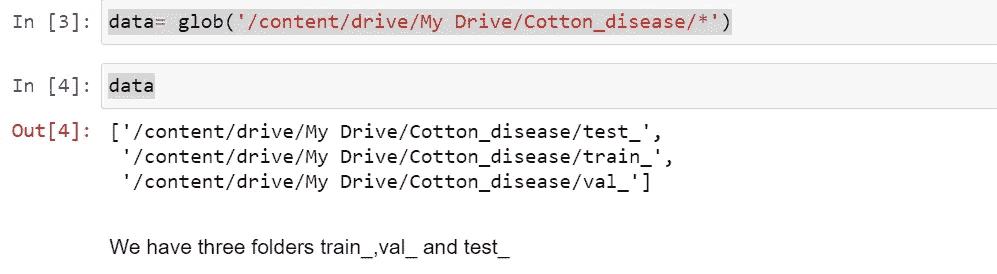
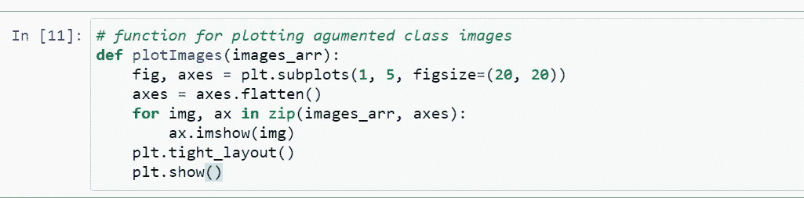
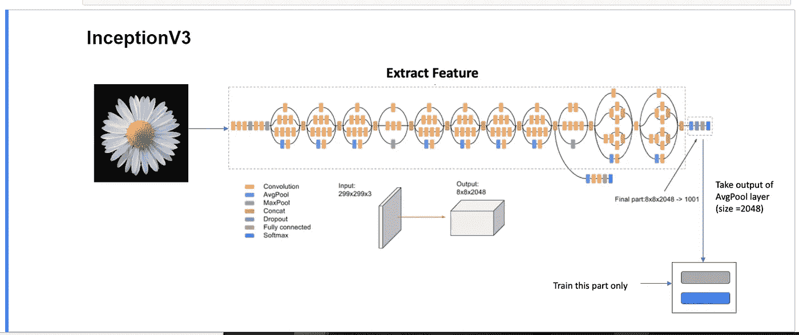

# 使用深度学习架构从零开始到部署的农业项目

> 原文：<https://medium.com/analytics-vidhya/agriculture-project-from-scratch-to-deployment-using-deep-learning-architecture-fca767be094f?source=collection_archive---------5----------------------->

你只需要知道机器学习在现实世界中有多有用

[https://www.youtube.com/watch?v=-CjfDjfmOU0](https://www.youtube.com/watch?v=-CjfDjfmOU0)

[欧提·梅南](https://unsplash.com/@outimarjaana?utm_source=medium&utm_medium=referral)在 [Unsplash](https://unsplash.com?utm_source=medium&utm_medium=referral) 上的照片

## 目录:

(一)问题陈述

㈡动机

㈢数据处理

㈣数据扩充

㈤有线电视新闻网从零开始

㈥概念 3

(七)用烧瓶展开

㈧结论

㈨未来的范围

㈩参考资料

## (一)问题陈述:

我们的问题陈述是给定的棉花植物或棉花叶片是患病的还是新鲜的进行分类

## ㈡动机:

印度是世界上最大的棉花生产国。美国农业部(USDA)预计印度 2019-20 季节的棉花产量为 2900 万包，而前一年为 2600 万包。

作为一名机器学习爱好者，我想应用我的机器学习知识来提高印度棉花作物的生产力。

如果我的模型对一个农民有用，那对我来说也意味着很多，这个想法驱使我做这个项目。

## ㈢数据处理:

为了做这个项目，我使用谷歌 Colab

我们有棉花植物和棉花叶子的图像

数据分为 4 类

患病的棉花植物

(二)新鲜棉花植物

(三)病棉叶

(四)新鲜棉花叶

我把我的数据集上传到 google drive

在我的数据集中，我们有 3 个文件夹

训练 _，值 _，测试 _

train_:它包含 4 类图像，这些图像用于训练模型

val_:它包含 4 类图像，这些图像用于验证训练的模型

test_:它包含 4 类图像，这些图像用于测试训练好的模型

## ㈢数据整理:

数据扩充是一种从现有训练数据中人工创建新训练数据的技术。这是通过将特定于领域的技术应用于来自训练数据的示例来实现的，这些示例创建新的不同的训练示例。

为什么是数据增强？

我们不知道我们在生产中从用户那里得到的是哪种类型的图像，它可能是带标题的、放大的、拉伸的或翻转的，所以为了有效地对任何类型的图像进行分类，我们还需要在培训课程上进行数据扩充。

我使用 ImageDataGenerator 模块进行数据扩充

我对培训类图像应用旋转、宽度移动、高度移动、剪切、缩放、翻转

flow_from_directory()方法允许您直接从目录中读取图像，并在神经网络模型学习训练数据时对其进行扩充

我们有 1951 张图片来训练这个模型

我希望输入图像大小为 224 x 224，这就是我给 traget_size (224，224)的原因

数据集包含彩色图像，彩色图像用 RGB 表示

train _ a mented _ set[0][0][0]返回包含[R，G，B]值的 3dim 数组

我写了一个函数返回增强的图像

增强图像

我们没有在 val_ class 图像上应用任何数据增强，因为它们用于验证训练的模型，如果我们增强它们，那么我们的模型会过拟合。

我们只是重新缩放 val_ class 图像

val _ a gument = imagedata generator(rescale = 1。/255)

我们在验证数据集中有 324 幅图像

模型的类别

0:病棉叶

1:患病的棉花植株

2:新鲜棉花叶

3:新鲜棉花植株

# ㈣从零开始建立有线电视新闻网:

图片来源:[https://vinodsblog . com/2018/10/15/everything-you-neural-networks/](https://vinodsblog.com/2018/10/15/everything-you-need-to-know-about-convolutional-neural-networks/)

基本 CNN 都有

卷积图层、最大化、完全连接、缺失、批量归一化、展平图层、输出(softmax/sigmoid)图层

辍学+批量正规化工作作为正规化

我们的输入图像大小= (224，224)

我们的模型架构

con2D(内核数:3 x 3，内核数的个数= 32)

最大池 2D( 2 x 2)

con2D(内核数:3 x 3，内核数的个数= 64)

最大池 2D( 2 x 2)

con2D(内核数:3 x 3，内核数的个数= 128)

最大池 2D( 2 x 2)

con2D(内核:3 x 3，内核数量= 256)

最大池 2D( 2 x 2)

脱落层(脱落率=0.5)

展平图层

密集层(单位=128，激活=relu)

脱落层(脱落率=0.1)

密集层(单位=256，激活=relu)

脱落层(脱落率=0.25)

密集图层(units=no_of_classes(4)，activation =softmax) == >输出图层

我们的问题陈述属于多类分类，这就是为什么输出层激活是 Softmax

使用的库:带有后端 Tensorflow 的 Keras

导入必要的模块

在 Keras 中建立 **g 卷积神经网络的步骤**

(一)建筑模型:定义建筑

(ii)编译:给出元数据(如丢失、优化器等)

㈢符合模型

步骤 1:构建模型

第二步:编译

我使用 optimizer =Adam(lr=0.0001)，loss = ' categorical _ crossentropy '，metrics='accuracy '

第三步:拟合模型

我为 50 个时代建立了模型

在第 50 个纪元结束时

训练 _ 数据 _ 设置 _ 准确度= 0.88

validation _ data _ set _ accuracy = 0.85

**新纪元 vs 失落:**

**历元对精度**

**模型评估:**

为了评估训练的模型，我们使用验证数据集类图像

验证数据集的类别

## 预测验证数据集图像的类别

在验证数据集中，我们有 324 幅图像

利用训练好的 CNN 模型预测个人图像的类别

**使用测试数据集图像测试训练模型**

在测试之前，我们需要保存训练好的模型

正在加载保存的模型

我从 test_ data 集中获取新图像来测试训练好的模型。

Test_ data set 图像是模型中的新图像。

如果模型正确地预测了图像类别，那么我们训练的模型被认为是一般化模型。

导入必要的模块

从测试数据集中加载图像

我拍了一张患病棉花叶子的照片

将加载的图像转换成数组

以[R，G，B]的形式将加载的图像转换为 3dim 数组

现在我们需要归一化[R，G，B]值

**预测加载图像的类别**

这样，我们就可以将训练好的模型归纳为泛化模型

# ㈥迁移学习:

迁移学习是在新问题上重新使用预先训练好的模型。它目前在深度学习中非常流行，因为它可以用相对较少的数据训练深度神经网络。

**著名预训练模特**

㈠resnet 50:25 636 712 个参数

㈡resnet 152 v2:60，380，648 个参数

㈢第三项:23 851 784 个参数

我选择 InceptionV3 是因为与其他模型相比，它的参数更少，参数越少，响应时间越短

图片鸣谢:[https://www . analyticsvidhya . com/blog/2020/08/top-4-pre-trained-models-for-image-class ification-with-python-code/inceptionv3/](https://www.analyticsvidhya.com/blog/2020/08/top-4-pre-trained-models-for-image-classification-with-python-code/inceptionv3/)

**Inceptionv3** 由两部分组成:(一)特征提取(二)卷积神经网络。

我们使用 imagenet 权重

我们不训练提取特征

我们只训练最后几层

导入必要的模块

对于 InceptionV3 型号，默认输入图像大小= [224，224]

我们的输入图像是彩色图像。

所以我们需要给输入的 image_size 加上+ 3

使用 imagenet 权重加载初始模型，并排除最后几层

我们不想从头开始训练完整的模型。所以我们不为 imagenet 权重训练我们的模型。

训练数据集中的类别数

我们有 4 节课

现在我们需要展平 InceptionV3 模型输出

通过展平 inceptionV3 模型，我们得到瓶颈层输出

现在我们需要添加层到瓶颈层输出。

我们可以添加任意数量的层

我只添加了一个密集层(units=no_of_classes，activation=softmax)

我们有 4 个类，所以我们在密集层需要 4 个单位，激活是 softmax

我们将 softmax 激活应用于瓶颈层输出

第一步:模型构建

我们的模型的总参数=22，007，588

但是只有 204，804 个参数是可训练的

第二步:编译

第三步:拟合模型

我为 50 个时代建立了模型

在第 50 个纪元结束时

训练精度= 0.93

验证准确度= 0.94

## 时代 vs 损失

## 纪元与精确度

## **转移已学模型评估**

使用验证数据集图像评估 inceptiov3 模型

单独预测验证数据集图像的类别

我们在验证数据集中有 324 幅图像

我们单独预测每一类图像

## 用测试数据集图像测试迁移学习模型

在测试之前，我们需要保存迁移学习模型

正在加载保存的模型

我从 test_ data 集中取了一张图片来测试训练好的迁移学习模型。

我特意拍了一张患病棉花叶子的照片

现在我们需要测试我们是否得到了相同的类

从测试数据集中加载图像

现在我们需要将图像转换成一个数组

我们的输入图像是彩色图像

所以数组的形式是[R，G，B]

现在我们需要归一化[R，G，B]值

预测图像类别

拍摄的图像是患病的棉花叶子

# (七)用烧瓶展开:

# ㈧结论:

## CNN 模型

参数:5141188

纪元=50

第 50 个历元时，Val_accuracy=0.85，accuracy=0.87

## InceptionV3 模型

总参数:22，007，588

纪元=50

在第 50 个时期，训练精度= 0.93，验证精度= 0.94

使用迁移学习模型总是更好，因为它可以用更少的数据训练深度神经网络，并且与 CNN 相比，它还可以从头开始提供良好的准确性。

# ㈨未来的范围:

*   尝试更多迁移学习模式
*   使用 Keras-tuner 微调 CNN 模型

# ㈩参考资料:

谷歌(一些定义)

Krish naik youtube 频道(用户界面部分)

印度 ai 制作 youtube 频道(数据部分)