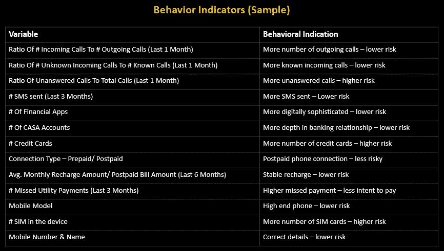
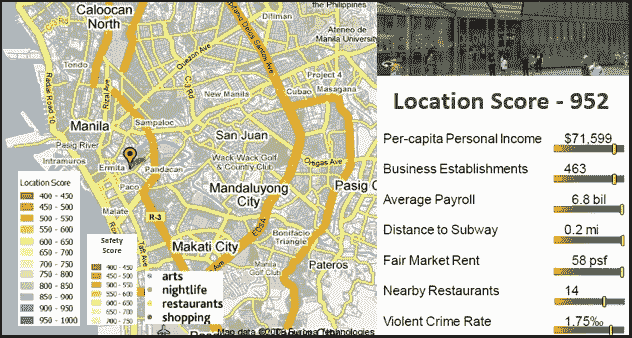

# 人工智能与贷款的未来

> 原文：<https://medium.com/analytics-vidhya/ai-and-the-future-of-lending-fb6f33ca1810?source=collection_archive---------21----------------------->

金融机构(FIs)很幸运，在这个时候，他们有机会向前迈出一大步，创造长期的战略影响。随着金融服务的不断数字化，他们拥有巨大的业务增长机会。技术的普及和深厚的商业专业知识可以帮助金融机构检查他们的业务，并找到复杂问题的答案，例如，如何评估风险。

为了抓住这个机会，金融机构需要信任技术。诸如[机器学习](https://en.wikipedia.org/wiki/Machine_learning)和[人工智能](https://en.wikipedia.org/wiki/Artificial_intelligence)这样的技术可以在他们传统上失败的地方帮助他们。例如，对新客户或瘦客户的风险评估。

人工智能可以帮助金融机构了解借款人的特征，如诚实、道德、行为和态度，因此即使支付能力不明显，金融机构也可以根据借款人的积极支付意愿发放贷款。通过从借款人的智能手机上收集手机使用模式、安装的应用程序类型、手机品牌和型号以及位置模式的数据，人工智能可以确定支付意向。

首先，这些预测模型可能不太有效，但最终，随着算法的发展和数据的增长，决策将越来越准确。这就是信任技术的重要性所在。

行为评分模型也可用于信用局为贷款申请人分配信用评分的情况，因为通常存在准确性问题。

## 人工智能贷款用例

在整个贷款生命周期中，可以利用人工智能来改善客户体验。

*   营销部门可以通过提高营销活动的针对性而受益。
*   信用风险部门可以创建记分卡，以便就是否接受申请做出更明智的决策。
*   通过分析现有客户的行为，可以发现交叉销售和追加销售的机会。通过评估违约风险，可以采取积极主动的措施来尽早降低风险。
*   收集分析可以预测拖欠债务的客户偿还债务的可能性，以及联系这些客户的正确渠道。这不仅有助于增加收入，也有助于降低经营成本。

## 人工智能模型——构建还是购买

人工智能可以使金融机构使用统计和机器学习技术来建立自己的信用评分模型，具体针对他们的业务需求和客户档案。内部分析可以提供对输入、方法和假设透明的见解；并且在改变假设和输入参数方面是灵活的，其可以被频繁地更新。

## 人工智能平台能力

金融机构获得分析全部好处的能力将完全取决于他们选择使用的分析平台或工具。正确的分析工具将使业务用户能够自己使用系统，而不太依赖 IT 或数据科学团队。它不仅提供了构建预测模型的能力，还提供了无障碍的部署以及业务规则的配置。部署将通过 API 来支持实时处理模型评分的远程请求。最后但并非最不重要的一点是，由于经济漂移等原因，每个模型都会随着时间的推移而退化，因此金融机构需要一个具有自动化模型监控功能的平台，以确保及时调整模型。

现在是高瞻远瞩的金融机构投资于这项技术并成为未来领导者的时候了。