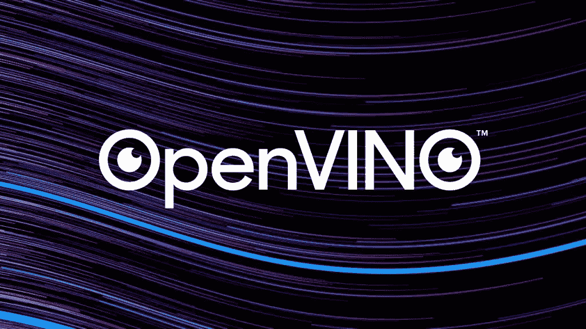

# 人工智能在边缘——英特尔 OpenVINO 工具包简介

> 原文：<https://medium.com/analytics-vidhya/ai-at-the-edge-an-introduction-to-intel-openvino-toolkit-a0c0594a731c?source=collection_archive---------8----------------------->



我们现在生活在云计算时代。现在一切都在云上，你的数据，你的处理能力——一切。像 AWS、Azure、GCP 等云服务已经使你的物联网设备很容易弥补本地机器处理能力的不足，并使用云中的处理能力，为你提供人工智能的惊人能力。但并不是在所有情况下，你都可以依赖云服务。如果你把敏感的个人数据发送到云端，总会有泄露的风险。可能会有网络问题或延迟问题，您希望部署您的人工智能模型进行实时决策，例如，自动驾驶汽车。你真的不希望你的自动驾驶汽车在行驶中等待服务器的响应。或者甚至可能出现网络完全不可用情况。这就是人工智能在边缘概念发挥作用的地方。

# 什么是边缘的人工智能

物联网设备的增长增加了 AI 的边缘应用。我们现在被很多智能设备包围着——手机、智能音箱、智能锁等等。虽然它们很聪明，但是它们没有强大的处理能力。所以有很多硬件资源有限的目标设备，你可能想在那里部署一个 AI 模型。边缘意味着本地处理。这意味着你可以在设备中使用人工智能模型，并利用其处理能力做出决策，而无需连接云服务。

不过，Edge 并不是云计算的替代品。当需要高处理能力时，您可能仍然需要在云环境中训练您的模型(或者在强大的桌面中)。训练完成后，您可以针对您的设备优化您的训练模型，将其部署在您的 edge 应用程序中，并执行推理，而无需连接到服务器。优化软件可以极大地帮助优化多目标硬件的训练模型，以提高其效率并最大化其性能。最近，我被英特尔 Edge AI 奖学金项目录取，在那里我学到了很多关于英特尔 openVINO toolkit 的知识。在这个(系列)博客中，我将谈论英特尔 OpenVINO toolkit 软件，它使不同计算机视觉模型的边缘部署变得非常简单和高效。

# 什么是英特尔 OpenVINO

OpenVINO 这个名字代表***O****pen****V****isual****I****N****N****eural Network****O****optimization*它是由英特尔开发的开源软件。OpenVINO 的主要重点是优化神经网络，以便在各种英特尔硬件上进行快速推理，如 CPU、GPU、VPUs、FPGAs、IPUs 等。有一个通用的 API。OpenVINO 软件优化了模型的大小和速度，使其可以在有限的硬件资源下运行在边缘。但这并没有提高模型的精度。这种优化是在模型训练步骤中完成的。相反，有时您可能需要选择降低精度以获得更高的性能。例如，选择 8 位整数精度而不是 32 位浮点精度。

# 正在设置

要使用 OpenVINO，你必须了解 Python 或 C++。您可以按照官方[文档](https://docs.openvinotoolkit.org/2019_R3.1/index.html)中的说明在您的本地机器上安装 OpenVINO toolkit。我用的是 windows 电脑。这是我的脚步，

1 我用 [anaconda 发行版](https://www.anaconda.com/distribution/)安装了 python(安装过程中出现提示时，我选择了“添加到路径”选项，尽管安装程序不建议这样做。此选项允许您从我们将使用的命令提示符访问 python。).

2 我下载了 OpenVINO installer exe 文件，转到此[链接，](https://software.intel.com/en-us/openvino-toolkit/choose-download)选择我的操作系统 windows，然后注册英特尔。

安装人员指出了我缺少的需求，即 CMake 和 Microsoft Visual Studio。

4 我按照这个[视频](https://youtu.be/8_X5Iq9niDE)中的说明安装了 CMake。

5 下载[微软 Visual Studio](https://visualstudio.microsoft.com/) 2019 并安装。遵循这个[页面](https://www.intel.in/content/www/in/en/support/articles/000055251/boards-and-kits/neural-compute-sticks.html)中提到的步骤(你**必须**安装一些带有 VS 的工作负载，否则无法工作，所以必须按照链接页面中的说明进行)

现在，在那之后，我按照安装完 openVINO 后打开的文档进行操作。但是后来我注意到我的 TensorFlow 版本从 2.0 降级到了 1.15.2。因为，在本文撰写之时，openVINO 支持 TensorFlow 以下版本( ***更新:****open vino 2020 版本现在支持 TF 2*)。所以，如果你不想让 openVINO 改变其他包，你可以这么做。**当然首先创建一个虚拟环境！**打开命令提示符并运行以下命令。

(如果您还没有安装“virtualenv”软件包，请运行以下代码中的第一个命令来安装它。否则，跳到创建虚拟环境的第二行。“openvinoenv”是我选择的环境的名称，如果你愿意，你可以用不同的名称)

```
pip install virtualenvvirtualenv --system-site-packages -p python openvinoenv
```

7 激活虚拟环境。

```
openvinoenv\Scripts\activate
```

8 设置 OpenVINO 环境变量。您需要运行一个名为“setupvars.bat”的文件来设置环境变量。

```
cd "C:\Program Files (x86)\IntelSWTools\openvino\bin\"
setupvars.bat
```

9 将目录更改为<open vino _ installation _ directory>\ open vino \ deployment _ tools \ model _ optimizer。就我而言，

```
cd "C:\Program Files (x86)\IntelSWTools\openvino\deployment_tools\model_optimizer>"
```

10 你会看到，文件夹里有一些文本文件，其中一个是“requirements.txt”。运行以下命令，

```
pip install -r requirements.txt
```

使用虚拟环境的好处是，它将把 openVINO 的需求隔离在一个单独的 python 沙箱中，并在不修改全局包的情况下单独安装它们。

接下来，把你的目录换成后退一步，转到“demo”文件夹。

```
cd ..
cd demo
```

12 运行“demo_benchmark_app.bat”文件。这一点很重要，因为它会在你第一次运行它时为你安装一些其他缺失的组件。在命令行中键入以下内容。

```
demo_benchmark_app.bat
```

您将看到一个基准测试结果。这意味着，一切工作正常。您的 openVINO 设置已经可以使用了。如果出现错误，可能是有一个包丢失了。您将在错误消息中看到丢失包的信息。手动安装软件包。

记住，每次使用 OpenVINO，都要运行 <installation_directory>\openvino\bin 文件夹中的 setupvars.bat 文件。因此，在激活虚拟环境之后，不要忘记在每次开始使用 openVINO 时运行下面的命令(如果您在不同的位置安装了它，请使用 setupvars.bat 在您机器中的位置)。</installation_directory>

```
"C:\Program Files (x86)\IntelSWTools\openvino\bin\setupvars.bat"
```

完成后，只需运行，

```
deactivate
```

**提示:**每次开始工作时，首先激活虚拟环境，然后运行 setupvars.bat 文件，很快就会变得令人恼火。因此，在您的项目中，您可以创建一个批处理文件，在一行中运行这两个步骤。创建一个“environment.bat”(您可以随意命名)文件，编辑该文件以添加这些行并保存。

```
call "openvinoenv\Scripts\activate"
call "C:\Program Files (x86)\IntelSWTools\openvino\bin\setupvars.bat"
```

然后，当您开始处理您的项目时，不要键入长目录名，只需在命令提示符下键入以下内容，就可以开始了。

```
environment.bat
```

# OpenVINO 的工作流程

使用 OpenVINO 有四个步骤。

> 1.获取预先训练的模型。
> 
> 2.使用模型优化器，优化预训练模型并创建中间表示(IR)
> 
> 3.使用推理机执行实际的推理(预测)
> 
> 4.正确处理推理引擎的输出

一个预先训练好的模型可以从 OpenVINO 的模型动物园获得，我会在下一篇文章[第一部分](/@ahsan.shihab2/deploying-ai-at-the-edge-with-intel-openvino-part-1-51a09752fb4e)中明确谈到。有些模型已经在中间表示中准备好了，对于它们，你不需要进行任何优化，直接把模型送到推理机就可以跳到推理步骤。另一方面，一些模型在转换成中间表示之前需要进一步优化。如果你用 TensorFlow 或 Caffe 或其他深度学习库创建了自己的模型，你可以用模型优化器转换你预先训练的模型。这个转换我会在[第二部](/@ahsan.shihab2/deploying-ai-at-the-edge-with-intel-openvino-part-2-1f1a9faa514b)讲。最后，在[第 3 部分](/@ahsan.shihab2/deploying-ai-at-the-edge-with-intel-openvino-part-3-final-part-664b92c75fde)中，我们将使用推理引擎来执行推理，并将输出处理到一个示例应用程序。

所以，不多说了，把你的环境设置好，跟我到下一篇文章。

(*链接到所有部分:* [*第 0 部分*](/@ahsan.shihab2/ai-at-the-edge-an-introduction-to-intel-openvino-toolkit-a0c0594a731c) *>* [*第 1 部分*](/@ahsan.shihab2/deploying-ai-at-the-edge-with-intel-openvino-part-1-51a09752fb4e)*>*[*第 2 部分*](/@ahsan.shihab2/deploying-ai-at-the-edge-with-intel-openvino-part-2-1f1a9faa514b)*>*[*第 3 部分*](/@ahsan.shihab2/deploying-ai-at-the-edge-with-intel-openvino-part-3-final-part-664b92c75fde) *)*