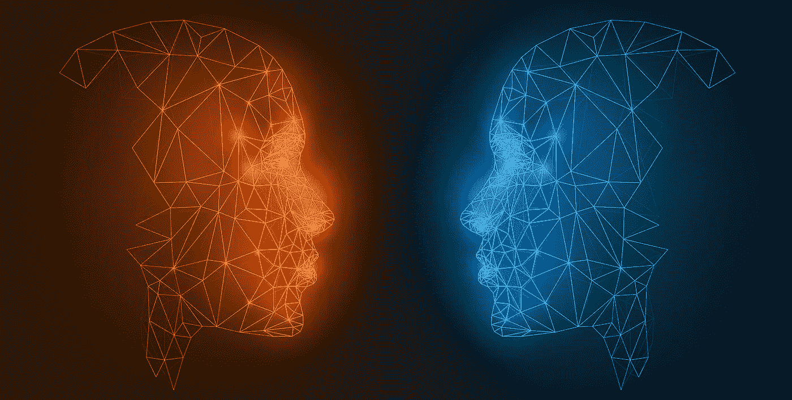

# 人工智能助推:是福是祸

> 原文：<https://medium.com/analytics-vidhya/ai-boosterism-a-boon-or-a-bane-86373c8ce880?source=collection_archive---------18----------------------->

人工智能(AI)目前掌握着前所未有的权力、影响力和金钱。它有能力塑造一个国家的经济。

> 2018 年，谷歌、亚马逊和脸书花费了创纪录的金额来影响美国政府。根据新的政府披露，他们去年总共投入了 4800 万美元进行游说，比 2017 年增加了 13%。(来源:[https://www . vox . com/2019/1/23/18194328/Google-Amazon-Facebook-lobby-record](https://www.vox.com/2019/1/23/18194328/google-amazon-facebook-lobby-record)

人工智能助推:是福是祸(图片来源:【https://www.arm.com/blogs/blueprint/arm-ai-trust-manifesto】T4)

人工智能已经为社会做了很多好事，甚至经常试图争辩说，如果没有“人工智能革命”，社会秩序早就崩溃了。接下来通常是一个“另一方面”的警告，告诉我们人工智能的引入带来的某些障碍。通常会提到大型数据库对个人隐私造成的威胁，以及 AI 产业化引发的大规模裁员的危险[1]。

尽管人工智能的工作不仅限于学术领域，也就是说，不仅仅是发表论文。大型科技巨头公司正在使用人工智能来[干预政治选举](https://www.theguardian.com/technology/2018/jul/11/facebook-fined-for-data-breaches-in-cambridge-analytica-scandal)和[影响政策和法规](https://www.vox.com/2019/1/23/18194328/google-amazon-facebook-lobby-record)。

> 信息专员宣布，脸书因卷入剑桥分析公司丑闻将被罚款 50 万英镑，这是可能的最高金额。

# 标准对齐

对于作为思维模型的 AI 和作为监视工具的 AI 来说，边界正变得越来越薄。这样做的主要理由之一是“如果我不做，别人会做”。因为现在谁不想在新闻中也有一个 **AI** 标签。

另一种说法是拒绝将局限性、困难和危害与优势和潜力相比视为次要问题。由于知道人工智能(作为一个系统)抓取大量数据，辩护者可能会试图将其视为*只是*定向广告的问题。能有多糟？你可以忽略它们。

> 计算机从一开始就是一种基本上保守的力量……一种在已经存在的地方保持甚至巩固权力的力量。

采用人工智能解决方案而不是更全面的方法来解决[社会问题](/lingvo-masino/nlp-for-social-good-part-i-85b2d757bf15)仍然普遍存在。使用人工智能来确定某人的性取向并没有被[媒体](https://www.newyorker.com/news/daily-comment/the-ai-gaydar-study-and-the-real-dangers-of-big-data)【3】接受。

自从伊莱扎出生以来，计算机专家们就有一个共同的幻想，即人类的思想是完全可以计算的，但是在《计算机的力量和人类的理性》一书中，韦森鲍姆解释道:

> 人类和机器之间的关键差异，表明存在某些需要人际关系、尊重、情感和理解的领域，而计算机不应该侵入这些领域，不管它们看起来是否可以。

> 没有任何其他生物，当然也没有任何计算机，能够以人类的角度来面对真正的人类问题

# 结束语

总之，作为人工智能的研究人员，在将人工智能融入我们的平台之前，我们都应该问一个问题，即“首先需要这项技术吗？”如果人类是我们的出发点，人类福利是首要利益，那么人工智能产生的负面影响，以及研究人员和开发人员缺乏责任感，仍然是人工智能中最紧迫的伦理讨论。

[1]魏曾鲍姆，约瑟夫。"关于计算机对社会的影响。"*科学* 176，第 4035 号(1972):609–14。2020 年 2 月 26 日访问。[www.jstor.org/stable/1734465.](http://www.jstor.org/stable/1734465.)

[2]约瑟夫·韦森鲍姆 1985 年接受麻省理工学院新闻服务机构《技术》的采访。

[3][https://medium . com/@ blai sea/do-algorithms-reveal-sexual-orientation-or-just-expose-our-stereotypes-d 998 fafdf 477](/@blaisea/do-algorithms-reveal-sexual-orientation-or-just-expose-our-stereotypes-d998fafdf477)

文章来源:[https://reallifemag.com/fair-warning/](https://reallifemag.com/fair-warning/)