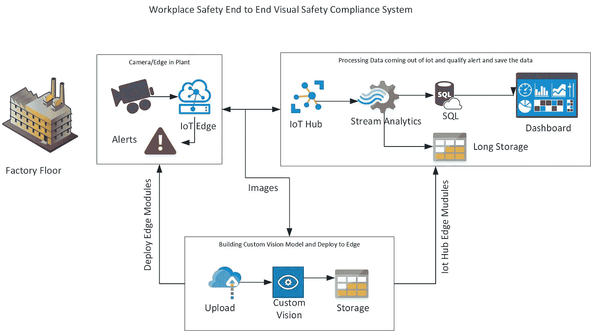
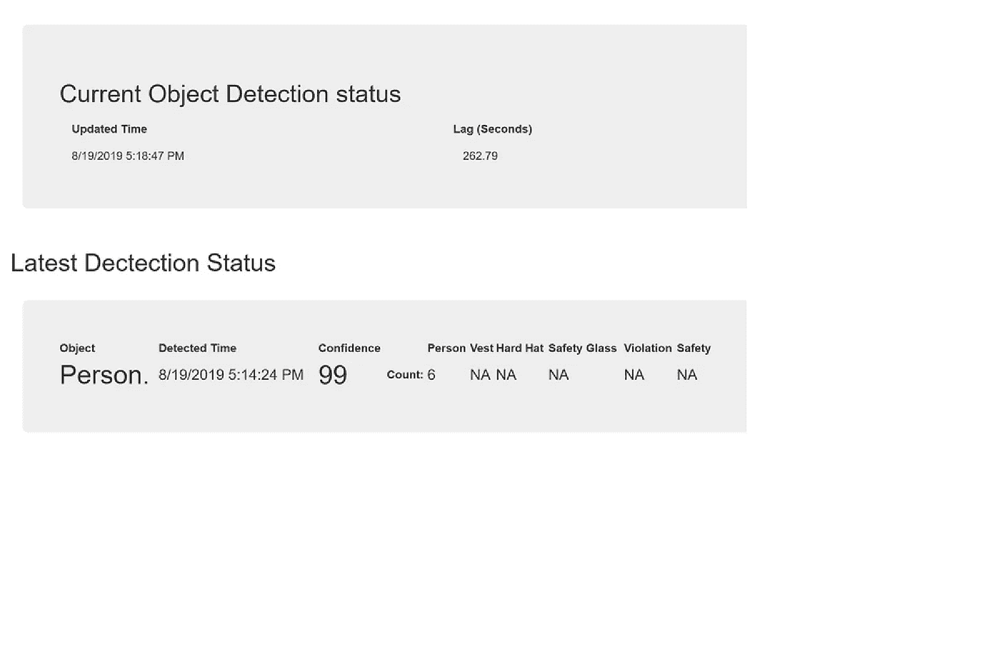
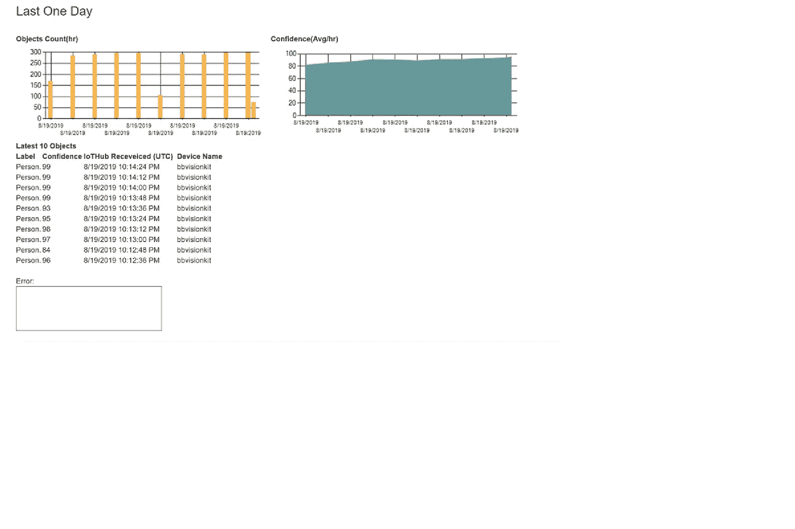

# AI for Good:工作场所安全 PPE

> 原文：<https://medium.com/analytics-vidhya/ai-for-good-workplace-safety-cb719b245b26?source=collection_archive---------15----------------------->

在任何工作场所的安全中，预防人员伤亡和事故是非常重要和关键的。这也是 AI 对于好项目的一部分。

基于人工智能的定制视觉工作场所安全检测系统。

能够检测基于视觉的合规性。在安全对员工工作至关重要的环境中，有合规规则要求员工穿戴合适的装备来保护环境，确保员工安全工作。例如，取决于哪家制造公司，人的因果关系是每个人都想避免的事情。所以，他们坚持穿合适的背心，安全帽和安全玻璃或实验室外套和玻璃来保护。在某些情况下，可能是面罩和完整的化学溢出防护服等。因此，这里的想法是检测人，然后看看他们是否穿着背心，安全帽和安全玻璃。通常在制造业，人们可以在生产线上行走，这将是下一步的工作。能够通过报告和实时警报来检测人员、合规性和警报管理。此外，能够检测叉车并在前往叉车操作员的途中向人员发出警报。该系统不仅检测对象，而且能够存储信息，以供进一步报告和分析。

例如:通常工厂必须向 OSHA 审计员提供年度或季度报告，以确定是否存在人为因果关系，以及采取了哪些措施避免重复。掌握物体何时被检测到以及何时未被检测到的图片对于审计人员分析数据非常有帮助。这对审计人员来说非常简单和容易。但主要目的是工厂可以运行，没有停机时间或拉劳动力去通过审计过程。审计时通常会有一段停机时间，在这种情况下，这将减少和增加生产率和正常运行时间。

检测和提供报告是必要的，存储数据用于历史目的也是重要的，以便能够进行审计并从数据中学习。历史数据可以与其他生产率数据相结合，也可以从中发现真知灼见。将数据放入数据湖很可能是有意义的。了解系统的运行情况也非常重要。因此，我们需要收集遥测数据并存储在 Azure SQL 和 Blob 中，以便进一步处理。我们可以生成每月报告或每周报告，说明出现了多少合规性问题。我们还可以分析数据，并发现模型是否表现良好，或者发现哪里不好。

该场景可以定制为其他用例，如医院、化工厂以及各种其他重型机械和采矿业。



# 建筑说明

*   **IoHub** —收集检测到的对象，并将其发送到云端，以便使用下游系统进行进一步处理。充当从物联网设备中抽取数据并将其发送到云的网关。此外，设备管理功能和安全的数据传输都由物联网中心提供。
*   **流分析** —从物联网中心的传入事件中心读取数据，解析 JSON 并写回 Azure SQL 和 blob 存储。传入的数据集是 JSON 格式的，必须压缩成结构化格式才能进行分析。此外，如果需要，我们可以根据用例要求进行基于窗口的计算。
*   **Azure SQL** —存储检测到的对象数据以及检测到对象的时间，用于为网站和基于 power bi 的报告创建图表。数据仅保留 6 个月到 1 年的报告时间，然后创建清理作业来删除旧记录。用于报告和仪表板。如果需要，也用于下游业务系统。
*   **Blob 存储** —进入 Azure SQL 的相同数据存储在 Blob 中，用于长期存储。保留超过一年或更长时间的数据，用于审计记录和合规性。优选地，图像也应该存储在这里，以便在需要时可以执行合规性和审计。如果需要长期保存这些数据，也可以将其转移到冷存储中。更多关于长期和审计目的。基于历史数据分析模型结果的能力。
*   **Web App** — Dashboard 使用 Azure SQL 数据来显示页面中的信息。它还使用 Azure SQL 中的历史数据，但仅限于存储在 SQL 中的数据。
*   **摄像头标记模块** —这是另一个模块，用于拍摄照片并进行标记，然后发送到定制视觉服务，同时发送到 Blob 存储。Blob 存储用于长期和历史数据分析。在实际使用案例中，我们希望能够拍摄真实世界的图片，然后使用它们来训练自定义视觉模型，使模型更加准确。

要开始将模块添加到视觉套件，请点击以下链接[https://github . com/balakreshnan/work place safety/blob/master/CameraTaggingModule/readme . MD](https://github.com/balakreshnan/WorkplaceSafety/blob/master/CameraTaggingModule/readme.md)

> *例如，在真实的工厂或车间或医院或任何其他场景中，除非我们有图片，否则很难建立模型。使用上面的标签模块，我们可以拍摄真实世界的图片，并将其用于训练。上述模块基于手动拍摄照片，以便对拍摄的照片和存储进行控制。*

# 使用自定义视觉服务提供的图片创建自定义视觉模型

*   登录 customvision.ai，创建一个紧凑的对象检测项目。
*   上传带有各种标签的图片。
*   用正确的标签和边界框标记每个图像。
*   训练模型并将模型下载为 AI 视觉套件部署文件。
*   有关详细信息，请参阅 vision ai 文档中的其他文章

# 将模型部署到 Vision Kit

*   下载模型文件并上传到 blob 存储器，在那里我们可以为模块 twin 访问它。
*   您可以压缩模型并上传。
*   ModelUrlZip 属性在模块 twin 中被分配，以下载创建的新的视觉模型。现在，当你戴上安全帽、背心或安全眼镜时，你应该会看到新模型显示的边界框。该模型也应该预测人。
*   [" https://bbiotstore . blob . core . windows . net/others/model . zip](https://bbiotstore.blob.core.windows.net/others/Model.zip)"

# 创建报告和仪表板

> *创建一个资源组来处理创建存储 blob*

*   创建 blob 帐户
*   创建一个容器
*   将容器命名为:visoinkitdata
*   这是为了长期存储评分数据，以用于审计、合规性和报告目的

> *创建 Azure SQL 数据库*

*   创建数据库
*   创建新表格
*   下面是创建表脚本:
*   还创建计数表来合计每分钟检测到多少个对象。

```
SET ANSI_NULLS ON GO SET QUOTED_IDENTIFIER ON 
GO CREATE TABLE [dbo].[visionkitinputs](
[id] [int] IDENTITY(1,1) NOT NULL, 
[confidence] [float] NULL, 
[label] [nvarchar](2000) NULL, 
[EventProcessedUtcTime] [datetime] NULL, 
[PartitionId] [int] NULL, 
[EventEnqueuedUtcTime] [datetime] NULL, 
[MessageId] [nvarchar](250) NULL, 
[CorrelationId] [nvarchar](250) NULL, 
[ConnectionDeviceId] [nvarchar](250) NULL, [ConnectionDeviceGenerationId] [nvarchar](2000) NULL, 
[EnqueuedTime] [datetime] NULL, 
[inserttime] [datetime] NULL 
) ON [PRIMARY] 
GO ALTER TABLE [dbo].[visionkitinputs] ADD CONSTRAINT [DF_visionkitinputs_inserttime] DEFAULT (getdate()) FOR [inserttime]
GO/****** Object: Table [dbo].[visionkitcount] Script Date: 9/29/2019 7:24:20 AM ******/ SET ANSI_NULLS ON 
GO 
SET QUOTED_IDENTIFIER ON 
GO CREATE TABLE [dbo].[visionkitcount]( 
[id] [int] IDENTITY(1,1) NOT NULL, 
[Avgconfidence] [float] NULL, 
[label] [nvarchar](2000) NULL, 
[EventProcessedUtcTime] [datetime] NULL, 
[PartitionId] [int] NULL, 
[EventEnqueuedUtcTime] [datetime] NULL, 
[MessageId] [nvarchar](250) NULL, 
[CorrelationId] [nvarchar](250) NULL, 
[ConnectionDeviceId] [nvarchar](250) NULL, [ConnectionDeviceGenerationId] [nvarchar](2000) NULL, 
[EnqueuedTime] [datetime] NULL, 
[count] [int] NULL, 
[inserttime] [datetime] NULL 
) 
ON [PRIMARY] 
GO ALTER TABLE [dbo].[visionkitcount] ADD CONSTRAINT [DF_visionkitcount_inserttime] DEFAULT (getdate()) FOR [inserttime] GO
```

> *创建流分析*

*   从物联网中心创建输入，以读取来自视觉套件模块的数据。
*   创建 2 个输出
*   一个用于 Blob 存储:outputblob 用于长期存储
*   文件夹模式:data/{date}
*   日期格式:年/月/日
*   以上是为了确保可以创建更大的数据集。
*   将来读取数据时，也可以并行读取。
*   另存为 CSV 格式，以便在需要时可以使用多个系统查看数据。
*   其他用于上面创建的 Azure SQL 数据库
*   选择表格为:visionkitinputs
*   使用 SQL 用户名和密码连接。
*   将所有其他内容保留为默认值。
*   还要统计检测到并发送到物联网中心的物品数量。
*   现在创建查询，从 Iot Hub 读取数据，然后将 JSON 结构解析为表格式——行和列格式，并将其发送到两个输出。

```
WITH visiondata AS ( 
SELECT confidence ,
label ,
EventProcessedUtcTime ,
PartitionId ,
EventEnqueuedUtcTime ,
IoTHub.MessageId as MessageId ,
IoTHub.CorrelationId as CorrelationId ,
IoTHub.ConnectionDeviceId as ConnectionDeviceId ,IoTHub.ConnectionDeviceGenerationId as ConnectionDeviceGenerationId ,IoTHub.EnqueuedTime as EnqueuedTime 
FROM input 
) SELECT confidence,
label,
EventProcessedUtcTime, 
PartitionId,
EventEnqueuedUtcTime, 
MessageId,
CorrelationId,
ConnectionDeviceId, 
ConnectionDeviceGenerationId,EnqueuedTime 
INTO 
outputblob 
FROM 
visiondata SELECT confidence,
label,
EventProcessedUtcTime, 
PartitionId,
EventEnqueuedUtcTime, 
MessageId,
CorrelationId,
ConnectionDeviceId, 
ConnectionDeviceGenerationId,
EnqueuedTime 
INTO 
sqloutput 
FROM visiondata SELECT ConnectionDeviceId,
label, 
avg(confidence) as Avgconfidence, 
count(*) as count, 
MIN(CAST(EventEnqueuedUtcTime AS DATETIME)) as EventEnqueuedUtcTime, MIN(CAST(EventProcessedUtcTime AS DATETIME)) as EventProcessedUtcTime, 
MIN(CAST(EnqueuedTime AS DATETIME)) as EnqueuedTime 
INTO sqlaggr 
FROM visiondata GROUP BY TUMBLINGWINDOW(second,60),ConnectionDeviceId,label- First part is CTE with is common table expression - To send the output into multiple output a temporary CTE is created and then selected columns are used to push that into Azure SQL table and Blob storage. - The 2 Select query is one for Blob output and other for Azure SQL output. - I am also saving Device meta data information to further reporting.
```

> *创建 Web 应用程序以显示信息*

*   创建 ASP NET 窗体应用程序
*   根据上面创建的内容更改 SQL 的连接字符串。
*   Objects.aspx 是显示对象检测的所有详细信息的页面
*   页面每 20 秒刷新一次。
*   该应用程序还使用 asp 图表来显示详细信息。
*   查询嵌入在代码本身的逻辑中
*   在高层次上，页面显示
*   当前预测对象和置信度及时间
*   滞后时间是在云端处理最新记录之前的时间。
*   滞后时间显示设备当前是否正在发送数据。
*   仅当检测到对象时，才接收数据。
*   所以长滞后时间是可以接受的



*   最新检测状态
*   随着时间显示当前对象和置信度
*   它需要 2 分钟的时间来分析最新数据
*   发现是否检测到背心、安全帽和安全玻璃。
*   查找一个人是否存在。
*   然后 if 计算，看看是否有违规。
*   例如，如果一个人有空并且没有穿听力背心、安全眼镜或安全帽，则违规计数递增。
*   该页还计算了背心，安全帽和安全玻璃。
*   上面的逻辑完全是虚构的，可能会根据用例而改变
*   这仅对于实时目的有效，因为没有对象跟踪可用。
*   如果对象跟踪，那么我们可以做实时适当的人计数与违反以及。
*   最后一天
*   从该时间点开始，一天 24 小时内的数据将按小时进行聚合。
*   数据被汇总并显示为条形图，以供直观显示。
*   每小时的对象计数和每小时的平均置信度也被绘制为图表显示。
*   最新的 10 个对象



*   错误
*   任何运行时错误都会被捕获并显示，以便进行故障排除。
*   还没有机会与应用洞察集成。

# 未来的改进

*   改进定制视觉人工智能模型
*   添加对象跟踪
*   向其他业务和警报系统发送警报
*   能够查看云中的图像，并通过选择图像发送到自定义视觉。
*   基于不同的行业和用例定制用例

*最初发表于*[*【https://github.com】*](https://github.com/balakreshnan/WorkplaceSafety)*。*