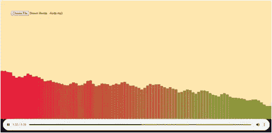

# 音乐中的人工智能:从立体声中分离人声并将其可视化的最快方法

> 原文：<https://medium.com/analytics-vidhya/ai-in-audio-fastest-method-to-isolate-vocals-from-stereo-and-visualize-36795ad8369?source=collection_archive---------16----------------------->

你是音乐小样还是 DJ 或者和我一样的音乐发烧友？你是否要花上数不清的时间来处理你的音乐文件，把不需要的声音分离出来，把背景音乐混合在一起，创造出你自己的音乐。或者也许你只是一个狂热的浴室歌手，肯定不记得你最喜欢的歌曲的歌词了！

别担心，我们基于网络的应用程序会帮你分类，眨眼之间就能完成。

# 它是如何工作的

整个场景有两个部分，首先是分离人声，这是通过使用由音乐流媒体服务 **Deezer 开发的深度学习库 **Spleeter** 来完成的。**它以[**开源包**](https://deezer.io/releasing-spleeter-deezer-r-d-source-separation-engine-2b88985e797e) 的形式提供，将音频文件拆分成**的词干。**

## 模型

Spleeter 模块旨在使用深度神经网络分离音轨，更具体地说是一个 **U 神经网络**，如下图所示，添加了这些层以提高声音质量，而**顺序卷积层**旨在获得更精确的输出。

这个网络的特别之处在于它没有任何完全连接的层，它只对卷积层和 ReLU 激活函数起作用。

这最初是为了医学图像分类的目的而提出的，但现在它被用于音乐。即使在小数据集上，U net 也能很好地工作。

## 资料组

**MUSBD 18 和 Bean 数据集**用于训练模型。

msdb18 是一个数据集，包含不同流派的 **150 首全长音乐**曲目(~ 10 小时时长)，以及它们各自独立的*鼓*、*低音*、*人声*和*其他*声干。

Musdb18 **训练**数据集由 **100 首歌曲**组成，

musdb18 **测试**数据集包含 **50 首歌曲**(约 3 小时 27 分钟的音频)

*   所有信号都是立体声并以 44.1kHz 编码。
*   数据集被**扩充**以产生更精确的结果。执行的增强有以下几种类型:

1.频道交换。

2.时间拉伸。

3.音高移位

4.使再混合

5.逆高斯滤波

6.响度标度

## 模型架构

输入的歌曲被提取并传递到预处理，在预处理中噪声被去除，spleeter 分别识别语音部分和音乐部分，然后下载并传递到可视化工具，给我们的用户一个很好的视觉效果。

开发了基于网络的应用程序，它可以成功地分离人声并将其可视化，以获得更好的用户体验。

在 GPU 或基于云的平台上运行时，sp leater 的速度*非常*快，并且优于许多其他深度学习模型。这是一个国家的艺术，因为它的速度快 100 倍。

## 形象化

可视化是通过使用 web 开发技术 HTML、CSS 和 JAVA 脚本来完成的。视觉效果看起来像:

声音可视化仪

这个项目是人工智能和音乐的独特融合。

该应用程序仍在研究和开发中，以使其更加用户友好，并且关于卡拉 ok 系统的开发正在进行中，以一起运行歌词和背景音乐。它也可以被翻译成一个漂亮的 android 应用程序。提供了该项目的 GitHub 链接。

 [## bhanvimenghani/音乐 _ 分离

### 在 GitHub 上创建一个帐户，为 bhanvimeghani/Music _ separation 开发做贡献。

github.com](https://github.com/bhanvimenghani/Music_Seperation.git)