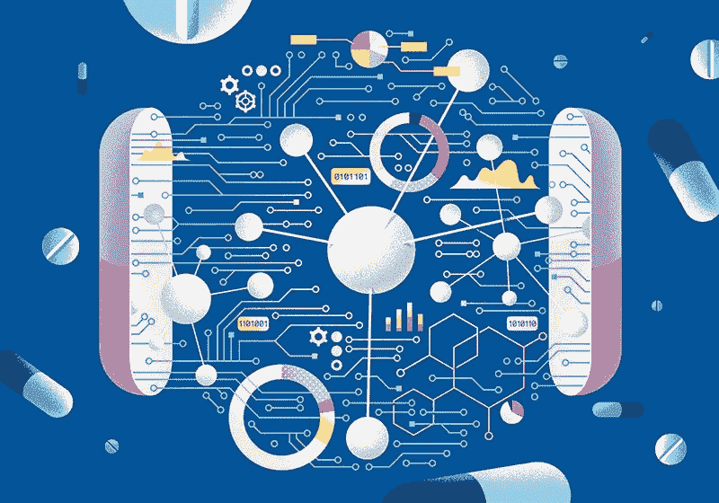

# 人工智能在药物发现和开发中的应用

> 原文：<https://medium.com/analytics-vidhya/ai-in-drug-discovery-development-d6c4c54d3654?source=collection_archive---------25----------------------->

图片来源:[http://www . IHP ASF . com/id/人工智能制药](http://www.ihpasf.com/id/artificial-intelligence-making-its-way-into-pharmacy)

**当我们谈论药物发现和开发过程时，人工智能**有许多用例。人工智能已经能够极大地推进古老的药物研究方法，并从传统方法中升级它们。

药物开发基于**分子开发**。有两种开发分子的方法

## 1.基于结构的