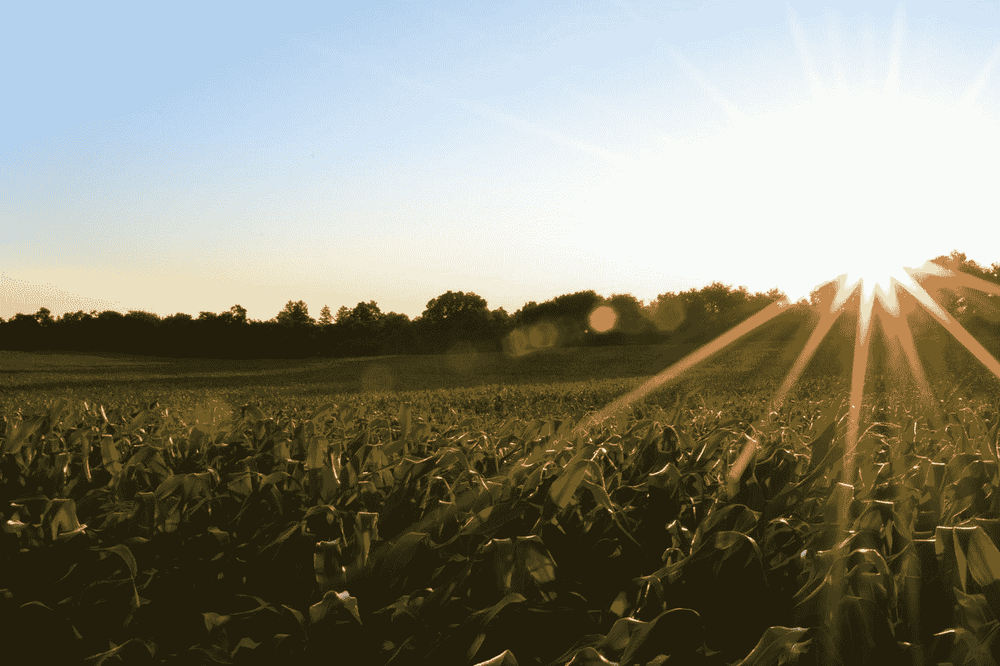

# 人工智能在农业中

> 原文：<https://medium.com/analytics-vidhya/ai-in-farming-b31fb13c6399?source=collection_archive---------15----------------------->

杰克·加德在 [Unsplash](https://unsplash.com?utm_source=medium&utm_medium=referral) 上的照片

人工智能创新正在支持各种细分市场，以帮助提高盈利能力和熟练程度。模拟情报安排有助于克服每个领域的常规困难。同样，农业和园艺中的人工智能正在帮助农民提高生产力，减少对生态的有害影响。农业企业坚定而直接地将人工智能运用到他们的实践中，以改变整体结果。人工智能正在改变我们提供营养的方式，园艺区的排放量已经减少了 20%。调整人工智能创新是协助控制和处理任何排除的特征条件。

今天，大多数新的农业公司都在利用人工智能技术来提高农业的效率和产量。市场研究报告表示，未来五年，全球人工智能(AI)在农业领域的市场规模预计将达到 15.5 亿美元。执行人工智能方法可以更快地识别灾难或大气变化，并做出敏锐的反应。在大赦国际的协助下，园艺和农业组织正在准备农村信息，以减少不利的结果。

人工智能在农业领域最广为人知的应用有三个重要类别，即农业机器人、预测分析、作物和土壤监测，计算机视觉和深度学习计算用于处理无人机捕捉的信息，此外，基于编程的创新用于筛选作物和土壤健康状况，机器学习模型用于跟踪和预测对作物产量的不同生态影响，例如气候变化。

1.  **农业机器人:**

耕作/农业机器人用于处理基本的园艺工作，例如，以比人类工人更高的产量和更快的速度收割作物。机器人旨在帮助采摘和压榨产量，同时应对农业劳动力内部的各种困难。农业机器人可以保护农作物免受杂草的侵害，这些杂草可能不会受到旨在消灭它们的合成除草剂的影响。自动化和机械自主性可以帮助农民发现越来越熟练的方法来保护他们的产量免受杂草侵害。据称，一个名为“看到并喷洒”的机器人使用自动视觉来筛选和喷洒植物上的杂草。精确喷洒有助于防止除草剂的阻碍。自动化处理掉了通常喷洒在作物上的 80%的除草剂，并且可以减少 90%的除草剂成本。

机械化可以帮助解决劳动力方面的困难，该行业预计从 2014 年到 2024 年将减少 6%的农村专家，安装有相机和激光扫描仪的机器人可以预见植物的标准产量，机器人可以帮助牧场主采摘和包装他们的收获，缺乏工人导致了关键种植区的大规模收入不幸。机器人一天可以收割 8 英亩土地，并取代 30 名人类工人，预计每年农业成本的 40%将用于产量的“工资、工资率和临时工作成本”，水果和蔬菜作物的工人需求往往最高。

**2。监测作物和土壤:**

使用人工智能是一种有效的方法，可以识别或筛选潜在的缺陷，并补充土壤中的不足。通过图片确认方法，人工智能可以通过无人机上的摄像头捕捉到的图片来区分潜在的畸形。在 Al 的帮助下，深度学习应用程序被创建来检查农业中的绿化设计。这种人工智能支持的应用程序在理解土壤脓肿、植物昆虫和疾病方面是稳定的。

对收获和土壤健康状况的简单而准确的评估对有效的耕作和农业经济至关重要。自动机和卫星创新的最新进展使人们能够获得实用、吉祥和有限的高目标农业用地的多光谱象征。慢性粒细胞白血病和人工智能提供了能力，感知深刻的重大例子，现在象征。

无人机提供了出色的成像，可以帮助筛选作物，同时检查和检查田地以收集重要的农业信息，这种成像创新可以帮助识别产量及其生长情况，包括它们的健康状况，并确保它们的准备状态，这些图片可以为农民提供决定他们的收获准备程度以及是否和何时准备收割的能力。

**3。预测分析**

农场每天都会产生大量集中在地面上的信息。在人工智能的帮助下，农民能够逐步分解和检查各种各样的东西，例如，从他们的农场收集的气候条件、温度、用水或土壤条件，以证明他们的选择或改变他们的方法。例如，人工智能的进步通过优化他们的收获决策来帮助农民提高产量，这是种子和资产使用的最佳组合。

人工智能框架同样有助于提高收获质量和准确性，这被称为精准农业。它利用人工智能创新来帮助识别植物中的疾病、问题区域和田间植物营养不良。人工智能传感器可以识别并锁定杂草，然后选择除草剂。这有助于避免过度使用除草剂和在我们的食物中发现它们的不合理的毒药。同样，农民也在利用人工智能建立临时预测模型，以提高农业准确性和效率。这些模型可以提前很长时间预测未来的气候变化，从而帮助农民做出相应的决策。

**农业实施人工智能的优势**

人工智能在农业和园艺中的应用鼓励农民理解信息体验，例如，温度、降水、风速和基于阳光的辐射。值得注意的质量的信息检查提供了理想结果的高级相关性。在农业中实现人工智能的最佳方式是，它不会免除人类农民的就业，而是会改善他们的程序。

*   人工智能可以沿着这些路线改善作物管理实践，帮助众多技术组织将资源投入到正在农业企业中获得价值的计算中。
*   人工智能提供了越来越熟练的方法来交付，收获和销售基本产量。
*   人工智能的使用强调检查歉收和提高稳定产量的潜力。
*   人工智能正在被应用，例如，用于害虫识别以及气候和疾病预测的机械化机器改造。
*   人工智能创新的发展增强了农业组织的生产力。

人工智能正在迅速解决问题，同时规定了解决问题所需的精确行动。人工智能在检查数据以快速发现安排方面很有效率。人工智能正被用于农业，以微不足道的自然成本来提高产量。通过执行 AI，我们可以以 98%的精度区分一种疾病。以这种方式，人工智能通过改变光线来帮助农民观察从地里长出来的食物，以加速它们的生长。

**最后的话**

使用人工智能和主观进步，世界各地的农场可以更高效地运行，用更少的劳动力满足世界的营养需求。幸运的是，人工智能的应用将允许各种规模的农场工作和生产，让我们的现实受到鼓舞。使用农业人工智能和知识进步，世界各地的农场可以更有效地运营，以提供我们饮食生活方式的主要主食。

人工智能驱动的创新正在发展，以帮助提高生产力和解决企业面临的困难，包括作物产量、土壤状况和除草剂障碍。农业机器人现在已经准备好成为人工智能的一种特别受尊重的用途。在乳制品行业，广泛选择的证据是显而易见的，目前有大量的机器人在那里工作。在未来的三到五年内，农业机器人将被创造出来完成不可否认的各种各样的差事，这是可行的。随着对环境变化的研究和评估的不断深入，收获和土壤观测创新同样会成为重要的应用。

这些技术(例如无人机和机器人)定期捕获的信息量将赋予农业企业另一种预测变化和识别机会的能力。我们预计，在未来 5-10 年内，卫星机器视觉应用将越来越成为大型现代化农场的典型应用。随着时间的推移，这将有助于演示这些工具的估计。