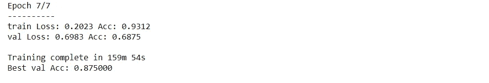
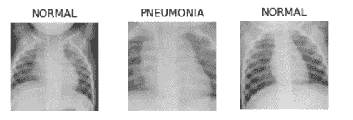

# 医疗保健中的人工智能:使用迁移学习的胸部 X 射线分类

> 原文：<https://medium.com/analytics-vidhya/ai-in-healthcare-chest-x-ray-classification-using-transfer-learning-45934929509b?source=collection_archive---------11----------------------->

**深度学习**:在深度学习模型中，迁移学习对于取得更好的结果可以起到至关重要的作用。


医学图像对于临床诊断和决策具有重要价值。图像模态是一个重要的基本步骤，因为它能够帮助临床医生在检索系统中访问所需的医学图像。传统的模态分类方法依赖于手工制作的特征的选择，并且要求对先前的领域知识有清楚的认识。特征学习方法可以有效地检测不同模态的视觉特征，但它受限于训练数据集的数量。为了克服标记数据的缺失，一方面，我们在 ImageNet 上预先训练不同深度的深度卷积神经网络(VGGNet，ResNet)，固定大部分早期层以保留自然图像的通用特征，在 ImageCLEF 上只训练其较高层部分以学习医学人物的领域特定特征。

# 什么是迁移学习？


在迁移学习中，已经训练好的深度学习模型的知识被应用于不同但相关的问题。例如，如果您训练一个简单的分类器来预测图像中是否包含一只猫，您可以使用模型在训练过程中获得的知识来识别其他动物。

使用迁移学习，我们基本上试图利用在一个任务中学到的知识来提高另一个任务的概括能力。我们将网络在“任务 A”中学习到的权重转移到新的“任务 b”

# 迁移学习和传统的机器学习有什么不同？


# 迁移学习的方法

## 1.训练模型以重用它

想象一下，你想解决任务 A，但没有足够的数据来训练一个深度神经网络。解决这个问题的一种方法是找到一个有大量数据的相关任务 B。在任务 B 中训练深度神经网络，并使用该模型作为解决任务 a 的起点。您是需要使用整个模型还是只使用几个层，这在很大程度上取决于您要解决的问题。

如果您在两个任务中有相同的输入，那么可以重用模型并为您的新输入进行预测。或者，改变和重新训练不同的任务特定层和输出层是一种探索的方法。

## 2.使用预先训练的模型

第二种方法是使用已经预先训练好的模型。有很多这样的模型，所以一定要做一些研究。重用多少层，重新训练多少层取决于问题。

例如，Keras 提供了九个预训练模型，可用于迁移学习、预测、特征提取和微调。你可以在这里找到这些模型，以及一些关于如何使用它们的简短教程。也有很多研究机构发布训练好的模型。

这种类型的迁移学习在整个深度学习中最常用。

## 3.特征抽出

另一种方法是使用深度学习来发现你的问题的最佳表示，这意味着找到最重要的特征。这种方法也被称为表征学习，通常可以获得比手工设计的表征更好的表现。

# 项目:借助迁移学习预测肺炎

**数据集来源:**[https://drive . Google . com/drive/folders/1 vz 7 qdbwasncuge 8 dzcwpljigope 1g ms5？usp =分享](https://drive.google.com/drive/folders/1Vz7QDBwASNCUgE8dzCWPLjiGOpEg1mS5?usp=sharing)

**参考的研究论文:**

1.  [https://arxiv.org/abs/1403.6382](https://arxiv.org/abs/1403.6382)
2.  [https://arxiv.org/abs/1411.1792](https://arxiv.org/abs/1411.1792)

## 代码和方法

> **导入必要的库**

```
import torch
import torch.nn as nn
import torch.optim as optim
from torch.optim import lr_scheduler
import numpy as np
import torchvision
from torchvision import datasets, models, transforms
import matplotlib.pyplot as plt
import time
import os
import copy
```

> **用于训练和验证的数据扩充和标准化**

```
mean = np.array([0.5, 0.5, 0.5])
std = np.array([0.25, 0.25, 0.25])data_transforms = {
    'train': transforms.Compose([
        transforms.RandomResizedCrop(224),
        transforms.RandomHorizontalFlip(),
        transforms.ToTensor(),
        transforms.Normalize(mean, std)
    ]),
    'val': transforms.Compose([
        transforms.Resize(256),
        transforms.CenterCrop(224),
        transforms.ToTensor(),
        transforms.Normalize(mean, std)
    ]),
}
```

> **加载数据:我们将使用 torchvision 和 torch.utils.data 包来加载数据。**

```
data_dir = r'D:\Assign\X_ray\chest_xray\chest_xray'
image_datasets = {x: datasets.ImageFolder(os.path.join(data_dir, x),
                                          data_transforms[x])
                  for x in ['train', 'val']}
dataloaders = {x: torch.utils.data.DataLoader(image_datasets[x], batch_size=4,
                                             shuffle=True, num_workers=0)
              for x in ['train', 'val']}
dataset_sizes = {x: len(image_datasets[x]) for x in ['train', 'val']}
class_names = image_datasets['train'].classesdevice = torch.device("cuda:0" if torch.cuda.is_available() else "cpu")
print(class_names)
```

> **可视化一些图像**

```
def imshow(inp, title):
    """Imshow for Tensor."""
    inp = inp.numpy().transpose((1, 2, 0))
    inp = std * inp + mean
    inp = np.clip(inp, 0, 1)
    plt.imshow(inp)
    plt.title(title)
    plt.show()# Get a batch of training data
inputs, classes = next(iter(dataloaders['train']))# Make a grid from batch
out = torchvision.utils.make_grid(inputs)imshow(out, title=[class_names[x] for x in classes])
```

**训练模特**

1.  计划学习率
2.  保存最佳模型

```
def train_model(model, criterion, optimizer, scheduler, num_epochs=25):
    since = time.time()best_model_wts = copy.deepcopy(model.state_dict())
    best_acc = 0.0for epoch in range(num_epochs):
        print('Epoch {}/{}'.format(epoch, num_epochs - 1))
        print('-' * 10)# Each epoch has a training and validation phase
        for phase in ['train', 'val']:
            if phase == 'train':
                model.train()  # Set model to training mode
            else:
                model.eval()   # Set model to evaluate moderunning_loss = 0.0
            running_corrects = 0# Iterate over data.
            for inputs, labels in dataloaders[phase]:
                inputs = inputs.to(device)
                labels = labels.to(device)# forward
                # track history if only in train
                with torch.set_grad_enabled(phase == 'train'):
                    outputs = model(inputs)
                    _, preds = torch.max(outputs, 1)
                    loss = criterion(outputs, labels)# backward + optimize only if in training phase
                    if phase == 'train':
                        optimizer.zero_grad()
                        loss.backward()
                        optimizer.step()# statistics
                running_loss += loss.item() * inputs.size(0)
                running_corrects += torch.sum(preds == labels.data)if phase == 'train':
                scheduler.step()epoch_loss = running_loss / dataset_sizes[phase]
            epoch_acc = running_corrects.double() / dataset_sizes[phase]print('{} Loss: {:.4f} Acc: {:.4f}'.format(
                phase, epoch_loss, epoch_acc))# deep copy the model
            if phase == 'val' and epoch_acc > best_acc:
                best_acc = epoch_acc
                best_model_wts = copy.deepcopy(model.state_dict())print()time_elapsed = time.time() - since
    print('Training complete in {:.0f}m {:.0f}s'.format(
        time_elapsed // 60, time_elapsed % 60))
    print('Best val Acc: {:4f}'.format(best_acc))# load best model weights
    model.load_state_dict(best_model_wts)
    return model
```

> **微调 Convnet，加载预训练模型，重置最终全连接层。**

```
model = models.resnet18(pretrained=True)
num_ftrs = model.fc.in_features**# Here the size of each output sample is set to 2.
# Alternatively, it can be generalized to nn.Linear(num_ftrs, len(class_names)).**model.fc = nn.Linear(num_ftrs, 2)model = model.to(device)criterion = nn.CrossEntropyLoss()
```

1.  StepLR 在每个 step_size 时期通过伽玛衰减每个参数组的学习率
2.  每 7 个时期以 0.1 的因子衰减 LR
3.  学习率调度应该在优化器更新后应用，例如，您应该这样编写代码:
    # for epoch in range(100):
    # train(…)
    # validate(…)
    # scheduler . step()

```
step_lr_scheduler = lr_scheduler.StepLR(optimizer, step_size=7, gamma=0.1)model = train_model(model, criterion, optimizer, step_lr_scheduler, num_epochs=10)
```



**历元上的训练模型= 8**

> **现在将训练好的模型应用于我们的问题陈述**

```
model_conv = torchvision.models.resnet18(pretrained=True)
for param in model_conv.parameters():
    param.requires_grad = False**# Parameters of newly constructed modules have requires_grad=True by default**num_ftrs = model_conv.fc.in_features
model_conv.fc = nn.Linear(num_ftrs, 2)model_conv = model_conv.to(device)criterion = nn.CrossEntropyLoss()**# Observe that only parameters of final layer are being optimized as
# opposed to before.**
optimizer_conv = optim.SGD(model_conv.fc.parameters(), lr=0.001, momentum=0.9)**# Decay LR by a factor of 0.1 every 6epochs**
exp_lr_scheduler = lr_scheduler.StepLR(optimizer_conv, step_size=7, gamma=0.1)model_conv = train_model(model_conv, criterion, optimizer_conv,
                         exp_lr_scheduler, num_epochs=6)
```

# 在测试图像上显示结果

```
def visualize_model(model, num_images=2):
    was_training = model.training
    model.eval()
    images_so_far = 0
    fig = plt.figure()with torch.no_grad():
        for i, (inputs, labels) in enumerate(dataloaders['val']):
            inputs = inputs.to(device)
            labels = labels.to(device)outputs = model(inputs)
            _, preds = torch.max(outputs, 1)for j in range(inputs.size()[0]):
                images_so_far += 1
                ax = plt.subplot(num_images//2, 2, images_so_far)
                ax.axis('off')
                ax.set_title('predicted: {}'.format(class_names[preds[j]]))
                imshow(inputs.cpu().data[j])if images_so_far == num_images:
                    model.train(mode=was_training)
                    return
        model.train(mode=was_training)
```

```
visualize_model(model,num_images=4)
```

