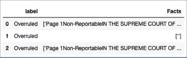
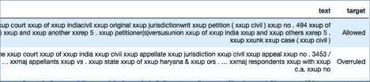
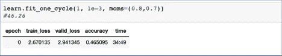

# 法律行业中的人工智能——通过深度学习预测判决的案例研究

> 原文：<https://medium.com/analytics-vidhya/ai-in-legal-industry-a-case-study-on-predicting-judgements-through-deep-learning-4ca13f4cf8e1?source=collection_archive---------3----------------------->

正义的雕像

纵观历史，人们依靠法院、陪审团、国王和王后来伸张正义。今天，法院为其公民提供公正和迅速司法的能力不仅是任何国家最重要的义务之一，也是民主的主要支柱。

印度自诩为世界上最大的民主国家，但在司法系统方面仍有欠缺。它与世界上积压案件最多的国家之一作斗争，这可以归因于法官的短缺和法律漏洞，延误了判决。据估计，印度每 100 万公民中只有 19 名法官。

# 这个案例研究是关于什么的？

在这个案例研究中，我们训练并建立了一个基于深度学习的模型，以相当高的准确度预测印度最高法院发布的判决。我们的目标是在未来为先进的洗钱解决方案开个头，增强法官的决策能力，帮助加快法律程序，减轻数百万人的痛苦。

至于本文的结构，我们将简单谈谈机器学习(ML)在法律方面的好处，我们用来预测决策的技术，并详细讨论我们采用的预测过程，从收集相关数据到建立深度学习模型。我们还将概述改进模型以提高其准确性的后续步骤。最后，如果有任何问题或建议，您可以找到我们的联系信息，并联系我们进行合作。

# 为什么是机器学习？

机器学习已经开始彻底改变各种行业，我们想不出它为什么不能帮助印度的法律系统。它分析大量数据以学习模式和预测结果的能力在法律部门尤其有用。机器学习的最新进展，尤其是在 NLP 的子领域，使得它更加相关。市场上已经有了解决方案和机器人，NLP 被用来“智能搜索”现有的判决和裁定，以帮助准备新的案件。

# 为什么不是传统的 ML？

在过去几年中，预测法律结果的模型已经大量建立，但这些模型往往更依赖于传统的机器学习算法，更注重特征工程；例如，法官、上诉法院和部门的裁决历史。一个额外的上下文人工智能层肯定会有所帮助，这就是为什么我们决定在这里尝试深度学习。

# 在法律中使用 ML 的好处

> 加速决策过程和结果
> 
> 输入数据的即时验证
> 
> 公正的观点
> 
> 能够快速展示具有相似模式的历史案例
> 
> 通过识别人类和人工智能决策差异较大的案例，更容易发现腐败

# 已经使用 ML 的法律领域

> 文件审查和法律研究
> 
> 合同管理
> 
> 客户尽职调查
> 
> 预测法律结果

需要注意的是，算法能够根据起诉书中提到的 IPC 部分决定性地理解事实并客观地识别犯罪，同时详细了解周围世界的那一天仍然很遥远。

# 哪个 ML？

为了收集和预处理数据，我们使用 Python3。所有型号都是通过 Fastai 开发的。Fastai 是一个基于 PyTorch 构建的深度学习库，具有运行高级深度学习算法的能力。我们发现 fastai 对这个练习非常有用，它强调* *迁移学习*和理论之前的实践，fastai 几乎彻底改变了人们使用深度学习的方式，使其高度可及和易于使用。

* *转移学习* : fastai 提供已经在大量数据上训练过的内置模型，这允许用户运行预训练模型，并使用新数据来仅更新已经有意义的权重值，而不是从头开始(随机值)。这个过程最终节省了大量的时间和精力，并在训练周期的早期提供了具有良好准确性的结果。

# 该过程

> 收集和格式化数据
> 
> 创建数据标签(培训数据)
> 
> 创建文本数据串
> 
> 构建语言学习模型
> 
> 从语言模型中保存编码器
> 
> 使用编码器建立最终预测模型

## 收集和格式化数据

第一步是收集和存储公开可用的判决数据。由于印度政府最近开展的数字化运动，所有最高法院的判决都以电子形式出现在政府网站上。每项判决都以 pdf 文件的形式提供，包含案件编号、主审法官姓名、被告和被告方的详细信息、整个下级法院的案件历史以及最高法院最终判决的案件事实，最终判决可能属于两种可能性之一，即上诉是“允许”还是“驳回”。

我们借助了一种简单的数据收集方法，使用 python 收集了四年的数据，并将其转换为 csv 格式，然后可以很容易地读取到 python 笔记本中的数据框中。我们的输入数据框架由超过 3600 个独特的最高法院判决组成。

## 创建数据标签

在典型的机器学习设置中，我们将输入带有标签的数据(对于我们的数据，“允许”和“拒绝”)，这些标签可用作训练和验证数据集，用于训练算法。

*收集事实或输入数据* -理想情况下，它应该是在审判开始时提供给最高法院的相同信息，包括所有历史和关于案件事实的信息。但是在我们的案例中，没有办法获得前面提到的输入数据，也就是提供给法院的确切数据；因此，我们使用该案例的 pdf 判决书中提到的事实作为输入数据的代理。这是最符合逻辑和最简单的前进方式，正如多名律师所证实的那样，最终判决中提到的事实与最初向法院提供的信息几乎相同。

pdf 文件的第一页包含有关案件编号、重要日期、被告和被告的详细信息、代表各方的律师姓名和主审法官姓名的信息，从那时开始，案件的事实、详细的时间表和下级法院的判决结果，最后是法院的判决。在有些国家，判决书的结构有严格的定义，并遵循特定的标准，但我们发现，在印度，判决书的撰写没有明确的规定，我们唯一可以肯定的是，法院的执行命令(最终裁决)可以在最后两页找到。

*标注事实或输入数据* -一旦我们从 pdf 数据框中提取出文本，我们会添加一个名为 labels 的列，其中包含有关上诉结果的信息。我们已经通过使用* *正则表达式匹配*确定了最后两页包含最终判决信息。然后，我们从判决的最后两页提取标签，无论上诉是被允许还是被驳回，从而为每个记录创建标签。这消除了手动创建标签的任何高成本需求，并消除了对输入大小的限制。我们非常确定这种标签方式是最准确的，我们没有手动检查每个标签，但这是一个* *证据*允许的假设。

*(如果您需要证据的更多细节，请随时查看 github 存储库中的实际代码和数据，本案例研究的末尾提供了相关链接。)

数据快照

为了完成我们的输入数据框，最后一步要求我们从输入文本中删除判决的最后两页，因为它们包含法院是否允许上诉的最终裁决。如果留在那里，算法可以直接学习阅读最后两页，预测决策。最终的数据帧包含完整的判断，没有最后两页和对应于每个输入的标签。

## 创建文本数据束

对于这个笔记本，通过抓取获得的 csv 文件被转换为数据帧，然后转换为数据束。Data Bunch 是 fastai 特有的一种专门的数据存储形式。这是一种定制形式的数据存储，使用起来非常方便，因为它在后台执行多种操作。我们将使用一种称为 TextDataBunch 的特殊形式的 DataBunch，它用于输入数据为文本形式的应用程序中。在创建一个 TextDataBunch 的时候，不可能检查所有的后台操作，但是我们将在下面解释几个重要的操作。

**有效数据集和训练数据集的创建:**数据集分为训练集和验证集，在创建 TextDataBunch 时，我们为参数 valid_pct 提供了值 0.2，该参数将数据集分为 80:20 的比例，将数据集的 80%作为训练集，将剩余的 20%作为验证集。

**记号化**:这是一个相对简单的过程，将文本分解成单词或记号。这可以通过用空格分割文本来实现，但有证据表明这不是最好的方法，更好的方法是不仅在空格上分割句子，还要分割标点和缩写。Fastai 执行所有这些操作，并通过删除任何 HTML 代码实例来清除数据。整个文本也被转换成小写，以防止相同标记的任何大写形式被计算两次。Fastai 提供了查看标记化数据的选项，这不仅揭示了前面提到的步骤的执行情况，还揭示了其他有用的信息。例如，人们可以注意到所有的撇号“s”被聚集在一起形成一个标记，还创建了几个特殊的标记，用于替换未知的标记或创建单独的文本字段。

**数值化**:在创建 TextDataBunch 的过程中，fastai 在后台进行的另一个操作叫做数值化。这是 TextDataBunch 最重要的任务之一，也是我们使用 TextDataBunch 而不是 fastai 的普通 DataBunch 来处理文本的主要原因之一。当 fastai 读入图像数据集时，数据集已经由表示图像像素的数字组成，但当我们读取文本时，我们需要将文本转换为标记，并将这些标记转换为数字，从而允许应用通用近似。这一步被称为数值化，它的工作原理是将所有的记号转换成整数值。为了保持最佳性能并降低创建高度稀疏向量的可能性，默认情况下，fastai 只保留在矩阵中至少出现两次的标记，同时还将最大词汇大小限制为 60，000 个标记。尽管可以更改最大词汇大小，但本解决方案使用了默认值。

预处理数据的快照

# 语言学习模式

语言学习模型努力预测句子中的下一个单词，从而在学习语言的同时获得对文本及其上下文的基本理解。预测句子中的下一个单词不是一件容易的事情，需要对上下文有很好的了解和一般的理解。在开发了这个模型之后，我们保存了它的编码器，并将其输入到我们最终的预测决策的 RNN 模型中。关于我们最终模型的更多细节将在本文后面介绍。

此外，Fastai 有一个预训练的语言模型，内置于库中。这样我们就不必从头开始训练我们的模型。它节省了大量的时间和计算能力。在我们的案例中，我们使用了一个预先训练的语言学习模型，该模型已经在名为 Wiki-103 的维基百科数据集上进行了训练。

我们创建了我们的新语言模型，包含来自 Wikitext-103 的预训练权重作为初始值，这个新语言模型试图预测判断数据中的下一个单词。在读取我们提供的新数据群时，该模型没有从零开始，因为它的模型参数没有设置为随机值，否则在从头开始的新模型中它们会被设置为随机值。因为我们使用了一个预先训练的模型，权重被设置为使用维基百科的文本进行训练的结果。这使我们很快达到更高的精度。在训练过程中，我们的模型显示了 46%的准确率。这意味着我们的语言模型能够在 46%的情况下正确预测下一个单词。按照行业标准，这是非常好的。

语言模型准确性

fastai 提供的另一个非常方便的特性是能够只解冻模型的最后几层，并且只训练这些层。这一功能使我们能够优化现有的预训练模型，使其更好地适应我们的新数据，而不会破坏初始训练参数，从而节省大量训练时间。

为了进一步提高语言学习模型的准确性，并增加模型的法律知识，我们增加了印度宪法和 IPC 法案和章节的现有输入，这是通过在语言学习模型阶段将这两个文档简单地抓取到数据框中并输入到模型中来完成的。这并不难理解，因为一个案件中的所有论点都必须涉及多个 IPC 法案、章节和印度宪法中规定的公民权利，因此了解这些文档的模型肯定能够理解这些关联，从而能够以更高的准确性和置信度得分预测下一个单词。

# **分类器模型(RNN)**

一旦语言模型被训练，我们保存这个模型的编码器。在下一阶段的训练中，我们使用这个编码器来训练我们的最终预测模型。这个最终的模型是一个 RNN 型分类模型(AWD·LSTM ),它是自然语言处理应用中的首选模型。RNN 代表循环神经网络，如果读者希望温习本文中提到的任何概念，他们可以很容易地在互联网上找到大量的资料。

这个模型能够达到 76%的准确率，这意味着它能够读取以前未见过的案件的细节作为输入，并且能够正确预测法院的判决，大约 76/100。

我们相信，通过调整模型的各种参数值以及尝试一系列学习速率，可以大大提高精确度。

最终模型快照

# 结论和结果

通过我们的模型，我们已经证明了 ML 和深度学习可以成功地应用于法律领域，以提高司法过程的效率。本案例研究的结果证明，确实有可能建立一个解决方案来帮助法官裁决案件:

> 自动化了接收大量法律数据并生成结构化信息和规则的过程
> 
> 大大减少了法官审查数百份类似案件的案件文件和材料的工作量
> 
> 成功地增强了对案件的分析，从而帮助法官更快地做出决定
> 
> 通过进一步提高准确性，我们可以开始在下级法院检验这一假设，因为大多数积压案件都在下级法院

对于法律和技术人员来说，这是一个令人兴奋的机会，他们可以一起工作，开发一个有益于整个社会的系统。

# 取得联系

我们将非常感谢您的任何反馈或建议，如果有人愿意在接下来的步骤中进行合作，请随时与我们联系。

[Nikhil.chandna71@gmail.com](mailto:Nikhil.chandna71@gmail.com)

https://www.linkedIn.com/in/nik

特别感谢 Debabrata Roy 构建了本解决方案中使用的抓取代码。

可以通过 github 上的以下链接查看代码。

 [## Nik 2049/Predicting _ SC _ judgments

### 用深度学习预测印度最高法院的判决(Fastai)-Nik 2049/Predicting _ SC _ decisions

github.com](https://github.com/Nik2049/Predicting_SC_judgements) 

*免责声明* —本文表达的观点是个人观点，绝不代表我的雇主或我可能隶属的任何其他组织。