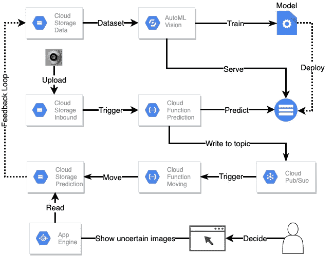
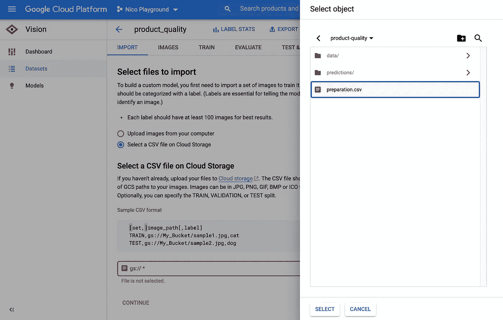
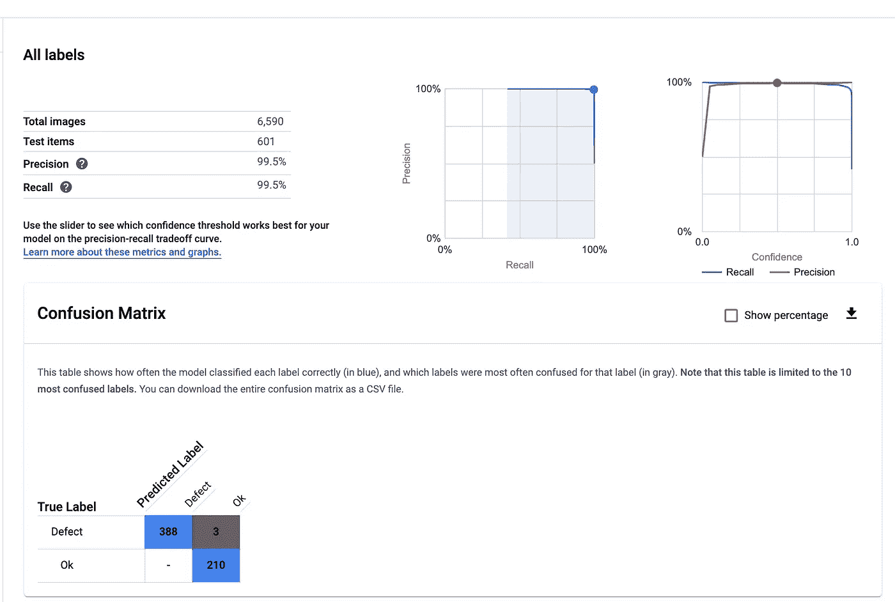
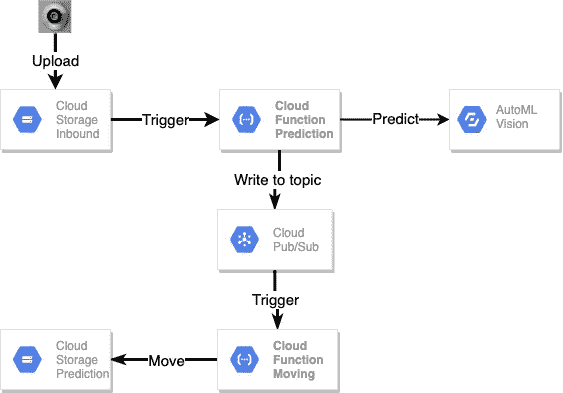
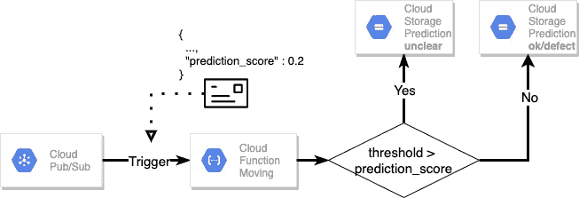
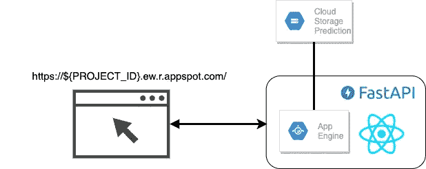
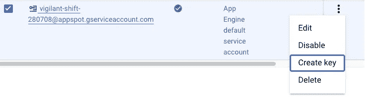
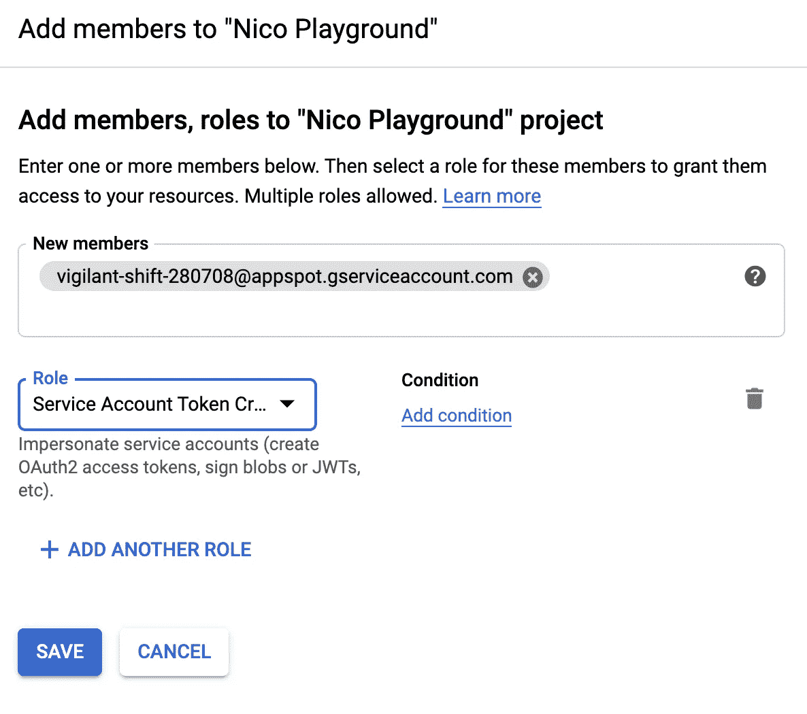
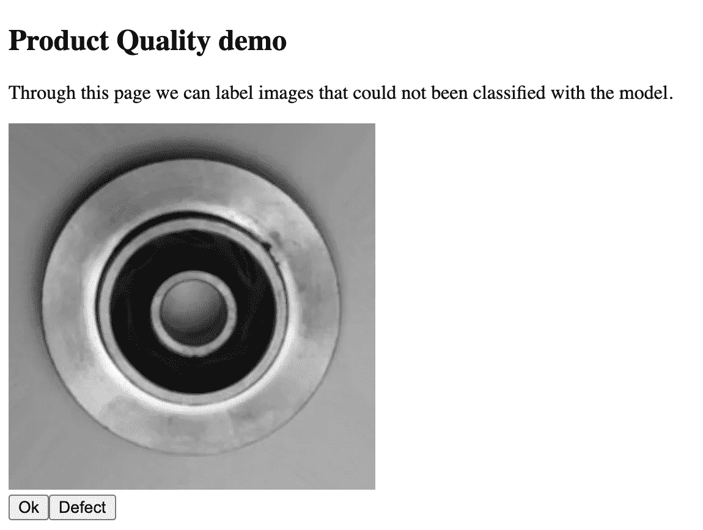

# 人工智能实践:用谷歌云平台中的 AutoML 识别有缺陷的组件

> 原文：<https://medium.com/analytics-vidhya/ai-in-practice-identify-defective-components-with-automl-in-gcp-d984f92d3dcf?source=collection_archive---------7----------------------->

直到最近，人工智能(AI)的使用只有通过巨大的努力和构建自己的神经网络才有可能。今天，通过云计算服务进入人工智能世界的壁垒已经大大降低。因此，人们可以立即使用当前的人工智能技术来实现组件质量控制的(部分)自动化，而不必在人工智能研究上投入大量资金。

在本文中，我们展示了如何在谷歌云平台(GCP)上示例性地实现这样一个人工智能系统。为此，我们使用 AutoML 训练一个模型，并使用云函数和 App Engine 将它集成到一个过程中，在该过程中可以进行质量控制中的手动校正。

这个项目的代码在库[GCP-自动质量检查](https://github.com/naxty/gcp-automated-quality-inspection)中。

# 人工智能系统的体系结构

下图显示了 GCP 的一个架构示例，用于组件质量控制的逐步自动化。



人工智能系统在 GCP 的典型应用

为了训练合适的模型，我们使用机器学习服务 AutoML。这项服务在自定义数据集上训练最先进的人工智能模型进行图像分类。此外，该模型可以通过服务作为 REST-endpoint 直接部署。

为了模型的集成，我们使用 Google 云存储(GCS)来上传图片。上传触发了一个云函数，该云函数调用模型的 REST-endpoint 并对图像进行分类。然后，我们通过由发布/订阅主题触发的第二个云函数来处理预测结果。

第二个云函数实现了根据分类和相关置信度对图像进行分类的处理逻辑。置信度低于选定阈值的预测称为“不确定的”。这些预测必须由有经验的工人进行后处理。为此，我们编写了一个 web 应用程序，供工作人员用来检查不确定的预测。

在下文中，我们描述 AI 系统的主要组件的安装和部署:

1.  AutoML 的准备、培训和服务
2.  模型与云函数的集成
3.  部署应用程序，使用 App Engine 进行手动后处理

***要求遵循本教程***

要执行这些步骤，需要能够访问 GCP。我们建议创建一个新项目，并在本地开发环境中设置 Google Cloud SDK 。下载[GCP-自动化质量检验库](https://github.com/naxty/gcp-automated-quality-inspection)的完整代码，建立 python 3.7 环境，通过*pip install-r requirements . txt*安装需求。

# 1.AutoML 的准备、培训和服务

我们使用 Kaggle 的[铸件产品数据进行质量检测](https://www.kaggle.com/ravirajsinh45/real-life-industrial-dataset-of-casting-product)数据集。该数据集包含用于生产潜水泵的制造产品的不同图像。

首先，我们将数据上传到一个 GCS 桶中。由于 AutoML 目前仅在*美国中心 1* 区域可用，我们必须使用以下命令在该区域内创建 bucket。可以在 GCP 控制台中直接找到*GCP _ 项目 _ID* 。

```
export GCP_REGION="US-CENTRAL1"
export GCP_PROJECT_ID="<fill-with-your-project-id>"
export TRAINING_DATA_BUCKET="${GCP_PROJECT_ID}""-product-quality"
gsutil mb -l $GCP_REGION gs://"${TRAINING_DATA_BUCKET}"
```

接下来，我们[从 Kaggle](https://www.kaggle.com/ravirajsinh45/real-life-industrial-dataset-of-casting-product/download) 下载数据，并将它们解压缩到 *data* 目录中。

```
data
└── casting_data
    ├── test
    │   ├── def_front
    │   │   ├── ....
    │   │   └── new__0_9334.jpeg
    │   └── ok_front
    │       ├── ....
    │       └── cast_ok_0_9996.jpeg
    └── train
        ├── def_front
        │   ├── ...
        │   └── cast_def_0_9997.jpeg
        └── ok_front
            ├── ...
            └── cast_ok_0_9998.jpeg
```

最后，我们上传数据:`gsutil -m cp -r data/ gs://${TRAINING_DATA_BUCKET}`

在上传之后，我们创建一个 CSV 文件，其中包含关于数据的必要元信息，以便开始使用 AutoML 进行训练。该文件由三列组成:

*   集合:这是一个具有固定值的可选字段，用于决定哪个样本属于哪个集合。固定值为训练、验证和测试。如果我们不分配这个字段，AutoML 会把数据集分成 8:1:1。如果我们分配这个字段，就必须使用所有这些值。
*   图像路径:图像在 GCP 的路径。
*   标签:样本的标签。

我们编写了一个脚本 [prepare.py](https://github.com/naxty/gcp-automated-quality-inspection/blob/master/automl/prepare.py) 来基于指定桶中的 blobs 生成这个 CSV 文件。您可以通过执行`python automl/prepare.py`来创建这个文件，并使用`gsutil cp preparation.csv gs://"${TRAINING_DATA_BUCKET}"`将它上传到 GCS。

现在可以在 AutoML 中创建数据集了。为此，在控制台中选择*单标签分类*，然后选择上传的 CSV 文件。它执行将数据导入 AutoML。这个过程大约需要 20 分钟。



在 AutoML UI 中选择上传的 preparation.csv

导入后，可以在 AutoML 中检查数据。这个特性对于有选择地检查数据质量特别有用。现在可以开始训练了。

在我们的例子中，我们选择“云托管”选项，在培训结束后在 GCP 快速部署模型。训练期间的计算能力以“节点小时”指定。在它的后面，有一个使用 NVIDIA Tesla V100 显卡的计算实例。每个节点小时按每小时 3.15 美元收费。我们选择最少八个节点小时，开始训练。

训练之后，可以在 AutoML 中对模型进行第一次评估。在这里，您可以计算和显示各种质量标准，如召回，精度和混淆矩阵。此外，有几种可能性可以交互地显示模型及其预测。



通过 AutoML UI 对模型结果进行交互式分析

为了完成 AutoML 部分，我们将训练好的模型部署为服务端点。

# 2.模型与云函数的集成



云功能集成的架构

AutoML 模型通过两个云函数*预测*和*移动*整合。每次上传图像时，会自动执行*预测*功能。它下载图像并将其发送到模型端点。然后将结果写入发布/订阅主题，触发*移动*功能。它实现了根据分类结果对图像进行分类的逻辑。

## 预言；预测；预告

首先，我们创建 *INBOUND_BUCKET* 和 *PREDICTION_TOPIC* :

```
export INBOUND_BUCKET="product-quality-inbound"
export PREDICTION_TOPIC="automl_predictions"
gsutil mb -l $GCP_REGION gs://"${INBOUND_BUCKET}"
gcloud pubsub topics create "${PREDICTION_TOPIC}"
```

函数的代码在[cloud _ functions/predict/main . py](https://github.com/naxty/gcp-automated-quality-inspection/blob/master/cloud_functions/predict/main.py)中。

在运行时，要分类的图像从桶中下载并发送到 AutoML 服务端点。协议缓冲格式的响应被解串，然后以如下形式的消息写入*预测 _ 主题*。

```
msg = {
    "bucket_name": data["bucket"],
    "image_name": data["name"],
    "prediction_label": result.get("display_name"),
    "prediction_score": result.get("classification").get("score"),
}
```

我们通过 Google Cloud SDK 部署云功能。因此我们需要计算出训练模型的 *MODEL_ID* ，它可以通过 AutoML 接口提取。此外，指定了具有相应桶*的触发事件`google.storage.object.finalize`和入站桶*。

```
export MODEL_ID="ICN690530685638672384"
export PREDICT_CLOUD_FUNCTION_PATH="cloud_functions/predict"
export PREDICT_CF_NAME="predict_image"
gcloud functions deploy "$PREDICT_CF_NAME" \
 --source "$PREDICT_CLOUD_FUNCTION_PATH" \
 --runtime python37 \
 --trigger-resource "$INBOUND_BUCKET" \
 --trigger-event google.storage.object.finalize \
 --set-env-vars model_id="$MODEL_ID",topic_id="$PREDICTION_TOPIC"
```

## 移动的



移动函数的处理逻辑将预测分数与阈值进行比较，以决定将图像移动到哪里。

移动函数处理来自*预测 _ 主题*的消息。消息一到，这就触发了移动云功能。该函数在[cloud _ functions/move/main . py](https://github.com/naxty/gcp-automated-quality-inspection/blob/master/cloud_functions/move/main.py)中实现，根据置信度、标签和阈值处理结果。根据这三个值，服务将相关图像从*入站存储桶*移动到*预测存储桶*的特定目录:

*   好的:没有检测错误的图像
*   缺陷:检测到错误的图像
*   不清楚:不确定的图像。在这种情况下，置信水平低于期望的阈值。

在部署之前，我们创建预测桶:

```
export PREDICTION_BUCKET="product-quality-prediction" 
gsutil mb -l $GCP_REGION gs://"${PREDICTION_BUCKET}"
```

最后，我们使用 Google Cloud SDK 和相关的环境变量部署云功能。

```
export PREDICTION_THRESHOLD="0.8"
export MOVE_CLOUD_FUNCTION_PATH="cloud_functions/move"
export MOVE_CF_NAME="move_image"
gcloud functions deploy "$MOVE_CF_NAME" \
 --source "$MOVE_CLOUD_FUNCTION_PATH" \
 --runtime python37 \
 --trigger-topic "$PREDICTION_TOPIC" \
 --set-env-vars prediction_bucket="$PREDICTION_BUCKET",prediction_threshold="$PREDICTION_THRESHOLD"
```

# 3.部署应用程序，使用 App Engine 进行手动后处理

使用一个简单的 web 应用程序，我们在浏览器中显示来自不明目录的图像。通过该应用程序，有经验的工人详细检查产品图像并手动分类。我们使用 FastAPI 和 React 来实现 web 应用程序。应用程序的代码在 [app_engine](https://github.com/naxty/gcp-automated-quality-inspection/tree/master/app_engine) 文件夹中。



手动后处理应用程序的架构使用云存储和带有 FastAPI 和 React 的 App Engine

## 许可的准备

在部署应用程序之前，我们需要设置不同的权限，以便从应用程序引擎访问 Google 云存储。默认情况下，App Engine 的 API 激活会创建服务帐户`${PROJECT_ID}@appspot.gserviceaccount.com`。通过 IAM 控制台，我们为这个服务帐户创建一个密钥。我们将这个密钥作为*app_engine _ service _ account . JSON*存储在 app _ engine 目录中。



IAM 控制台—为服务帐户创建密钥

应用程序启动后，[它加载密钥以获得必要的权限](https://github.com/naxty/gcp-automated-quality-inspection/blob/21585922f9fc8c15669ebd2928043d9302842333/app_engine/main.py#L17)。需要注意的是，这个密钥既不能共享也不能版本化。

应用程序创建预先设计好的 URL 来从 Web 前端加载它们。因此，服务帐户需要*角色服务帐户令牌创建者*。



IAM 将“角色服务帐户令牌创建者”分配给应用程序引擎服务帐户。

此外，服务帐户需要访问*预测 _ 存储桶*。在 GCP 控制台中，我们导航到存储浏览器，并为服务帐户分配角色`Storage Object Viewer`和`Storage Legacy Bucket Writer`。

# 在 App Engine 上部署应用程序

首先，确保*app_engine _ service _ accout . JSON*在 app _ engine 目录中。其次， *PREDICTION_BUCKET* 必须作为 [app.yaml](https://github.com/naxty/gcp-automated-quality-inspection/blob/master/app_engine/app.yaml#L7) 中的环境变量进行适配。

我们用`gcloud app deploy app_engine/app.yaml`部署应用程序。部署完成后，我们可以使用命令`gcloud app browse`直接从 CLI 打开应用程序。



应用程序的演示视图

应用程序从*预测 _ 存储桶*中的*不清楚的*目录中读取。为了测试它，我们可以上传一张图片到这个目录。在图像被手动分类后，后端将图像存储在带有标签前缀的*human _ decide*目录中。

# 这个 AI 系统的运行成本有多高？

一个重要的问题是运营这样一个云应用的成本。这里我们区分一次性成本、固定成本和动态成本:

*   一次性:模特培训等费用
*   固定:为确保应用程序永久可用而产生的成本。例如模型的服务端点和带有 App Engine 的 web 应用程序
*   动态:根据使用和利用率而变化的成本，例如 GCS 中的存储空间和云功能的计算时间

如果没有具体的用例，总是很难建立精确的成本计算。除了调用次数，解决方案的环境也起着重要的作用。

然而，为了给出成本的更具体的初始概念，我们做出以下假设:

*   每天 1，000 张 1 兆字节的图像
*   5 %的图像被归类为不安全
*   该应用程序 30 天每天 24 小时运行

成本分摊到 AutoML、App Engine、云存储和云功能的使用中。我们不考虑网络流量、GCP 免费层，而是粗略估计每月成本:

*   模型开发(一次性):3.15 美元* 8 节点小时= 25.2 美元
*   模型部署(固定):1.25 美元* 24 小时* 30 天= 900 美元
*   应用托管(固定):0.05 美元* 24 小时* 30 天= 36 美元
*   GCS —存储和读/写操作(动态):< 1.5 美元
*   云函数(动态):< 1 美元

从计算中可以清楚地看出，模型部署导致了最高的成本。如果需要，可以进一步降低这些成本，例如，通过模型的边缘部署，或者通过不全天候运行模型，而仅在工作时间选择性地运行模型。

# 结论

在本文中，我们展示了如何通过几个步骤在 Google 云平台上实现一个用于半自动质量控制的初始 AI 系统。

通过使用云计算服务，数据驱动的产品可以快速原型化。应用引擎和云功能等服务使开发人员能够更专注于实际的价值创造，而不是应用程序的运营操作。

尤其是在图像识别方面，一个足够好的 AI 模型在今天可以不用繁琐的努力就能开发出来。这项技术降低了数据驱动产品验证的门槛。由于云开发的技术进步，人工智能项目可以在快速实验模式下进行。

我和我的同事 Marcel Mikl 一起写了这篇文章。非常感谢富有成效的合作。我们在一家名为 [codecentric](https://www.codecentric.de/) 的公司工作，该公司帮助企业进行数字化转型。

如果你有兴趣做项目或交流数据驱动产品或人工智能，请随时给我们写电子邮件至 [ki@codecentic.de](mailto:ki@codecentic.de) 。

_____

如果您有任何反馈或问题，请随时通过 LinkedIn [Nico Axtmann](https://www.linkedin.com/in/nico-axtmann-731532107/) 联系我。

______

加入[生产中的机器学习](http://bit.ly/2Pg6z4v) LinkedIn 群组，学习如何将你的模型投入生产。随时加我 LinkedIn。我随时欢迎讨论机器学习话题，并为您的数据科学项目业务实施提供建议！