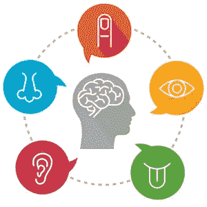
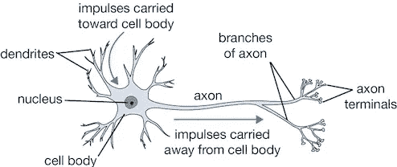
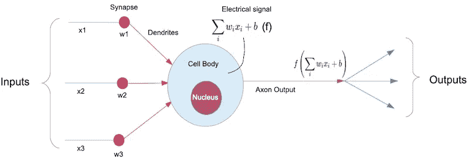
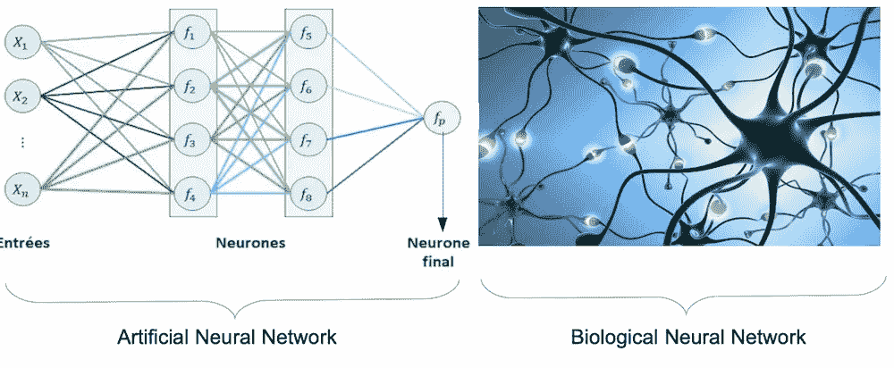
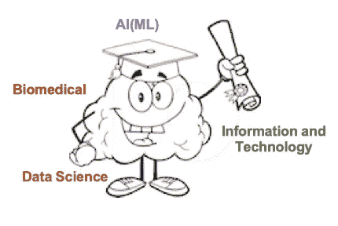

# AI 让我们从生物医学的角度来揭示

> 原文：<https://medium.com/analytics-vidhya/ai-lets-reveal-in-terms-of-biomedical-47d8b789aba6?source=collection_archive---------15----------------------->

把“人工”和“智能”这两个词分开。这两个词都很容易理解。但这里的**智能**是简而言之，涉及**大脑的功能、行为、记忆、信号处理、神经元的信息处理和学习能力。**智力是获取和运用知识和技能的能力。

作为一名 IT 工程师，如果有人问我如何以及在哪里使用 AI，我可以说我们可以使用类似 TensorFlow，PyTorch，CAFFE，Keras，Chainer 等机器学习框架和平台来制作软件和应用程序，即人脸识别，图像分类，股市预测，象棋游戏等。并且会说这通常是数据科学家的主题。

但基本上，AI(ML)的核心原理属于生物医学。我的意思是基本原理与人脑及其行为有关。基于这一原则，数据科学家利用大量的数学学科，如向量、张量、矩阵等，开发出这样的算法。来制作机器学习模型并训练它们。

我们将看到生物医学专业的学生对人工智能有哪些了解？它与信息和技术有什么关系。让我们看看。

# 人类的感官

人类有五种感官:触觉、嗅觉、视觉、声音识别和味觉。它们都根据自己的功能为大脑产生信息。

当该信息产生时，它将被记忆一次。然后，如果大脑用感官获得这些信息，它会自动被记忆。

让我们举一个愿景的例子。如果一个 5-6 个月的婴儿第一次看到一个苹果，我们告诉他这是一个苹果。现在苹果公司的图像信息存储在他的存储器中。所以，第二次如果我们给他看苹果，他的大脑会启动记忆过程，并得到苹果的输出。产生该信息的时间取决于大脑已经记忆该信息(数据)的准确程度。所以，现在如果他第三次看到苹果，产生的信息会比第二次更准确更快，以此类推。所以，我们可以说大脑在学习。同样的原理也可以用在**深度学习**和**机器学习**中。

# 神经元

神经元是专门的**细胞**，处理信息的生成、计算和向大脑的传输。第一个输入来自任何感官，然后神经元通过这条路径进入大脑。这类神经元被称为[感觉神经元](https://en.wikipedia.org/wiki/Sensory_neuron)。它们对影响感觉器官细胞的触觉、声音或光线等输入刺激做出反应，并向大脑发送信号。[生物神经元](https://en.wikipedia.org/wiki/Biological_neuron_model)看起来像这样。

其中**枝晶**作为输入。我们可以看到这里有不止一个输入。**轴突**作为输出工作。轴突**末端**会将输出馈送到下一个神经元。它也被称为**突触**。也可以有如此多的输出。细胞体**和细胞核**将计算并产生电信号形式的信息。当神经元一对一传递信息时，它们传递的是由细胞液产生的电信号。对生物神经元的基本了解就够了。****

啊！！但这是生物学。这跟 AI 或者机器学习有什么关系？

然后看看这个生物神经元的数学模型。

我们可以很容易地将模型与生物神经元联系起来。神经元非常多，与轴突和树突相连，形成一个信息传递的网络，称为神经网络。

*我们这里说的不是计算或者方程。在图像中，它只是为了表明，自然神经元细胞存在某种信息生成过程，可以人工理解，并通过现实世界中的一些方程推导出来。*

神经网络是机器学习的一个非常熟悉的术语。如果我们比较自然和人工神经网络，它看起来像这样。

我们现在可以理解，任何来自感官的信息是如何到达大脑的。

但是，我们仍然有其他问题，为什么我们要把这个概念用于机器学习？机器将如何学习这种结构和计算？

这个问题的出现是因为我们遗漏了一个最重要的神经元自然现象。这叫做**神经元内存分配**。这是感官记忆的一部分。

# 感官记忆

感官记忆是记忆中最短的元素。它是一种在原始刺激结束后仍能保留感觉信息印象的能力。对于通过视觉、听觉、嗅觉、味觉和触觉的五种感官**接收到的刺激，它起到一种**缓冲器**的作用，这些感官被准确地保留下来，但非常短暂。**

例如，看着某样东西，只用一秒钟的观察就能记住它的样子的能力就是感觉记忆的一个例子。

> 综上所述，我们可以说记忆是储存在侧神经元中的，这个过程叫做 [**神经元的记忆分配**。](https://en.wikipedia.org/wiki/Neuronal_memory_allocation)

**神经元分配**是一种现象，它表示网络中的特定神经元如何存储特定的记忆，而不是其他接收类似输入的神经元，从而致力于。

我们可以从苹果的识别例子中理解同样的情况。

如果我们将这与机器学习相关联，它具有相同的功能。很明显，首先，我们要训练某种一堆神经网络，我们可以说， **ML 模型**。

然后我们可以在应用程序或软件中的某些组件中使用该模型文件。因此，该 ML 模型专门记忆一些预定义的所需数据集，并基于其处理输出。

因此，在理解了神经元的功能之后，我们就可以理解人工智能(ML)是如何与生物医学的概念相联系的。

感谢阅读这篇文章。我喜欢听你的反馈。有什么问题可以随便问:)。