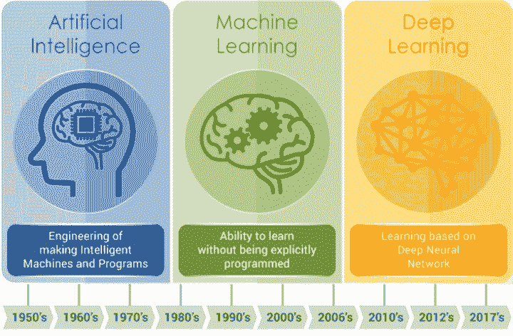
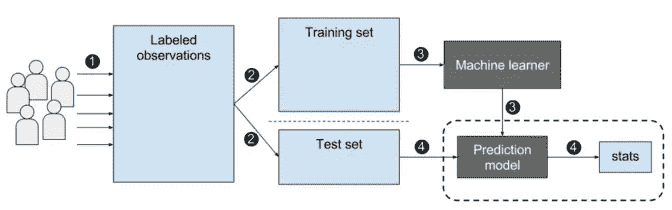
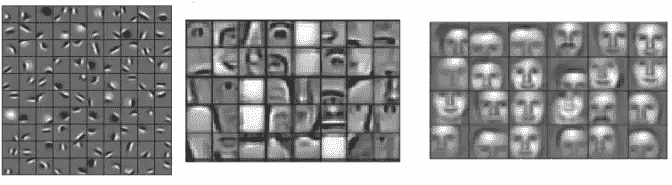
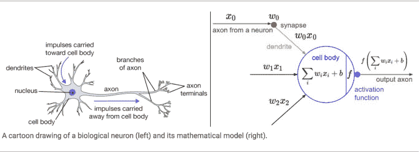
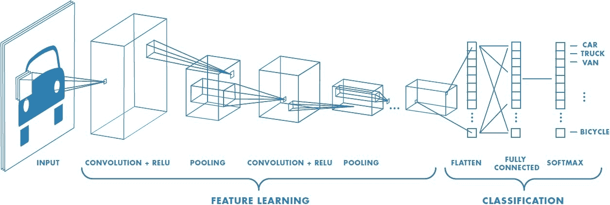
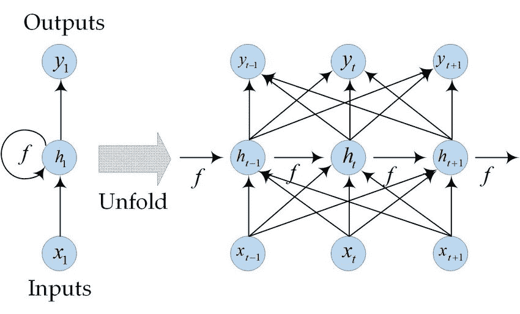
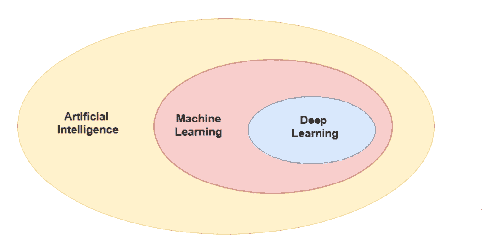

# AI，ML，DL..什么是什么？🤔🤔

> 原文：<https://medium.com/analytics-vidhya/ai-ml-dl-whats-what-ecb354967e63?source=collection_archive---------14----------------------->

本文试图通过定义人工智能、机器学习和深度学习并描述每个部分来解释它们之间的差异，同时给出一个宽泛的概述。

我非常肯定，我们大多数人都因为好莱坞电影而熟悉人工智能(AI)这个名字。我最喜欢的电影系列之一是《复仇者联盟》，它让我对人工智能的世界产生了兴趣。在大多数科幻电影中，AI 被赋予了某种超能力，可以制造一些不自然的东西，超越存在。

复仇者联盟

虽然现实中 AI 技术还不够智能。人工智能的发展简化了我们日常生活中的大多数问题，也简化了银行业、市场营销和医疗保健等行业的问题。

理解所有围绕人工智能的缩略语几乎比理解技术更难。在这个人工智能世界的最初几天，几乎所有人都对人工智能(AI)、机器学习(ML)和深度学习(DL)感到困惑。这三个术语密切相关，但并不相同。所以让我们开始了解更多。

现在，让我们从:

# **如何定义人工智能？**

无生命的物体以智慧生物的形式出现的想法已经存在很长时间了。古希腊人有关于机器人的神话，中国和埃及的工程师建造了机器人。现代人工智能的起源可以追溯到古典哲学家试图将人类思维描述为一个符号系统。1950 年，艾伦·特纳提出了一个提案“机器能思考吗？”。但是人工智能领域直到 1956 年在新罕布什尔州汉诺威的达特茅斯学院的一次会议上才正式成立，在那里“*人工智能*一词被创造出来。简单地说，AI 是一种使系统能够展示类似人类智能的技术。人工智能是使机器智能化的一个广义概念。无论是汽车、机器人还是软件应用程序，如果你想让它们变得聪明，你就需要人工智能。

**人工智能的类型:**

考察模仿自然智能的能力，他们使用的硬件，他们在现实世界中的应用，人工智能可以分为三个部分。我们来看看 AI 的类型。

**人工狭义智能(ANI):**

人工狭义智能(ANI)也被称为**弱 AI** 是我们今天唯一成功实现的人工智能类型。狭义人工智能被编程为执行单一任务，如查看天气、下棋、面部识别、驾驶汽车或互联网搜索，并且在完成它被编程为要做的特定任务方面非常智能。简单地说，我们可以承认狭义人工智能是面向目标的。它们被设计为实时工作，但是它们只从特定的数据集中提取信息。狭隘的人工智能系统没有人类那样的意识和情感。

**一些狭义 AI 的例子**:

*   [谷歌排名榜](https://moz.com/learn/seo/google-rankbrain) /谷歌搜索
*   苹果的 Siri，亚马逊的 Alexa，微软的 Cortana 以及其他虚拟助手
*   IBM 的沃森
*   图像/面部识别软件
*   疾病绘图和预测工具
*   制造业和无人驾驶机器人
*   针对危险内容的垃圾邮件过滤器/社交媒体监控工具
*   基于观看/收听/购买行为的娱乐或营销内容推荐
*   无人驾驶汽车

**人工通用智能:**

人工通用智能(Artificial General Intelligence)或称**强 AI** 是一种机器的概念，它具有模仿人类智能的能力。AGI 能够思考、理解和行动，在任何给定的情况下，其方式与人类无异。这是我们在《复仇者联盟》、《阿凡达》、《她》等科幻电影中看到的一种人工智能。

当你考虑到人类大脑是创造一般智能的模型时，实现强大人工智能的巨大挑战就不足为奇了。缺乏对人类大脑功能的全面了解，使得研究人员努力复制视觉和运动的基本功能。

[富士通制造的 K](https://www.fujitsu.com/global/about/businesspolicy/tech/k/whatis/system/) ，最快的超级计算机之一，是实现强人工智能的最引人注目的尝试之一，但考虑到它花了 40 分钟来模拟一秒钟的神经活动，很难确定在我们可预见的未来是否会实现强人工智能。随着图像和面部识别技术的进步，我们很可能会看到机器学习和视觉能力的提高。

**人工超级智能:**

牛津哲学家尼克·博斯特罗姆将超级智慧定义为 **:**

**" *在几乎所有感兴趣的领域中大大超过人类认知表现的任何智力* "**

人工超级智能(ASI)是一种假设的人工智能，它不仅模仿或理解人类的智能和行为。ASI 是机器变得有自我意识并超越人类智力和能力的地方。正是这种类型的 AI 将对人类产生巨大影响，并可能导致人类从这个平面上灭绝。

现在，让我们潜入机器学习的河流。

# **什么是机器学习？**

机器学习是人工智能的一种应用，它使系统能够根据经验自动学习和改进，而无需显式编程。

在传统的编程中，我们建立一些规则和数据，并在此基础上得到相关的答案。但是机器学习需要一些数据和答案，基于这些数据和答案，它会制定一些规则，并执行特定的任务。

从白天到黑夜，机器学习的应用程序分散在我们周围。 **YouTube，Spotify，Google Photos，Google Assistant，亚马逊 Alexa，**所有都体现 ML。

机器学习是基于算法的。这些算法可以大致分为:

*   **监督学习:**想象你正在监督下学习一项任务。所以，一定会有人来评判你是否得到了正确的答案。同样，在**监督学习中，**在训练 ML 算法时有一组完全标记的数据。

完全标记的数据表示训练数据集中的每个示例都标记有算法应该自己得出的答案。所以，从上图可以看到，它把带标签的数据作为输入，找出算法，然后测试新数据，预测标签。因此，监督学习最适合于存在一组可用参考点或训练算法的基础事实的问题。但是这些并不总是可以得到的。

*   **无监督学习:**干净、完美标记的数据集不容易得到。有时，研究人员会问一些他们不知道答案的算法问题。这就是无监督学习的用武之地。在无监督学习中，它的主要宗旨是通过数据集中的干扰模式来了解更多的数据。无监督学习通常作为探索性数据分析的一部分来执行。

注意上面的截图，它试图通过提取有用的特征并分析其结构来自动找到数据中的结构。

*   **强化学习:**电子游戏充满了强化暗示。完成一个级别并获得徽章。在一定数量的移动中击败坏人，并获得奖金。步入陷阱——游戏结束。这些提示帮助玩家学习如何在下一场比赛中提高他们的表现。如果没有这种反馈，他们只会在游戏环境中采取随机行动，希望进入下一个阶段。强化学习的运作原理是一样的——实际上，视频游戏是这类研究的常见测试环境。在这种机器学习中，人工智能代理试图找到最佳方式来完成特定目标或提高特定任务的性能。这是一个迭代的过程:反馈的次数越多，代理人的策略就变得越好。这种技术对于训练机器人特别有用，机器人可以在诸如驾驶自动驾驶汽车或管理仓库库存等任务中做出一系列决定。

是时候深入了。所以，

# **什么是深度学习？**

深度学习是一种机器学习技术，其灵感来自于我们的大脑通过神经元理解任何事情的过程。它过滤输入数据，并通过神经层对其进行处理，以预测和分类信息。

大多数深度学习方法使用**神经网络。**正如你在上图中注意到的，生物神经元和人工神经网络的结构是相似的。深度学习可以定义为包含大量参数和层的多神经网络架构。

深度学习架构分为以下几个部分:

*   **人工神经网络(ANN):** 人工神经网络是一种计算系统，旨在模拟人脑分析和处理信息的方式。它是人工智能的基础，因为它模仿我们并解决对我们或统计标准来说不可能或困难的问题。人工神经网络具有自学能力，这使它们能够在获得更多数据时产生更好的结果。

如您所见，ANN 由一个输入层、一些隐藏层和输出层组成。输入层接受输入，隐藏层通过应用权重和偏差来处理输入，输出层产生结果。

*   **卷积神经网络(CNN):** 卷积神经网络是一种深度学习算法，它以图像为输入，为图像中的各个方面或对象分配偏差和权重，以将其与其他区分开来。

卷积神经网络的体系结构

卷积神经网络(ConvNet)中的隐藏层由卷积层、池层、全连接层和规范化层组成。ConvNet 的架构类似于人脑中神经元的连接模式，其灵感来自视觉皮层的组织。单个神经元只在视野中被称为感受野的有限区域内对刺激做出反应。这些区域的集合重叠覆盖了整个可视区域。

*   **递归神经网络:**递归神经网络是一种深度学习算法，用于序列预测问题。RNN 在自然语言处理领域非常成功。

RNN 基础建筑

递归神经网络记住过去，并且它的决策受到它从过去所学到的东西的影响。注意:基本的前馈网络也能“记住”东西，但它们记住的是在训练中所学的东西。例如，图像分类器在训练中学习“1”的样子，然后使用该知识对生产中的事物进行分类。此外，虽然 rnn 在训练时学习类似，但是它们在生成输出时记住从先前输入中学到的东西。

现在你可以自己分辨出**人工智能、机器学习、**和**深度学习**的区别了。为了更好地理解，请查看下面的图片，直观地了解它们之间的差异。

AI 是 ML 和 DL 的超集。无论什么深度学习都属于机器学习，都属于人工智能领域。

这是对人工智能和相关术语的概述。在我讨论的每个领域都有很多有趣的话题，我希望我能点燃你们探索这个有趣领域的火花。

*资源:*

*   [https://blogs . NVIDIA . com/blog/2018/08/02/supervised-unsupervised-learning/#:~:text = In % 20a % 20 supervised % 20 learning % 20 model，and % 20 patterns % 20 on % 20 its % 20 own。](https://blogs.nvidia.com/blog/2018/08/02/supervised-unsupervised-learning/#:~:text=In%20a%20supervised%20learning%20model,and%20patterns%20on%20its%20own.)
*   [https://towards data science . com/understanding-the-difference-at-ai-ml-and-dl-cceb 63252 a 6 c？gi=b0fe0994842b](https://towardsdatascience.com/understanding-the-difference-between-ai-ml-and-dl-cceb63252a6c?gi=b0fe0994842b)
*   [https://code bots . com/artificial-intelligence/the-3-types-of-ai 是第三种可能性](https://codebots.com/artificial-intelligence/the-3-types-of-ai-is-the-third-even-possible)
*   [https://vinodsblog . com/2020/05/17/深度学习递归神经网络基础知识/](https://vinodsblog.com/2020/05/17/deep-learning-basics-of-recursive-neural-network/)
*   [https://www.mathworks.com/discovery/deep-learning.html](https://www.mathworks.com/discovery/deep-learning.html)
*   [https://towards data science . com/a-comprehensive-guide-to-convolutionary-neural-networks-the-Eli 5-way-3bd2b 1164 a53](https://towardsdatascience.com/a-comprehensive-guide-to-convolutional-neural-networks-the-eli5-way-3bd2b1164a53)
*   [https://towards data science . com/recurrent-neural-networks-d 4642 c 9 BC 7 ce](https://towardsdatascience.com/recurrent-neural-networks-d4642c9bc7ce)