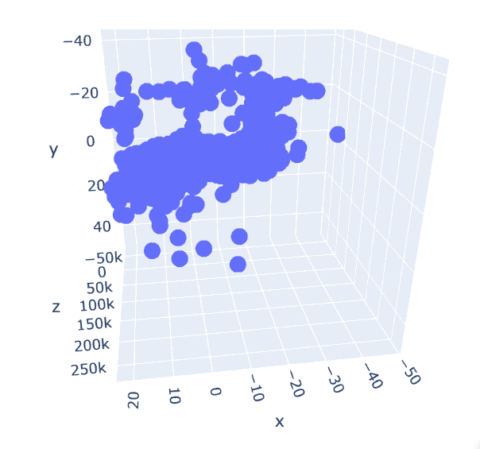

# AI & ML:如何结合 KMeans 和 DBSCAN？一种分割的方法

> 原文：<https://medium.com/analytics-vidhya/ai-ml-how-combine-kmeans-and-dbscan-a-methodological-approach-for-segmentation-ad2735dbf42d?source=collection_archive---------17----------------------->


***——还是听了一个关于系外行星的诺贝尔奖的会议让我想到了人工智能的数据方法& ML 聚类方法——***

***By 诺贝托****[*【1】*](http://file///C:/Users/norbe/OneDrive/Desktop/article%20clustering%20-%20V2.docx#_ftn1)*[*【2】*](http://file///C:/Users/norbe/OneDrive/Desktop/article%20clustering%20-%20V2.docx#_ftn2)*[*【3】*](http://file///C:/Users/norbe/OneDrive/Desktop/article%20clustering%20-%20V2.docx#_ftn3)***

# **背景和想法建议(或一种抽象)**

**几周前，我参加了诺贝尔奖获得者 Dider Queloz 在瑞士日内瓦大学举办的一次会议(我们甚至有机会一起喝了杯咖啡)。他与米歇尔·马约尔(Michelle Mayor)一起，因 1995 年发现第一颗系外行星——51 Pegasi b 而获得了 2019 年诺贝尔物理学奖。25 年多后，我们记录了 4000 多颗系外行星[【7】](http://file///C:/Users/norbe/OneDrive/Desktop/article%20clustering%20-%20V2.docx#_ftn7)。**

**在天文学中，正如在一般科学中一样，人工智能和机器学习算法在分类中的应用(监督和非监督技术[【8】](http://file///C:/Users/norbe/OneDrive/Desktop/article%20clustering%20-%20V2.docx#_ftn8))被广泛使用[【9】](http://file///C:/Users/norbe/OneDrive/Desktop/article%20clustering%20-%20V2.docx#_ftn9)[【10】](http://file///C:/Users/norbe/OneDrive/Desktop/article%20clustering%20-%20V2.docx#_ftn10)。更详细地说，人工智能(AI)和机器学习(ML)技术对聚集系外行星有着特殊的兴趣[【11】](http://file///C:/Users/norbe/OneDrive/Desktop/article%20clustering%20-%20V2.docx#_ftn11)。**

**此外，细分和聚类技术还用于企业和工业领域，例如对潜在客户进行分组和细分(即定制特定营销活动或计划季节性生产[【12】](http://file///C:/Users/norbe/OneDrive/Desktop/article%20clustering%20-%20V2.docx#_ftn12))。**

**用于无监督聚类目的的一些主要 AI & ML 算法是 KMeans 和 DBS can[【13】](http://file///C:/Users/norbe/OneDrive/Desktop/article%20clustering%20-%20V2.docx#_ftn13)。然而，与所有无监督算法一样，在考虑哪种算法可能是最佳算法以及必须定义多少个聚类/合理拥有多少个聚类时，必须接受折衷。最后，建立分析的关键部分是由研究本身发生的领域的知识驱动的。**

**通过以一个超过 900 颗系外行星的数据集作为工作实例，我提出了一种比较不同聚类算法(及其最优解的选择——肘法[【14】](http://file///C:/Users/norbe/OneDrive/Desktop/article%20clustering%20-%20V2.docx#_ftn14)和膝法[【15】](http://file///C:/Users/norbe/OneDrive/Desktop/article%20clustering%20-%20V2.docx#_ftn15))的方法学方法，并给出了一些关于如何选择更方便的预处理数据的相关指南(对数变换[【16】](http://file///C:/Users/norbe/OneDrive/Desktop/article%20clustering%20-%20V2.docx#_ftn16)，标准化，规范化[【17】](http://file///C:/Users/norbe/OneDrive/Desktop/article%20clustering%20-%20V2.docx#_ftn17))。**

**本文中提出的想法是通过考虑最佳的预处理策略来最佳地选择聚类的数量，该策略使得两种算法输出之间的差异更小。因此，换句话说，它基于一个 3 步流程:**

**1.实施一个选定的预处理**

**2.运行两种算法(KMEANS 和 DBSCAN ),识别并收集点 1 的每个选择的每个单一输出。**

**3.运行了所有可能的预处理数据选项(点 1)并收集了所有相关的算法聚类输出(点 2)，选择两种算法的结果最相似的情况作为最终最优。**

# **数据集描述、Jupyter 和 Python 代码**

**数据可通过不同的在线资源公开获取。截至今天(2020 年 10 月)，已确认的系外行星数量为 4368 颗。每颗行星都有几个特征。为了进行分析，我决定只考虑其中的 3 颗[【18】](http://file///C:/Users/norbe/OneDrive/Desktop/article%20clustering%20-%20V2.docx#_ftn18)，每条记录都有[【19】](http://file///C:/Users/norbe/OneDrive/Desktop/article%20clustering%20-%20V2.docx#_ftn19)，总共有 974 颗系外行星，描述如下:**

**1.行星质量——现在也被认为是 X 轴**

**2.起始质量-现在也被认为是 Y 轴**

**3.轨道周期[【20】](http://file///C:/Users/norbe/OneDrive/Desktop/article%20clustering%20-%20V2.docx#_ftn20)—现在也被认为是 Z 轴**

**在 Jupyter 工作簿环境中使用 Python 进行分析[【21】](http://file///C:/Users/norbe/OneDrive/Desktop/article%20clustering%20-%20V2.docx#_ftn21)。**

**我写的 Python 代码可以在这里找到[，通过谷歌驱动](https://drive.google.com/file/d/1UZXD1ZO61UJecqfJqIZl5H-A7vskgkTT/view?usp=sharing)[【22】](http://file///C:/Users/norbe/OneDrive/Desktop/article%20clustering%20-%20V2.docx#_ftn22)。**

# **方法论:图解描述**

**对于那些从事机器学习和人工智能项目的人来说，通常的做法是在分析之前准备好数据集。实施的步骤通常涉及清理和协调数据格式，作用于空白数据(即，对缺失值应用平均值和/或移除所有未充分描述的记录)，并通过应用数据形状转换使数据在它们之间具有可比性[【23】](http://file///C:/Users/norbe/OneDrive/Desktop/article%20clustering%20-%20V2.docx#_ftn23)。**

**在这项工作中，我应用了 4 种数据转换:**

**1.标准化**

**2.正常化**

**3.对数变换**

**4.“临时”日志转换[【24】](http://file///C:/Users/norbe/OneDrive/Desktop/article%20clustering%20-%20V2.docx#_ftn24)**

**对于 4 个选项中的每一个，我都运行了 2 种聚类算法(KMeans 和 DBSCAN)，并获得了每种情况下的结果[【25】](http://file///C:/Users/norbe/OneDrive/Desktop/article%20clustering%20-%20V2.docx#_ftn25):**

**a.对于聚类:通过应用肘方法和剪影分析获得最佳聚类数**

**b.对于 DBSCAN:应用 Knee 方法设置最佳 EPS 值，得到最佳聚类数[【26】](http://file///C:/Users/norbe/OneDrive/Desktop/article%20clustering%20-%20V2.docx#_ftn26)**

**在总共 8 个聚类输出(4x2)中，通过考虑哪个数据转换为 KMeans 和 DBSCAN 带来最接近的结果(具体地，如进一步所述，选择为两种算法带来 5 个聚类的“特定”对数转换)来做出最佳选择。**

**下面是最后一句话，对写这几行的人来说很重要。即使可以对这种方法提出一些理论上的批评，商业中通常的做法是采用一种实用的，在某些情况下甚至是“手工的”方法(或者换句话说，基于实践的经验)，而不是仅仅被理论所驱动。最后，关于所获结果质量的最终选择应始终由了解该研究领域的人员进行审查[【27】](http://file///C:/Users/norbe/OneDrive/Desktop/article%20clustering%20-%20V2.docx#_ftn27)。**

# **编码输出和图形**

**(-关于方法的结论在这几行末尾的专门段落中-)**

# **1 个初始数据集**

**选择用三维来分析数据集，一点也不随机。事实上，它暗示了为了更好的理解而画图表的可能性。下面你可以看到 974 颗行星被绘制在一张 3D 地图上(以点的形式)。**

****

**以下部分的结构如下:**

**1.选择数据转换(共 4 个)**

**2.绘制获得的数据**

**3.运行 KMeans 分析:**

**a.肘方法和相关图:最佳聚类数的初步选择**

**b.剪影分析:结果和绘图**

**c.最终聚类数的定义**

**d.聚类数据集的绘图**

**e.打印出一些数据统计(平均，每个集群的元素数量等。)**

**4.运行 DBSCAN 分析:**

**a.膝法图**

**b.确定最佳每股收益率**

**c.聚类数据集的绘图**

**d.最终分类编号的标识**

**e.打印出一些数据统计(平均，每个集群的元素数量等。)**

**5.结果比较**

# **2.1 标准化**

**标准化意味着重新调整值的分布，使观察值的平均值为 0，标准偏差为 1。以下是绘制的数据:**

****

# **2.2.均值分析**

# **2.2.1 寻找最佳聚类数的肘形法**

****

**最佳聚类数:6 到 8**

# **2.2.2 轮廓分析**

```
**For n_clusters = 6 The average silhouette_score is : 0.8705326724380881For n_clusters = 7 The average silhouette_score is : 0.8730096408923297For n_clusters = 8 The average silhouette_score is : 0.7982196885773016**
```

****

# **2.2.3 最佳集群数**

**在 6 到 8 个轮廓分析范围内，最终获得的聚类数是 7，即具有最佳轮廓分数(0.873)的聚类数**

# **聚类数据集的绘图**

****

# **2.2.5 千均值统计**

```
**Average of Data per cluster: Planet Mass  Star Mass  Orbital Period
Cluster Label                                        
0                -0.217158  -0.058892       -0.061369
1                 1.871795  -0.215893       26.603112
2                 6.021872  -0.076752        0.069941
3                -0.199618  20.329225       -0.079844
4                 2.355313  -0.042638        0.115091
5                -0.169162   7.995528       -0.079860
6                 0.750149   0.041935        7.961525Count of Elements per cluster: Planet Mass  Star Mass  Orbital Period
Cluster Label                                        
0                      910        910             910
1                        1          1               1
2                       17         17              17
3                        2          2               2
4                       39         39              39
5                        2          2               2
6                        3          3               3**
```

# **2.3.DBSACN 分析**

# **2.3.1.用拐点法求最优 EPS 率**

****

# **2.3.2.确定最佳每股收益率**

```
**EPS Rate: 0.15358041639814596**
```

# **2.3.3 使用选定的 EPS 运行 DBSCAN 分析**

****

# **2.3.4 最终聚类数的识别**

**所选的 EPS 只确定了 1 个集群[【28】](http://file///C:/Users/norbe/OneDrive/Desktop/article%20clustering%20-%20V2.docx#_ftn28)[【29】](http://file///C:/Users/norbe/OneDrive/Desktop/article%20clustering%20-%20V2.docx#_ftn29)**

# **2.3.5 千均值统计**

```
**Average of Data per cluster (-1 is Noise Cluster): Planet Mass  Star Mass  Orbital Period
Cluster Label                                        
-1                2.510945   0.690743        0.859376
 0               -0.224693  -0.061811       -0.076902 Count of Elements per cluster (-1 is Noise Cluster): Planet Mass  Star Mass  Orbital Period
Cluster Label                                        
-1                      80         80              80
 0                     894        894             894**
```

# **3.1 标准化**

**归一化数据意味着根据高斯分布(0 到 1)重新缩放数据集。**

****

# **3.2.均值分析**

# **3.2.1 寻找最佳聚类数的肘方法**

****

**最佳聚类数:6 到 8**

# **轮廓分析**

```
**For n_clusters = 6 The average silhouette_score is : 0.546915511486785For n_clusters = 7 The average silhouette_score is : 0.520452001127997For n_clusters = 8 The average silhouette_score is : 0.507950916276848**
```

# **3.2.3 最佳聚类数**

**在 6 到 8 个剪影分析范围内，所取的最终聚类数是 6，具有最佳得分(0.5469)。**

# **聚类数据集的绘图**

****

# **3.2.5 千均值统计**

```
**Average of Data per cluster: Planet Mass  Star Mass  Orbital Period
Cluster Label                                        
0                 0.435509   0.320256        0.823894
1                 0.020016   0.054814        0.995913
2                 0.970420   0.095111        0.154775
3                 0.139757   0.282285        0.941569
4                 0.738071   0.288113        0.580821
5                 0.057810   0.868372        0.400254 Count of Elements per cluster: Planet Mass  Star Mass  Orbital Period
Cluster Label                                        
0                      119        119             119
1                      479        479             479
2                       41         41              41
3                      243        243             243
4                       72         72              72
5                       20         20              20**
```

# **3.3 DBSACN 分析**

# **3.3.1.用拐点法求最优 EPS 率**

****

# **3.3.2.确定最佳每股收益率**

```
**EPS Rate: 0.09639028435584383**
```

# **3.3.4 最终聚类数的识别**

**选定的 EPS 确定了 2 个集群**

****

# **数据库扫描统计**

```
**Average of Data per cluster (-1 is Noise Cluster): Planet Mass  Star Mass  Orbital Period
Cluster Label                                        
-1                0.490175   0.458527        0.464900
 0                0.153068   0.166143        0.932434
 1                0.992676   0.053397        0.070132 Count of Elements per cluster (-1 is Noise Cluster): Planet Mass  Star Mass  Orbital Period
Cluster Label                                        
-1                      55         55              55
 0                     893        893             893
 1                      26         26              26**
```

# **4.1 自然日志**

**如前所述，用于比较数据并产生更接近高斯分布的技术之一是对数据集应用对数变换。在这里，我对所有 3 个维度进行了相同的转换。在下面找到相应绘制的数据集:**

****

# **4.2.均值分析**

# **4.2.1 寻找最佳聚类数的肘方法**

****

**最佳聚类数:4 到 6**

# **轮廓分析**

```
**For n_clusters = 4 The average silhouette_score is : 0.4224896238902955For n_clusters = 5 The average silhouette_score is : 0.3442082847922259For n_clusters = 6 The average silhouette_score is : 0.3459242410026600**
```

****

# **4.2.3 最佳聚类数**

**在 4 到 6 个轮廓分析范围内，最终的聚类数为 4，即得分最高(0.422)的聚类数。**

# **聚类数据集的绘图**

****

# **4.2.5 均值统计**

```
**Average of Data per cluster: Planet Mass  Star Mass  Orbital Period
Cluster Label                                        
0                -4.142526  -0.591658        1.767688
1                 0.317616   0.009636        1.207144
2                -2.179556  -0.127672        3.480561
3                 2.236817  -0.294047        7.923827 Count of Elements per cluster: Planet Mass  Star Mass  Orbital Period
Cluster Label                                        
0                      229        229             229
1                      492        492             492
2                      171        171             171
3                       82         82              82**
```

# **4.3.DBSACN 分析**

# **4.3.1.用拐点法求最优 EPS 率**

****

# **4.3.2.确定最佳每股收益率**

```
**EPS rate :  1.2810780029446476**
```

# **4.3.3 使用选定的 EPS 运行 DBSCAN 分析**

****

# **4.3.4 最终簇号的识别**

**选定的 EPS 仅识别了 1 个集群。**

# **数据库扫描统计**

```
**Average of Data per cluster (-1 is Noise Cluster): Planet Mass  Star Mass  Orbital Period
Cluster Label                                        
-1                0.088657  -0.910813        3.859141
 0               -1.088861  -0.127528        2.188625 Count of Elements per cluster (-1 is Noise Cluster): Planet Mass  Star Mass  Orbital Period
Cluster Label                                        
-1                      67         67              67
 0                     907        907             907**
```

# **5.1 即席日志转换**

**类似地，正如在第 4 节中所做的，我对 3 个维度应用了对数变换，但不是对所有维度都一样。下面是每个维度的 3 个图，包含原始数据(蓝线)和每个维度的特定对数变换，带来了合理的高斯分布(橙线)。**

**为了清楚起见，我在这里报告了 Python 代码:**

***SNS . distplot(df . final _ mass)***

***SNS . distplot(5 *(NP . log(df . final _ mass)))***

***plt.title("行星质量分布")***

****

***SNS . distplot(df . star _ mass)***

***SNS . distplot(10 *(NP . log(df . star _ mass)))***

***plt.title("恒星质量分布")***

****

***SNS . dist plot(df . orbital _ period)***

***SNS . distplot(20000 * NP . log(df . orbital _ period))***

***plt.title("轨道周期分布")***

****

**请参见下面的综合转换数据集图表:**

****

# **5.2.均值分析**

# **5.2.1 寻找最佳聚类数的肘形法**

****

**最佳聚类数:5 到 7**

**轮廓分析**

```
**For n_clusters = 5 The average silhouette_score is : 0.5883037969041494 For n_clusters = 6 The average silhouette_score is : 0.5881160930365811 For n_clusters = 7 The average silhouette_score is : 0.5553145596447594**
```

**5.2.3 最佳集群数**

**在 5 到 7 个剪影分析范围内，所取的最终聚类数是 5，具有最佳得分(0.588)。**

# **聚类数据集的绘图**

****

# **平均统计数据**

```
**Average of Data per cluster: Planet Mass  Star Mass  Orbital Period
Cluster Label                                        
0                -3.664519  -0.573782    23948.345346
1                 8.680214  -5.099493   184058.496680
2               -11.329849  -2.822090    56338.626899
3                 1.404428  -1.770407   114206.177884
4                -6.571787  -6.743543   -20009.716705 Count of Elements per cluster: Planet Mass  Star Mass  Orbital Period
Cluster Label                                        
0                      524        524             524
1                       46         46              46
2                      283        283             283
3                       77         77              77
4                       44         44              44**
```

# **5.3.DBSACN 分析**

# **5.3.1.用拐点法求最优 EPS 率**

****

# **5.3.2.确定最佳每股收益率**

```
**EPS rate: 3293.17249989343**
```

# **5.3.3 使用选定的 EPS 运行 DBSCAN 分析**

****

**5.3.4 最终簇号的识别**

**所选的 EPS 确定了 5 个集群。**

# **数据库扫描统计**

```
**Average of Data per cluster (-1 is Noise Cluster): Planet Mass  Star Mass  Orbital Period
Cluster Label                                        
-1                6.540385  -3.869472   110369.970896
 0               -6.563493  -1.600403    34919.907776
 1               -0.414042  -4.336668   109044.003308
 2               -5.798799  -0.592534    96547.550417
 3               11.809209  -0.191690   139739.798212
 4                2.571507  -4.356497   160996.038502 Count of Elements per cluster (-1 is Noise Cluster): Planet Mass  Star Mass  Orbital Period
Cluster Label                                        
-1                      70         70              70
 0                     841        841             841
 1                      22         22              22
 2                      13         13              13
 3                      18         18              18
 4                      10         10              10**
```

# **6.结果比较**

**下表列出了每次迭代获得的最佳聚类数。很明显，对于第 1 行到第 3 行，两者之间的差异似乎很大。然而，对于第 4 行，聚类的数量没有太大的不同(特别是对于这个数据集，两者都等于 5)。**

****

**事实上，比较案例 4 的两个聚类图如何得出相同的定性假设也非常有趣:**

****

# **结论**

**在无监督的机器学习技术中，聚类和分割被广泛应用于许多领域。一个至关重要的方面是确定正确的集群数量。**

**建议的聚类方法强调了前期数据处理如何影响聚类结果。**

**这里进行了 4 种不同的数据处理。对于所有这些，运行 KMeans 和 DBSCAN，分别使用广泛使用的方法来优化它们的输出。**

**必须通过考虑哪种操作在 KMeans 和 DBSCAN 之间产生的差异更小来得出结论性的最佳结果。**

**然而，最后一句话是，对所选结果的解释必须经过研究所在领域专家的分析和批准。**

**— — — — — — — — — — — — — — — — — — — — — — — — — — — — — — —**

**[【1】](http://file///C:/Users/norbe/OneDrive/Desktop/article%20clustering%20-%20V2.docx#_ftnref1)这几行所表达的观点均为作者个人观点。它们不反映所提到的任何其他人的意见或观点。**

**[【2】](http://file///C:/Users/norbe/OneDrive/Desktop/article%20clustering%20-%20V2.docx#_ftnref2)图片根据免费分享协议，可在此处获得:[https://pix abay . com/illustrations/artificial-intelligence-brain-think-4550606/](https://pixabay.com/illustrations/artificial-intelligence-brain-think-4550606/)和[https://time . com/WP-content/uploads/2015/11/exo planets _ by _ jaysimons-d9dv 6 th-large . jpg](https://time.com/wp-content/uploads/2015/11/exoplanets_by_jaysimons-d9dv6th-large.jpg)**

**让我感谢马莱卡和卡洛琳给我宝贵的支持，来纠正我有时很滑稽的书面英语。这里的任何错误都完全归咎于作者。**

**[【4】](http://file///C:/Users/norbe/OneDrive/Desktop/article%20clustering%20-%20V2.docx#_ftnref4)[https://en.wikipedia.org/wiki/Didier_Queloz](https://en.wikipedia.org/wiki/Didier_Queloz)**

**[【5】](http://file///C:/Users/norbe/OneDrive/Desktop/article%20clustering%20-%20V2.docx#_ftnref5)[https://youtu.be/Tacbw-p468Q?t=1259](https://youtu.be/Tacbw-p468Q?t=1259)**

**[【6】](http://file///C:/Users/norbe/OneDrive/Desktop/article%20clustering%20-%20V2.docx#_ftnref6)[https://drive . Google . com/file/d/1 ure xar _ ZL-QJ-rywzarb 8 xvsx 8 gupovq/view？usp =分享](https://drive.google.com/file/d/1urexAR_ZL-QJ-RYWZarB8xvSX8gupovQ/view?usp=sharing)**

**[【7】](http://file///C:/Users/norbe/OneDrive/Desktop/article%20clustering%20-%20V2.docx#_ftnref7)【http://exoplanet.eu/catalog/】T2**

**【8】[【https://www.youtube.com/watch?v=cfj6yaYE86U】](https://www.youtube.com/watch?v=cfj6yaYE86U)**

**[【9】](http://file///C:/Users/norbe/OneDrive/Desktop/article%20clustering%20-%20V2.docx#_ftnref9)[https://astro statistics . PSU . edu/r lectures/clustering _ class ification _ jessi . pdf](https://astrostatistics.psu.edu/RLectures/clustering_classification_Jessi.pdf)**

**[【10】](http://file///C:/Users/norbe/OneDrive/Desktop/article%20clustering%20-%20V2.docx#_ftnref10)[https://academic.oup.com/nar/article/46/14/e83/4990634](https://academic.oup.com/nar/article/46/14/e83/4990634)**

**[【11】](http://file///C:/Users/norbe/OneDrive/Desktop/article%20clustering%20-%20V2.docx#_ftnref11)“利用稳健聚类对太阳系外行星的数据分析”蒋应贵，1 叶丽琴，2 洪文良 2 和杨敏申 3，[链接](https://watermark.silverchair.com/mnras0370-1379.pdf?token=AQECAHi208BE49Ooan9kkhW_Ercy7Dm3ZL_9Cf3qfKAc485ysgAAArgwggK0BgkqhkiG9w0BBwagggKlMIICoQIBADCCApoGCSqGSIb3DQEHATAeBglghkgBZQMEAS4wEQQM0gRYSG0TUyRU_mDuAgEQgIICaz2oC1OFxcqdaaLs4L__zCMB19gM3Vek3OsAGBhhgkWeInQOzpVWJmhT8J7K_0rdzQGYOTrYbuEVwmRZFMvwjH3ekOtca6i5i17_TQcgdS-CDgSQpgUtgJPAFtroVNd05LctomiRctlmgwOuGW7x9MKhyQL8DyIGKl4f8k7QK-6mr8kiTV7I3SXZoS9OAxVden4Y41UNHlaC82z4SfV-LdSAx_ONld_2UIFsyd6LIWbextONsUrsdo5Pri80_T4gVqGALFaDR8EcyVoZcyNNEwFxxUbXb-B_sxroe6KE_W0svY2IF19qE2JOUmIKqqqyIQQhhPnTe6KmThE_KunRuPXGzgfXHlMaNcUsBf7ckUSLn-PSv-WFaJWa4eCasDBqjDLg1wpE7sBvOvudkoVuIOIC3K9HHa27CdnuCnd9LeBBIzHFPCuAAV-desPe9JsSTSwp6BkARxzdwUQoQ99P2p0-q_rfbtIuqgskEhp9O_06nlosaAhLWyQ-olVcCXlu4C5atmuuURwHCfGAeKf4Ox60AoRbbaWb3SEZNiHVsSQzy2xRcYYaoqy8AwXxohZTRfXWzrOP28TVTTYKCZNSg1pgN9zfnFPLH5UpvurVuJjRTMSyNeEUTWoLbfYdoJBE2nqZkj9YvpTUUojVAEkrdTKu6XHinLDXZaZS0Kfi33Bvu2bdSojQuJ7v9t-bZA3wE-hUoISeximyvHODr-xR0w5kXrqo-H-XPDJxcR6yi92AGBhLS1UlzPbuYfDxD7Ul-ps_jhhg13wi7bzGQfQyf2ep_M7c4UMx1fAOHInP2A_qpSb0LAi3HR7MLI4)**

**[【12】](http://file///C:/Users/norbe/OneDrive/Desktop/article%20clustering%20-%20V2.docx#_ftnref12)[www . researchgate . net/publication/271302240 _ Customer _ Segmentation _ Using _ Clustering _ and _ Data _ Mining _ Techniques](http://www.researchgate.net/publication/271302240_Customer_Segmentation_Using_Clustering_and_Data_Mining_Techniques)**

**【https://sebastianraschka.com/books.html】[【13】](http://file///C:/Users/norbe/OneDrive/Desktop/article%20clustering%20-%20V2.docx#_ftnref13)理论参考资料等，在本书中都可以找到**

**[【14】](http://file///C:/Users/norbe/OneDrive/Desktop/article%20clustering%20-%20V2.docx#_ftnref14)[https://www.youtube.com/watch?v=lbR5br5yvrY](https://www.youtube.com/watch?v=lbR5br5yvrY)**

**[【15】](http://file///C:/Users/norbe/OneDrive/Desktop/article%20clustering%20-%20V2.docx#_ftnref15)Ville sato PAA 等人，“在干草堆中寻找“膝盖”:检测系统行为中的膝盖点”——2011 年**

**[【16】](http://file///C:/Users/norbe/OneDrive/Desktop/article%20clustering%20-%20V2.docx#_ftnref16)[https://www.youtube.com/watch?v=ZKaOfJIjMRg](https://www.youtube.com/watch?v=ZKaOfJIjMRg)**

**[【17】](http://file///C:/Users/norbe/OneDrive/Desktop/article%20clustering%20-%20V2.docx#_ftnref17)[https://www . analyticsvidhya . com/blog/2020/04/feature-scaling-machine-learning-normalization-标准化/](https://www.analyticsvidhya.com/blog/2020/04/feature-scaling-machine-learning-normalization-standardization/)**

**[【18】](http://file///C:/Users/norbe/OneDrive/Desktop/article%20clustering%20-%20V2.docx#_ftnref18)关于测量单位和其他细节，参考资料如下:[http://exoplanet.eu/catalog/](http://exoplanet.eu/catalog/)**

**[【19】](http://file///C:/Users/norbe/OneDrive/Desktop/article%20clustering%20-%20V2.docx#_ftnref19)并非 CVS 文件中提到的所有记录都是如此，可通过此链接获得(右上，CSV 选项):【http://exoplanet.eu/catalog/#】T2**

**[【20】](http://file///C:/Users/norbe/OneDrive/Desktop/article%20clustering%20-%20V2.docx#_ftnref20)关于所用术语的更多细节，可在此处找到其他定义:**

**[https://exoplanetarchive . ipac . Caltech . edu/docs/API _ exomultpars _ columns . html](https://exoplanetarchive.ipac.caltech.edu/docs/API_exomultpars_columns.html)**

**[【21】](http://file///C:/Users/norbe/OneDrive/Desktop/article%20clustering%20-%20V2.docx#_ftnref21)[https://jupyter.org/about](https://jupyter.org/about)**

**[【22】](http://file///C:/Users/norbe/OneDrive/Desktop/article%20clustering%20-%20V2.docx#_ftnref22)[https://drive . Google . com/file/d/1 uzxd 1 zo 61 ujecqfjqizl 5h-a 7 vskgktt/view？usp =共享](https://drive.google.com/file/d/1UZXD1ZO61UJecqfJqIZl5H-A7vskgkTT/view?usp=sharing)**

**[【23】](http://file///C:/Users/norbe/OneDrive/Desktop/article%20clustering%20-%20V2.docx#_ftnref23)其背后的推理和相关技术可以在互联网上找到，例如这里:[https://towardsai . net/p/data-science/how-when-and-why-should-you-normalization-rescale-your-data-3f 083 def 38 ff #:~:text =标准化% 20is %有用%20when%20your，回归% 20and % 20linear % 20discriminant %](https://towardsai.net/p/data-science/how-when-and-why-should-you-normalize-standardize-rescale-your-data-3f083def38ff#:~:text=Standardization%20is%20useful%20when%20your,regression%2C%20and%20linear%20discriminant%20analysis)**

**在这篇文章的下面几行中会给出一个更好的解释。然而，想法是为每个选择的维度定义更合适的对数变换，以获得“更”高斯分布。**

**KMeans 和/或 DBSCAN 的理论应用领域超出了这些范围。同时使用它们是作者的选择。在分析过程中，尝试不同的技术并随后根据所分析领域的知识解释数据结果也是常见的做法。关于聚类算法的更全面的回顾，这里有一些参考资料:【https://scikit-learn.org/stable/modules/clustering.html **

**[【26】](http://file///C:/Users/norbe/OneDrive/Desktop/article%20clustering%20-%20V2.docx#_ftnref26)那些技术的理论解释都不在此列。它们被认为是必备的。以上注释已经引用了一些相关资源。**

**[【27】](http://file///C:/Users/norbe/OneDrive/Desktop/article%20clustering%20-%20V2.docx#_ftnref27)一个关于奇怪相关性和错误理论曲解的搞笑视频可以在这里找到:[https://www.youtube.com/watch?v=WNsLcg2GQMY](https://www.youtube.com/watch?v=WNsLcg2GQMY)**

**[【28】](http://file///C:/Users/norbe/OneDrive/Desktop/article%20clustering%20-%20V2.docx#_ftnref28)对于 KMeans 而言，最佳聚类的数量是一个参数选择(通过使用肘和轮廓方法定义)，而对于 DBSCAN 而言，最佳聚类的数量是所选 EPS 的结果(通过使用膝方法)。理论参考可以在上面引用的注释中找到。**

**[【29】](http://file///C:/Users/norbe/OneDrive/Desktop/article%20clustering%20-%20V2.docx#_ftnref29)DBS can 定义了一个聚类，如果被算法识别的话，上图中标记为-1 的蓝色，称为噪声(其背后的直觉是，不知何故那些数据点是数据集的噪声，因此必须通过分析去除)。**