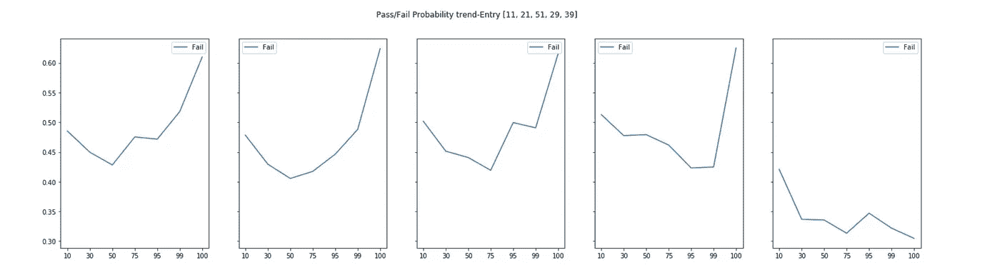
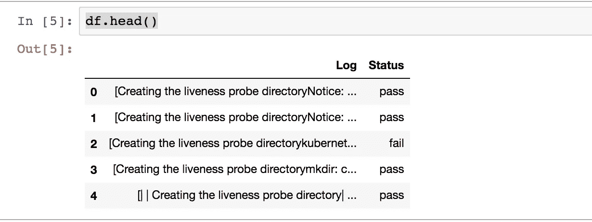
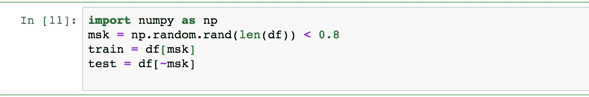
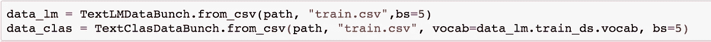
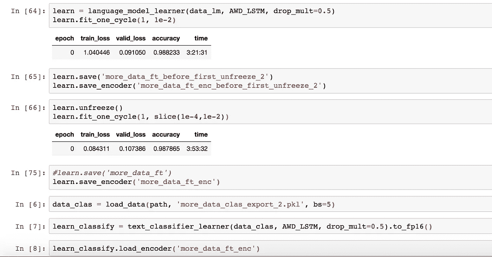

# 使用 fast.ai 库的增量日志分析来预测系统操作故障的 AI 模型

> 原文：<https://medium.com/analytics-vidhya/ai-model-to-predict-system-operation-failures-using-incremental-log-analysis-using-the-fast-ai-2764d4c4cf04?source=collection_archive---------7----------------------->

萨法尔·萨法罗夫在 [Unsplash](https://unsplash.com?utm_source=medium&utm_medium=referral) 上拍摄的照片

**问题陈述:**

我可以训练一个基于 NLP 的模型来读取服务日志，并在操作完成之前预测操作的潜在结果(通过/失败)吗？

## **摘要:**

考虑到任何操作生成的日志都是我们解决任何问题的参考点，我想探索可能的 NLP 解决方案，其中我可以训练一个模型，以持续监视流程生成的日志并“理解”日志记录模式，从而实时估计操作通过与失败的总体概率。

我使用了 **fast.ai** 框架，先构建语言模型，构建“以流程为中心”的词汇表。这是必要的，因为为了让我的模型“理解”Python 表达式，如文件夹路径“/opt/”或单词“Python ”,并且不会将它们分别与“choice”和“Snake”混淆，语言模型是必要的。

一旦建立了语言模型，我就用这个词汇来建立一个分类器，这个分类器使用预先训练好的基于 AWD-LSTM 的模型提供的权重(因此使用了迁移学习的概念)。

训练集是来自各种通过和失败场景的系统更新(操作)日志的预处理列表。

测试集是一组不同的预处理过的系统更新日志列表，这是模型以前没有见过的。

这个练习的目的是输入这个测试集，并将它的总体预测结果与实际结果进行比较。

## **详情:**

该模型能够根据增量日志文件信息(随着系统更新的进行)预测系统更新操作的通过/失败状态的概率。

通过更多的训练，我认为我们应该能够生成更好的预测，并在流程周期的更早阶段捕获故障预测..

我通过了测试集中 5 个样本的 10%、30%、50%、75%、95%、99%和 100%的日志文件，注意到了这些失败预测。

x 轴:提供给模型的日志文件的百分比

y 轴:故障概率

如您所见，最初，即大约 10% (X 轴)，在所有 5 种情况下，故障概率接近 50% (Y 轴)，这是可以理解的，因为模型没有足够的信息来预测最终结果。

在案例 1、2 和 3 中，实际结果是“失败”,而模型确实预测到了失败。我感兴趣的一点是，在大约 50%数据(X 轴)标记处注意到了故障趋势，这表明，在查看了 50%系统更新进度时生成的日志后，模型在绘制故障趋势方面做了合理的工作。

案例 4 是一个错误的分类。直到 99%的数据，事情似乎都朝着正确的方向发展，但出于某种原因，它改变了主意，决定将其归类为“失败”场景。

案例#5 是一个成功的系统更新操作的日志文件。正如你所看到的，失败概率总是在涉及的<40% (Y-axis) chance range.

## **步骤中:**

1.  预处理日志文件，将整个文件转换为字符串
2.  生成一个包含两列的熊猫数据帧:日志(X)和状态(Y)

3.为其创建一个测试和训练集

4.使用 fast.ai 库生成语言模型，这将有助于创建特定于语言的词汇。

5.使用此词汇表创建一个 TextDataBunch，然后可以用它来训练分类器

6.现在，我们继续训练我们的模型:

## **一些有趣的观察:**

1.为了生成这些结果，我需要的数据量非常少。

2.我构建和使用词汇表的基础语言模型为我在其上构建模型提供了一个良好的基础。鉴于我在使用基于英文文章的 Word2Vec 和 TF-IDF 等令牌化工具时的失败尝试，它们与我们的系统日志的上下文相关性很低。(例如，word2vec 中类似于“Python”的单词是蛇和其他爬行动物，而我们想要的是更特定于系统的)。

## **总结:**

我们应该能够为各种关键操作建立更精确的相似模型，并执行以下任务:

1.  在周期的早期生成相关的警报
2.  自动或手动采取纠正措施来解决问题

## **参考文献:**

1.  Gaurav Arora 做了很多出色的工作。其中有一个是我用来作为参考来熟悉 fast.ai 库的:[https://github . com/goru 001/NLP-for-Kannada/blob/master/Classification/Kannada _ Classification _ model . ipynb](https://github.com/goru001/nlp-for-kannada/blob/master/classification/Kannada_Classification_Model.ipynb)
2.  [https://medium . com/datadriveninvestor/deep-learning-with-python-and-fast-ai-part-2-NLP-class ification-with-transfer-learning-e7aaf 7514 e 04](/datadriveninvestor/deep-learning-with-python-and-fast-ai-part-2-nlp-classification-with-transfer-learning-e7aaf7514e04)
3.  [https://www.fast.ai/](https://www.fast.ai/)