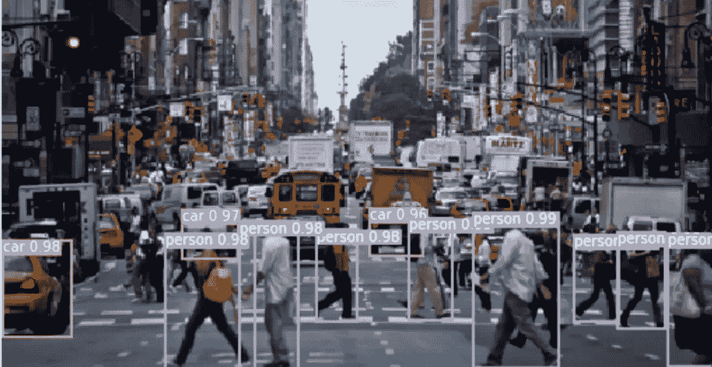
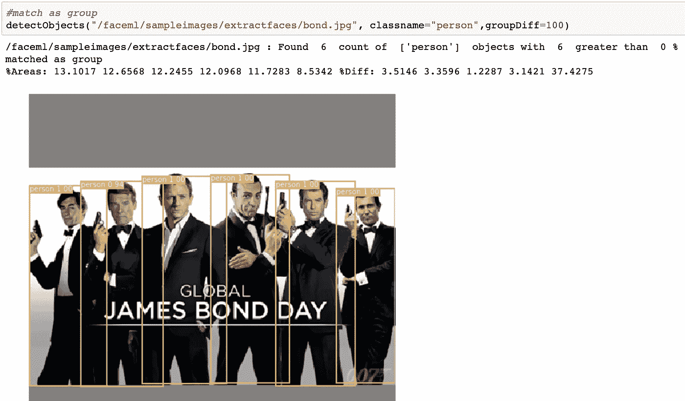
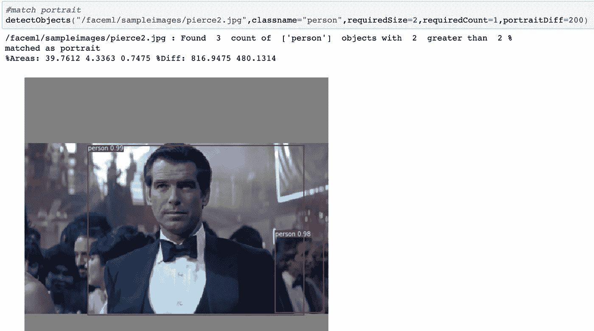
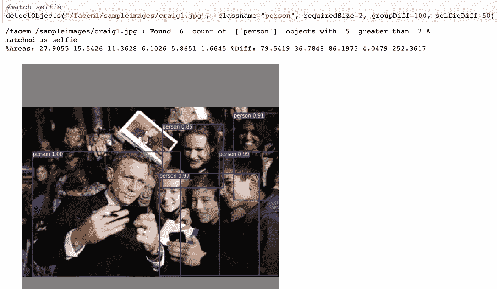
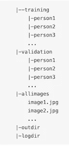
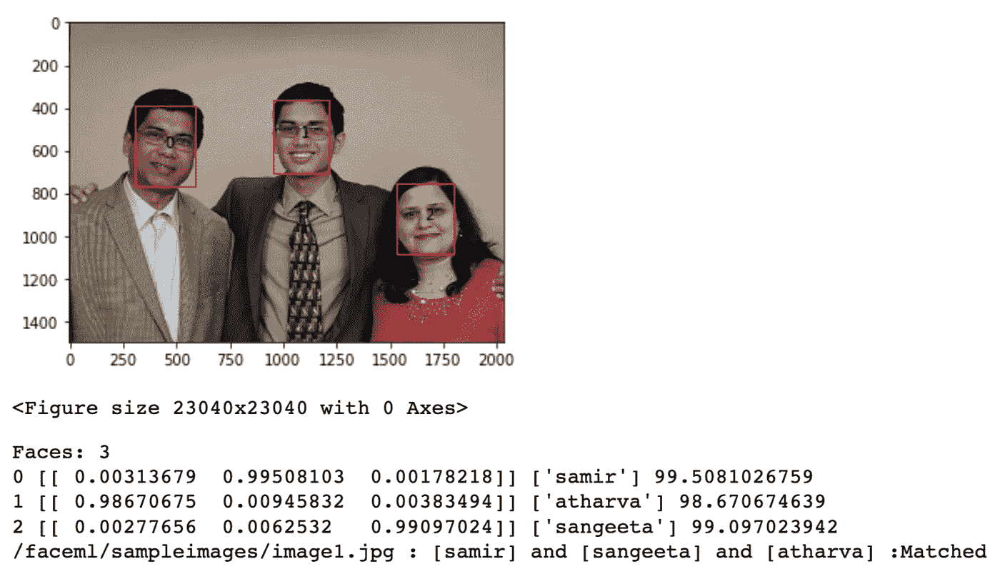
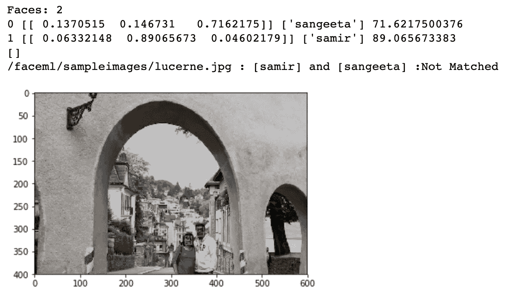
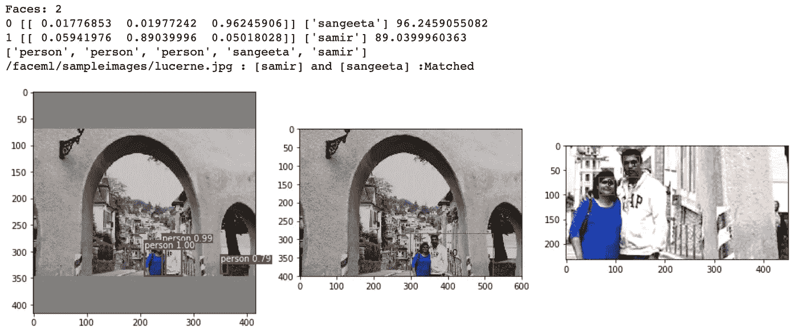
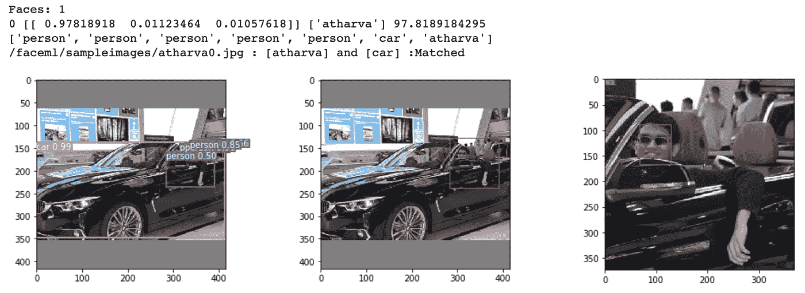
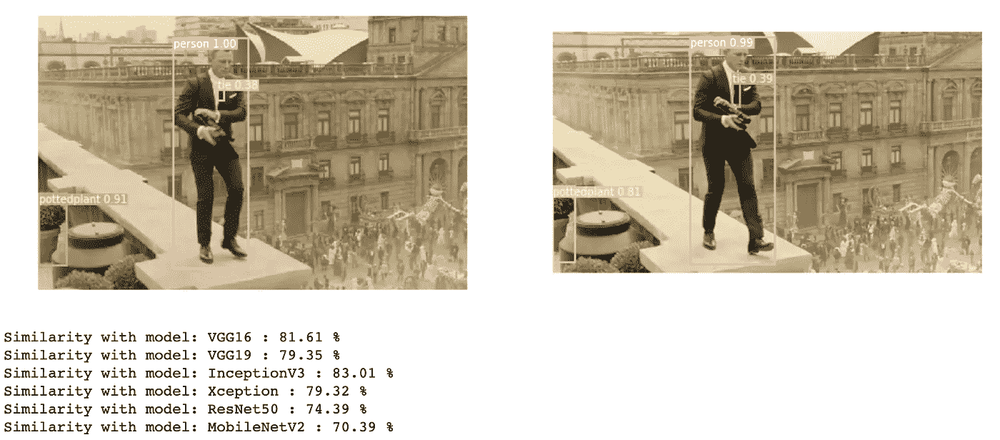

# 艾救了我的家人…照片。

> 原文：<https://medium.com/analytics-vidhya/ai-saved-my-family-photos-521ce6fa5877?source=collection_archive---------7----------------------->

一个周末，我想整理我收集的照片，清理我的手机图库。过去几个月里，有成千上万张照片是用我手机的摄像头拍摄的，并由家人和朋友上传到 WhatsApp 上，还有成千上万张照片被转到了我的外置 USB 驱动器上。我的目标是从一堆图像中识别家庭照片，这些图像只包含花、鸟、猫、自然、野生动物、早安、晚安、笑话等。然后，我可以将家庭照片保存到一个单独的文件夹中，并清理其他照片。试着整理图像 5 分钟后，我放弃了。我心想“一定有更好的方法来做这件事。”

基于我对各种图像的分析，我决定从写下我的需求开始:

1.  保存包含我的家庭成员的图像，并清理其他图像。
2.  能够对我的手机、SD 卡或外部 USB 驱动器上的图像进行分类，而无需将数以千计的图像上传到在线服务(例如 Google Photos)。
3.  不想花太多时间整理照片。
4.  找到一个可重复的过程，这样我就可以在将来再次使用它。
5.  查找只有一个人(或任何对象，忽略远处背景中的人/对象，如果有的话)的人像照片或团体照片。
6.  按姓名查找家庭成员的照片。
7.  使用简单灵活的查询和特定对象查找照片，例如人、人和汽车、人和(斑马或大象或马)、人和狗，而不是自行车等。或者在上述查询中使用真实姓名而不是人名。所以用我的名字，比如 samir 和蛋糕，samir 和沙发和书等等。这可能有助于从成千上万的图像中找到基于某些特定记忆或场合的照片。
8.  将是很好的识别类似的照片，因为通常情况下，人们采取多张照片略有不同的相机设置，角度等，这将很容易检查和保留最好的。

我本质上需要人工智能(AI)能力，特别是物体和人脸检测。现在，手机上的原生相机应用程序具有一些功能，可以提供一些帮助。像 Google Photos 这样的应用程序拥有上述大部分功能以及更多功能，但照片需要上传，这确实带来了任何社交媒体应用程序都会带来的明显的安全风险。我还需要一些额外的查询功能，即。
a)带有“没有人”的查询..查找没有任何人的照片，这样您就可以删除这些照片。也许，由于 Google 相册提供了无限存储空间，它并不需要它。
b)具有特定对象计数的查询，即 4 人 2 鸟等一组。c)获得在图像中发现的对象和计数的列表。

因此，我想在不上传照片的情况下，在本地评估图像的搜索和排序，并创建一个平台来试验各种人工智能模型/方法，并能够将其应用于其他用例。例如，您可以建立一个自定义数据集，并训练人工智能模型来识别特定行业的对象，如食品、植物、动物或工业零件，如齿轮、阀门、弹簧、轴、传送带等。其中一些已经存在。因此，应用对象检测/人脸识别的机会非常大。

总之，有趣的是。我尝试了几种不同的人工智能模型/方法来进行物体检测和人脸识别，效果相当不错。我使用预先存在的机器学习(ML)模型，从一些现有代码中获得灵感，根据上述需要添加增强功能，并创建了一套易于使用和可配置的工具。

对象检测工具使用流行的 [YOLOv3](https://pjreddie.com/darknet/yolo/) 模型。它目前可以识别 80 种不同的[物体类型](https://github.com/samirsdoshi/faceml/blob/master/yolo_keras/coco_classes.txt)。使用各种对象类型、特定大小、置信度%和肖像或组参数的组合来识别图像的功能应该支持各种图像集和需求。

我还添加了一个实用程序来识别相似的图像，并将它们分组到一个文件夹中。我尝试了各种 Keras [预训练模型](https://keras.io/applications/#available-models)进行评估，并决定使用带有余弦相似性算法的 Keras InceptionV3 模型。这很有效，但我仍在寻找更有信心的解决方案。

我使用两种模型/方法进行人脸检测，即 [Keras/FaceNet](https://arxiv.org/abs/1503.03832) 和 [MTCNN](https://arxiv.org/abs/1604.02878) (多任务级联卷积网络)，还有[OpenCV](https://opencv.org/)/[Caffe](https://caffe.berkeleyvision.org/)/[Torch](https://cmusatyalab.github.io/openface/models-and-accuracies/)，来评价一个比另一个好。在相同的数据集上，Keras/Facenet 比 OpenCV/Caffe 花费更多的时间来训练我的模型，但验证精度也高得多。我添加了一个特性，在人脸周围添加可变的像素百分比，这可以改变人脸识别的置信度，并选择置信度最高的一个，以提高检测的准确性。命令行允许与对象检测中相同的灵活性，以形成表达式，并且您可以按名称而不是对象类型进行搜索。

ML models 需要你输入大量的图像来训练它，这可能需要相当长的时间来收集，其中一个额外的目标是引导学习数据的创建，并使这个过程简单和更少的时间消耗。我使用对象检测工具来分离人像图像，并从其他图像中提取人脸，用于 ML 模型训练。然后，可以将这些具有个人的图像保存到训练模型所需的适当文件夹结构中。一旦模型经过训练，您就可以使用人脸识别来识别具有模型所学习的人脸的图像。

生成的代码/工具和相应的文档发布在我的 [github repo](https://github.com/samirsdoshi/faceml) 中。github repo 提供了一个指向 docker 图像的链接，其中包含用于对象检测和人脸识别的必要 ML 基本模型和代码。

**整体流程**

1.  从你的数据集中挑选出肖像或群组图像，并分离出少数感兴趣的人脸

2.使用肖像图像和/或从图像中提取人脸

3.创建文件夹结构，如下所示，用于培训和验证，并相应地放置每个人的图像。将大约 70%的图像用于训练，大约 30%用于验证。使用创建的图像训练模型。

4.运行人脸识别来识别带有用于训练模型的人脸的图像。
我为我、我的妻子和儿子(Sangeeta 和 Atharva)训练了这个模型，并获得了大约 98%的相当高的准确率，每个人大约有 200 张图像用于训练，70 张用于验证，如下所示。

在人脸尺寸非常小或不够亮的照片中，人脸识别可能无法可靠地工作。此外，为了获得更好的效果，照片需要更正面而不是侧面，并且不能倾斜或旋转。图像大小、亮度、对比度、饱和度、锐度都对人脸识别有影响。这种图像可以自动修复，但仍是一项正在进行的工作。

该工具确定图像中检测到的人周围的区域，并以数字方式放大图像的特定部分，使面部具有更大的尺寸，这可以改善面部识别过程。例如，下图与我们的查询不匹配。*在这里寻找 85%及以上的信心，使形象成为无可匹敌。*

随着人员区域的放大，该图像现在与上面的查询相匹配。下面的中间图像显示了图像中与人相关的区域，右侧显示了用于人脸识别的缩放图像。该工具只会放大大于特定尺寸的人周围的区域，以获得更好的结果。此外，如果没有检测到人脸，该工具将多次旋转图像并重试。

除了放大和旋转，该工具还融合了人脸识别和对象检测，以支持混合训练名称和对象类型的查询，例如 atharva 和 car

5.将相似的图像分类到单独的文件夹中，以便适当地查看和删除。您可以查看照片拍摄的日期/时间，并查看几秒钟内拍摄的照片。但是，由于 WhatsApp 等社交媒体应用程序删除了 EXIF 数据(即照片拍摄时间、相机设置、地理位置等)。)出于安全考虑，对于通过 WhatsApp 接收到的照片，你可能会忽略拍摄时间。

下面是略有不同的样本图像，使用不同的 Keras 模型的相似度为%。

上面所有的图片快照都是从我的 [git repo](https://github.com/samirsdoshi/faceml/tree/master/faceml/notebooks) 的 jupyter 笔记本上拍摄的。

**演职员表/参考资料**

[https://machinelingmastery . com/how-to-develop-a-face-recognition-system-using-facenet-in-keras-and-an-SVM-classifier/](https://machinelearningmastery.com/how-to-develop-a-face-recognition-system-using-facenet-in-keras-and-an-svm-classifier/)
[https://www . pyimagesearch . com/2018/02/26/face-detection-with-opencv-and-deep-learning/](https://www.pyimagesearch.com/2018/02/26/face-detection-with-opencv-and-deep-learning/)
[https://pjreddie.com/darknet/yolo/](https://pjreddie.com/darknet/yolo/)
[https://mc.ai/face-detection-with-opencv-and-deep-learning/](https://mc.ai/face-detection-with-opencv-and-deep-learning/)
[https://s b-NJ](https://sb-nj-wp-prod-1.pyimagesearch.com/2018/09/24/opencv-face-recognition/)