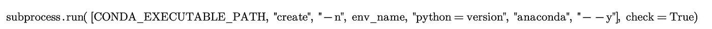
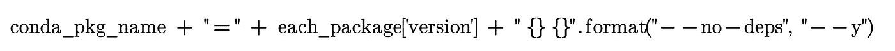

# 人工智能设置自动化

> 原文：<https://medium.com/analytics-vidhya/ai-setup-automation-8b578ff127c6?source=collection_archive---------25----------------------->

**一、简介:**数据科学领域的难点工作之一是安装 GPU 驱动、AI 库、env setup。这是流程的第一步，没有成功的设置，我们无法前进。需要有耐心，并排除各种错误，以完成一个成功的设置。假设在一个系统中设置东西需要这么多时间和耐心，那么想象一下在多个系统中设置同样的东西有多困难。在我们的公司，我们可能已经看到软件更新，安全补丁更新是通过使用 ansible 或网络方法的自动化方式完成的，但没有软件或工具在机器中进行人工智能设置。在这篇博客中，我非常兴奋地分享自动化环境设置、版本控制、库安装、验证、更新、依赖库安装和调度的过程。让我们进入细节…

**关键词:** ML 库，AI 设置，自动安装，CUDA，Nvidia GPU，anaconda，pip，cronjob，子进程

其余博客分为:
II。配置
三。实施
四。验证
五、调度

**二。配置:**我们创建了一个 JSON 文件，这是一个主文件，包含所有必需的库、版本、测试脚本路径、安装后重启选项、安装状态、验证状态、安装程序信息(是 pip 还是 anaconda)、环境名称、环境中的 python 版本。为每个深度学习框架(例如 TensorFlow、PyTorch、Caffe、Keras 和 mxnet)创建单独的环境是一个很好的做法，因为一个框架依赖关系可能与其他框架不兼容，而且每个框架都需要不同的 Cuda 版本，因此在一个环境中不可能有相同的不同 Cuda 版本。

我们使用了一个配置 python 文件来存储 python 可执行路径、env 文件夹、JSON 文件、日志文件、报告文件和日志级别状态的位置。这是主进程使用的重要文件，主进程在进程开始时加载所有细节。创建一个文件夹来存储每个库的测试脚本。JSON 文件中提到了文件和函数名的位置，以便主进程可以加载脚本。

**三世。实现:**核心逻辑的实现写在主文件中。在第一步中，我们验证了日志文件是否被创建。如果未创建文件，则创建一个日志文件，设置日志级别状态。日志级别的状态值将来自配置文件。python 中有不同的日志级别，它们是调试、信息、警告、错误和关键。根据上下文，我们可以选择任何日志级别。下一步，我们验证提供的 JSON 文件是否有效。验证 JSON 的格式、键名和提供的值。如果验证成功，执行将进入下一步，否则将停止执行，并在日志和状态文件中记录错误。

我们已经编写了创建虚拟环境的函数，正如前面讨论的那样，将为每个深度学习框架创建每个环境。在创建之前，进程检查 env 是否存在，如果不存在，它将创建一个新的环境。Python 版本、环境名称、作为环境创建的一部分传递给进程的安装程序信息。用于 env 创建的子流程，当在不同的环境中执行时，不可能切换到不同的环境。子流程允许我们在主任务中执行任务，允许我们输入标志值，能够捕获和引发错误，阅读[本](https://docs.python.org/3/library/subprocess.html)了解有关子流程的信息。使用标志向流程输入“是”或“否”选项。标志用于向输入提供值，它避免了手动输入。这是为什么在自动化中大量使用标志的主要原因之一。创建了一个状态文件来跟踪包名、版本、状态、环境名、验证状态等等。该文件不同于日志文件，它仅用于生成状态报告。

(1)环境创建命令

一旦验证和初始化完成，我们就转移到主函数执行部分。将 JSON 文件加载到内存中，逐个读取环境，以及它们的包列表和状态。已验证软件包状态是否为空，如果为空，则安装软件包，否则将跳过该软件包并选择另一个软件包。安装时，我们检查了源安装程序，如果是 pip，则不需要发送标志“y ”,因为 pip 将默认采用 yes 值，如果是 conda，则需要发送标志值，因为 conda 不采用默认值。如果 JSON 文件中提供的版本没有添加版本，则在安装命令中添加版本，这样它将自动安装最新发布的版本。从 JSON 文件中读取依赖项值，如果值为“no ”,则在安装命令中添加“no-deps”标志，这样就不会安装任何依赖项。分配给安装程序的默认“是”值。建议安装依赖项，因为大多数 python 包都需要依赖项，没有依赖项包无法正常工作。

(2)no-deps 标签的使用。conda 包安装命令。

(3)非 deps 标签的使用。pip 包安装命令。

一旦软件包被安装，我们更新为“成功”。所有具有“成功”状态的包都被移动到验证部分。如果有任何软件包无法安装，我们实现了计数器逻辑。计数器逻辑将按照配置文件中指定的次数重新尝试安装，这是为了避免因网络、服务器和负载而频繁发生错误。深度学习框架需要 Cuda 工具包 cudnn 来有效利用 GPU。因此，在安装 DL 框架 Tensorflow、Pytorch、Caffe、Keras、Mxnet 时，要确保安装了正确的 Cuda 版本。Conda 安装程序安装 Dl 框架和所需的 Cuda 工具包。这是 anaconda 的主要优势之一，也是 anaconda 比 pip 更受数据科学相关作品欢迎的原因。参考 [CUDA](https://docs.nvidia.com/cuda/cuda-c-programming-guide/index.html) 链接，了解更多关于 CUDA 及其使用案例的信息。

**四世。验证:**检查包安装状态的最好方法是用测试脚本进行验证。我们已经为每个 AI 库创建了一个测试脚本，这个测试脚本的主要操作是执行一个小的演示并返回执行状态。如果测试脚本成功运行，则返回 true，否则返回 false。软件包会一个接一个地安装，所以每当新的软件包安装时，我们都会验证该软件包的测试脚本和所有以前安装的软件包，这样我们就能知道是哪个软件包导致了错误。成功验证后，我们将状态更新为“已验证”。无论哪个包测试脚本失败，我们都将状态更新为“失败”，因此它们将在下次执行时重新安装并重新测试。

**V .调度:**这个工具可以根据需要灵活地进行调度，为了避免手动运行的负担，我们实现了这个功能。在每一步之后，我们都更新了状态，所以无论执行多少次，都不会重新安装已安装和已验证的包，只会安装已卸载或失败的包。对于基于 Unix 的计算机，使用 init directory 或 cronjob 调度作业有不同的方法。我们通过提供时间、日期和周期，使用 cronjob 创建了一个作业。所以每当有新的更新时，只需更新 JSON 文件，调度程序就会安装新的更新。

**六世。结论:**市场上有许多软件工具可用于安装和更新软件，但用于完全自动化人工智能设置的工具有限或没有。我花了很多精力来开发这个产品，希望这个新工具对数据科学家、Ml 工程师和 IT 团队有很大帮助。

请在评论区告诉我你的观点、想法和问题。快乐学习😊….