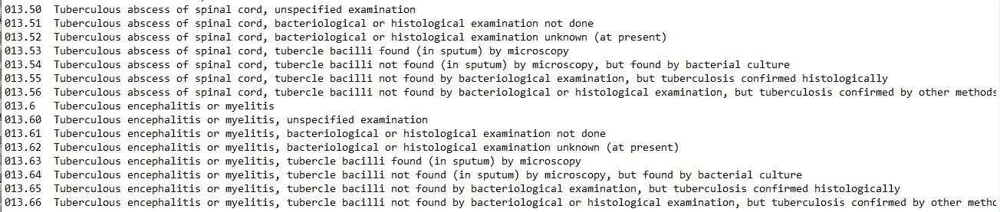

# 人工智能-医疗保健技术

> 原文：<https://medium.com/analytics-vidhya/ai-technologies-for-healthcare-7686c6bdd237?source=collection_archive---------19----------------------->

一个人工智能凭借其广泛的应用和对算法的深度理解，正在陡峭地覆盖所有公共部门。当前十年显示了医疗保健部门在机器学习方面的巨大研究突破。虽然这些发展可以分为两个领域，即基于图像(计算机视觉)的人工智能&基于文本(自然语言处理)的人工智能。

**MIMIC(重症监护医疗信息集市)**:这是 2001 年至 2012 年间在 Beth Israel Deaconess 医疗中心重症监护病房住院的 61523 名患者的数据库。它包括 53，432 名成人和 8，100 名新生儿。这一大部分公开可用的数据集(6.2 GB)由实验室测量、护理人员记录、程序、药物、死亡报告和胸部 x 光片组成。

**升级(MIMIC-II vs MIMIC-III):**

由于 MIMIC 是为数不多的首批可用数据库之一，许多研究出版物都是基于 MIMIC-II 得出的结论。要将它与当前数据联系起来，我们需要了解它是如何升级的。

MIMC 生理网的网站视图

> MIMIC-III 是旧 MIMIC-II 的扩展(形成多参数智能监控集成)。MIMIC-II 是 2001 年至 2008 年间的数据收集，后来又与 2008 年至 2012 年的数据合并。这种转换是在几个查询中完成的。一些项目，如 D _ MEDITEMS、D_IOITEMS、D_CHARTITEMS，被合并到 D_ITEMS。入院和出院在和**处标注为**，带有**和**时间成分。此外，CENSUSEVENTS 被 TRANSFERS 取代，DEMOGRAPHIC_DETAIL 并入 ADMISSIONS DRGEVENTS 改名为 DRGCODES，ICD9 改名为 diagnostics _ ICD，等等。

**如何获取权限？**

MIMIC 数据库根据最新数据定期更新。MIMIC-III v 1.4 是最新版本，可以从 Physio net 获得。这些电子健康记录(EHR)是去识别的，以确保病人的保密性。获取数据库并将其用于研究的程序如下。

1.  完成 CITI“[仅数据或标本研究](https://www.citiprogram.org/index.cfm?pageID=154&icat=0&ac=0)”课程，确保为研究目的定义数据法规。

2.在[https://physionet.org](https://physionet.org/)注册账户。

3.提交您的凭证访问申请。记得提供你的 CITI 完成报告。

4.获得访问权限后，您可以根据您的使用目的下载 26 个逗号分隔的 CSV 文件。下载前可以从[这里](https://mimic.physionet.org/mimicdata/datatypes/)读取每个文件的内容。

5.如果您无法从[这里](https://physionet.org/content/mimiciii-demo/.)获得 CITI 完成报告，您可以访问包含 100 名患者的演示库

# **国际疾病分类(ICD) :**

ICD 是一个医疗保健系统，由世界卫生组织(世卫组织)维持。该系统涉及各种健康状况，如体征、症状、异常情况和损伤，以一个标志数字编码。这种编码系统是分级的，主要代码用于疾病，其子代码用于变异。ICD-9 用于模拟标记条件。ICD-11 已经获得批准，将于 2022 年 1 月生效。ICD-10 在许多国家被广泛使用，因为它是多语言版本。

MIMIC 中最常用的代码是 427.31 房颤、584.9 急性肾衰竭、428.9 充血性心力衰竭和 401.9 未明原发性高血压。

ICD-9 代码摘录。

# **等级标识符:**

这种公共健康信息通常以静态和动态类型维护。

**静态:**

Subject_ID:这是患者的主要信息，记录在诸如出生日期(DOB)、死亡日期(DOD)、DOD_HOSP 和 DOD_SSN 等字段中，列在患者表中。

HADM_ID:这是基于患者入院的数据，包括入院时间、死亡时间、出院时间和入院类型。

ICUSTAY_ID:这是患者接受手术时的数据。该信息被报告为 ICU 开始时间、ICU 结束时间、第一监护病房和最后监护病房。

**动态:**

这些是定期更新的记录，如血压、药物、程序、实验室事件、微生物报告。这种医院获得的数据和 ICU 获得的数据已经作为一种特征用于许多 ML 算法中。您可以在这里找到一些列出的出版物。

# 模仿 CXR JPG:

计算机视觉在基于细胞图像和分子结构的医学疾病分类方面有着悠久的历史。特别是，X 射线在骨骼、心脏、生殖和肺部问题上有着巨大的作用。该数据库的目的是用标记的心肺疾病自动进行胸部放射摄影。这是根据 HIPPA 规则确定的另一个重要的模拟数据集。该数据集包含 377，110 幅 JPG 格式的图像和结构化标签，这些标签源自与这些图像相关联的 227，827 份自由文本放射学报告。

# 相关数据集:

基于医学的生物化学和遗传学研究领域很长。在[健康数据](https://healthdata.gov/)大约有 221 个数据集可用。

> 特别感谢:朱塞佩·里佐的咨询。

**参考文献:**

【https://mimic.physionet.org/about/publications/ 

[https://github.com/MIT-LCP/mimic-code](https://github.com/MIT-LCP/mimic-code)

[https://it.wikipedia.org/wiki/Classificazione_ICD](https://it.wikipedia.org/wiki/Classificazione_ICD)