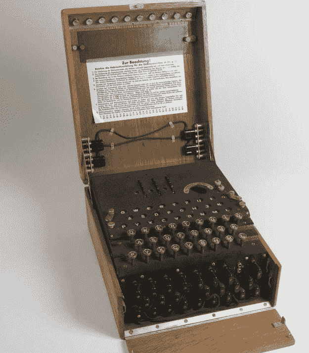
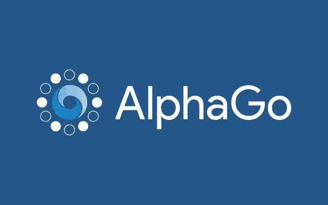
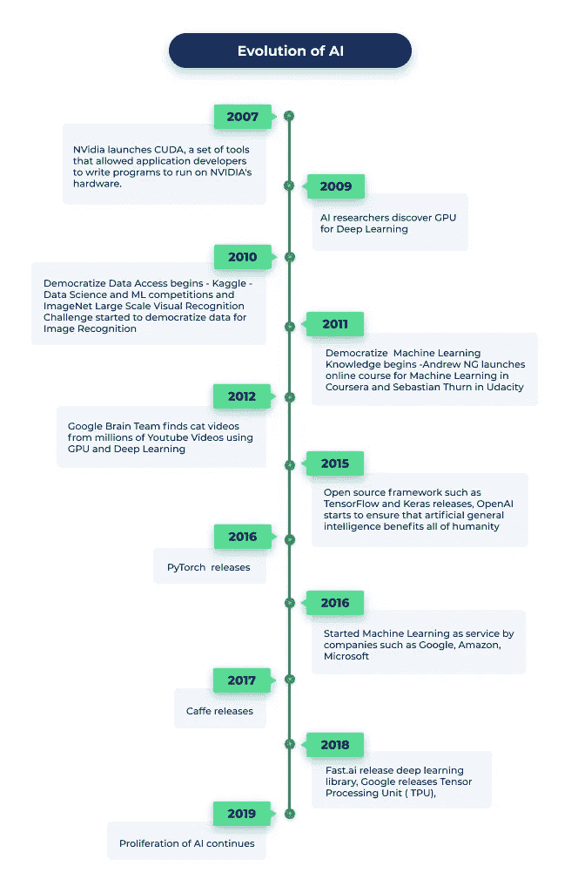
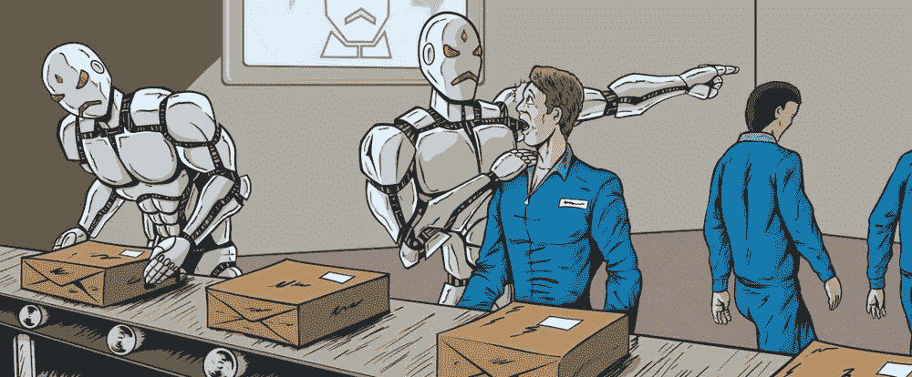
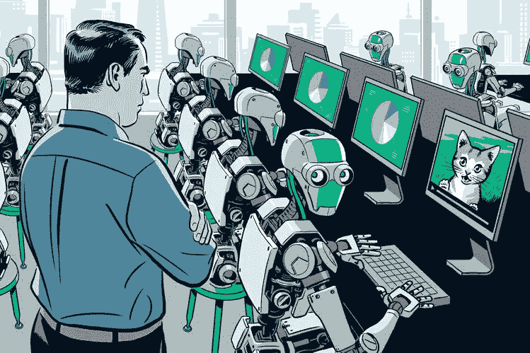

# 人工智能:开始、发展和影响。

> 原文：<https://medium.com/analytics-vidhya/ai-the-beginning-evolution-and-impact-307dc5815f3?source=collection_archive---------29----------------------->

在 [Unsplash](https://unsplash.com/s/photos/ripple?utm_source=unsplash&utm_medium=referral&utm_content=creditCopyText) 上由 [Linus Nylund](https://unsplash.com/@doto?utm_source=unsplash&utm_medium=referral&utm_content=creditCopyText) 拍照

鉴于目前的情况，当 AI 帮助我们对抗致命的**新冠肺炎**时，它引起了许多专家对该领域快速发展的担忧。今天，人工智能正以其他一些方式直接或间接影响着我们的生活:从**精炼谷歌搜索**结果到安排我们的**任务和设置提醒**，人工智能无疑是我们生活中必不可少的一部分，研究它影响我们生活的方式是有效的，无论是好是坏。

在本帖中，我们将尝试寻找一些一般性问题的答案:人工智能是如何产生的？它如何演变并影响我们的生活？

# 开始…

据 techopedia 报道，“ ***人工智能*** *(AI)，也称为* ***机器智能*** *，是计算机科学的一个分支，旨在为软件注入* ***的能力，使用预定的规则和搜索算法或模式识别机器学习模型来分析其环境，然后根据这些分析做出决策*** *。*”

许多专家认为，艾伦·图灵爵士是人工智能的先驱，他是英国数学家和计算机科学家，以解密强大的机器“T30”谜而闻名。

[图灵机](https://www.iwm.org.uk/history/how-alan-turing-cracked-the-enigma-code)

“人工智能”一词是在新罕布什尔州汉诺威的达特茅斯学院的一次会议上正式创造的。

从 1987 年到 1993 年，经历了一个漫长的冬天，最终在 1997 年，IBM 的“深蓝”打败了国际象棋冠军、俄罗斯特级大师加里·卡斯帕罗夫。2011 年，计算机巨头的问答系统[沃森赢得了智力竞赛节目《危险边缘》击败卫冕冠军布拉德·鲁特和肯·詹宁斯。](https://www.livescience.com/47591-ibm-watson-science-discoveries.html)

DeepMind 的 AlphaGo

事实上，这一事件标志着这一领域快速发展的开始，这一点从[创造的 AlphaGo](https://deepmind.com/research/case-studies/alphago-the-story-so-far) 和 Deepmind 创造的 Watson 以及更多的例子中可见一斑。

# 进化…

为了理解这种影响，我们必须研究人工智能的进化模式。

[AI 进化图表](https://www.lftechnology.com/blog/ai/ai-evolution/)

从六个目标开始的 AI 之旅，今天正在逐步实现。人类总是见证人工智能执行从识别视频中的物体到操作自动驾驶汽车的任务。今天，许多科技巨头如特斯拉、谷歌和亚马逊都在努力实现 AGI 或人工智能，如果没有适当的战略和规划，这仍然是一个遥远的梦想。

自 1956 年诞生以来，人工智能的进化一直是最有争议的话题。

一份来自 [**科学习惯**](https://slashdot.org/~sciencehabit) 的报告称:

研究人员基于查尔斯·达尔文爵士的进化原则“适者生存”成功创造了人工智能程序。这些程序被设计成在没有任何人类输入的情况下改进一代又一代。据该杂志称——“该程序在几天内复制了几十年的人工智能研究，其设计者认为有一天，它可以发现人工智能的新方法”。

它建立在循环方法的基础上，程序将它的性能与手工设计的算法进行比较。通过编辑、替换和删除几行代码，将最有利的特性添加到算法中。换句话说，该算法添加了所有必要的缺失功能，以充分利用其性能和功效。

# 影响…

[机器人指挥人类](https://www.houseofbots.com/news-detail/12342-1-will-artificial-intelligence-increases-the-risk-of-jobseekers-by-taking-away-jobs)

人类监督机器人

上面显示的图像描绘了人类监督人工智能(机器人)和人类被人工智能(机器人)引导。虽然这似乎是虚构的，但现实与此不谋而合。我们可能会想象这只是科技巨头关注的事情，而人工智能不会影响我们的生活。但事实是它比我们想象的还要多。这里有一些例子说明人工智能已经成为我们日常生活的一部分。

1.  **Siri(苹果用户可以联系)**

这更像是早上的例行公事，问“*嘿，Siri！！！现在的温度是多少？*”。有些人会问一些不合逻辑的问题，Siri 会不停地回答。换句话说，它被编程为既聪明又聪明。

**2。社交媒体**

解锁了他们的手机之后，接下来呢？许多人查看他们的社交媒体账户，包括脸书、推特、Instagram 等，以了解一夜之间发生的最新情况。[人工智能不仅在幕后工作](https://www.bernardmarr.com/default.asp?contentID=1373)个性化你在你的订阅源上看到的内容(因为它根据过去的历史了解到什么类型的帖子最能引起你的共鸣)，它还能计算出朋友的建议，识别和过滤假新闻，机器学习正在努力防止网络欺凌。

**4。谷歌搜索**

我们大多数人一天都离不开在谷歌上搜索答案或我们离不开的产品。没有人工智能的帮助，搜索引擎无法扫描整个互联网并提供你想要的东西。

**5。智能家居设备**

我们的家变得越来越“智能”我们中的许多人现在都有“智能”恒温器，如 Nest，它可以了解我们的加热/冷却偏好和日常习惯，以便在回家前及时根据我们的喜好调节温度。

# 结论…

因此，几乎不可能想象我们的生活没有，但同时我们应该记住，如果我们变得越来越依赖技术，那么它将主宰我们的生活。

# 剧透…

在接下来的文章中，我们将更详细地讨论这种影响，并试图找到一个重要问题的答案。

***是否有要求在部署前仔细检查 AI 算法？***

我的目标始终是通过我的文章为读者提供准确和原创的事实和信息。我希望这篇文章是有益的。请建议你想让我写的关于人工智能的话题。

谢谢