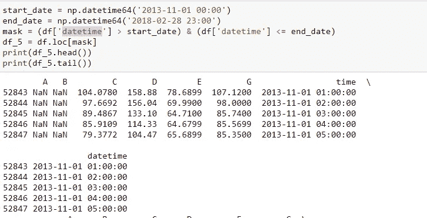

# 空气污染数据-探索数据集-初学者指南

> 原文：<https://medium.com/analytics-vidhya/air-pollution-data-exploring-data-set-beginners-guide-dc302c72ad48?source=collection_archive---------25----------------------->

Ria Puskas 在 [Unsplash](https://unsplash.com?utm_source=medium&utm_medium=referral) 上拍摄的照片

这是马其顿首都斯科普里的空气污染数据。
测量可追溯到大约 10 年前，包括 6 个测量站。每小时都进行测量，但是有很多缺失的数据，并且一些站点只运行了几年。

让我们导入数据并进行检查。我们有从 A 到 E 和 G 的站。我们还将“时间”作为字符串列。请注意，测量时间是从 2008 年 1 月 1 日 00:00 开始的。

请注意，测量记录到 2018 年 3 月 9 日 23:00

有些站开始测量的时间晚了一点。a 站(下)从 2008–03–05 16:00 开始。

所有电视台的平均收视率是多少？

让我们把它画出来，以便更好地理解。

> 我们可以看到，D 的评级最高，E 的评级最低。

现在让我们看看过去 5 年 13/14 到 17/18 的冬天。冬天是从 11 月到 2 月(包括两个月)。

从“时间”列创建一个名为“日期时间”的新列，其日期时间数据类型为。

我们想要单独的 5 年数据。所以我们创建了一个带有开始和结束日期的布尔掩码。

获取过去 5 年的数据

我们想知道哪个站经历了一个艰难的冬天。我们希望按日期进行查询，因此我们希望将索引更改为“datetime”列。

首先，取 5 个冬季中每个冬季每个站点的平均值，并在字典中保存每个冬季的最高评级。

2013 年冬季所有站点的平均值

D 站记录了所有冬季的最高等级

*每个站点的测量值超过 50 和 200 的天数总共有多少？*

我们有小时的测量，我们需要把它带到每天。所以需要重新采样。d '，这是频率。在这里阅读更多—[https://pandas . pydata . org/pandas-docs/stable/reference/API/pandas。DataFrame.resample.html](https://pandas.pydata.org/pandas-docs/stable/reference/api/pandas.DataFrame.resample.html)

以天为频率对数据进行重采样

气象站报告的天数超过 50

绘制的数据如下所示——就等级而言，越高意味着空气质量越差。任何超过 50 的都被认为不好。任何超过 200 的都被认为是有害的。

D、G 站附近的区域必须移交给环境部门

在这里找到我的 Jupyter 笔记本-[https://github.com/indgoddess/AirPollutionData](https://github.com/indgoddess/AirPollutionData)