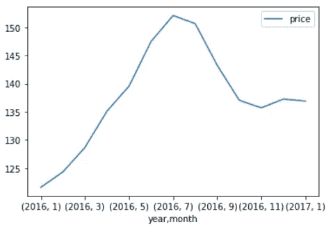
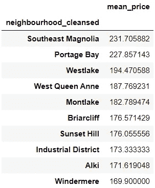
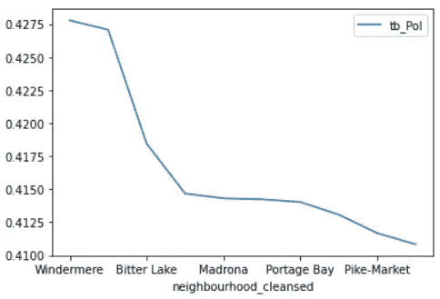
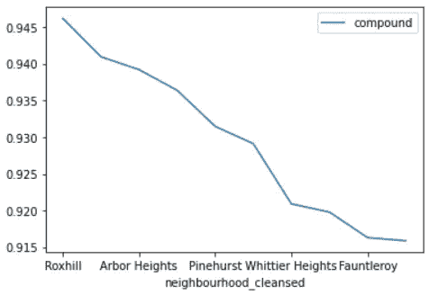
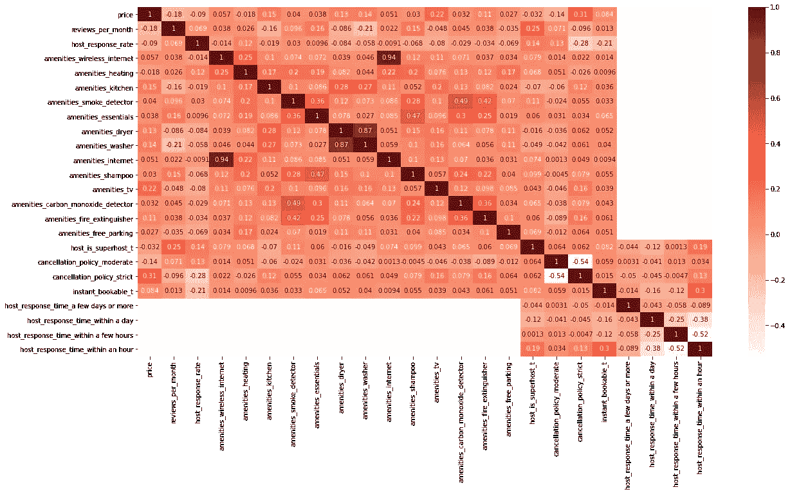
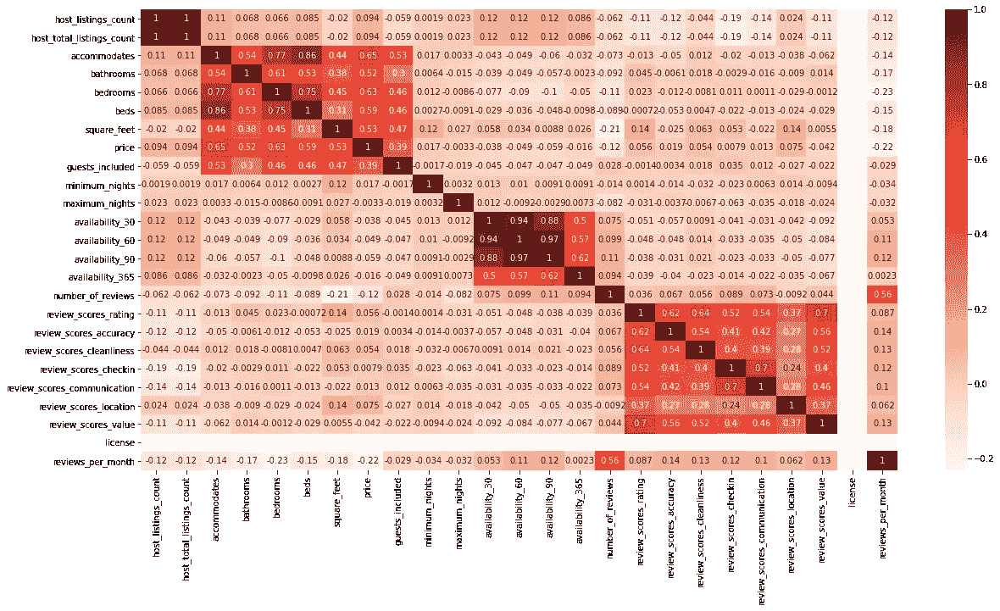
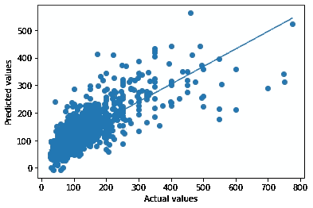

# AirBNB 数据分析

> 原文：<https://medium.com/analytics-vidhya/airbnb-data-analysis-43554ec39832?source=collection_archive---------8----------------------->

西雅图 AirBNB 数据分析和调查结果。


西雅图 AirBNB 数据分析

自 2008 年以来，客人和主人都使用 Airbnb 以一种更独特、更个性化的方式旅行。作为 Airbnb Inside 计划的一部分，该数据集描述了华盛顿州西雅图的民宿列表活动

该数据集包含不同的变量，这些变量定义了特定主机的预订和入住及其价格。我们正试图分析这些数据，以深入了解预订的内容，并找出对这一过程影响最大的因素

✅价格随时间变化

```
df_calendar.groupby(['year','month'[['price']].mean().plot(kind**=**"line");
```



价格随时间变化

2016 年价格稳步上涨，然后在下半年下跌

2017 年，价格从 2016 年的水平稳步上升

按社区列出的✅价格列表

```
df_neighbourhood **=** pd.DataFrame(df_listings.groupby('neighbourhood_cleansed').mean()['price'].sort_values(ascending**=False**))
df_neighbourhood **=** df_neighbourhood.rename(columns **=** {'price': 'mean_price'})
top_10 **=** df_neighbourhood.index[:10].tolist()
df_neighbourhood.head(10)
```



木兰花东南部的价格似乎更高，其次是价格最高的街区

使用文本斑点的✅情感分析

TextBlob 是一个 Python 包，用于对文本数据执行简单和复杂的文本分析操作，如语音标记、名词短语提取、情感分析、分类、翻译等。尽管我们可能会在其他博客中讨论 TextBlob 的更多用例，但这篇文章涵盖了分析推文以获取他们的观点。

```
df_comm['tb_Pol']
n_polarity_comm = df_comm.groupby('neighbourhood_cleansed')[['tb_Pol']].mean().sort_values(by='tb_Pol',ascending=False)
```



按社区划分的极性得分图显示了社区居民的情绪以及他们提供的评论。Textblob 解决方案

使用维达的✅情感分析

**VADER (Valence Aware 字典和情感推理器)**是一个基于词典和规则的情感分析工具，专门针对社交媒体中表达的情感。使用情感词典的组合是词汇特征(例如，单词)的列表，其通常根据它们的语义取向被标记为正面或负面。`**VADER**`不仅告诉我们积极和消极的分数，还告诉我们情绪的积极或消极程度。

```
n_polarity_vader **=** df_comm_vader.groupby('neighbourhood_cleansed')[['compound']].mean().sort_values(by**=**'compound',ascending**=False**)
```



按社区划分的极性得分图显示了社区居民的情绪以及他们提供的评论。维德的解决方案

只是想展示两种不同的算法如何提供不同的观点。好评并不意味着价格会更高，这是共识。

✅清理数据和特征选择

☑·皮尔逊相关性—第一子集

```
*#Using Pearson Correlation* plt.figure(figsize**=**(20,10))
cor **=** df_sub.corr()
sns.heatmap(cor, annot**=True**, cmap**=**plt.cm.Reds)
plt.show()
```



☑·皮尔逊相关性—第二子集

```
*#Using Pearson Correlation* plt.figure(figsize**=**(20,10))
cor **=** df_List.corr()
sns.heatmap(cor, annot**=True**, cmap**=**plt.cm.Reds)
plt.show()
```



# 基于上述分析的☑字段子集

```
df_list **=** df_list[[ "neighbourhood_cleansed","guests_included", "property_type","room_type", "accommodates", "bathrooms", "bedrooms","beds", "price", "number_of_reviews", "cancellation_policy", 'security_deposit',"reviews_per_month", 'cleaning_fee', 'amenities']]
```

# ☑便利设施现场清理

```
amenities_sub **=**['amenities_wireless_internet|Wireless Internet','amenities_heating|Heating','amenities_kitchen|Kitchen','amenities_smoke_detector|Smoke Detector','amenities_essentials|Essentials','amenities_dryer|Dryer','amenities_washer|Washer','amenities_internet|Internet','amenities_shampoo|Shampoo','amenities_tv|TV','amenities_carbon_monoxide_detector|Carbon Monoxide Detector','amenities_fire_extinguisher|Fire Extinguisher','amenities_free_parking|Free Parking on Premises']**for** c **in** amenities_new_cols:
    c_name,c_desc **=** c.split('|')
df_list[c_name] **=** df_list['amenities'].apply(**lambda** x: 1 **if** c_desc **in** x **else** 0)
```

清理了便利设施字段，因为它包含许多多余的值。这是基于对重要特征的分析。

清理其他字段，如保证金、主机响应率、清理费等。

```
EXAMPLE CODE
df_list['cleaning_fee'] **=** df_list['cleaning_fee'].replace(np.nan, '', regex**=True**)
df_list['cleaning_fee'] **=** df['cleaning_fee'].replace('[\$,]', '', regex**=True**).astype(float)
df_list['cleaning_fee'] **=** df_list['cleaning_fee'].replace(np.nan, 0)
```

✅清洁数据功能

```
​**def** clean_data(df):num_vars**=** df.select_dtypes(include**=**['int','float','int64']).copy().columns**for** var **in** num_vars:
         df[var].fillna((df[var].mean()), inplace**=True**)cat_cols **=** df.select_dtypes(include**=**['object']).columns**for** var **in** cat_cols:
         df **=** pd.concat([df.drop(var, axis**=**1), pd.get_dummies(df[var],             prefix**=**var, prefix_sep**=**'_', drop_first**=True**)], axis**=**1)X **=** df.drop(columns**=**['price'], axis**=**1)
y **=** df['price']**return** X, y
```

Clean data 函数将数据帧作为输入。

1.  然后，它识别数值型字段，并将平均值估算为空值。
2.  然后，它识别分类字段，为它们添加虚拟字段，删除原始字段，并确保总共选择了 n-1 个变量。

# ☑检查数值和分类字段中的空值

```
*# Checking numeric columns for null values* num_cols **=** df_list.select_dtypes(include**=**['float', 'int', 'int64']).columns**for** col **in** num_cols:
        print(col,df_list[col].isnull().sum())
```

> 客人 _ 被包含 0
> 住宿 0
> 浴室 0
> 卧室 0
> 床 0
> 价格 0
> 评论数 0
> 保证金 0
> 评论 _ 每月 0
> 清洁 _ 费用 0
> 便利设施 _ 无线 _ 互联网 0
> 便利设施 _ 供暖 0
> 便利设施 _ 厨房 0
> 便利设施 _ 烟雾探测器 0
> 便利设施 _ 必需品 0
> 便利设施 _ 烘干机 0
> 便利设施 _ 洗衣机 0

# 分类字段

```
cat_cols **=** df_list.select_dtypes(include**=**['object']).columns**for** col **in** cat_cols:
        print(col,df_list[col].isnull().sum())
```

> 邻里 _ 净化 0
> 财产 _ 类型 0
> 房间 _ 类型 0
> 注销 _ 政策 0

我们看到，清理数据功能和对某些文本字段的物理清理为所有数值和分类字段生成了 0 null，我们正在考虑对其进行进一步分析。

✅造型

```
*# Create train and test data sets*X_train, X_test, y_train, y_test **=** train_test_split(X, y, test_size **=** .30, random_state**=**42)print(X_train.shape, y_train.shape)print(X_test.shape, y_test.shape)
```

> (2672，128) (2672，)
> (1146，128) (1146，)

✅初始化模型并预测

```
*# Initialize linear regression model and fit it to training data set*lm **=** LinearRegression(normalize**=True**)lm.fit(X_train, y_train)*# Predict and score the model*y_train_pred **=** lm.predict(X_train)y_test_pred **=** lm.predict(X_test)train_score **=** r2_score(y_train, y_train_pred)test_score **=** r2_score(y_test,y_test_pred)print("The rsquared score on the training data was {}.  The rsquared score on the test data was {}.".format(train_score, test_score))
```

> 训练数据的平方得分为 0.6068824689699986。测试数据的平方得分为 0.6069458394959164。

✅预测和分数

```
​*#Predict and score the model*y_train_pred **=** lm.predict(X_train)print("r-squared - training data is {} on {} values. The RMSE is {}".format(r2_score(y_train, y_train_preds), len(y_train), mean_squared_error(y_train, y_train_preds)))y_test_pred **=** lm.predict(X_test)print("r-squared   testing data is {} on {} values.  The RMSE is {}".format(r2_score(y_test, y_test_preds), len(y_test), mean_squared_error(y_test, y_test_preds)))
```

> 2672 个值的 r 平方训练数据为 0.6068824689699986。RMSE 是 3129.6126192253005
> r 平方测试数据在 1146 个值上是 0.6069458394959164。RMSE 是世界上最大的海洋公园之一。36860.88868888686

✅评估

```
plt.scatter(y_test, y_test_preds)
plt.xlabel('Actual values')
plt.ylabel('Predicted values')
plt.plot(np.unique(y_test), np.poly1d(np.polyfit(y_test, y_test_preds, 1))(np.unique(y_test)))
```



根据图表，该模型在预测价格方面做得不是很好。

调查的结果

1.  通过相关性，我们发现用更少的变量我们仍然得到相似的预测度量
2.  2016 年，价格一直在上涨，并且已经下降并保持稳定
3.  与其他形式的租赁相比，房屋平均比公寓更贵，预订量也更大
4.  几个街区的价格有几个异常值
5.  可以使用其他算法和在一定程度上对定价有贡献的其他属性来进行进一步的分析
6.  情感分析在识别极性方面给了我们不同的结果。这表明评论与定价没有直接关系。

参考

1.  [https://machine learning mastery . com/feature-selection-with-real-and-category-data/](https://machinelearningmastery.com/feature-selection-with-real-and-categorical-data/)
2.  [https://chrisalbon . com/machine _ learning/feature _ selection/chi-squared _ for _ feature _ selection/](https://chrisalbon.com/machine_learning/feature_selection/chi-squared_for_feature_selection/)
3.  Udacity 数据科学代码
4.  [https://github . com/Alexander hipp/Airbnb-Seattle-uda city-project/blob/master/Airbnb-sesat tle-uda city-project . ipynb](https://github.com/AlexanderHipp/airbnb-seattle-udacity-project/blob/master/airbnb-sesattle-udacity-project.ipynb)

代码可在 [GitHub](https://github.com/kmannaraj/Data-Science-Learning/tree/AirBNB-Analysis) 中获得。