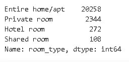

# Airbnb 数据分析—夏威夷

> 原文：<https://medium.com/analytics-vidhya/airbnb-data-analysis-hawaii-1c7337ac246a?source=collection_archive---------21----------------------->

夏威夷是美国的一个州。它是唯一位于太平洋的国家，也是唯一完全由岛屿组成的国家。

夏威夷多样的自然风光、温暖的热带气候、丰富的公共海滩、海洋环境和活火山使其成为世界各地游客、冲浪者、生物学家和火山学家的热门目的地。

由于其在太平洋的中心位置和 19 世纪的劳动力迁移，夏威夷的文化除了其本土的夏威夷文化之外，还受到北美和东亚文化的强烈影响。

Airbnb 已经被认为是当今最大的酒店公司。哦，细节是:它没有任何酒店！

Airbnb 提供了一个创新的平台，将世界各地想要旅行的人和想要方便实用地租赁房屋的房东联系起来，使这种托管方式成为一种替代方式。

截至 2018 年底，这家成立于 10 年前的初创公司已经在全球接待了超过 3 亿人，挑战了传统的连锁酒店。

Airbnb 的举措之一是为全球一些主要城市提供网站数据。通过 Airbnb 内部的网页[，可以下载大量数据来开发*数据科学*项目和解决方案。](http://insideairbnb.com/get-the-data.html)

# 获取数据

这里使用的所有数据都是从 Airbnb 内部的[中提取的，用于初步分析探索，它将只下载存档:](http://insideairbnb.com/get-the-data.html)

*   listings.csv —夏威夷列表的汇总信息和指标(有利于可视化)

# 数据分析

这一步旨在创建一个初始的情景意识，并允许理解数据是如何构造的。

在开始任何分析之前，我们应该检查我们的*数据集的表面。*我们可以通过分析前 5 个条目来做到。

# 属性(变量)、条目和变量类型

让我们继续，确定我们的数据集有多少个条目，并查看每一列的类型。

我们下载的这个数据集是 Airbnb 的“简短”版本。在同一个页面上，我们下载了文件 listings.csv。有一个更完整的版本，有 35847 个条目和 106 个变量(listings.csv.gz)。

# 数据集中缺失值的百分比

数据集的质量与缺失值的数量直接相关。重要的是尽早了解这些空值与总条目相比是否重要。

*   您可以看到 reviews_per_month 和 last_review 列中有将近 23%的值缺失。
*   变量 host_name 大约有 1.2%的空值。
*   变量名有大约 0.07%的空值。

# 变量的分布类型

为了确定变量的分布，我将绘制直方图。

# 极端值

通过分布直方图，可以检查异常值存在的证据。以变量 price、minimum_nights 和 calculated_host_listings_count 为例。

这些值不符合分布，会扭曲整个图形表示。为了证实这一点，有两种简单的方法可以帮助检测异常值。他们是:

*   使用 description()方法的统计摘要
*   绘图框为变量绘图。

看一下上面的统计摘要，我们可以确认一些假设，例如:

*   可变价格有 75%的值低于 340，但其最大值是 24999。
*   变量 minimum_nights 有 75%的值低于 5，但它的最大值是 365。

# 箱线图:最小 _ 夜

# 箱线图:价格

# 无异常值的直方图

既然我们发现了 price 和 minimum_nights 变量中的异常值，让我们清理它们的数据框架并绘制一个新的直方图。

# 变量之间的相关性

相关性是指两个事物之间有关系。在我们的上下文中，我们正在寻找两个变量之间的关系或相似性。

这种关系是可以测量的，它是确定其强度的相关系数的函数。为了确定感兴趣的变量之间的相关性，我将:

*   创建相关矩阵
*   使用 seaborn 库从这个矩阵生成一个热图

# Airbnb 上出租最多的是什么类型的房产？

room_type 变量列指示 Airbnb 上广告的租赁类型。如果你已经在网站上租房，你知道公寓/整栋房子都有选项，只需租一个房间，甚至与其他人合租一个房间。

让我们使用 value_counts()方法统计每种租赁类型的出现次数。

# 夏威夷最贵的地段是哪里？

检查一个变量与另一个变量的一种方法是使用 groupby()。在这种情况下，我们希望根据租赁价格来比较各个街区。

由于为属性提供了纬度和经度，因此可以绘制每个点。为此，认为 x =经度，y =纬度。

# 结论

在 Airbnb 数据库中只做了表面分析，但已经注意到在一些变量中存在异常值。

全屋/公寓是夏威夷最常见的房产类型，占所有可用房产的 88%。

拉海纳的平均房价最高，而库劳洛阿的平均房价最低。

请记住，这个数据集是一个简短的版本，仅适用于初始方法。建议在进一步的探索性分析中使用具有 106 个可用属性的完整数据集。

点击[这里](http://bit.ly/2TneAEx)查看我的 Github 上的完整代码。