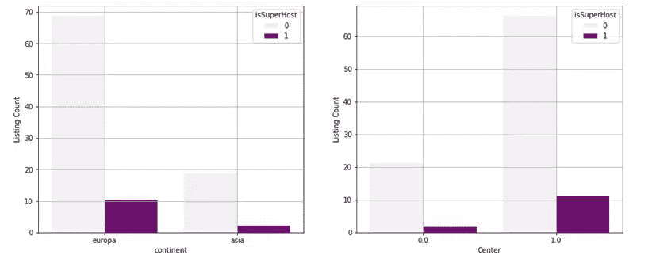
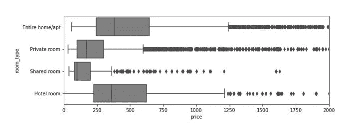

# Airbnb 主机以及在哪里可以找到它们

> 原文：<https://medium.com/analytics-vidhya/airbnb-hosts-and-where-to-find-them-4c204dfd1138?source=collection_archive---------22----------------------->

基于 Airbnb 伊斯坦布尔数据集的 Airbnb 房源价格分析与预测

Fatih —伊斯坦布尔信贷:[jonesaroundheworld](https://www.jonesaroundtheworld.com/best-airbnb-istanbul-turkey/)

人们总是对一些事情感到好奇。有时仅仅是好奇，有时是为了满足好奇心而采取行动。

一周前，我想知道 AirBnb 托管价格决策、房屋位置以及与他们在伊斯坦布尔的房产相关的信息。为此，我做了一个项目，旨在预测 AirBnb 中的房源价格。我的 [**GitHub**](https://github.com/abduygur/AirBnB-Istanbul-Price-Prediction) 中该项目的所有代码

以下是我对这个项目的概述:

**1。简介和问题**

**2。建模&模型评估**

**3。总结**

# **简介和问题**

在土耳其，AirBnB 从 2010 年开始工作。因为我住在 i̇stanbul.，所以我从来没有用过它然而，在开始我的项目之前，我有一些问题。

有多少主机有 1 个以上的列表？

挂牌价和洲有没有关系？

我的房子在伊斯坦布尔的欧洲一侧。在 Airbnb 上列出我的房子好吗？

我可以预测挂牌价吗？

**数据集回顾**

出于好奇，我在 Airbnb 官方网站([获取数据)找到了一个数据集——在 AirBnb 内部。为辩论添加数据。](http://insideairbnb.com/get-the-data.html))

有很多城市数据是完全免费的。当我分析 2020 年 10 月收集的伊斯坦布尔数据时，这个数据集 AirBnb 提供了 74 列 22，328 行(列表)。行代表列表(房间、整个公寓等。)

Airbnb 伊斯坦布尔数据集中的一些列

正如你在上面看到的，这些是非常混乱的数据，有一些字符串，单元格中的空值列表等等。我喜欢处理杂乱的数据。数据的概要是我们有分类和数字列。这些栏目与东道主、房产类型、地区、东道主提供的一些便利设施和评论有关

我不打算谈论技术细节。如果你想检查我的项目，这里是我的 GitHub

**探索性数据分析**

经过清洗、改造过程，我有了漂亮的造型桌。在建模之前，我需要了解业务，并考虑价格和其他特征之间的相关性。

在 AirBnb 伊斯坦布尔数据集中，有 12，651 个唯一的主机。一个主机可能有多个列表。让我们看看每台主机的列表计数:

主机列表分发

正如你在上面看到的，近 80%的主机在伊斯坦布尔有一个列表。10%的主机有 2 个列表，10%的主机有 2 个以上的列表。这是我的一个问题的答案。

90%的列表代表整个家庭和私人房间

地区分布

AirBnB 在 Beyoğ lu、iş li、Fatih、Kadı和 beikta 有将近 70%的房源。

Beyoğ lu 的 Istiklal 大街

这些地方是伊斯坦布尔最著名的地区。如果你计划游览伊斯坦布尔，你应该去位于伊斯坦布尔欧洲一侧的贝约鲁。有塔克西姆广场、伊斯蒂克拉尔大道、葡萄酒屋、俱乐部、餐馆、咖啡馆、教堂、历史通道和建筑……总而言之，贝约卢是历史和今天的和谐。更多信息:[beyo Lu—维基百科](https://en.wikipedia.org/wiki/Beyo%C4%9Flu)

经过一些单变量的探索，让我们看看超级主机。AirBnB 伊斯坦布尔有 2819 个(占唯一主机的 22%)超级主机。最有可能的情况是，想要选择 AirBnB 的人会发现 superhosts 比其他人更可靠。

各大洲和中心区的超级主机分布

上面的左条形图显示了按洲分布的百分比，它表明主机不是超级主机。80%的房源在欧洲(10%为超级主机，70%为其他)

上图右侧柱状图显示了各中心的百分比分布。我手动标记了这些中心:贝约格鲁、西斯里、法提赫、贝希克塔斯、萨里耶、卡迪科伊、乌斯库达尔、阿达拉尔、贝科兹

我认为 AirBnB 应该像我之前提到的那样增加 superhost 计数，因为人们觉得它们更可靠。

经过一些超级主持人的调查，我要谈谈上市价格

价格分布

哎呀，价格高度右偏，有极值点，让我们放大

价格分布(放大 0-5000 土耳其里拉)

挂牌价格的平均值为 511 土耳其里拉，标准偏差为 1904 土耳其里拉。标准差很高。在接下来的部分，我将处理这个偏斜问题

数据集中某些属性的关联图

如果我查看为主机和便利设施变量创建的关联热图，我会对价格和其他属性之间的不关联感到非常难过。

但是，我可以检测独立变量中的多重共线性。我讨厌多重共线性，删除了一些属性。

我对所有属性都做了这个操作，但是我不打算在这里展示它。如果你对操作感兴趣，让我们来看看 [GitHub](https://github.com/abduygur/AirBnB-Istanbul-Price-Prediction) 。

基于洲的价格分布

欧洲的价格分布比亚洲高，因为我之前提到过，大多数受欢迎的地区都在欧洲，我的房子也在伊斯坦布尔的欧洲一侧，所以我的房子很有可能超过 250 吨。

基于房间类型的价格分布

价格可能取决于房间类型。整个家庭/公寓和私人房间占 Airbnb 房源的 90%,它们的价格分布不同。这可能是建模价格的良好属性

宿主任期分布

在电信行业，任期定义了客户在公司的生命周期，所以我创建了这个特性并给它起了个名字。它代表了主持人作为主持人在 Airbnb 的一生中的月数。

保有权不区分价格，但在保有权分布中，似乎有两个接近正态分布。我发现了这一点，我将把这个属性放入> = 40 的任期和< 40 Tenure it might be useful for modeling

· Most of the hosts lie between 0–40 Tenure

# **建模&评估**

在一些洞察之后，有一个建模步骤。正如我所说，价格是高度倾斜的。这对回归模型来说是件坏事。

对数转换价格

如果我对价格取对数，我们可以得到正态分布。所以我认为最好创建一个对数价格模型

**随机森林回归模型**

经过预处理后，我有 35 个独立变量来预测列表价格。首先，我从 Scikit-Learn 包中创建了一个模型 RandomForestRegressor，而没有拆分数据集。这个模型给了我 0.59 R2 分数，但它可能是过度拟合。我的目标是发现异常值(如果有的话)。

首款 R2 得分为 0.59 的基本款

这里你可以看到第一个模型结果和误差分布(中间)。误差是正态分布的，但是当模型预测更高的价格时，可变性增加了，所以我认为我们可以消除一些变量

第一模型的残差分布

我将消除只看方框图，并从-1.7 和+1.7 点进行修剪。在这次行动中，我丢失了 237 个列表。对此很抱歉…

在我删除了极端值之后。我将预测价格的训练集和测试集分开，并使用具有相同属性的模型

异常值检测后的训练集结果(0.63 R2 分数)

建模后，你可以在上面的结果中看到 R2 得分为 0.63 的训练集结果

异常值检测后的训练集结果(0.56 R2 分数)

我在测试集中得到了 0.56 r2 的分数。这意味着我们的回归模型解释了 56%的价格波动。功能重要性:

价格预测的重要特征

**XGBoost 回归:**

测试集的 XGB 回归结果(0.60 R2 分数和 0.28 MSE)

当我在测试集上尝试 xgboost regressor 0.60 R 平方得分和 0.28 MSE 比 RandomForestRegressor 稍好。我们的 XGBRegressor 模型解释了数据中近 60%的可变性。

以下是 XGB 模型的功能重要性:

XGB 回归模型的重要特征

有趣的是，我的模型是从私人房间属性中得知价格的。容纳在这个重要性上也有很大一部分。

# **总结**

因为在这个项目中，数据清理和处理占用了整个项目将近 70%的时间。我回答了我所有的问题。让我们总结一下:

**有多少主机有 1 个以上的房源？**

o 20%的主机拥有 1 个以上的列表

80%的主机有 1 个列表

**洲与价格有关吗？**

欧洲这边的价格比亚洲这边高

根据方框图，您可以看到两个大陆的价格分布，很明显，欧洲这边的价格分布高于亚洲的价格分布。

我的房子在伊斯坦布尔的欧洲一侧。在 Airbnb 上列出我的房子好吗？

整个家庭的价格对我来说很好:)

o 我打算租下我位于欧洲的整栋房子。我有很大的机会从我的房子获得高收入

o 欧洲方面的价格高于亚洲方面，所以是的，他们有很大的不同

**我可以预测挂牌价吗？**

测试集上的 XGB 回归结果

是的，我们的模型结果显示，我可以用 XGBoost 模型解释 60%的价格波动。通过微调，它可以增加

下一步是什么

我需要部署这个模型。或许可以创建一个 web 应用程序，根据住宿、浴室、评论、便利设施等规格来预测 Airbnb 房源。

在本文的下一部分，我将把这个模型部署到一个 web 应用程序中。因为没有部署的模型项目还没有完成。