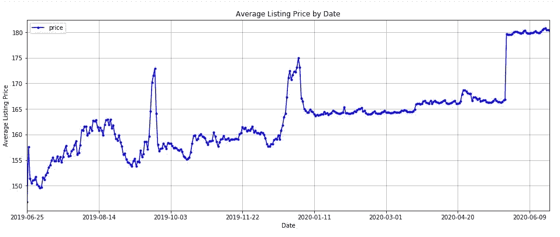
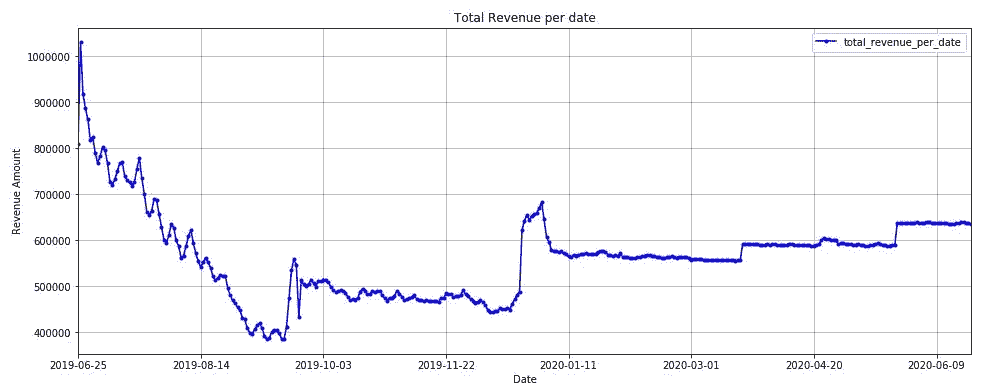
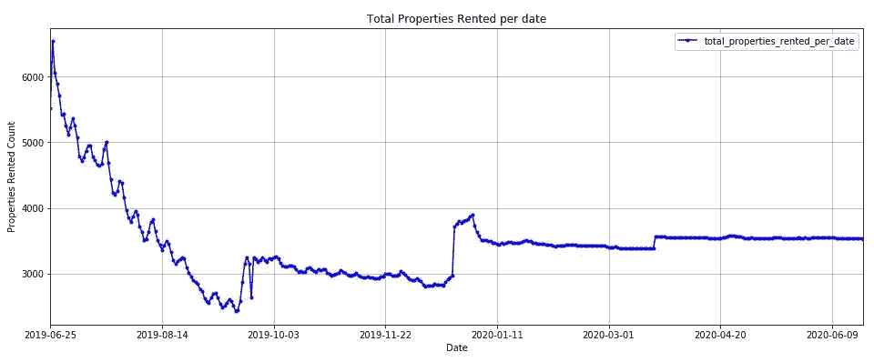
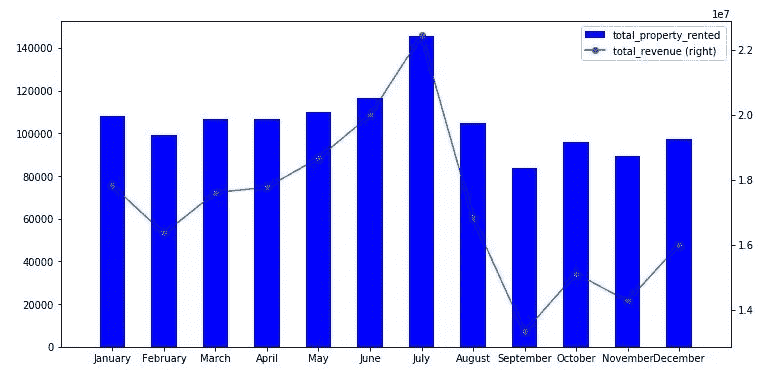
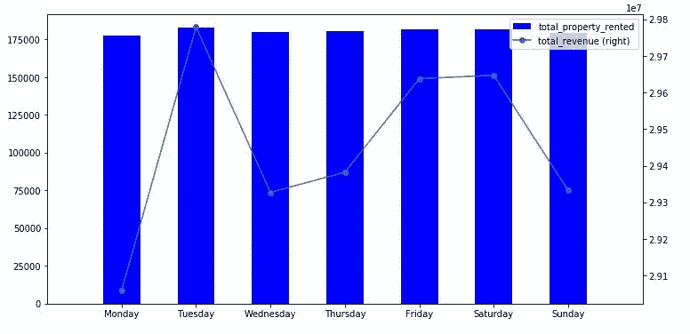
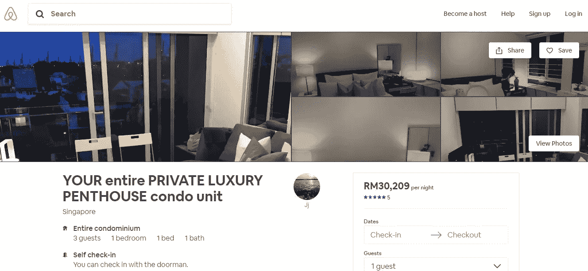
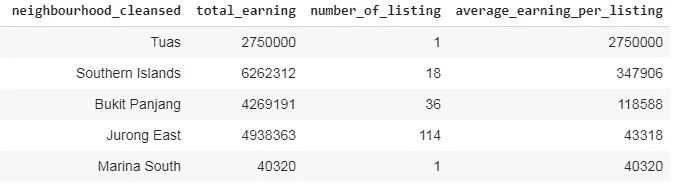
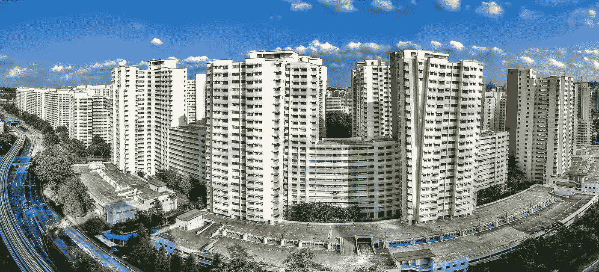
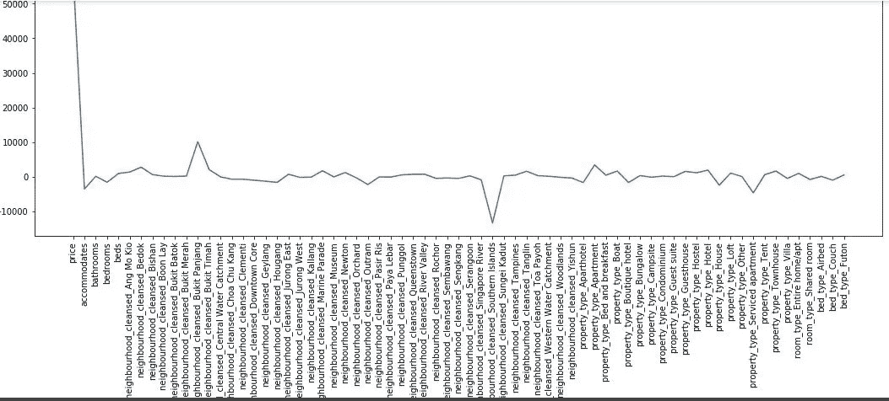

# 新加坡的 Airbnb:描述性和预测性分析

> 原文：<https://medium.com/analytics-vidhya/airbnb-in-singapore-descriptive-and-predictive-analytics-58802975e181?source=collection_archive---------8----------------------->

Airbnb |新加坡

# 介绍

在这篇文章中，我将使用 **CRISP-DM** 流程分析新加坡的 [Airbnb 数据集。分析中使用了两个主要数据集:新加坡的列表数据和日历数据。](http://insideairbnb.com/get-the-data.html)

# CRISP-DM(数据挖掘的跨行业标准流程)

*   商业理解
*   数据理解
*   数据准备
*   建模
*   估价
*   部署

# 商业理解

A‌i‌r‌b‌n‌b‌是一个在线市场，将寻找住宿(主要是寄宿家庭)或旅游体验的人与大量可供出租的空间联系起来。在这次探索中，我试图通过 Airbnb 找到房源的模式。

为了更好地理解业务，我考虑了 3 个问题:

1.  【2019 年什么时候 Airbnb 能给新加坡带来更高的收入？
2.  **使用 Airbnb，新加坡哪些地点的收入更高？**
3.  **在新加坡，Airbnb 的哪些物业特征能带来更高的收入？**

# 数据理解

只有两个数据集，即列表和日历。理解数据会给我们一些关于数据信息的直觉，以及建立模型应该包括哪些潜在的特征。

## 列表信息

下面是一些数据变量的例子:

*   *id*
*   *列表 _ 网址*
*   *主机 _ 图片 _ 网址*
*   *邻里 _ 净化*
*   *国家*
*   *房产 _ 类型*

从这里，我们可以看到哪些功能将包括哪些功能将被删除以供进一步分析。
' *listing_url* '、 *host_picture_url* '、 *country* '将被删除，其余的保留下来，因为“ *listing_url* ”、“ *host_picture_url* ”只是 url 没有提供太多信息，而“ *country* ”我们只知道新加坡。

**日历信息**

日历信息很重要，它提供了日期信息。这是因为我们可以知道星期几、月份、季节和节日活动。这些都与当前的商业机会有关。然而，日期是从 2019 年 6 月开始到 2020 年 6 月，我无法从 Airbnb 公开数据中找到关于这个时间段的解释。我相信是 Airbnb 隐私保护政策。

来源:破产背包客

# 数据准备

首先是数据清理，如删除不必要的列和缺少值的指定行，将列转换为“str”，将列转换为“1”，“0”，将价格列转换为“float”，将日期列转换为日期时间等。

然后创建两个数据集来回答我在业务理解方面的三个问题:

1.  使用日期数据集
2.  没有日期数据集

最后是特征工程，如将分类列转换为虚拟列、创建虚拟数据和训练测试分割。

在数据预处理之后，让我们通过一些图表来了解一下数据:

平均列表价格图表

平均挂牌价格趋势逐渐上升，并在 9 月和 12 月底达到峰值。

总收入图表

租赁物业总数图表

从上面的两张图表来看，总收入图表和总租赁财产图表是相互关联的。这是因为出租的物业越高，收入就越高。

暑假

# 问题 1:2019 年什么时候 Airbnb 在新加坡的收入最高？

# 建模

*   我们使用经过数据预处理并提前保存的数据集。
*   然后，我们在数据集中选择一些我们想要关注的特征，即价格、月份和星期几。
*   我们计算总收入和出租的总财产。
*   两个不同日期的总收入和总租金将绘制在柱状图中。

**每月**总收入和总租赁物业

**每日**总收入和总出租物业

# 估价

以月为标准:
-总收入最高的月份是 7 月，一年中的前 7 个月可以看到总收入的上升趋势。
-因此，业主可以在今年前 7 个月将更多精力放在房产上市上。

日作为标准:
-星期二给出最高的总收入，然后是星期五和星期六。周二、周五和周六，业主可以更多地关注他们的房源。

# **问题 2:在新加坡哪些地点使用 Airbnb 的收入较高？**

# 建模

*   我们使用没有日期的数据集
*   然后，我们在数据集中选择一些我们想要关注的特征，这些特征是经过邻域清洗的，并且收入。'
*   我们计算总收入，上市数量，平均每上市收入
*   收入最高的 5 个地点将在表中列出

收入最高的前 5 个地点

# 估价

*   大士的平均收入最高，为 2，750，000 美元，但在大士只有一个出租房屋。
*   其次是南部岛屿、武吉潘江、裕廊东和滨海南，为 347，906 美元；$ 118,588;$ 43,318;分别为 40320 美元。
*   裕廊东录得最高的上市数量，这意味着存在更大的竞争，导致更具竞争力的定价。
*   退房的大士房源其实是[豪华顶楼](https://www.airbnb.com/rooms/20791161)。因为这个案例表明投资越高，回报也越高。

武吉潘江的公寓

# 问题 3:在新加坡，Airbnb 的哪些物业特征能带来更高的收入？

# 建模

*   我们使用没有日期的数据集。
*   然后，我们在数据集中选择要分析的要素，并将其存储在新的数据框中。
*   我们对分类特征进行编码，并对数据值进行标准化。
*   然后我们把数据分成训练集和测试集。
*   实例化预测模型并使用模型评分测量误差。
*   我们使用线性回归、决策树回归、Lasso、RidgeCV、RandomForestClassifier 进行预测。
*   Lasso 在模型中给出了最好的结果，训练分数为 0.4875，测试分数为 0.5161。

针对系数的特征

# 估价

五个重要的财产特征带来更高的收入:

*   价格
*   街区 _ 净化 _ 武吉潘江
*   邻里 _ 净化 _ 南部岛屿
*   物业 _ 类型 _ 酒店式公寓
*   房产 _ 类型 _ 公寓