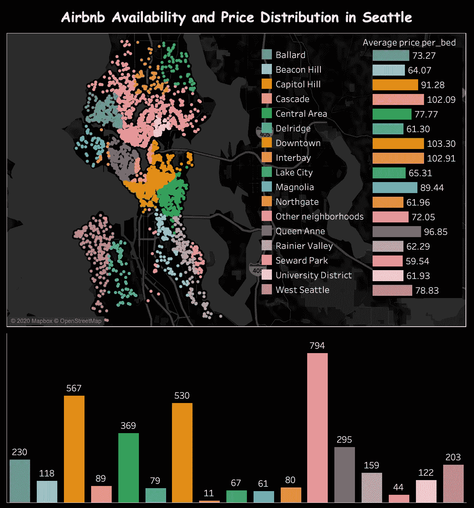
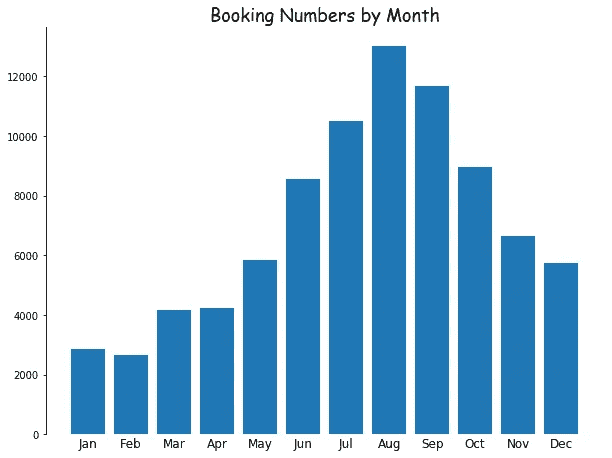
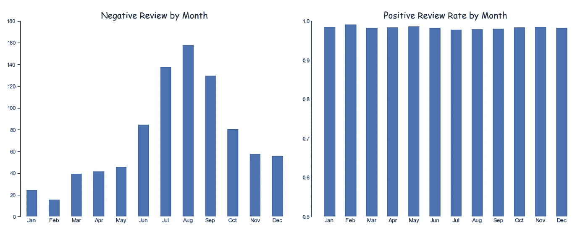
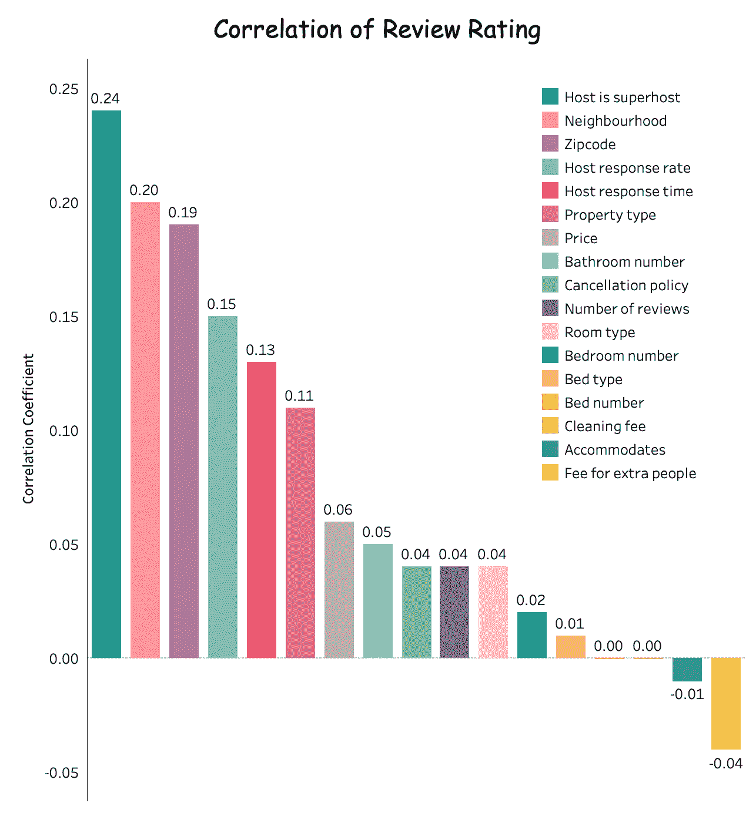
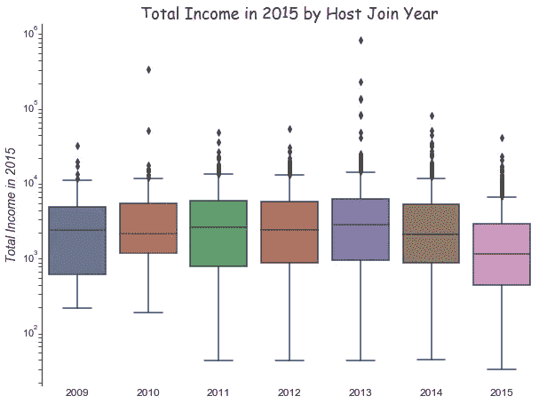
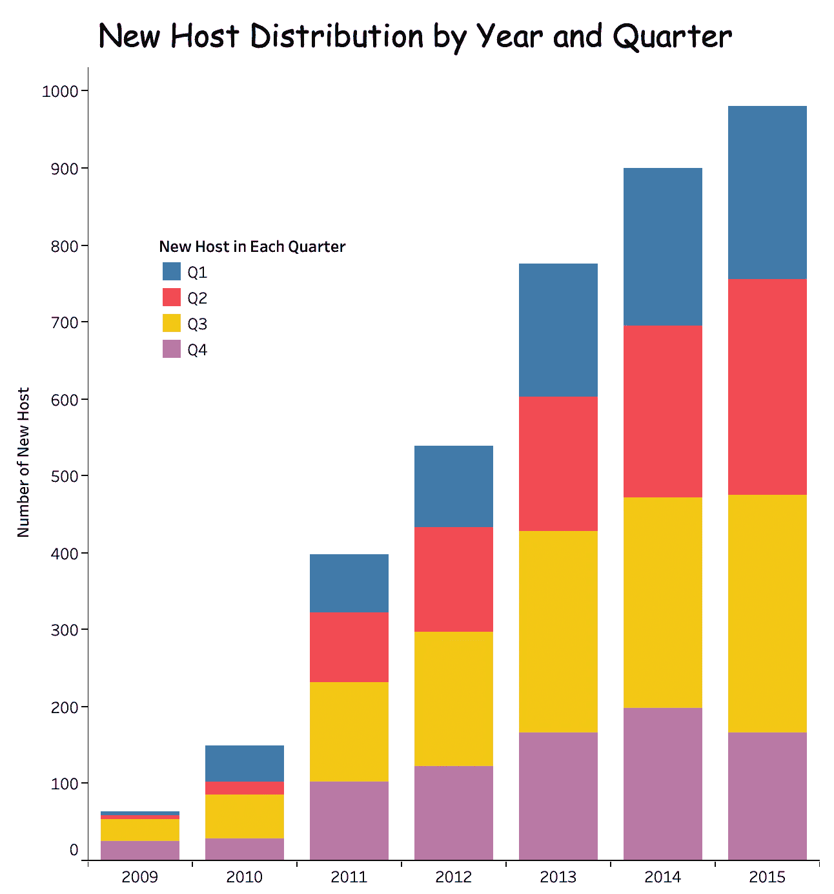
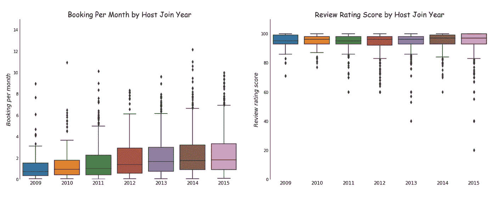

# 西雅图的 Airbnb 市场——从主人和访客的角度看

> 原文：<https://medium.com/analytics-vidhya/airbnb-market-in-seattle-a-closer-look-from-the-perspectives-of-host-and-visitor-89b179cde17?source=collection_archive---------32----------------------->

本·达顿在 [Unsplash](https://unsplash.com?utm_source=medium&utm_medium=referral) 上的照片

> 在这篇博客中，我将分享对“Hello world”数据集的分析——2016 年 Kaggle 西雅图 Airbnb 数据——为西雅图的潜在游客和西雅图当地的 Airbnb 主机提供一些见解。

西雅图是一个如此迷人的城市，拥有世界上最大的工业和科技公司，如亚马逊、星巴克、微软等。每年有超过 4000 万人去西雅图旅游。Airbnb 是一种帮助旅行者找到住宿的革命性方法，它在包括西雅图在内的许多地方重塑了房主和租房者之间的关系。让我们来看看现有数据告诉我们西雅图 Airbnb 市场的情况。

在本文中，我将借助 Python 和 Tableau 分析 2016–2017 年 Kaggle 西雅图 Airbnb 开放数据，回答西雅图潜在游客和西雅图当地主人可能感兴趣的四个问题。

> 从游客的角度来看:
> 
> 1.西雅图不同位置的房源和租金价格分布如何？
> 
> 2.西雅图 Airbnb 租房者的体验会因时间而异吗？
> 
> 从本地主机的角度来看:
> 
> 1.主持人怎么做才能提高点评评分？
> 
> 2.对于考虑成为西雅图 Airbnb 主持人的“菜鸟”来说，与经验丰富的主持人相比，他们在这个市场的竞争力如何？

# **第一部分:从游客的角度**

**西雅图不同位置的可用房源和租金价格分布如何？**

永远不要呆在市区，那里太贵了！—妈妈

市中心真的是最贵的地方吗？答案是，妈妈从来不会错！从下面的仪表板可以清楚地看到，与所有其他地区相比，西雅图市中心、卡斯卡德、安妮女王以及国会山等地区的每张床的平均价格最高(> 100 美元/晚)。自然，西雅图市中心更密集的人口和更大的商业集中度增加了对房源的需求，租金价格也随之上涨。但这也为西雅图市中心的游客创造了更多的选择。如果你预算紧张，这些是你绝对应该避免的领域。

西雅图北部是你口袋里的甜蜜点。在这一地区，平均租赁价格下降到大约 60-75 美元/晚。此外，该地区有大量的住宿选择，尤其是在巴拉德和大学区之间的区域(“其他街区”，粉红色)。与西雅图北部相比，西雅图南部的平均租房价格相似，但可能的住宿选择要少得多。

**西雅图 Airbnb 租房者的体验会因时间而异吗？**

*“不要在旺季出行，他们把你当垃圾！”—妈妈*

当需求高于供给时，产品质量就会下降，这是常识。这种关系是否也适用于西雅图 Airbnb 租房者的经历？数据让我们对这个问题有了一些了解。通过查看 2009 年至 2016 年期间每月的预订数量分布，可以清楚地看到，7 月、8 月和 9 月等夏季是高峰月，而 1 月和 2 月是预订量最少的非高峰月。

现在我们知道了西雅图的旅游高峰和非高峰月份，让我们根据他们的评论来看看客人体验的分布。分析 2009-2016 年间客人写的 83195 条评论，我发现 82320 条正面评论，359 条中性评论，516 条负面评论。考虑到中性和负面评论都是不满意客人的反映，我们可以看到不满意客人的出现遵循与预订数量分布相同的模式。旅游高峰月(7 月、8 月、9 月)负面评价最多，非高峰月(1 月、2 月)负面评价最少。然而，越来越多的预订通常伴随着越来越多的负面评价，因此每月检查正面评价的比例可能是评估客人体验的一种较少偏见的方法。下图显示了全年几乎不变的正面评价，表明顾客满意率不会随时间而变化。在旺季和淡季，正面评论率都很高(> 97%)。

> 要点:如果你要去西雅图旅行，Airbnb 的大多数选择都位于西雅图中部和北部。北西雅图有最好的平衡——价格友好，有许多住宿选择。根据你自己的时间表选择旅行时间，你可能对你选择的 Airbnb 有相似程度的(不)满意——高峰或非高峰*。*

# **第二部分:从本地主机的角度出发**

**主持人怎样做才能提高点评评分？**

*可惜我没有妈妈的至理名言来回答这些问题。但是我们有数据！*

不同的 Airbnb 主持人有不同的策略来提高他们的评论评级，但可能有一些共同的方法来赢得你的客人的心。我们来分析一下不同因素是如何影响评论评分的。

(连续-连续变量的皮尔逊 R，分类-连续变量的相关比，分类-分类变量的克拉默 V 或泰尔 U)

基于相关分析，我们发现除了地理位置(邮编)和物业类型之外，影响评论评级的主要因素是主人和客人之间的交流。主人的回应率和回应时间是影响客人是否感到舒适的两个关键因素。致力于快速和频繁的交流可能会增加被贴上“超级主持人”标签的机会，这可以显著提高评论评级。

对于考虑成为西雅图 Airbnb 主持人的“菜鸟”,与经验丰富的主持人相比，他们在这个市场的竞争力如何？

*钱，钱，钱！*

成为 Airbnb 的主持人就是为了赚钱，但让我们看看有兴趣加入西雅图 Airbnb 市场的新主持人的赔率如何。我们会将 2015 年加入的所有主持人认定为“菜鸟”，通过将他们 2015 年的总收入与更有经验的主持人进行比较，来评估他们在市场上的表现。乍一看，根据平均收入和最高收入的比较，“新手”在 2015 年的总收入最低。

然而，这种分析应该通过考虑一个新手在 2015 年的什么时候开始创业来校准。由于大多数新手主机在年初没有加入 Airbnb，因此整体营业时间比可比的经验丰富的主机短得多。

当我们根据与时间无关的参数评估新手主持人的表现时，我们根据每月的预订数量和评论评级看到，新手主持人实际上在预订统计和客人评估方面都很出色，这表明他们很快就会赶上有经验的主持人。另一点需要注意的是，自 2013 年以来，新主机的数量急剧增加。如果你即将进入这个市场，最大的挑战将不是与有经验的主持人竞争，而是与你的“新手”同行竞争。

> 要点:要成为一个高评价的主持人，及时与你的客人沟通是非常重要的。如果你正在考虑成为西雅图的 Airbnb 主持人，如果你能胜过同年开业的其他新手主持人，你将能够在市场上赢得自己的一席之地。

# **进一步分析**

对于游客来说，如果你想在西雅图获得最佳体验，建议你将旅行安排在春季或秋季，并在西雅图中部地区选择住宿，这样你可以减少交通时间/成本，避免游客拥挤，并最大限度地将自己沉浸在西雅图的自然和文化风景中。

对于西雅图的主人来说，除了维护和升级便利设施(如更新的厨房电器和现代家具)，积极与客人沟通是增加你在市场中竞争力的关键因素，无论你是经验丰富的还是新手主人。

回到现在，由于新冠肺炎疫情，我们正处于历史上前所未有的时刻，正因为如此，西雅图的 Airbnb 市场将非常难以预测。但变化总是与机遇并存。无论你是经常旅行的人还是 Airbnb 的主人，保持健康和安全！

# **资信证明**

本文使用的所有代码都可以在我的 [GitHub](https://github.com/giantseaturtle/Seattle-airbnb) 和 [Tableau](https://public.tableau.com/profile/zhili.wen#!/?newProfile=&activeTab=0) 上找到。

1.  [*对文本数据进行完整的探索性数据分析和可视化— Susan Li*](https://towardsdatascience.com/a-complete-exploratory-data-analysis-and-visualization-for-text-data-29fb1b96fb6a)
2.  [*对分类相关的搜索— Shaked Zychlinski*](https://towardsdatascience.com/the-search-for-categorical-correlation-a1cf7f1888c9)
3.  [*优步骑行数据可视化与 Tableau —梁咏琪*](https://towardsdatascience.com/data-visualization-of-uber-rides-with-tableau-67988f61f712)