# AirBnB-西雅图的故事:

> 原文：<https://medium.com/analytics-vidhya/airbnb-the-seattle-story-de5c05caed90?source=collection_archive---------15----------------------->

## 您的分析指南可帮助您预订下次入住。

# 概述

Airbnb 是一个在线市场，它将想要出租房屋的人与在当地寻找住处的人联系起来。随着在世界各地的存在，该公司彻底改变了人们在外出工作或度假时对住宿的看法。

我们将尝试回答一些常见的基于客户的问题，并最终尝试创建一个良好的模型来预测 CRISP-DM 流程下的未来上市价格。

## **内容**

以下 Airbnb 活动包含在此 [*AirBnB 西雅图数据集*](https://www.kaggle.com/airbnb/seattle) 中:

**列表:**包括完整描述和平均评论分数。

**日历:**包括刊登物品 id 以及当天的价格和供货情况。

## **我们将尝试回答的商业问题-**

让我们以客户为中心，从我们的数据中回答以下三个问题。

**1。*房源通常在什么时候提供？***

> 只是周末还是整个星期？
> 
> 有季节性模式吗？
> 
> 我们有邻居变异吗？

**②*。第二，我们将努力研究推动房地产价格的主要因素。***

***3。仅使用上述因素，我们将尝试创建一个预测模型来预测新上市产品的价格。***

# 理解数据:

这里我们只使用日历和列表数据 csv 文件。首先，让我们将两个 csv 导入 jupyter notebook，并查看前几行，以了解我们拥有的数据集。

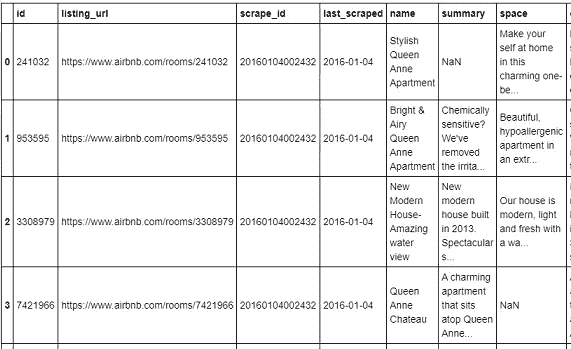

看一下 listings.csv 数据集

上面显示了列表数据集，其中有 92 个特征和 3818 个列表。Calender.csv 中的第二个数据集，其中有 4 个要素和 139357 行数据。

因为我已经定义了手头的业务问题，所以我继续研究数据集，以了解哪些功能是有用的，以及我们在数据集中遇到的所有问题。

# 数据预处理:

现在是最重要的部分，它耗费了手头数据分析和建模任务 80%的时间。我们在列表数据集中有很多对我们的分析没有用的列。因此，我们将减少到下面只提到一次。

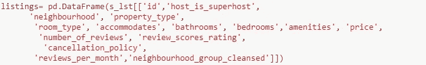

我们将用于分析列表数据集中的特征。

然后，我们将继续在列表和日历数据集中查找 Nan 值

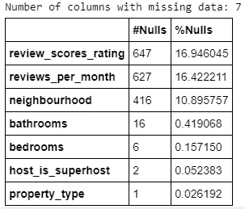

in Listings.csv 中的值

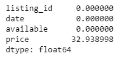

in Calendar.csv 中的值

根据以上发现——我们可以去掉***review _ score _ rating***，因为它用处不大，我们可以去掉***neighborhood***，因为我们有***neighborhood _ group _ cleaned***，这是对邻里关系更好的描绘。 ***浴室、卧室、host_is_superhost*** 和***property _ type***可以用各自特征的模式进行插补。从日历数据集中，从价格功能中，我们可以删除 Nan 行，因为如果您检查组合，就会知道只有在属性不可用时它才会丢失。因此使用这些值是没有意义的。

接下来的 ***价格*** 特性被排序为必须删除$之前的数值。查看下面的 ***每月评论数*** 的分布，我们看到数据是右偏的，因此中位数是插补的更好衡量标准。

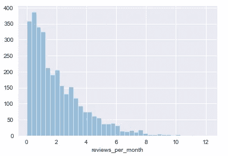

## 现在让我们继续探索并回答这个商业问题

为了回答您关于属性可用性的第一组问题，我们将首先从日历数据集中的日期特性获取星期几和月份。

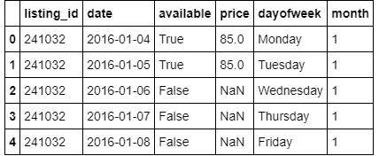

Calendar.csv，包含星期和月份

现在让我们检查一周中某一天的可用性——如果你仔细观察，没有太大的变化，而且一周都是一样的。

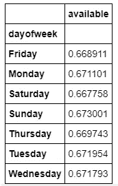

在星期几级别筛选的可用性比例

现在，让我们将邻居包括在我们的分析中，并查看可用性的一些统计数据——如果我们在下面进行观察，那么我们会看到所有邻居的可用性在一周的任何一天都没有太大的变化。

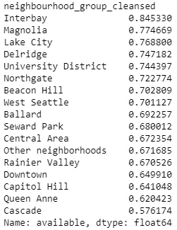

邻里层面的可用性

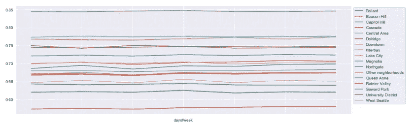

显示不同社区一周中每天可用性的图表

现在让我们继续讨论季节变化——下面我们将看到整个季节的房源供应情况，然后添加社区以查看哪个社区在哪个季节有房源。

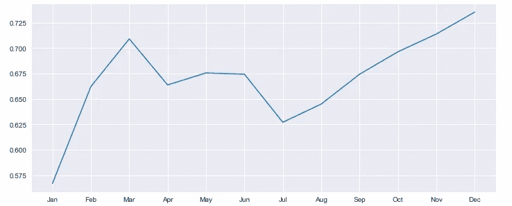

西雅图列表的季节性可用性

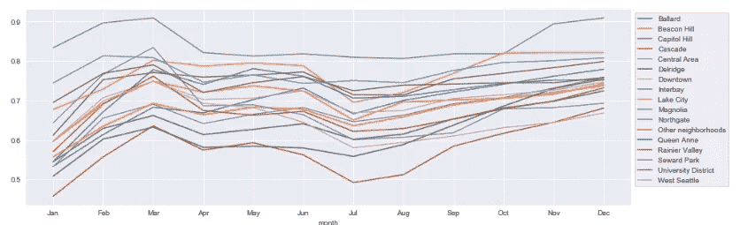

西雅图列表的季节性可用性-每个社区

这非常有趣，因为我们看到可用性**非常低，在一月份大幅下降，并在年底达到峰值**。人们在接近年底的时候开始度假，因此出现了高峰期。此外，二月和三月可用性较高，七月至八月可用性再次下降。如果我们试图找到年中下降的原因，那么我们就会知道这是城市干旱的时候，流入的人口可能会很少，当地人会搬出城市。

接下来回答我们的第二个问题——我们将寻找影响上市价格的因素。首先让我们看看价格的分布。

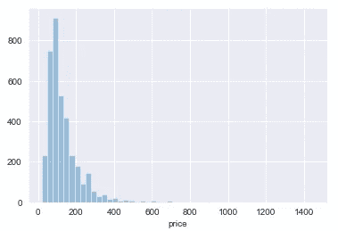

价格是右偏分布

因此，上市的价格主要集中在 20 美元到 300 美元之间，大部分在 100 美元左右

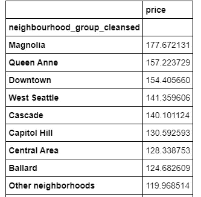

每个街区的平均价格

我们还是能看到西雅图市中心的地方定价高了一点，这又是蛮期待的。通常情况下，越靠近市中心，房地产价格和生活成本越高，这在数据中有所反映。但我们也要考虑其他因素，比如床位、房产类型等。此外，如果我们查看 ***每张床的价格统计，我们会发现市中心的每张床价格最高，其次是卡斯卡特、昆斯安、国会山和 Interbay。***

现在让我们看看价格的季节性变化

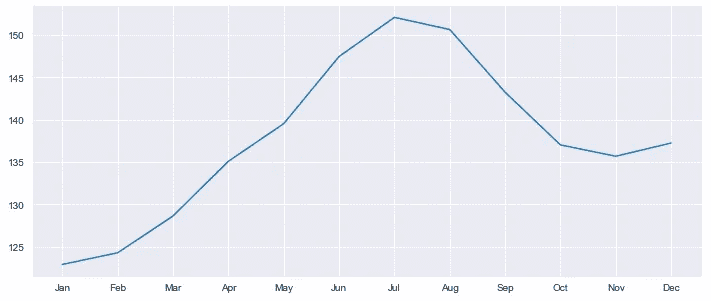

价格的季节性变化

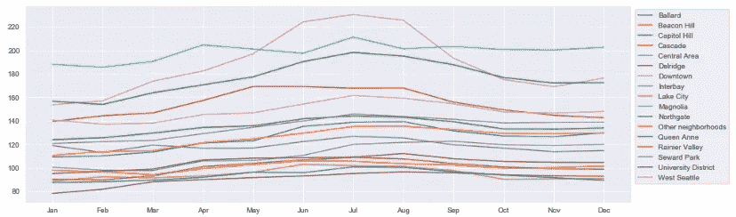

每个街区价格的季节性变化

所以夏天和冬天是参观西雅图最繁忙和最昂贵的时候。

现在，我们将整理一下，看看除了季节性变化之外，哪些特征会影响列表的价格。

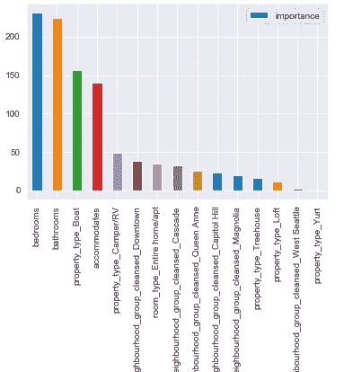

预测物品价格的重要性

***正如我们在上面看到的，清单中最重要的特征是卧室、浴室、物业类型和住宿。这是非常正确的，因为当这些功能更好、更丰富时，价格肯定会上升或下降。***

## 最后，我们将尝试使用上述功能构建一个预测模型，该模型可以预测添加到西雅图 AirBnB 热门列表的新房源的价格。

我们将尝试一些回归算法，看看哪种算法能给出最好的误差矩阵 MSE(均方误差)和 R2(决定系数)分数。以下是相同的整理资料。

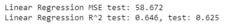

线性回归

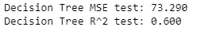

决策树

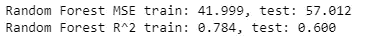

随机福里斯特

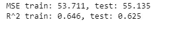

Xgboost

# 结果

***在数据集上运行了几个算法后，我们看到 Random Forest 和 Xgboost 给我们的结果最好，均方误差低，决定系数更好。***

# 部署

最后，当我们完成我们的项目时，完成的代码已经发布在 GitHub [上。](https://github.com/abhinav0231/AirBnB-Seattle-Data-Analysis-Price-Prediction-)该项目可以作为 Jupyter 笔记本运行。自述文件提供了有关安装和运行的更多信息。