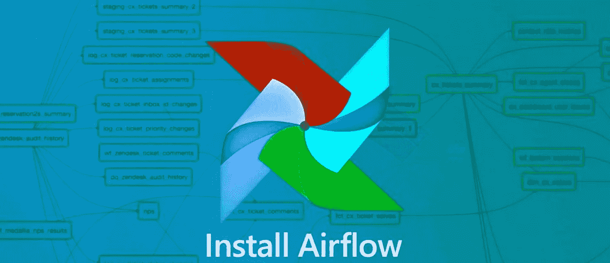

# 初学者的气流——I

> 原文：<https://medium.com/analytics-vidhya/airflow-for-beginners-e80fd032cc2?source=collection_archive---------20----------------------->



阶段:- 1(介绍和安装)

**简介**

Apache Airflow 是一个平台，用于以编程方式创建计划和监控工作流。它是最好的工作流管理系统之一。

Airflow 最初是由 Airbnb 开发的，旨在利用快速增长的数据集管理其基于数据的运营。Airflow 正在 Apache 软件基金会进行孵化，因为 Airbnb 已经决定在 Apache 认证下开源它。

Apache airflow 允许您将工作流划分为独立的小任务单元，从而使您的工作流变得简单而有条理。易于组织和安排。您的整个工作流程可以转换成一个 DAG 与气流。

一旦你的代码定义了你的工作流，它就变得更容易维护。借助功能丰富的用户界面，您的工作流程可以轻松实现可视化、监控和故障排除。

Airflow 还提供了一组丰富的命令行实用程序，可用于在 DAG 上执行复杂的操作。

简而言之，airflow 是一个平台，您可以在其中查看和安排您的脚本运行。

**安装**

你可以通过 PIP 简单地安装气流。

```
pip install apache-airflow
```

所以这个命令会把你的气流安装到本地。

要启动气流，运行以下命令，您就可以设置气流了。

```
airflow initdb   # initating the database for storing the DAGsairflow scheduler  # initating the scheduler for triggering on scheduled timeairflow webserver  # initating the webserver for UI
```

执行此操作后，您的气流完全设置好了。您可以在以下位置找到它:

```
localhost:8080
```

现在你已经完全设置好了气流，并开始执行和创建 DAG，我们将在[的下一篇文章](/@rdhawan201455/airflow-for-beginners-ii-ae2a9f55d2f6)中看到。

谢谢你的支持。