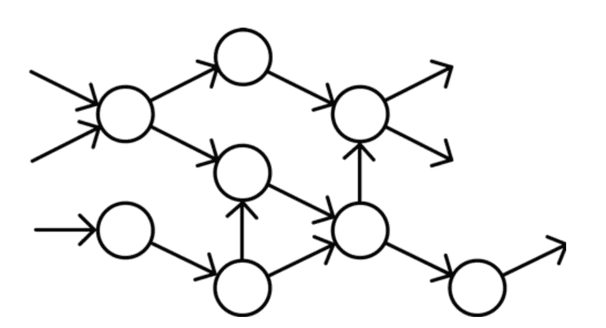
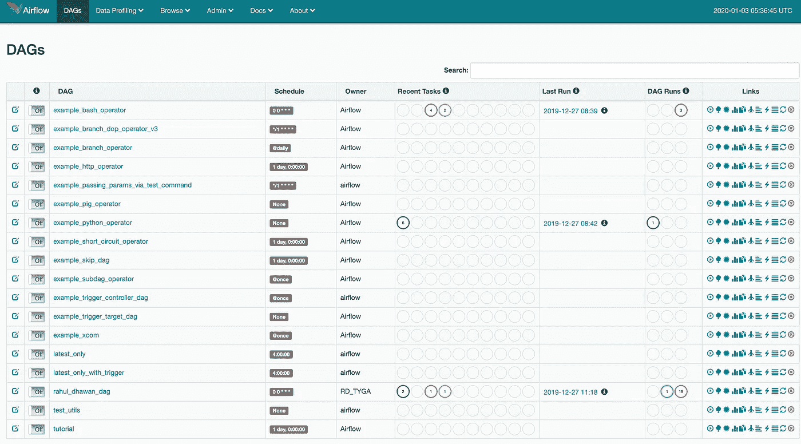

# 初学者的气流— II

> 原文：<https://medium.com/analytics-vidhya/airflow-for-beginners-ii-ae2a9f55d2f6?source=collection_archive---------19----------------------->

## 第二阶段:执行气流

正如上一篇文章[初学者的气流，我](/@rdhawan201455/airflow-for-beginners-e80fd032cc2)我们学习气流以及如何在本地安装气流。在本文中，我们将了解 DAG 以及如何使用 web airflow 来调度和管理工作。

让我们从 DAG 开始，然后我们将学习关于网络气流。

**有向无环图**



DAG 是一个没有圈的有向图。它有有限数量的边和节点。其中我们可以知道哪个事物(节点)将首先出现，并且我们将知道节点的顺序。所以只要把每个节点想象成一个工作(你想要执行的)，我们就可以用 DAG 来表示工作的顺序，这就是为什么 DAG 是流程的一个重要部分。

**卷筒纸气流**

所以现在你看到了

```
localhost:8080 
```

如果你打开它看起来会像:



现在，这些是已经添加的示例 DAG 或工作，因此要添加您自己的脚本(DAG ),只需遵循下面提到的简单步骤:

1.  只需转到终端中的 airflow 目录(它将位于根目录中)，然后只需创建名为“ ***dags*** 的新文件夹，因为在配置文件中，路径是为 dags 设置的，用于获取 dags。
2.  现在只剩下如何创建 dag 了，我们现在将通过一个接一个地执行两个文件的例子来完成它。我们之所以做这个例子，是因为通常在你的工作空间中，你必须按照预定的时间间隔执行一些文件。

2.a .创建两个文件在我的例子中，我创建了两个 python 脚本来执行。

2.b .现在您必须编写一个 python 脚本来创建 DAG

所以让我们来详细了解一下

1.  首先导入我们需要的库

```
import airflowfrom airflow.models import DAGfrom airflow.operators.bash_operator import BashOperatorfrom airflow.operators.dummy_operator import DummyOperator
```

2.现在初始化我们需要传递的 dag 参数，并初始化 dag。

```
def_arg = {'owner': 'RD_TYGA','start_date': airflow.utils.dates.days_ago(2),}dag = DAG(dag_id='rahul_dhawan_dag',default_args=def_arg,schedule_interval='0 0 * * *',) # run every minute
```

3.现在创建您想要执行的任务。

```
t1 = BashOperator(task_id='python_task_1',bash_command='python /Users/rahul/Desktop/goal.py ',dag=dag)t2 = BashOperator(task_id='python_task_2',bash_command='python /Users/rahul/Desktop/goal2.py ',dag=dag)
```

4.现在添加运行的顺序。

```
t1 >> t2
```

现在只需保存它并运行这个命令

```
python your_file_name.py
```

1 或 2 分钟后，您将在 web 服务器中看到该 dag。

现在，您已经为计划做好了准备，只需看看它是如何运行的。

谢谢你的支持。