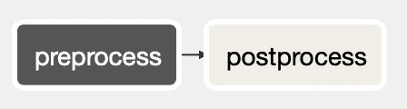
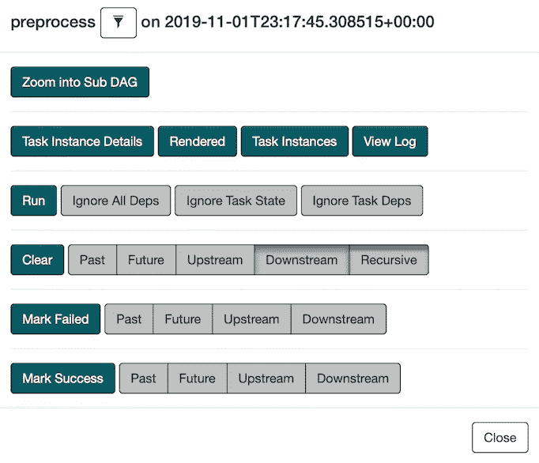
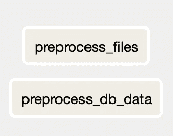

# 气流技巧— Xcom 和 SubDAG

> 原文：<https://medium.com/analytics-vidhya/airflow-tricks-xcom-and-subdag-361ff5cd46ff?source=collection_archive---------1----------------------->


我做数据工程师 2 年了，一直用[气流](https://airflow.apache.org)维护大部分数据管线。这是一个非常直观的界面，组织数据管道非常简单。在这篇文章中，我想分享一些我在气流 DAGs 中使用的技巧。

# 技巧 1 — Xcom

Xcom 是“cross-communication”的缩写，可以让你在任务之间传递消息。尽管任务被认为是原子的，并且不在它们之间共享资源，但是有时在它们之间交换消息变得有用。Xcom 有两个方面；推杆和推杆。推送器发送一个消息，而拉取器接收该消息。

示例(`BashOperator`适用于推料器和拉料器):

```
# Get modified files in a folder since the last execution time
pusher = BashOperator(
        task_id='get_files',
        bash_command='files=$(find \"$(cd .; pwd)\" -newermt {{ prev_ds }} ! -newermt {{ ds }}); echo $files',
        xcom_push=True,  # This will send stdout to Xcom.
        dag=dag)# Pull Xcom from a task, "get_files"
puller = BashOperator(
        task_id='process_files',
        bash_command='python process.py --files \"{{ task_instance.xcom_pull(task_ids='get_files') }}\"',
        dag=dag)
```

# 诀窍 2 —子标签

子 DAG 是可插入的模块 DAG，可以插入到父 DAG 中。当一个 DAG 内或其他 DAG 之间有重复的流程时，这很有用。

示例:

1.  创建一个子标记(subdag.py)。SubDAG 应该是一个返回 DAG 对象的函数。子标记的 dag_id 必须用`{parent dag id}.{SubDagOperator's task id}`格式化。

```
def dag_preprocess(dag_id, schedule_interval, start_date, table_name):
    dag = DAG(
        dag_id=dag_id,  
        schedule_interval=schedule_interval,
        start_date=start_date) preprocess_files = BashOperator(
        task_id='preprocess_files',
        bash_command='python preprocess_files.py',
        dag=dag) preprocess_db_data = BashOperator(
        task_id='preprocess_db',
        bash_command='python preprocess_db.py --table {{ params. table}}',
        params={
            'table': table_name
        },
        dag=dag) return dag
```

2.创建父 DAG。

```
from airflow.operators.subdag_operator import SubDagOperator
from subdug import dag_preprocessDAG_ID = 'parent_dag'
default_args = {
    'owner': 'emmasuzuki',
    'depends_on_past': False,
    'start_date': datetime(2019, 11, 1)
}dag = DAG(DAG_ID, default_args=default_args, schedule_interval='@daily')SUBDAG_TASK_ID = 'preprocess'
preprocess = SubDagOperator(
    task_id=SUBDAG_TASK_ID,
    subdag=dag_preprocess('%s.%s' % (DAG_ID, SUBDAG_TASK_ID),
               dag.schedule_interval,
               default_args['start_date'],
               'mytable'),
    dag=dag)postprocess = BashOperator(
    task_id='postprocess',
    bash_command='bash postprocess.sh',
    dag=dag)preprocess >> postprocess
```

这个`parent_dag`在 Airflow UI 中看起来会是这样的。



父 DAG 中的任务

如果您点击`preprocess`任务，您将看到一个额外的菜单，弹出“放大子 DAG”。



子操作符点击菜单

点击按钮会显示子标签内容。用户界面和菜单应该像你的常规 DAG 一样。



子标签中的任务

关于 SubDag 的一个注意事项是，默认情况下，它使用 SequentialExecutor 这意味着所有流程都将按顺序执行，而不管是否存在任务依赖关系。

> 可以为子标记指定一个执行器。如果您想在进程内运行子标记并有效地将其并行度限制为 1，那么通常使用 SequentialExecutor。使用 LocalExecutor 可能会有问题，因为它可能会使您的工作人员超额订阅，在一个插槽中运行多个任务

参考号:[https://airflow.apache.org/docs/stable/concepts.html?高亮显示=子标签](https://airflow.apache.org/docs/stable/concepts.html?highlight=subdag)

使用它们的缺省值是安全的，但是，如果您的子标记非常简单并且这个缺陷不适用，那么您可以将一个执行程序指定为

```
from airflow.executors.local_executor import LocalExecutor...preprocess = SubDagOperator(
    task_id=SUBDAG_TASK_ID,
    subdag=dag_preprocess('%s.%s' % (DAG_ID, SUBDAG_TASK_ID),
               dag.schedule_interval,
               default_args['start_date'],
               'mytable'),
    executor=LocalExecutor(),
    dag=dag)
```

SubDAG 通过提取任何公共流程来简化 DAG，并提高流程的可重用性。

这些是气流技巧的简短列表，但是气流不需要技巧。大多数气流特性都很简单，非常适合我的数据需求。我对管道监控的低成本感到满意。