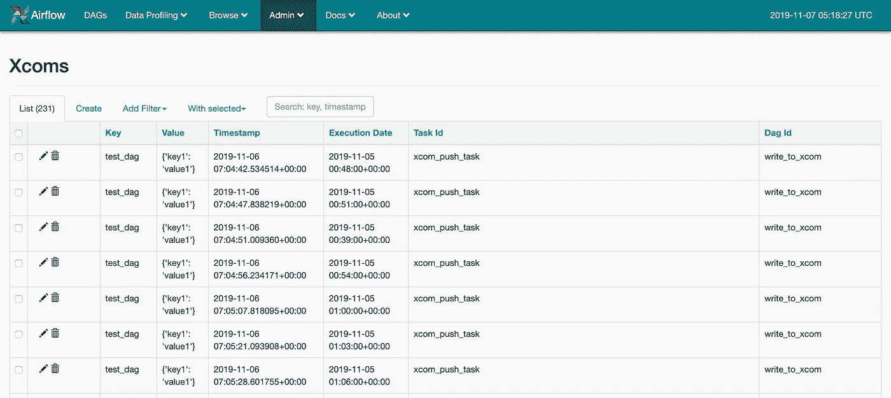
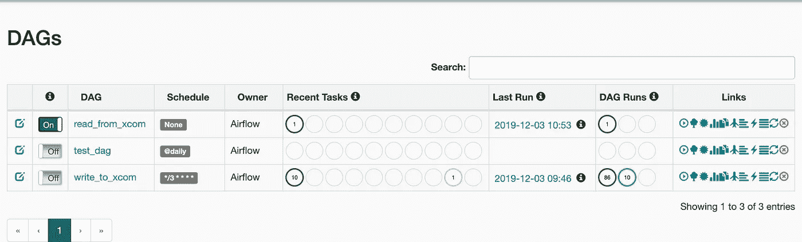

# 通风橱下的气流 XCom 推拉:来自不同 Dag 等的多个值

> 原文：<https://medium.com/analytics-vidhya/airflow-xcom-pull-and-push-under-the-hood-multiple-value-from-different-dags-and-etc-2b9b3a942299?source=collection_archive---------1----------------------->

不久前，我的一个大学问了我一个不难的问题。但是看起来，这个问题的范围在官方文件中没有足够的强调。

**问题是:**“我如何获得由另一个 DAG 的任务推送的 Xcom？”

如果你在这里，我想，你知道那是阿帕奇气流中的 Xcom。如果没有——首先阅读官方文件【https://airflow.apache.org/concepts.html? highlight = xcom # xcom



Apache Airflow UI 中的 Xcom

首先，让我们理解这是作为 Python 语言本质的 **Xcom** :它如何定义，它如何找到默认情况下只与你的 DAG 运行相关的值等等。

## 作为 Python 类的 Xcom

Xcom 是一个数据模型，它被定义为一个 SQL-alchemy 类，上面有一些额外的方法。如果你会进入 Apache Airflow sources 并且会看一看它:[https://github . com/Apache/air flow/blob/v1-10-stable/air flow/models/xcom . py # L41](https://github.com/apache/airflow/blob/v1-10-stable/airflow/models/xcom.py#L41)你会看到，我没有骗你:)

现在，离开这段代码，回到作为开发人员的 Xcom 是如何拉和推的？您通常在 Jinja 模板中的运算符中使用同名方法，如'**{ { ti . xcom _ push(…)} '**，或者在 Python 函数(可调用对象)中使用 in with Python operator 或 smth relative with**context[' ti ']。xcom_pull(key=None，task_ids='push_values')** 。这两种方式都使用相同的方法:task 的实例方法 pull 和 push。

哪里也没有魔法。让我们转到任务实例类。

# 任务实例方法

## xcom_push

我们到了:[https://github . com/Apache/air flow/blob/v1-10-stable/air flow/models/task instance . py # l 1485](https://github.com/apache/airflow/blob/v1-10-stable/airflow/models/taskinstance.py#L1485)

这是一个任务实例的方法 **xcom_push** ，您使用它来发送 Apache Airflow 后端数据库中 **Xcom** 表中的一些值。正如您在这段代码的“从源代码复制粘贴”部分所看到的:

```
XCom.set(
    key=key, 
    value=value, 
    task_id=self.task_id,
    dag_id=self.dag_id,
    execution_date=execution_date or self.execution_date)
```

它只是用 params 调用 **Xcom** 对象的 **set** 方法。你可以自己看看这个方法(Xcom 源代码的链接在上面)，这不是很重要。

关于 **execution_date** 一直存在于你的 **xcom-record** 的问题，这是导入。第二件事——您可以手动传递不同于执行日期，所以，是的，**您可以将 execution_date 作为参数提供给 xcom_push**

```
context['ti'].xcom_push(key='some_key',  value='some_value'     execution_date=) # xcom_push with sending different execution date
```

## xcom_pull

现在， **xcom_pull** 时间。让我们来看看来源:

[https://github . com/Apache/air flow/blob/v1-10-stable/air flow/models/task instance . py # l 1517](https://github.com/apache/airflow/blob/v1-10-stable/airflow/models/taskinstance.py#L1517)

如您所见，这段代码总是将 execution_date 作为参数发送给 xcom_pull，所以这就是您如何仅从当前 DAGRun 获得 **Xcoms** 的方法——因为在幕后它发送两个参数— **execution_date** 和 **dag_id。这就是你如何得到相对于你的 DAGRun 的值。**默认情况下，Xcom pull 总是搜索具有一对一执行日期和 dag_id 的记录。

## 拆分问题“我如何获得由另一个 DAG 的任务提取的 Xcom？”

因此，要回答这个问题，我们需要在 2:

1.  我如何获得与当前运行不同的**执行日期**的 **Xcoms**
2.  如何从不同的 DAG(不同的 **dag_id** )获取 **Xcoms**

然后我们混合这两个问题的答案。

## **获取以前运行的 Xcoms】**

现在来看看关于 [**xcom_pull**](https://github.com/apache/airflow/blob/master/airflow/models/taskinstance.py#L1327) 的论点:

[https://github . com/Apache/air flow/blob/v1-10-stable/air flow/models/task instance . py # l 1524](https://github.com/apache/airflow/blob/v1-10-stable/airflow/models/taskinstance.py#L1524)

你可以看到，我们可以传递给 Xcom 拉几个参数:

```
dag_id: Optional[str] = None   # answer on our question #2 include_prior_dates: bool = False  # answer on our question number #1
```

在 **dag_id arg** 全部清除的情况下，需要 1 个字符串— **dag_id** ，该字符串推动了 **Xcom** ，这是您想要获取的。

**包含先前日期**是一个标志。如果是“真”的，Airflow 将搜索具有相同执行日期的记录，但也会搜索最早的记录。因此，如果您有**execution _ date**2019–12–03 23:00:00 并设置 **include_prior_dates=True，**它可以找到以前推送的 xcom 记录，**例如，如果我们的 DAG 每小时运行一次，**在**2019–12–03 22:00:00**中以前运行。****

**什么时候会有用？如果你有一个任务，那么在你的 **DAGRun** 开始时，从上一次运行中取出 **Xcom** 来获取你想要处理的数据的左边界。**

**默认情况下，任务实例方法 **xcom_pull** 返回与请求匹配的最新值。但是有时候你想在一个值的时候得到更多，所以，你需要从 **Xcom 类中 **get_many** 方法。是的。**您可以直接使用 Xcom 类方法，只需提供必要的参数，例如:**

```
from airflow.models import XComXCom.get_many(
    execution_date=make_aware(datetime(2019, 12, 3, 0, 51, 00, 00)),
    dag_ids=["write_to_xcom"], include_prior_dates=True)
```

**你可以在 **Xcom** 类中找到同样的方法，那也许会对你有用。**

## **注意“关键”Xcom 参数**

**注意 Xcom pull 方法的 docstring 中的这个描述。**默认情况下，X** com 使用 **key = 'return_value '，**搜索记录，因此，如果您想要获得所有关键字的记录或只是删除关键字过滤器，您必须将其设置为 **key=None** ！别忘了这件事。**

```
*The default key is 'return_value', also
available as a constant XCOM_RETURN_KEY. This key is automatically
given to XComs returned by tasks (as opposed to being pushed
manually). To remove the filter, pass key=None.*
```

****代码示例****

**我准备了一个使用 dag 的代码示例，你可以在这里得到它们(一次 DAG 写，二次读，示例如何使用 xcom . get _ many):[https://github . com/xnuinside/air flow _ examples/blob/master/xcom _ diff _ DAG _ and _ multiply/xcom _ DAG . py](https://github.com/xnuinside/airflow_examples/blob/master/xcom_diff_dag_and_multiply/xcom_dag.py)**

****

**在不同的 Dag 中读写 xcom**

**如果有帮助的话，点击“鼓掌”(这真的只是了解是否有用的一种方式，也许可以停下来写这样的文章)，如果你有什么要补充的，留下评论。**