# 航空公司客户服务分析

> 原文：<https://medium.com/analytics-vidhya/airline-customer-services-analysis-7b9a84bfab86?source=collection_archive---------7----------------------->

小组项目由

Prathamesh Pradip Datar | pran jal Sondkar |王志伟| Nishit Nakrani

**简介**
我们的团队被赋予帮助东南航空公司降低客户流失率的任务。我们得到了一个通过东南航空公司进行的客户调查获得的数据集，其中包含客户乘坐的 10，282 次航班的数据。该数据集有 32 个变量，其中之一是推荐的可能性，这表明客户有多大可能向他们的朋友推荐该航空公司。它的等级为 1 到 10，10 表示可能性很大，1 表示可能性最小。这个属性是最重要的，因为越多的客户向他们的朋友推荐这家航空公司，航空公司就越有机会留住现有的客户，并赢得更多的客户。我们从研究数据集开始，以确定假设和业务问题。

> ***商务问题***
> 1。就目的地和出发城市而言，排名前 5 和最差的 5 个城市是哪些？
> 
> 2.哪种客户类型组合会导致贬低者或促进者？
> 
> 3.排名前 5 和最差的 5 条路线分别是什么？
> 
> 4.就客户满意度而言，哪家合作航空公司最好，哪家最差？
> 
> 5.就州际和州内航班而言，客户满意度的分布情况如何？

**数据清理&管理**
为了保持数据的一致性，以便支持各种描述性分析并执行数据建模技术，花一些时间来获得正确的数据是很重要的。我们通过检查数据集中是否存在 NA 列来开始原始数据清理过程。然后，我们继续创造一些新的分类变量，它们能更好地代表连续变量。此外，我们还创建了一些新的连续变量列，如 ArrivalDelayRatio 和 DepartureDelayRatio。

**探索性分析**

*A .条形图*

***NPS vs 单变量比较***

在这一部分，我们将探讨哪类客户的净推介值(NPS)较低。给定组中的总体 NPS 的计算方法是，从作为推广者的受访者百分比(得分 9-10)中减去作为贬低者的受访者百分比(得分 1-7 表示推荐的可能性)。我们通过柱状图比较给定组中不同变量的 NP。

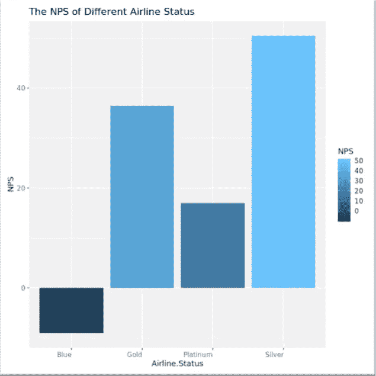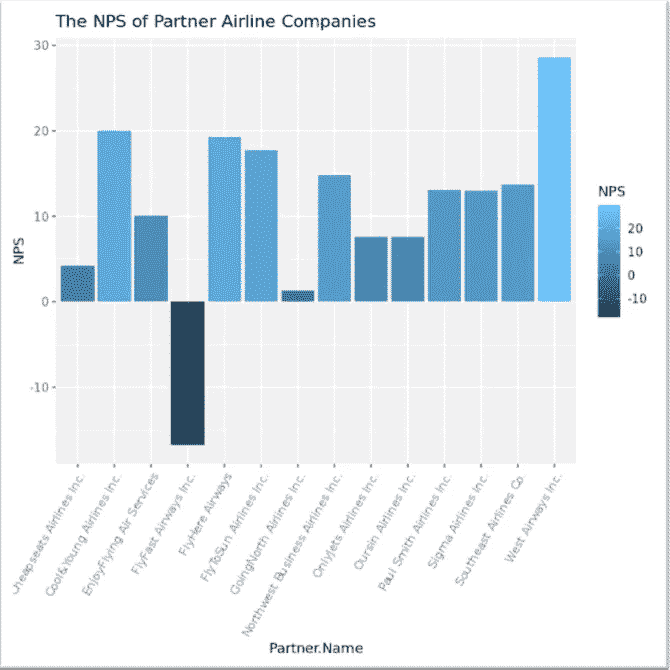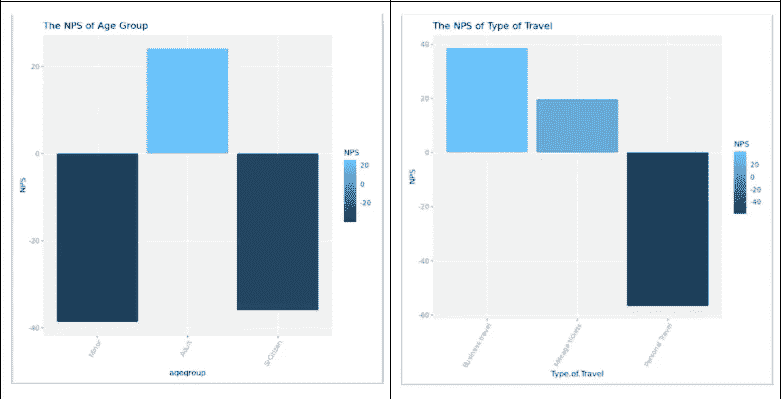

*B .文本挖掘*

在本节中，我们比较了推销者和贬低者对东南航空公司的评论中的关键词。注释存储在数据集的“自由文本”列中。

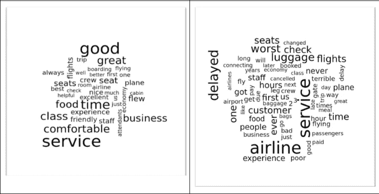

如图所示，贬低者顾客倾向于抱怨延误、服务和座位，而推销者顾客则喜欢食物和服务。虽然单词 clouds 提供了一些关于旅行者如何看待航空公司的信息，但仍然很难理解像“等级”、“客户”和“行李”这样的单词所指的是什么。因此，我们将文本标记为二元模型(两个相邻的单词)，以探索客户评论中的关键短语。为了从二元模型中删除停用词，我们首先将二元模型分成两列，分别过滤停用词列表中的词，然后将两个词重新组合在一起。然后我们为诋毁者和推崇者中出现频率最高的两个单词短语绘制两个条形图。正如我们从图表中看到的，不满意的客户抱怨诸如“腿部空间”、“行李牌”和糟糕的“客户服务”等问题，将该航空公司描述为“最差的航空公司”，并计划在未来乘坐“另一家航空公司”。

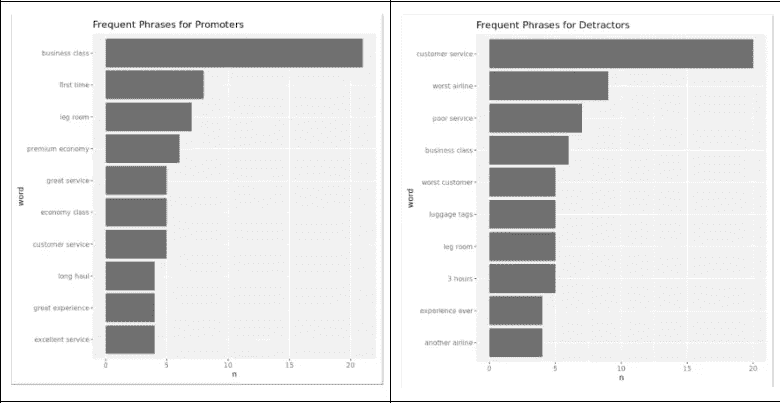

*C. INTER &州内多重条形图*

从图中可以看出，只有德克萨斯州的州际和州内路由的 NP 都为负。密苏里州和内华达州的州际路线的 NPS 为正，但州内路线的 NPS 为负。

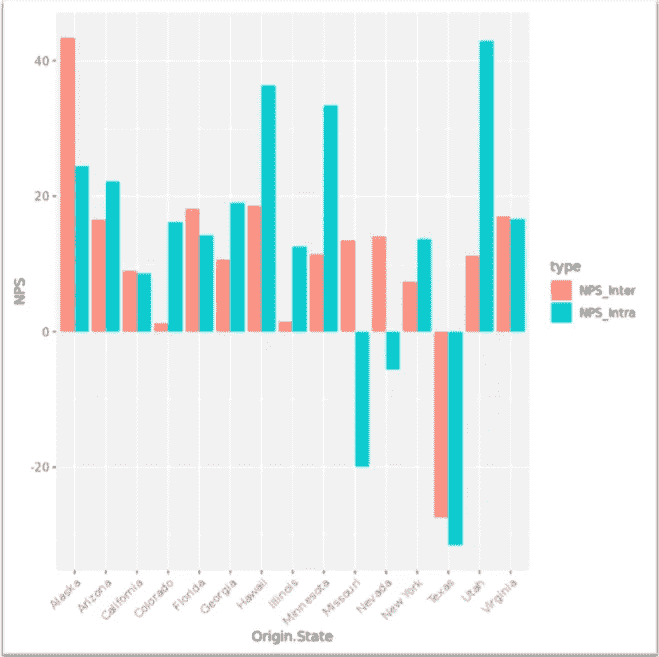

*D .地图可视化*

为了解决我们在对州进行分组时遇到的问题，我们应用了一个过滤器来过滤起飞或到达机场的航班数量。我们使用了试错过滤器，并满足于 n > 25，这意味着我们只考虑那些有超过 25 个航班离开或到达该城市的机场城市。从美国开始，我们将视觉聚焦于城市。我们想找出哪些机场在 NPS 方面表现得更好或更差。红色圆圈表示表现最差的 5 个机场城市，绿色三角形表示表现最好的 5 个机场城市。

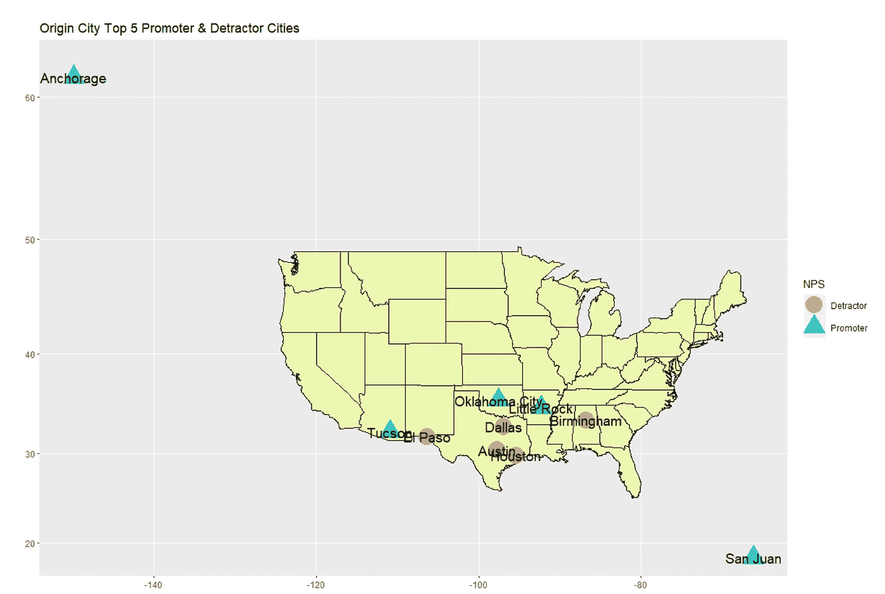

我们从这些可视化中观察到一些东西。就目的地和到达城市的 NPS 而言，图森一直是表现最佳的城市。尽管俄克拉荷马市是始发城市航班的最佳推动者之一，但它是目的地城市航班的最差诋毁者之一。伯明翰在目的地城市和抵达城市航班方面表现不佳。我们想更进一步，不仅仅局限于确定哪些城市表现好或坏。我们也想看看路线。因此，我们做了一组出发城市和目的城市，并开始从 NPS 的角度来看待它。即使在这里，我们使用过滤器也没有考虑稀疏分布的数据。绿色路由是性能最好的路由，红色路由表示性能最差的路由。

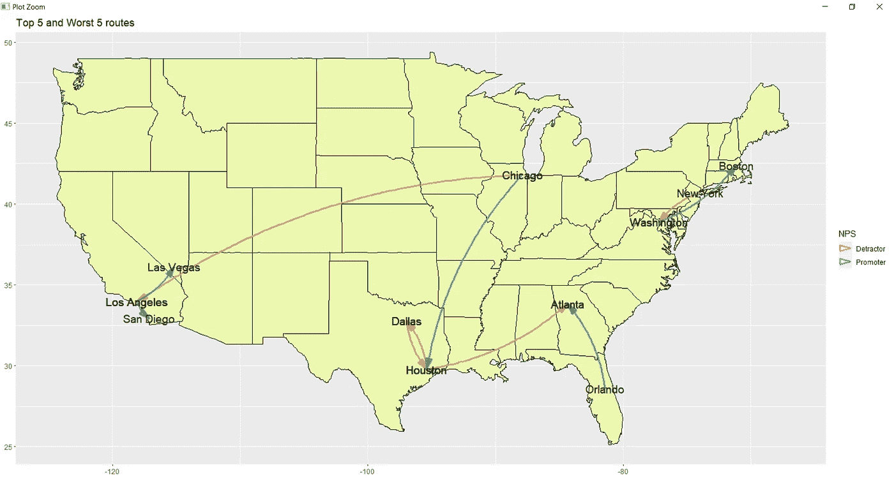

在这里，我们观察到达拉斯-休斯顿和休斯顿-达拉斯在 NPS 方面表现不佳。机场里一定有什么东西或者航班被取消了，因为人们给了很低的 NPS 分数。

**数据建模技术**

*A .线性模型*

我们使用多变量模型和双变量图，使用所有重要的连续变量来理解和预测不同组合的模式。这些图尤其有助于我们定义不同变量与推荐可能性之间的关系。对于这些模型，我们首先将所有的连续变量结合起来，得出 R 平方值 0.09。

代码:*型号< - lm(公式= Likelihood.to.recommend ~忠诚度+合计。Freq.Flyer.Accts +年龄+价格。敏感度+航班。每年+ArrivalDelayRatio+DepartureDelayRatio，data= df)汇总(模型 7)*

总之，我们从图和模型中收集了许多见解，但由于 R 平方值较低，我们不能仅基于线性模型进行分析。因此，我们继续用更多的模型来分析数据。

*B .逻辑回归模型*

这个项目的主要关注点是，根据我们掌握的数据，预测一名乘客是否是贬低者。作为分类变量的分类模型，逻辑回归适用于这种情况。在本节中，我们建立了一个逻辑回归模型来评估舱位等级、航空公司状况和旅行类型的变化如何影响乘客成为贬低者还是促进者。

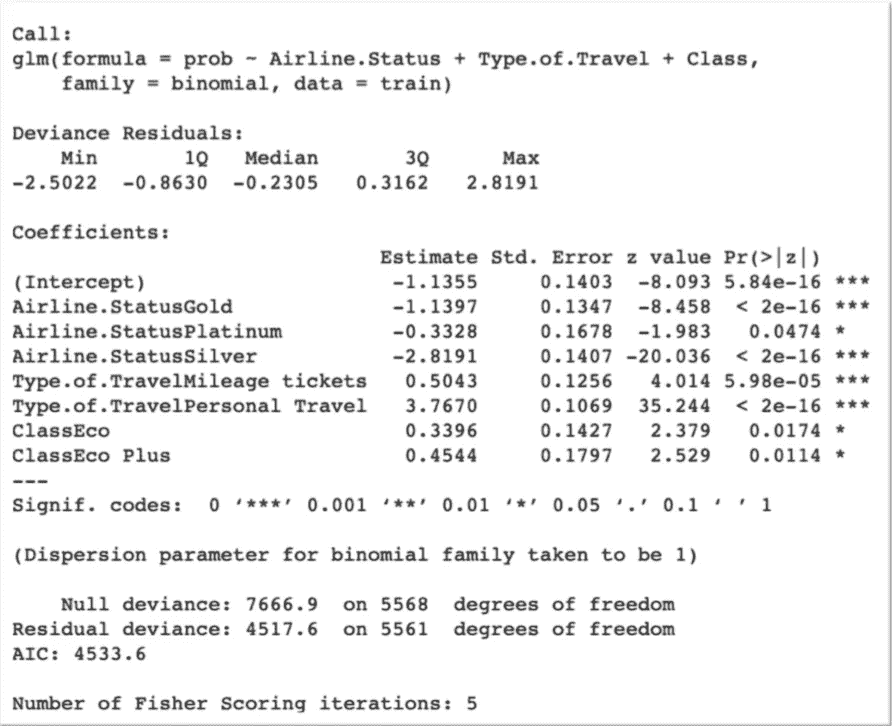

正如模型总结所表明的，航空公司状态变为银牌和金牌是使乘客不太可能成为贬低者的最重要因素，而选择个人旅行而不是商务旅行是使乘客成为贬低者的重要因素。该模型表现良好，在混淆矩阵的帮助下计算的准确度达到 0.817。

*C .支持向量机*

我们采取了更高层次的方法来决定 SVM 的变量。我们想，当乘客乘坐飞机时，与他相关联的航空公司特有的属性是什么。飞行员在飞行前有哪些选择？然后我们归结为三个属性:

*   航空公司状态
*   旅行类型
*   班级

我们决定在这些属性上运行 SVM 模型。在此之前，我们将变量转换成离散的数值变量。正如我们所知，我们使用 3 个变量来预测推动者和反对者，我们可以采用比 2D 图的正常绘图函数更好的可视化技术。因此，我们创建了一个自由流动的三维可视化，其中超平面将诋毁者与推动者分开。

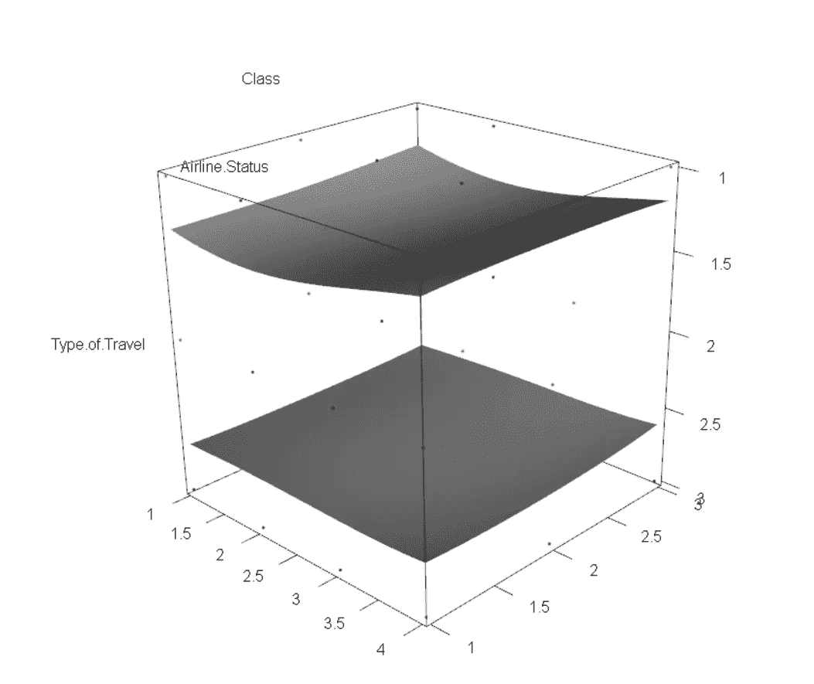

图上的蓝点代表推动者，红色代表诋毁者。这个输出在识别诽谤者到底哪里出了问题方面更有洞察力。

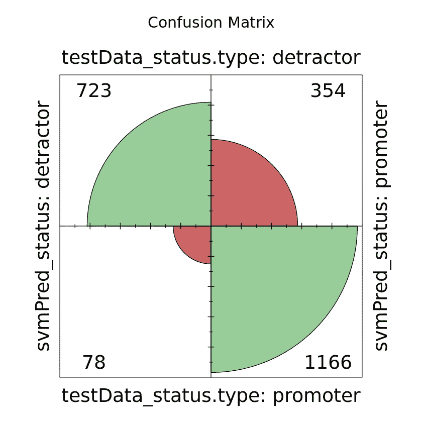

测试数据的模型准确率:81.38%

*D .关联规则挖掘*

我们使用关联规则挖掘来了解影响推荐可能性的主要因素。我们想知道什么样的属性组合会导致支持者和反对者。此外，我们将我们的发现与航空公司联系起来，以获得更深入的了解。

首先，我们创建了所有分类变量的子集。在将它转换成一个事务矩阵之后，我们对它进行了分析，得出了许多规则。产生了一万多条难以解释的规则。因此，我们只关注诋毁者，并使用先验函数生成规则。这里我们概括了导致客户成为贬低者的所有属性组合。然后利用这些信息，我们开始为支持者和反对者做不同的组合，并观察从中产生的规则。我们将参数提升保持在尽可能高的水平，并为更好的解释绘制规则。

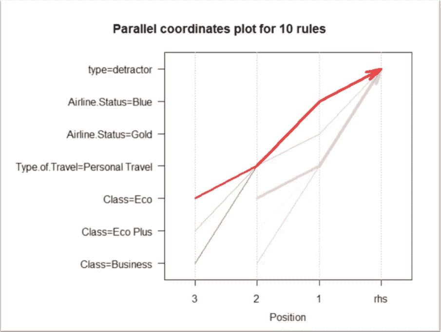

经济舱、个人旅行类型和蓝色航空公司状态的客户对他们的服务不满意

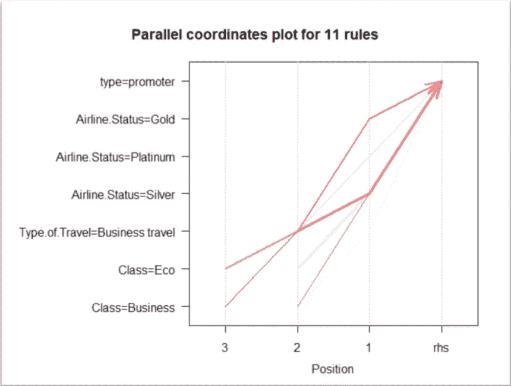

给予“推荐可能性”高分的客户来自商务舱，航空公司状态为银牌，商务旅行类型为

此外，我们还想找出表现最佳和最差的合作伙伴航空公司的问题所在。因此，我们重点关注了分别表现最差和最佳的伙伴航空公司 Flyfast Airways Inc .和西北商务航空公司。

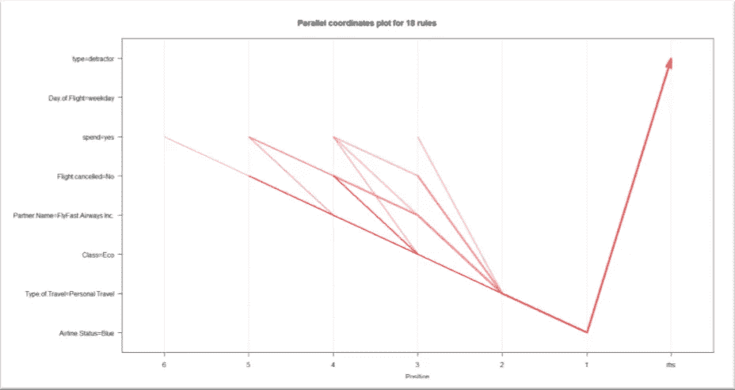

乘坐 Flyfast Airways 的经济舱、个人旅行类型和航空公司状态为蓝色的客户是贬损者。

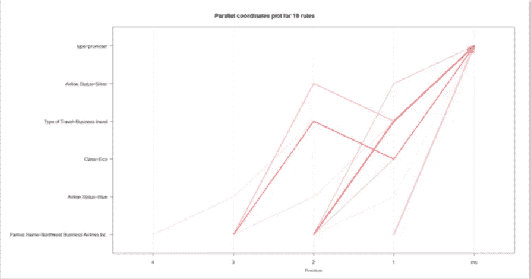

导致西北商业航空公司成为推广者的因素是航空公司地位银和旅游业务类型。

**车型对比**

在尝试了所有可能变量的各种模型后，我们发现“等级”、“航空公司地位”和“旅行类型”是客户类型(贬低者或促进者)的最突出的预测因素。虽然逻辑回归和 SVM 在预测批评者方面都达到了相对较高的准确度，但是很难理解模型中的每个变量是如何影响最终结果的。相比之下，通过呈现乘客在何种特定情况下(蓝色航空公司状态、个人旅行和经济舱)最有可能成为批评者，关联规则挖掘为我们提供了清晰而关键的业务洞察力。因此，我们认为关联规则挖掘是解决这一商业问题的最佳选择。

**可操作的见解**

1.  改善客户服务，如行李处理和腿部空间。
2.  致力于为女性、未成年人和老年人提供设施和服务。
3.  改善私人旅行、蓝天航空公司或经济舱乘客的设施和服务。
4.  进一步调查德克萨斯州，尤其是达拉斯的航空公司情况。
5.  与 FlyFast Airlines Inc .合作调查航线。

**确认**

我们感谢 Jeffrey Saltz 教授(锡拉丘兹大学信息研究学院)为我们提供了必要的指导，以加强和引导我们成功完成项目的方法。