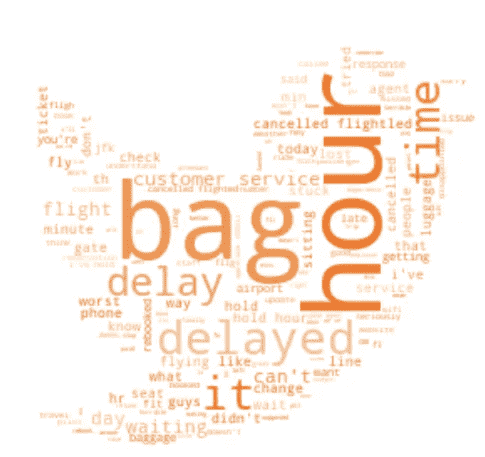

# Twitter 上的航空公司——使用 NLP 了解客户投诉

> 原文：<https://medium.com/analytics-vidhya/airlines-on-twitter-understanding-customer-complaints-with-nlp-81278f2b68dc?source=collection_archive---------2----------------------->

作者:詹妮弗·西乌、艾米·李、马修·洛克、安尼施·卡拉加、马诺哈尔·阿卢


在这个项目中，我们旨在了解社交媒体上的客户投诉，特别是 Twitter 上关于美国主要航空公司的投诉。要了解更多关于我们的项目和我们用来实现它的代码，请查看我们的 Github 库[这里](https://github.com/jsiwu94/airline_tweet_nlp)。

# **目标**

*客户情绪:*识别积极和消极的意见、情绪和评价。

*识别负面话题:*引出人们在谈论他们与航空公司的经历时可能会提到的负面话题。

*获得可操作的见解:*这些见解可能会被航空公司用于规划和执行客户服务计划、媒体关系等。

# **数据集**

数据可在 [Kaggle](https://www.kaggle.com/crowdflower/twitter-airline-sentiment) 上获得。twitter 数据从 2015 年 2 月开始收集，历时两周，包含超过 14K 条推文及其对美国 6 家主要航空公司的看法(正面、中立或负面)。

# **数据分析**

在开始建模之前，我们做了一些初步的数据分析，以了解数据中的一些模式或趋势。

**推特情绪分布&按航空公司统计的推文:**推文数据有 63%的负面，16%的正面和 21%的中性推文。联合航空公司的#tweets 最多，其次是全美航空公司、美国航空公司和西南航空公司。


**按地点划分的推文情绪:**推文集中在东海岸，因为那里是最繁忙的国际机场所在地。


**橙色**表示**负面情绪**，**深蓝色**表示**正面情绪**，**浅蓝色**表示**中性情绪**。

**按航空公司划分的 Twitter 情绪:**美国航空、联合航空和全美航空有> 60%的负面推文，有大量负面转发。


**情绪之间的字数分布:**根据下面的密度曲线和箱线图，我们可以看到负面推文通常比其他情绪更冗长。我们的单因素方差分析测试得出结论，这些情绪之间的字数确实存在差异(p < 0.01)。


**负面推文热门词:**负面推文的词云表示延迟、hold、bag、hour、call 等高频词。



# **接近**

**方法 1 —情绪分析**


*(**)表示每个算法中的最佳模型*

***法***

根据上面显示的模型结果总结，我们选择了带有 TFIDF 的**逻辑回归作为预测情绪的最佳模型。下面，我们将讨论这种模型的方法。**

由于我们只对推文的内容和每条推文的情绪水平感兴趣，所以我们提取了相应的两列，分别是‘text’和‘airline _ perspective’。下面的截图显示了 5 个随机的文本样本及其情感水平。


1.文本处理

首先，我们使用正则表达式清除文本中的标签、符号、提及、URL、数字和标点符号。在应用前面的步骤后，文本有一些额外的空白，稍后标记器可以将其拆分为单词。也就是说，我们删除了那些多余的空间。此外，我们确保删除所有单个字符，例如，“it's”可以转换为“it s”，然后我们需要删除“s ”,因为它没有任何意义。对于词干提取，我们注意到，虽然 Porter 是最常用的词干提取器，也是最温和的词干提取器之一，但有许多单词我们在提取词干后错过了它们的原意，最终降低了准确率。因此，我们决定不为文本清理部分添加词干。

此外，我们设置了停用词，排除了一些表示否定的词，如“不”、“不”，并更新了一些对预测情感没有意义的词。

此外，为了将文本分割成单词，我们做了**标记化**，下面给出了例子。

```
def clean_text(txt):

    """
    removing all hashtags , punctuations, stop_words  and links, also stemming words 
    """
    txt = txt.lower()
    def remove_stopwords(txt):
        return [t for t in txt if t not in stop]
    #txt = re.sub(r"(?<=\w)nt", "not",txt) #change don't to do not cna't to cannot 
    txt = re.sub(r"(@\S+)", "", txt)  # remove hashtags
    txt = re.sub(r'\W', ' ', str(txt)) # remove all special characters including apastrophie 
    txt = txt.translate(str.maketrans('', '', string.punctuation)) # remove punctuations 
    txt = re.sub(r'\s+[a-zA-Z]\s+', ' ', txt)   # remove all single characters (it's -> it s then we need to remove s)
    txt = re.sub(r'\s+', ' ', txt, flags=re.I) # Substituting multiple spaces with single space
    txt = re.sub(r"(http\S+|http)", "", txt) # remove links 
#    txt = ' '.join([PorterStemmer().stem(word=word) for word in txt.split(" ") if word not in stop_words ]) # stem & remove stop words
    txt = ''.join([i for i in txt if not i.isdigit()]).strip() # remove digits ()
    return txtdf['cleaned_text'] = df['text'].apply(clean_text)
re_tok = re.compile(f'([{string.punctuation}“”¨«»®´·º½¾¿¡§£₤‘’])')def tokenize(s): 
    return re_tok.sub(r' \1 ', s).split()df['tokenized'] = df['cleaned_text'].apply(lambda row: tokenize(row))
stop = set(stopwords.words('english'))
stop.update(['amp', 'rt', 'cc'])
stop = stop - set(['no', 'not'])def remove_stopwords(row):
    return [t for t in row if t not in stop]
df['tokenized'] = df['tokenized'].apply(lambda row: remove_stopwords(row)) df[['text', 'tokenized']].head()
```


2.文本矢量化

然后，我们使用 CountVectorizer 和 TFIDF 进行文本矢量化，将文档转换为向量。

1.  TFIDF:对于不使用网格搜索选择的参数，我们使用最大特征 2500，并忽略文档频率严格高于 0.8 且低于 7 的术语。对于求解器，我们使用牛顿-cg，因为它对未缩放的数据集是鲁棒的，并且对具有 l2 惩罚的多项式(也称为岭)执行得更好。Ridge 包括模型中的所有变量，尽管有些变量被缩小了，但它的计算量比 lasso 要少。我们选择 10 作为正则化强度的倒数。
2.  count vectorizer:hyper 参数在不使用网格搜索的情况下，我们忽略了文档频率严格低于 5 且 n 个 gram 范围内有 unigram 和 bigram 的术语。
3.  CV Gridsearch:然后我们尝试了 Gridsearch 推荐的超级参数，如下所示。
    - **C** : 3
    - **惩罚**:‘L2’
    -**max _ df**:0.5(*忽略出现在超过 50%的文档中的术语* )
    - **min_df** : 1(忽略出现在少于 1 个文档中的术语)
    - **ngram_range** : (1，2)


然而，结果表明精度低于前两个模型。在查看参数时，我们注意到 gridsearch 推荐的 hyper 参数在删除术语方面更加严格。例如，TFIDF 忽略出现在少于 7 个文档中的术语，而 gridsearch 建议忽略出现在少于 1 个文档中的术语(min_df)。

***结果***

在这 3 个模型中，使用 TFIDF 的 logistic 回归的检验准确率最高，为 80.3%。


使用逻辑回归分类器，我们能够绘制出最重要的系数，这些系数被认为是对每个情绪水平进行预测的。正如你在下面看到的，对于负面的，“最坏的”，“小时”，“荒谬的”或专门与小时相关的词似乎对预测有很大的贡献。同样，对于积极的情绪，“太好了”、“太棒了”、“谢谢”和与感激相关的词语对情绪预测的贡献很大。


***学习&挑战***

> 我们认为 TFIDF 性能优于 CountVectorizer 的原因之一是，它可以更有效地捕捉频繁但无意义的单词，因为它可以缩小诸如" **LOL"** 或" **ASAP"** 之类的单词，同时放大与客户体验相关的独特单词。

在 Twitter 上执行情感分析的挑战之一是，由于每个 Twitter 用户对他们的体验有不同的说法，因此有许多俚语、新词、首字母缩写词、缩写词、诅咒或简单的拼写错误的词很难用当前的文本清理包或正则表达式捕获，特别是当数据很大时。下一步，我们想寻找更好的文本清理包，可以减少上述问题。

**方法 2 —使用 LDA 进行主题建模**

通过方法 1，我们能够以相对较高的准确度识别推文的情绪。为了进一步分析，我们想了解人们在负面推文中关注的一般话题或类别。用于主题建模的最流行和最广泛采用的算法之一是 LDA(潜在狄利克雷分配)。

> **潜在狄利克雷分配(LDA)**—LDA 的工作方式是，它假设每个文档都由各种主题的混合组成，每个主题都由各种单词的混合组成。它建立了基于狄利克雷分布的每文档主题模型和每主题单词模型。下图有助于解释算法流程。


[https://towards data science . com/light-on-math-machine-learning-intuitive-guide-to-latent-Dirichlet-allocation-437 c 81220158](https://towardsdatascience.com/light-on-math-machine-learning-intuitive-guide-to-latent-dirichlet-allocation-437c81220158)

使用我们的数据，我们可以建立一个字典来训练 ld a 模型。然后， **LDA** **模型**将输出每个主题中的热门词汇，然后分析师可以将它们归类到主题名称中(是的，它确实需要手动部分，但它仍然工作得很好)。

***方法***

1.文本预处理

LDA 的第一步也是最重要的一步是数据清理，或者更具体地说，**停用词移除**。这也被认为是 LDA 建模的主要缺点，因为我们需要清理和挑剔许多没有真正表明主题的单词。例如，在这种情况下，诸如“行李”和“延误”等词表示不同的主题或投诉类别。然而，像“完全”或“芝加哥”这样的词就不是了。

我们在文本预处理中采取的步骤如下(如下面的代码所示):

1.  Regex : *删除航班号、表情符号、标签、推特用户名、文本标点和符号*
2.  Html 解析器+小写
3.  停用字词扩展(> 500 字)，包括:*美国城市名称、航空公司名称、日期、时间、星期几*
4.  空间标记:*去掉形容词和连词*
5.  斯特梅尔+ Lemmatizer

```
cities = pd.read_csv("[https://raw.githubusercontent.com/grammakov/USA-cities-and-states/master/us_cities_states_counties.csv](https://raw.githubusercontent.com/grammakov/USA-cities-and-states/master/us_cities_states_counties.csv)",sep="|")
cities = cities.iloc[:,:2]
cities.drop_duplicates(keep='first',inplace=True)#preprocess data
def preprocess(text):
    stopwords = set(STOPWORDS)
    stopwords.update(exclude_word_list) 
#this list was saved to csv and made available on our Github repo#stopwords.update([i for i in ts])
    # stopwords.update([str(i).lower() for i in cities.City]) #removing City names in US
    r = re.compile(r'(?<=\@)(\w+)') #remove words after tags --> usually twitter account
    ra = re.compile(r'(?<=\#)(\w+)') #remove words after hashtags
    ro = re.compile(r'(flt\d*)') #remove words after flight number
    names = r.findall(text.lower())
    hashtag = ra.findall(text.lower())
    flight = ro.findall(text.lower())
    lmtzr = WordNetLemmatizer()
    def stem_tokens(tokens, lemmatize):
        lemmatized = []
        for item in tokens:
            lemmatized.append(lmtzr.lemmatize(item,'v'))
        return lemmatized
    def deEmojify(inputString):
        return inputString.encode('ascii', 'ignore').decode('ascii')

    doc = nlp(text)
    text = deEmojify(text)
    soup = BeautifulSoup(text)
    text = soup.get_text()
    text = "".join([ch.lower() for ch in text if ch not in string.punctuation])
    tokens = nltk.word_tokenize(text)
    tokens = [ch for ch in tokens if len(ch)>4] #remove words with character length below 2
    tokens = [ch for ch in tokens if len(ch)<=15] #remove words with character length above 15 
    lemm = stem_tokens(tokens, lmtzr)
    lemstop = [i for i in lemm if i not in stopwords]
    lemstopcl = [i for i in lemstop if i not in names]
    lemstopcl = [i for i in lemstopcl if i not in hashtag]
    lemstopcl = [i for i in lemstopcl if i not in flight]
    lemstopcl = [i for i in lemstopcl if not i.isdigit()]
    lemstopcl1 = [i for i in lemstopcl if i not in t]
    return lemstopcl
```

2.选择主题的数量(K)

一旦我们将单词预处理成标记，我们就可以创建一个字典(或单词包)，其中包含一个单词在训练数据集中出现的次数。使用这个单词包，我们可以训练我们的 LDA 模型。

我们还需要确定 LDA 的主题数量(K )(类似于确定 k-means 聚类的 K)。尽管有许多方法来确定主题的最佳数量，但最常用的方法是使用困惑分数和连贯分数。这个想法是，困惑分数越低，连贯性分数越高，那么“K”就越好。([点击这里，如果你想了解更多关于连贯性或困惑分数](http://qpleple.com/topic-coherence-to-evaluate-topic-models/)

根据下图，我们确定该数据的最佳“K”为 8。因此，我们用它来训练我们的 LDA 模型。

```
def compute_coherence_values(dictionary, corpus, texts, start, stop):
    """
    Compute c_v coherence for various number of topics
    """
    coherence_values = []
    model_list = []
    for num_topics in range(start, stop):
        model = gensim.models.ldamodel.LdaModel(corpus=corpus, 
                                              num_topics=num_topics,
                                              id2word=id2word,
                                              random_state=90,
                                              alpha='auto',
                                              eta='auto',
                                              per_word_topics=True)
        model_list.append(model)
        coherencemodel = CoherenceModel(model=model, texts=texts,
                             dictionary=dictionary, coherence='c_v')
        coherence_values.append(coherencemodel.get_coherence()) return model_list, coherence_valuesstart=4
stop=9
model_list, coherence_values = compute_coherence_values(dictionary=id2word, 
                                    corpus=corpus,
                                    texts=processed_docs,
                                    start=start, stop=stop)
```


3.训练 LDA 模型

使用 8 的 k，我们得到了-9.34 的困惑分数和 0.60 的一致性分数，考虑到有超过 5 个主题，这是相当不错的。

```
%%time
# Create Dictionary
id2word = gensim.corpora.Dictionary(processed_docs)# Create Corpus: Term Document Frequency
corpus = [id2word.doc2bow(text) for text in processed_docs]# Build LDA model
lda_model1 = gensim.models.ldamodel.LdaModel(corpus=corpus,
                                           id2word=id2word,
                                           num_topics=8, 
                                           random_state=123,
                                           update_every=1,
                                           chunksize=10,
                                           passes=10,
                                           alpha='auto',
                                           eta='auto',
                                           iterations=125,
                                           per_word_topics=True)
doc_lda = lda_model1[corpus]
```

4.LDA 结果

我们现在可以打印每个主题中的顶部单词来标识主题名称。

```
from pprint import pprint
pprint(lda_model4.print_topics())
```


为了更好地可视化，我们使用 gensim 包中的 **pyLDAvis，它将我们的 LDA 模型的交互结果输出到一个 html 中，如下所示，其中每个气泡代表一个主题。理想的 LDA 模型是所有的气泡都相互分离的模型。在这种情况下，我们的模型非常好，因为大气泡(由文档中的更多令牌组成的气泡)彼此相距很远，只有小气泡彼此如此接近。**

当我们点击每个气泡时，我们可以看到它们包含的标记的百分比，以及其中的单词及其相应的概率得分(即该单词属于该主题的概率)。

```
import pyLDAvis
from pyLDAvis import gensimpyLDAvis.enable_notebook()
vis = pyLDAvis.gensim.prepare(lda_model4, corpus, id2word,sort_topics=False)pyLDAvis.save_html(vis, ‘ldaviz.html’) #run this to save your vis as html file
vis
```


基于以上单词分布，我们决定将主题命名如下:

*   主题 1 →延迟和客户服务
*   话题 2 →行李问题
*   话题 3 →改期和退款
*   主题 4 →电话和在线预订
*   主题 5 →预订问题
*   主题 6 →座位偏好
*   主题 7 →额外费用
*   主题 8 →客户体验

为了使结果更具交互性，我们还使用 jupyter notebook、ipywidgets 和 voila 在本地主机站点中创建了一个简短的演示。以下是片段。


当我们将 LDA 模型结果与业务问题联系起来时，我们发现最负面的推文主题是关于延误、客户体验、退款/重新安排和行李。类似于我们在 wordcloud 上的初步发现。


此外，每个航空公司的负面推文中似乎有不同的主题分布。以美联航 vs 美航为例。与美国航空公司相比，联合航空公司似乎有更多关于行李问题的投诉。


***学习&挑战***

总的来说，LDA 模型是用于主题分析的强大且易于使用的算法，因为实现时间相对较快。然而，它仍然需要并依赖于人工工作，例如彻底移除停用词并基于顶词正确标记主题。也就是说，它需要高度关注细节，并需要一个主题专家来确定包含/删除哪些单词。

# **业务影响和建议**

航空业是一个非常传统的行业，一些航空公司的一般商业惯例可以追溯到其成立之初(联合航空公司成立于 1931 年)。航空公司并不总是试图衡量顾客的反馈和情绪。J.D. Power 在 1968 年启动了一系列调查来收集消费者的反馈，过了好几年航空公司才有了可靠的信息来源来衡量消费者的反馈信息。

为了评估我们通过分析与我们范围内的六家航空公司相关的推文的情绪和主题而得出的结论的有效性，我们将我们的一些结论与来自美国交通部(DOT)空中交通消费者报告(ATCR)的事实进行了比较。这是一份每月发布的报告，包含关于延误、服务投诉和其他航空公司相关数据点的各种统计数据，这些数据点比较了美国各种飞行航空公司。统计数据偶尔也会被汇总，以生成季度和年度数据。

> **几个有趣的事实:**
> * 2015 年全年投诉量增长 29.8%
> *所有美国国内航班的预定取消率为 1.5%
> *联合航空公司在 17 家航空公司中的排名:
> *处理不当的行李最少:第 11 位
> *准点率:第 15 位
> *取消最少:第 16 位
> *每位乘客的投诉最少:第 17 位

如上图所示，2015 年的投诉量有所增加，并且随着行业的发展，投诉量还会继续增加。此外，取消率可能听起来很小，只有 1.5%。但考虑到一个每年有 950 万次国内航班的市场，这意味着全年大约有 142，500 次航班的乘客受到影响。航空公司需要一种比月度/季度/年度报告更实时地了解消费者情绪的方法。如果航空公司希望真正做到敏捷，并在客户出现需求时满足他们的需求，这种频率是不够的。

一些关于联合航空公司表现的有趣排名是，他们在准点表现，最少取消，最少投诉和最少误处理行李方面接近美国国内航空公司的最后一名。从我们的推文数据中，我们看到消费者也对联合航空公司和这些相同的类别抱怨最多。在高水平上，这表明在 twitter 情绪和主题分析结果与用 ATCR 汇编的数据之间的关系中存在一些相关性，但不一定是因果关系。

> (此外，2015 年乘客数量最多的航空公司是美国航空公司，其负面推文比联合航空公司少……)

如果航空公司还没有采取社交媒体和情感/话题分析策略，他们肯定应该这样做。

使用我们 2015 年的 Twitter 数据，我们观察到，我们的分析见解和美国 DOT 获得的定量见解之间确实存在一些可观察到的关系，也可能与绩效有关。一个简单的实现方法是使用一个实时引擎来标记与航空公司相关的推文，用 RNN 之类的东西标记该推文的情绪，然后分析负面推文的主题，转发给特定的客户团队(即 Boston Logan 的客户服务、LAX 的餐饮服务，甚至是客舱装饰团队)，以计划适当的业务行动。


社交媒体平台也在加强其作为人们新闻、社交互动、电子商务等的主要来源的地位。航空公司应该利用这一点。进行调查是吸引客户和收集反馈的一种不错的方法，但航空公司应该转移到人们已经表达他们的意见和担忧的空间，并利用这些 280 个字符的短信立即制定改进计划。

# **参考文献**

[https://www . ka ggle . com/crowd flower/Twitter-airline-sensation](https://www.kaggle.com/crowdflower/twitter-airline-sentiment)

[http://qp ple . com/topic-coherence-to-evaluate-topic-models/](http://qpleple.com/topic-coherence-to-evaluate-topic-models/)

[https://www . transportation . gov/personals/aviation-consumer-protection/air-travel-consumer-reports](https://www.transportation.gov/individuals/aviation-consumer-protection/air-travel-consumer-reports)

[https://medium . com/nano nets/topic-modeling-with-LSA-psla-LDA-and-LDA 2 vec-555 ff 65 b 0b 05](/nanonets/topic-modeling-with-lsa-psla-lda-and-lda2vec-555ff65b0b05)

[http://blog . echen . me/2012/03/20/具有非参数贝叶斯和狄利克雷过程的无限混合模型/](http://blog.echen.me/2012/03/20/infinite-mixture-models-with-nonparametric-bayes-and-the-dirichlet-process/)

[https://slidesgo.com/](https://slidesgo.com/)