# Akira 的 ML 新闻# 2020 年 9 月

> 原文：<https://medium.com/analytics-vidhya/akiras-ml-news-september-2020-80ed65bd7ea4?source=collection_archive---------17----------------------->

以下是我在 2020 年 9 月读到的一些我觉得特别有趣的论文和文章。

1.  机器学习论文
2.  技术文章
3.  机器学习用例的例子
4.  其他主题

— — — — — — — — — — — — — — — — — — — — — — — — — — — — — —

# 1.机器学习论文

— —

# 从视频中删除一个人

*流边引导视频完成* [https://arxiv.org/abs/2009.01835](https://arxiv.org/abs/2009.01835)

这是一个使用 flow 的视频补全的研究。这种方法的关键点是:1)通过检测缺失的边缘并连接它们来完成流，2)通过使用稍远的帧来获得视频的不可见部分，3)通过使用梯度来防止接缝。他们的方法在数量上优于以前的研究，甚至可以从视频中剔除人。

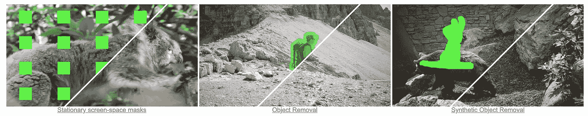

# 为语言生成解码大脑活动

*Brain2Word:解码语言生成的大脑活动*[https://arxiv.org/abs/2009.04765](https://arxiv.org/abs/2009.04765)
一项理解从 fMRI 图像中看到的字母的研究。使用 fMRI 图像作为输入，从 180 个候选单词中生成五个领先候选单词的手套嵌入向量。然后他们在 GPT-2 中用 50257 个单词做同样的事情，并比较两者作为语言模型求解。与现有方法相比，精确度大大提高。

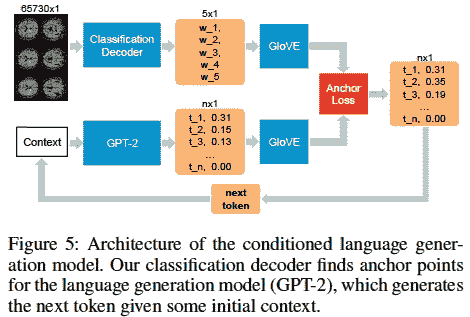

# 用语言建模进行定理证明

*自动定理证明的生成语言建模* [https://arxiv.org/abs/2009.03393](https://arxiv.org/abs/2009.03393)

他们提出了 GPT-f，它使用转换器自动证明定理。定理的证明定义为[目标，(定理)，证明步骤，…]等语言模型。与现有的定理证明相比，他们成功地缩短了 23 个定理的证明。

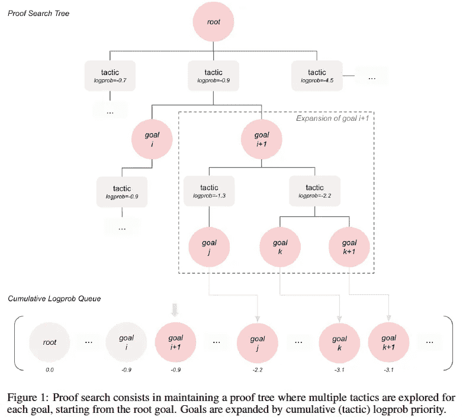

# 用 AlphaZero 平衡游戏

*用 AlphaZero 评估游戏平衡:探索国际象棋中的替代规则集*[https://arxiv.org/abs/2009.04374](https://arxiv.org/abs/2009.04374)

这是一个使用 AlphaZero 评估游戏平衡性的尝试。为了让 AlphaZero 在模仿国际象棋的游戏中进行训练，对规则做了一些小的改动，比如不要阉割，我们可以看看有经验的玩家是如何看待这个游戏的。在国际象棋的历史上，规则被反复修改，最终确定在现行规则上。他们说，可以用 AlphaZero 制作其他游戏来模拟这种事情。

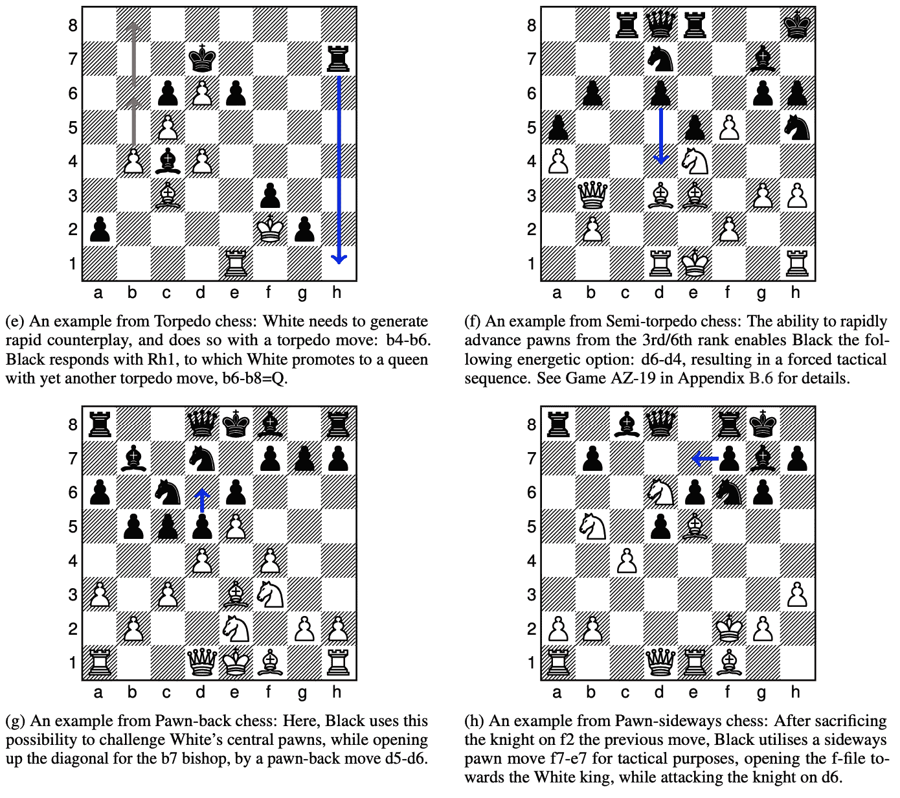

# 重新定时视频中的人物

*分层神经渲染对视频中的人进行重定时* [https://arxiv.org/abs/2009.07833](https://arxiv.org/abs/2009.07833)

此模式允许您更改视频中人物的时间(开始时间和移动速度)。首先，将每个人(包括遮挡)从背景中分离出来。然后把背景和每个人的信息组合成一个特征，组合在一起生成。他们能够改变水花飞溅的时间和伴随人们运动的其他特征。

# 使用小波变换减小 BigGAN 的大小

没什么大不了的:在小型计算机预算上生成高保真图像
[https://arxiv.org/abs/2009.04433](https://arxiv.org/abs/2009.04433)

这是一项研究，通过仅使用小波变换(WT)从低频信息中再现图像，使用少量计算资源使用 GANs 生成高保真图像。具体来说，丢失的高频信息由神经网络重构，并应用逆小波变换(iWT)。虽然生成的图像质量略有下降，但他们成功地将计算资源从 TPUx256 减少到 GPUx4

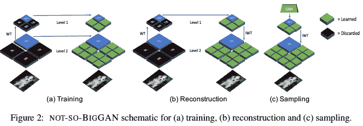

# 激活功能，以适当地确定它是否处于活动状态

*激活与否:学习定制激活*
[https://arxiv.org/abs/2009.04759](https://arxiv.org/abs/2009.04759)

他们统一地对待 ReLU 和 Swish，提出激活函数 ACtivationOrNot (ACON)作为它的一般形式。激活函数由多个可学习的参数组成，它们可以自由改变是否激活。他们证实，这种方法提高了对象检测和图像检索的准确性。

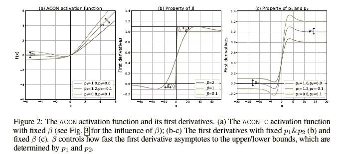

# 可以随意生成稀有天气数据的 GANs

*ExGAN:对抗性生成的极端样本*
[https://arxiv.org/abs/2009.08454](https://arxiv.org/abs/2009.08454)

虽然 gan 通常只训练和生成典型数据，但 ExGANs 可以以受控方式生成低概率数据；仅将 GAN 生成的样本的极值添加到数据集中以偏置数据，然后使用它们根据极值来训练 GAN。他们确认他们可以成功地在天气数据中生成数据。

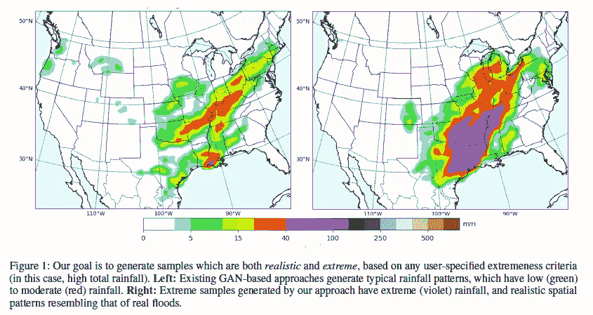

# 通过将过滤器分成块来修剪，实现准确性和速度

*yo Mobile:通过压缩编译协同设计在移动设备上进行实时目标检测* [https://arxiv.org/abs/2009.05697](https://arxiv.org/abs/2009.05697)

为了同时实现移动设备的高精度和低延迟，他们提出了一种分块剪枝方法，该方法将每一层分成多个块，并在每个块中学习不同的剪枝模式。他们成功地提高了速度，同时保持了准确性。GPU 用于计算卷积层，而 CPU 用于计算其他层，以进一步提高性能。

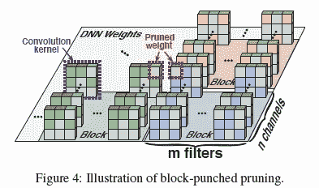

# 通过了解每个单元的作用来控制生成的图像

*理解深层神经网络中个体单元的作用* [https://arxiv.org/abs/2009.05041](https://arxiv.org/abs/2009.05041)

研究解释 DNNs 中每个单元的作用。他们发现，有些单位学习诸如“树”这样的概念时，并没有明确地把它们交给 DNN。在 GAN 中，他们成功地从图像中减少了树木，并通过操纵控制每个概念的单元将门附加到建筑物上。

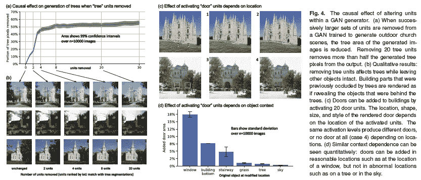

# 变形金刚调查

*高效变形金刚:一项调查* [https://arxiv.org/abs/2009.06732](https://arxiv.org/abs/2009.06732)

一篇关于 Transformer 模型改进系统的调查论文，该模型近年来迅速传播，特别是在自然语言处理方面。从记忆、注意的使用模式等方面进行了总结。它从图表和讨论中很好地概述了论文的流程。

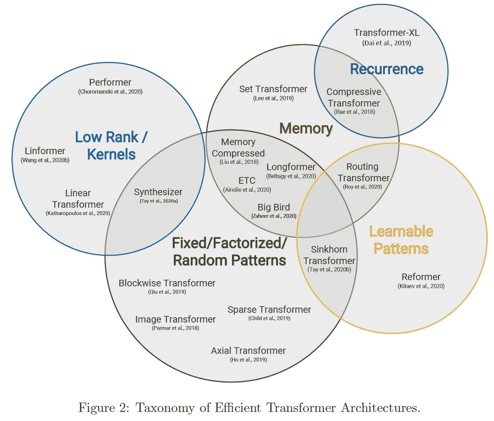

# 密度**泛函**理论和机器学习

*作为正则项的 Kohn-Sham 方程:将先验知识构建到机器学习物理学中* [https://arxiv.org/abs/2009.08551](https://t.co/e1JWpHF1ey?amp=1)

在使用具有神经网络的密度泛函理论的近似物理模拟中，可以通过将 Kohn-Sham 方程视为可微分模型来对 ML 施加物理约束。这大大提高了 XC 项计算的准确性

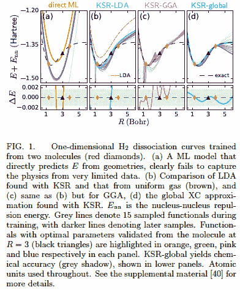

— — — — — — — — — — — — — — — — — — — — — — — — — — — — — —

# 2.技术文章

— — — —

# 卡格尔创始人安东尼·戈德布卢姆访谈

对 Kaggle 创始人安东尼·戈德布卢姆(Anthony Goldbloom)关于 Kaggle 竞争的采访证明了随机森林的有用性，GBDT 在学术界并不那么受欢迎，但它对结构化数据很有效，Kaggle 笔记本和 Kaggle 数据集的引入创造了一个环境，许多人可以自由表达他们的见解。

 [## 如何与安东尼·戈德布卢姆一起赢得卡格尔比赛

### 讨论的主题:0:00 先睹为快 0:20 简介 0:45 ka ggle 比赛中使用的方法 vs 主流学院 2:30…

www.wandb.com](https://www.wandb.com/podcast/anthony-goldbloom) 

# 新冠肺炎时间序列预测模型

众所周知，时间序列预测模型(如需求预测模型)会因 COVID19 而失败，但 Reddit 上有一场关于如何处理它的辩论。有一些观点认为，新冠肺炎被视为一个有很大影响的季节性因素，因为趋势相当于季节性下降，等等。