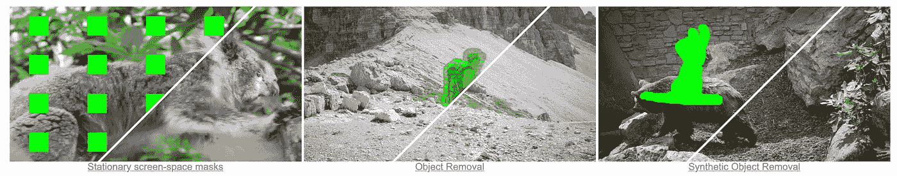
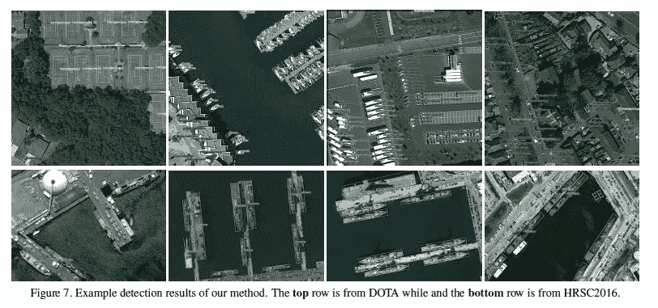
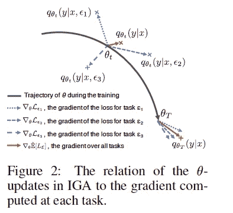
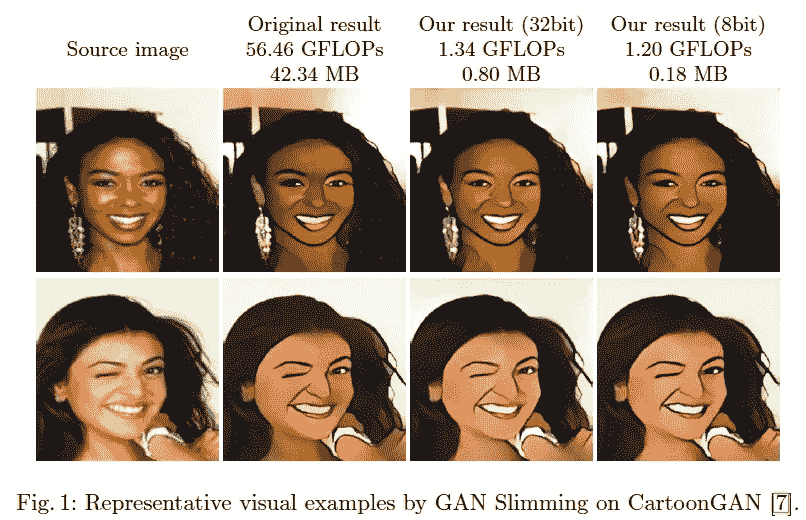
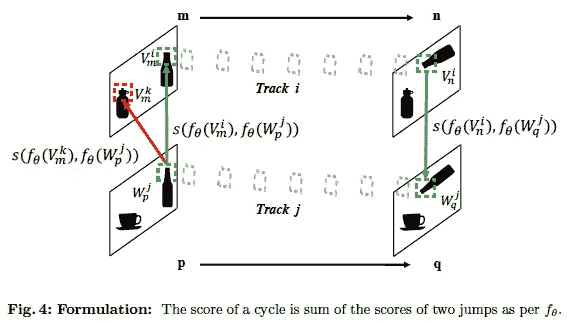
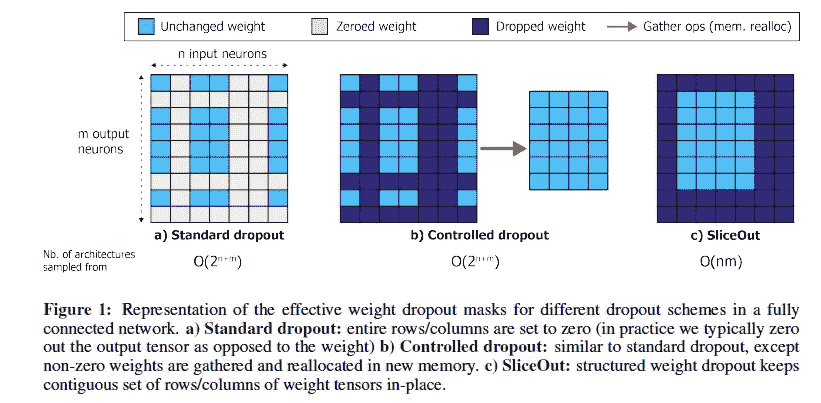

# 2020 年第 37 周

> 原文：<https://medium.com/analytics-vidhya/akiras-ml-news-week-37-2020-d36447d724bc?source=collection_archive---------12----------------------->

以下是我在 2020 年第 37 周(9 月第二周)读到的一些我觉得特别有趣的论文和文章。我已经尽量介绍最近的了，但是论文提交的日期可能和星期不一样。

## 内容:

1.  机器学习论文
2.  技术文章
3.  机器学习应用的例子

# 1.机器学习论文

## 流动边缘引导的视频完成

[https://arxiv.org/abs/2009.01835](https://arxiv.org/abs/2009.01835)

这是一个使用 flow 的视频补全的研究。这种方法的关键点是:1)通过检测缺失的边缘并连接它们来完成流，2)通过使用稍远的帧来获得视频的不可见部分，3)通过使用梯度来防止接缝。他们的方法在数量上优于以前的研究，甚至可以从视频中剔除人。

## 用于定向和密集包装对象检测的动态细化网络

https://arxiv.org/abs/2005.09973

很难检测密集的并且相对于图像旋转的物体。为了克服这一困难，他们提出了一种基于 CenterNet 的模型，该模型在不使用边界框的情况下回归对象中心，使用可变形 Conv 和 DRH 沿着要检测的对象的线进行检测，该模型通过生成过滤器来动态响应每个样本。

## 具有最大不变预测器的分布外推广

【https://arxiv.org/abs/2008.01883 

对于推广到超出分布的问题，他们提出了一种训练方法，其中每个数据的梯度接近平均梯度，并发现它在彩色 MNIST 中是有效的。

## GAN 瘦身:通过统一的优化框架实现一体化 GAN 压缩

[https://arxiv.org/abs/2008.11062](https://arxiv.org/abs/2008.11062)

减小氮化镓发生器尺寸的研究。提炼、量化和修剪的组合。量化通常是不可微的，但是他们使用伪梯度来实现 E2E 训练。他们已经成功地将现有模型的尺寸缩小到原来的 1/47。

## 在空间和时间上对齐视频

[https://arxiv.org/abs/2007.04515](https://arxiv.org/abs/2007.04515)

视频中行为对应的无监督检测研究。通过测量在无监督训练跟踪器中检测到的斑块之间的距离来学习斑块级对应。检测精度优于现有的特征提取器。

## SliceOut:训练变压器和 CNN 更快，同时使用更少的内存

[https://arxiv.org/abs/2007.10909](https://arxiv.org/abs/2007.10909)

提出了 Sliceout，一种高效的存储器丢失算法。我们不是选择一个均匀的随机缺失部分，而是在一个连续的范围内选择和分割矩阵，这消除了耗时的内存重新分配，从而使它更快。

# 2.技术文章

## 卡格尔创始人安东尼·戈德布卢姆访谈

对 Kaggle 创始人安东尼·戈德布卢姆(Anthony Goldbloom)关于 Kaggle 竞争的采访证明了随机森林的有用性，GBDT 在学术界并不那么受欢迎，但它对结构化数据很有效，Kaggle 笔记本和 Kaggle 数据集的引入创造了一个环境，许多人可以自由表达他们的见解。

 [## 如何与安东尼·戈德布卢姆一起赢得卡格尔比赛

### 安东尼·戈德布卢姆是 Kaggle 的创始人兼首席执行官。在 2011 年和 2012 年，福布斯杂志将安东尼评为 30 位…

www.wandb.com](https://www.wandb.com/podcast/anthony-goldbloom) 

## 新冠肺炎时间序列预测模型

众所周知，时间序列预测模型(如需求预测模型)会因 COVID19 而失败，但 Reddit 上有一场关于如何处理它的辩论。有一些观点认为，新冠肺炎被视为一个有很大影响的季节性因素，因为趋势相当于季节性下降，等等。

# 3.机器学习应用的例子

## **用人工智能助手寻找太空中的磁喷发**

磁层顶是由太阳风与地球磁层碰撞引起的现象，这种现象很罕见，因此该团队动员了技术高超的科学家对其进行全职监控。本文是关于使用机器学习来创建该任务的助手的试错。由于这是一项困难的任务，他们通过使用“科学家在循环中”来提高准确性，这涉及到一个科学家在学习循环中。

 [## 用人工智能助手寻找太空中的磁喷发

### 你的电子邮件中会弹出一个警告:最新的航天器观测已经准备好了。你现在有 24 小时搜索 84…

phys.org](https://phys.org/news/2020-09-magnetic-eruptions-space-ai.html) 

## 我的 github 上许多论文的摘要。

 [## AkiraTOSEI/ML_papers

### 关于这个项目有问题吗？注册一个免费的 GitHub 账户来开一期并联系它的…

github.com](https://github.com/AkiraTOSEI/ML_papers/issues) 

## 推特，我贴一句纸评论。

【https://twitter.com/AkiraTOSEI 