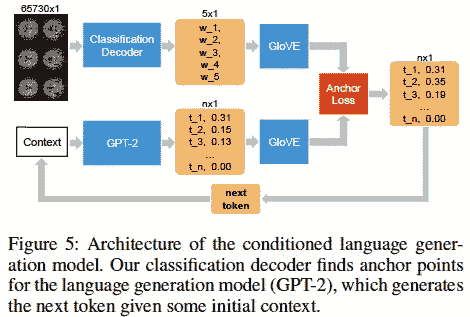
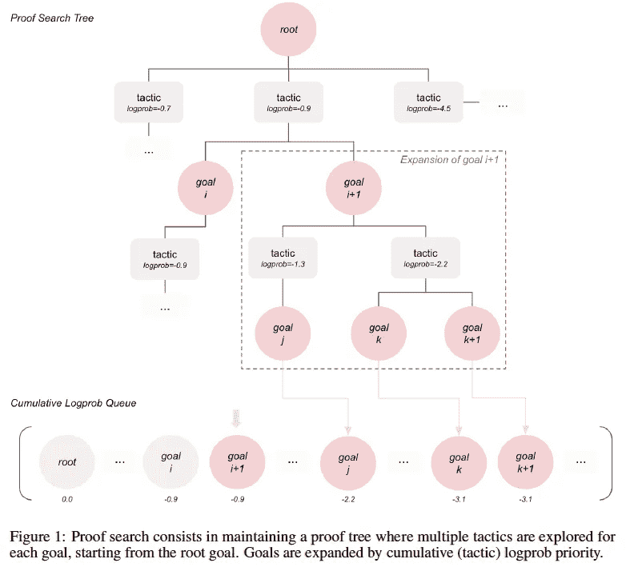
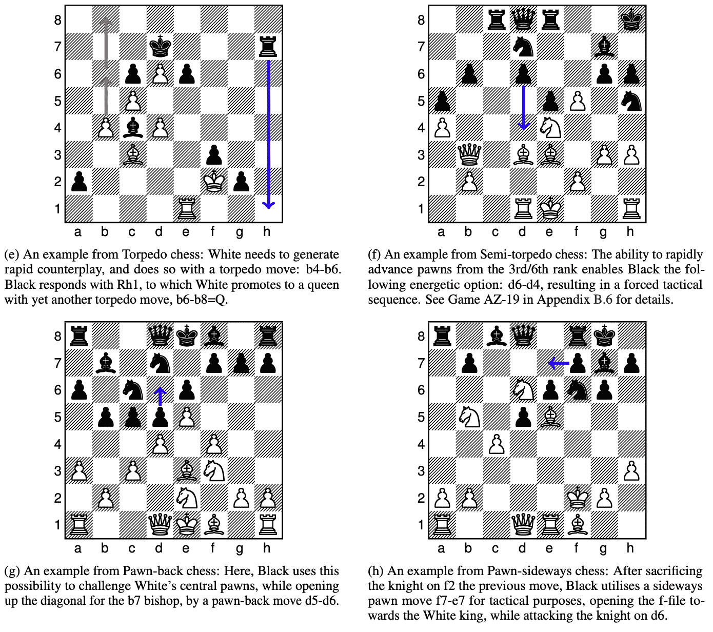
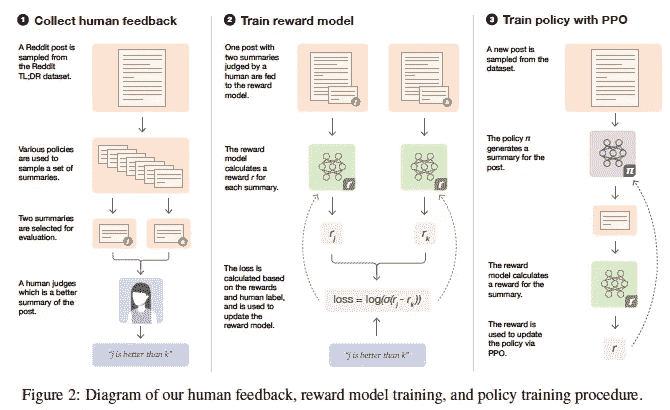
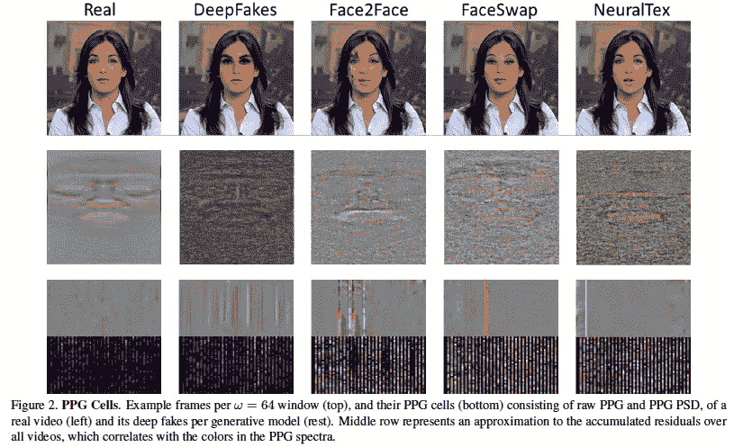

# 2020 年第 38 周

> 原文：<https://medium.com/analytics-vidhya/akiras-ml-news-week-38-2020-e7269ccafa1b?source=collection_archive---------22----------------------->

以下是我在 2020 年第 38 周(9 月 13 日~)读到的一些我觉得特别有意思的论文和文章。我已经尽量介绍最近的了，但是论文提交的日期可能和星期不一样。

# 内容:

1.  机器学习论文
2.  技术文章
3.  机器学习用例的例子
4.  其他主题

# 1.机器学习论文

## **为语言生成解码大脑活动**

【https://arxiv.org/abs/2009.04765】
一项旨在理解从 fMRI 图像中看到的字母的研究。使用 fMRI 图像作为输入，从 180 个候选单词中生成五个领先候选单词的手套嵌入向量。然后他们在 GPT-2 中用 50257 个单词做同样的事情，并比较两者作为语言模型求解。与现有方法相比，精确度大大提高。

## *用语言建模的定理证明*

*自动定理证明的生成语言建模* [https://arxiv.org/abs/2009.03393](https://arxiv.org/abs/2009.03393)

他们提出了 GPT-f，它使用转换器自动证明定理。定理的证明定义为[目标，(定理)，证明步骤，…]等语言模型。与现有的定理证明相比，他们成功地缩短了 23 个定理的证明。

## *使用 AlphaZero 进行游戏平衡*

*用 AlphaZero 评估游戏平衡:探索国际象棋中的替代规则集*[https://arxiv.org/abs/2009.04374](https://arxiv.org/abs/2009.04374)

这是一个使用 AlphaZero 评估游戏平衡性的尝试。为了让 AlphaZero 在模仿国际象棋的游戏中进行训练，对规则做了一些小的改动，比如不要阉割，我们可以看看有经验的玩家是如何看待这个游戏的。在国际象棋的历史上，规则被反复修改，最终确定在现行规则上。他们说，可以用 AlphaZero 制作其他游戏来模拟这种事情。

## 通过人的反馈进行总结改进

*从人类的反馈中学习总结*
[https://arxiv.org/abs/2009.01325](https://arxiv.org/abs/2009.01325)

文档摘要使用 ROUGE 分数来评估摘要的质量，但是它们不能正确地评估摘要的质量。在这项研究中，他们通过使用人类评价作为奖励的强化学习来生成人类偏好的摘要。它们在人类评估中胜过现有的模型。此外，它对数据领域的变化也很稳健(Reddit 培训→ CNN/DM 评估)

## 利用*生物信号*进行深度假货检测

*深度假货的心是怎么跳动的？通过用生物信号解释残差进行深度假货源检测*
[https://arxiv.org/abs/2008.11363](https://arxiv.org/abs/2008.11363)

使用深度生成模型的 DeepFake(假视频)已经成为一个社会问题，他们通过使用来自一种叫做 PPG 的生物信号的信息，在 DeepFake 检测中实现了 97.29%的准确率。他们还发现，每个世代模型都产生一个独特的假 PPG 样信号，并能够以 93.39%的比例识别世代模型。

# *重新定时视频中的人物*

*对视频中的人进行分层神经渲染* [https://arxiv.org/abs/2009.07833](https://arxiv.org/abs/2009.07833)

此模式允许您更改视频中人物的时间(开始时间和移动速度)。首先，将每个人(包括遮挡)从背景中分离出来。然后把背景和每个人的信息组合成一个特征，组合在一起生成。他们能够改变水花飞溅的时间和伴随人们运动的其他特征。

# 2.技术文章

## 学习，同时保持网络稀疏，仅具有良好的初始值

这是一篇我个人非常感兴趣的论文。这是一种只使用良好的初始值进行学习，同时保持稀疏性，同时从一开始就修剪和连接稀疏网络的方法。

我写的解释博客。

 [## 操纵彩票:高速高精度稀疏网络无…

### 稀疏网络训练方法，称为 RigL。用这种方法，你也许能够学习有巨大…

medium.com](/analytics-vidhya/rigging-the-lottery-training-method-of-high-speed-and-high-precision-sparse-networks-without-2340b0461d55) 

## ACL2020 幻灯片直播

ACL2020 的 SlideLive(一个视频，作者在几分钟内用幻灯片解释了这篇论文)现已推出。你可以点击以下网址论文名称左边的摄像机图标来播放。

 [## 计算语言学协会年会(2020) - ACL 选集

### 显示所有摘要隐藏所有摘要面向儿童的演讲与面向成人的演讲在语言上有所不同…

www.aclweb.org](https://www.aclweb.org/anthology/events/acl-2020/) 

# ICML2020 幻灯片直播

ICML2020 的 SlideLive(一个视频，作者在几分钟内用幻灯片解释了这篇论文)现已推出。这个网页很容易阅读，并且可以通过最新和最流行的条目进行分类。

 [## ICML 2020

### 机器学习国际会议(ICML)是专业人士致力于…

slideslive.com](https://slideslive.com/icml-2020#!feed=popular) 

# 3.机器学习用例的例子

## 用 GNN 改进到达时间预测

图形神经网络已被用于将谷歌地图的到达时间预测提高高达 50%。通过将本地交通网络视为图形数据并对其进行采样，可以大规模部署单个模型。

 [## 基于高级图形神经网络的交通预测

### 通过与谷歌合作，DeepMind 能够利用先进的图形神经网络进行交通预测

deepmind.com](https://deepmind.com/blog/article/traffic-prediction-with-advanced-graph-neural-networks) 

## 人工智能工具的保险范围

美国医疗保险和医疗补助服务中心(Centers for Medicare and Medicaid Services)已同意为医院使用 Viz LVO 提供报销，这是一款智能手机应用程序，可以检测中风的迹象，并帮助患者接受时间紧迫的治疗。Viz LVO 从大脑的 CT 扫描中识别中风患者，准确率达到 90%，并自动通知专家。每次使用最高可报销 1040 美元。医院将能够使用这些人工智能工具，而不会带来重大的经济负担。

 [## 即 ai 授予医疗保险新技术附加支付

### 旧金山 2020 年 9 月 3 日电/美通社/--在一项开创性的裁决中，CMS 授予 Viz.ai 首个新的…

www.prnewswire.com](https://www.prnewswire.com/news-releases/vizai-granted-medicare-new-technology-add-on-payment-301123603.html) 

# 4.其他主题

## 来自 DeepMind 的 BYOL 源代码

自我监督学习 BYOL 的源代码和训练模型现在可以从 DeepMind 获得。BYOL 不像西姆 CLR 和 MoCo，没有明确使用对比损失。

## 微软支持万亿参数模型的训练

微软的 DeepSpeed，深度学习库，可以训练多达 1 万亿个参数的模型。这是 GPT-3(截至 2020 年 9 月 17 日参数数量最多的型号)参数数量的 5 倍多。即使只使用 V100 中的一个 Nvidia V100 GPUs，也可以训练出一个有 130 亿个参数的模型。

 [## 微软人工智能工具支持具有万亿参数的“极大”模型——silicon angle

### 微软公司发布了其开源工具 DeepSpeed 的新版本，它说这将使创造…

siliconangle.com](https://siliconangle.com/2020/09/11/microsoft-ai-tool-enables-extremely-large-models-trillion-parameters/) 

## 来自 deeplearning.ai 的 NLP 课程

来自 deeplearning.ai 的自然语言处理课程，由吴恩达创办。一共 4 节课，第四节讲 T5、重整器等最新车型。

 [## 自然语言处理

### 自然语言处理(NLP)使用算法来理解和操纵人类…

www.coursera.org](https://www.coursera.org/specializations/natural-language-processing?action=enroll&authMode=signup#courses) 

我的 github 上许多论文的摘要。

 [## AkiraTOSEI/ML_papers

### 关于这个项目有问题吗？注册一个免费的 GitHub 账户来开一期并联系它的…

github.com](https://github.com/AkiraTOSEI/ML_papers/issues) 

## 推特，我贴一句纸评论。

https://twitter.com/AkiraTOSEI