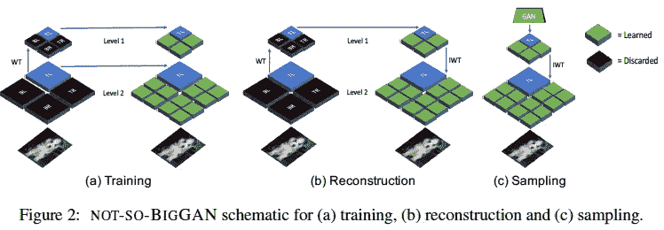
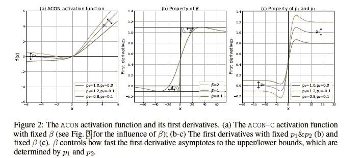
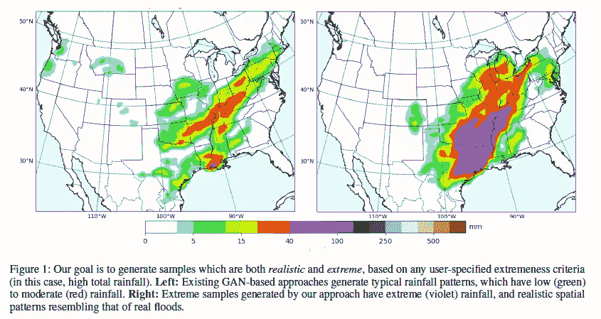
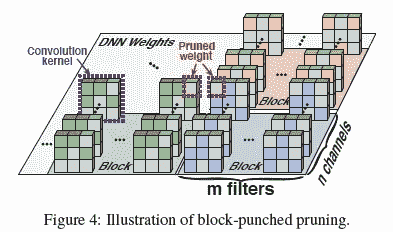
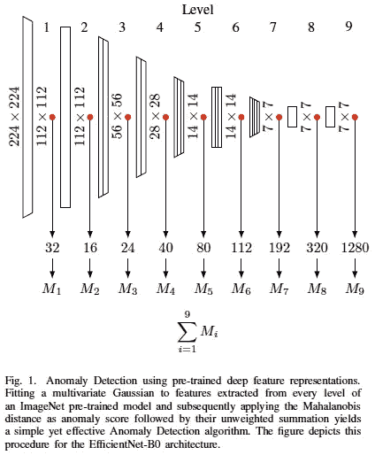
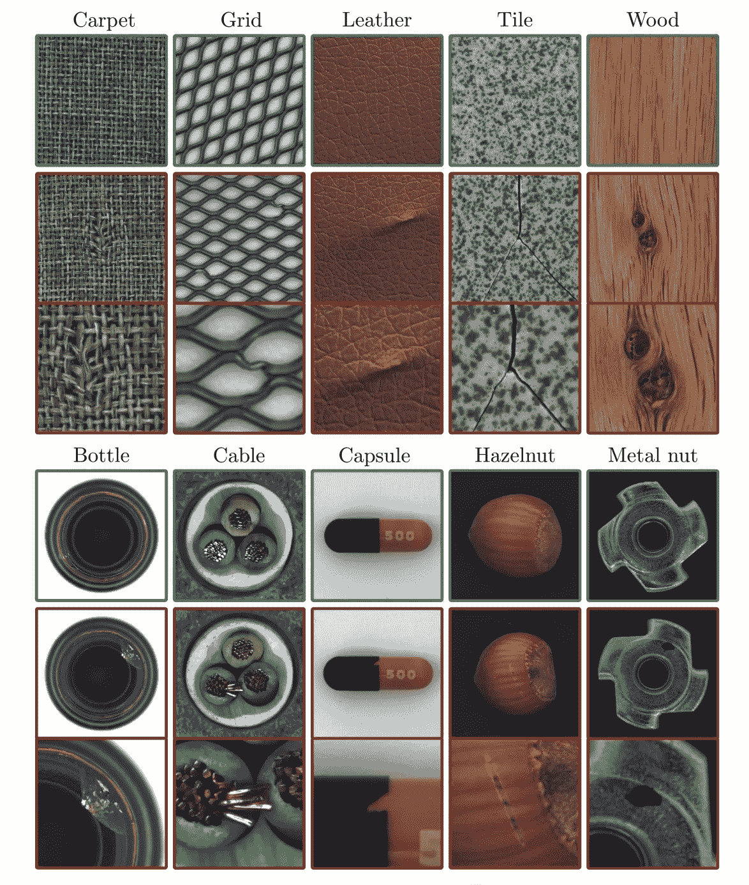
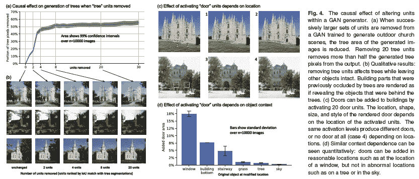
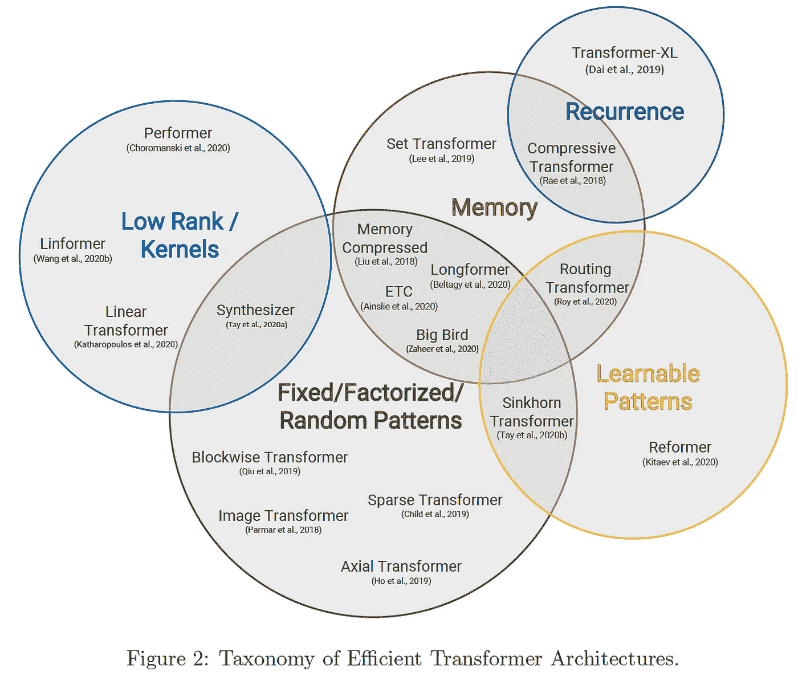

# 2020 年第 39 周

> 原文：<https://medium.com/analytics-vidhya/akiras-ml-news-week-39-2020-39bcee90cf9e?source=collection_archive---------23----------------------->

以下是我在 2020 年第 39 周(9 月 10 日~)读到的一些我觉得特别有意思的论文和文章。我已经尽量介绍最近的了，但是论文提交的日期可能和星期不一样。

1.  机器学习论文
2.  技术文章
3.  机器学习用例的例子
4.  其他主题

— — — — — — — — — — — — — — — — — — — — — — — — — — — — — —

# 1.机器学习论文

— —

# 使用小波变换减小 BigGAN 的大小

没什么大不了的:在小型计算机预算上生成高保真图像
[https://arxiv.org/abs/2009.04433](https://arxiv.org/abs/2009.04433)

这是一项研究，通过仅使用小波变换(WT)从低频信息中再现图像，使用少量计算资源使用 GANs 生成高保真图像。具体来说，丢失的高频信息由神经网络重构，并应用逆小波变换(iWT)。虽然生成的图像质量略有下降，但他们成功地将计算资源从 TPUx256 减少到 GPUx4

# 激活功能，以适当地确定它是否处于活动状态

*激活与否:学习定制激活*
[https://arxiv.org/abs/2009.04759](https://arxiv.org/abs/2009.04759)

他们统一地对待 ReLU 和 Swish，提出激活函数 ACtivationOrNot (ACON)作为它的一般形式。激活函数由多个可学习的参数组成，它们可以自由改变是否激活。他们证实，这种方法提高了对象检测和图像检索的准确性。

# 可以随意生成稀有天气数据的 GANs

*ExGAN:对抗性生成的极端样本*
[https://arxiv.org/abs/2009.08454](https://arxiv.org/abs/2009.08454)

虽然 gan 通常只训练和生成典型数据，但 ExGANs 可以以受控方式生成低概率数据；仅将 GAN 生成的样本的极值添加到数据集中以偏置数据，然后使用它们根据极值来训练 GAN。他们确认他们可以成功地在天气数据中生成数据。

# 通过将过滤器分成块来修剪，实现准确性和速度

*yo Mobile:通过压缩编译协同设计在移动设备上进行实时目标检测* [https://arxiv.org/abs/2009.05697](https://arxiv.org/abs/2009.05697)

为了同时实现移动设备的高精度和低延迟，他们提出了一种分块剪枝方法，该方法将每一层分成多个块，并在每个块中学习不同的剪枝模式。他们成功地提高了速度，同时保持了准确性。GPU 用于计算卷积层，而 CPU 用于计算其他层，以进一步提高性能。

# 使用训练模型的隐藏层的异常检测

*在预先训练好的深度特征中模拟正常数据的分布，用于异常检测*
[https://arxiv.org/abs/2005.14140](https://arxiv.org/abs/2005.14140)

使用预训练模型的异常检测研究。将多元高斯分布拟合到多个隐藏层特征并使用马氏距离检测异常。他们用 MVTe 数据集实现了 SOTA。(下图是 MVTe 数据集的样本)

# 通过了解每个单元的作用来控制生成的图像

*理解深层神经网络中个体单元的作用* [https://arxiv.org/abs/2009.05041](https://arxiv.org/abs/2009.05041)

研究解释 DNNs 中每个单元的作用。他们发现，有些单位学习诸如“树”这样的概念时，并没有明确地把它们交给 DNN。在 GAN 中，他们成功地从图像中减少了树木，并通过操纵控制每个概念的单元将门附加到建筑物上。

# 变形金刚调查

高效变形金刚:一项调查
[https://arxiv.org/abs/2009.06732](https://arxiv.org/abs/2009.06732)

一篇关于 Transformer 模型改进系统的调查论文，该模型近年来迅速传播，特别是在自然语言处理方面。从记忆、注意的使用模式等方面进行了总结。它从图表和讨论中很好地概述了论文的流程。

— — — — — — — — — — — — — — — — — — — — — — — — — — — — — —

# 2.技术文章

— — — —

# V100 / T4 / M60 GPU 的速度比较

这篇文章研究了 V100/T4/M60 GPU 的速度，以及它们在真实的大规模人员使用时的性能，而不是目录规格。它比较各种网络的速度。
结果表明，当数据量较小时，T4 M60 可以产生与 V100 相当的结果，这是一个很好的性价比结果。(与 V100 相比，T4 是 1/5，M60 大约是 1/4 的成本。然而，当增加批量时，V100 似乎是更好的选择。

 [## 常见 ML vision 模型(V100/T4/M60)中企业 GPU 培训时间的比较

### 这项研究涵盖了常见的基于图像的模型的训练时间的变化。在…之间观察到很大的变化

medium.com](/neuro-ai/a-comparison-of-enterprise-gpu-training-times-in-common-ml-vision-models-v100-t4-m60-84e864982d46) 

# 自然语言的未来**处理**

HuggingFace 的 Thomas Wolf 作了题为“自然语言处理的未来”的报告。有各种各样的主题，如太大的模型/太大的数据集的问题，使数据集太大是否会增加准确性，模型是否理解常识，以及领域外的概括。

# 自我监督学习 BYOL 是隐式的批量规范化对比学习

近年来，已成为 SOTA 的自监督学习方法，如 MoCo 和 SimCLR 系统，在对比损失中使用相同的数据作为正样本，在其他情况下使用负样本。然而，BYOL 不包括对比损失。这篇文章解释说，对比学习是隐式执行的，因为批量标准化的存在防止了小批量数据集中，并允许变化。

 [## 用“引导你自己的潜能”来理解自我监督和对比学习(BYOL)

### 摘要与西姆 CLR 和 MoCo 之前的工作不同，最近的论文从 DeepMind 引导你自己的潜在(BYOL)

无标题-ai.github.io](https://untitled-ai.github.io/understanding-self-supervised-contrastive-learning.html) 

# Kaggle 熊猫竞赛最佳解决方案

由 Rist 公司赞助的“由 Rist 举办的 Kaggle 研讨会#2”中的演示材料。Kaggle Master 的熊猫竞赛第一名和第六名解决方案。

 [## kaggle-panda-challenge.pdf

### 编辑描述

drive.google.com](https://drive.google.com/file/d/1GP2mIouzgpnkDJfe-EsJdUZsEYdfeSPk/view?usp=sharing) 

— — — — — — — — — — — — — — — — — — — — — — — — — — — — — —

# 3.机器学习用例的例子

— — — —

# **算法帮助裁判决定谁将获得自由**

纽约市正在努力让人工智能协助法官决定是暂时释放等待审判结果的嫌疑人，还是将他们留在监狱里。人工智能得分高的被告比得分低的被告更经常出现在法庭上，算法的预测效果很好，判决结果似乎普遍有利。在 2019 年 11 月 12 日至 2020 年 3 月 17 日期间，大赦国际建议释放 83.9%的黑人、83.5%的白人和 85.8%的西班牙裔人，不得保释，很少或没有种族偏见。

 [## 在纽约，算法帮助法官决定谁在等待审判期间是自由的-国际…

### 当尤尼奥·莫拉被指控袭击并勒死他的前女友时，布鲁克林的一名检察官要求法官…

www.world-today-news.com](https://www.world-today-news.com/in-new-york-algorithm-helps-judges-decide-who-will-be-free-while-awaiting-trial-international/) 

# 人脸生物识别和体温扫描

[Barcom](https://www.barcominc.com/) 推出了一款具有面部识别和体温扫描功能的独立终端，帮助公司在无需人工体温检查的情况下满足复工指南。它能够检测口罩，扫描和跟踪温度，可以由 40 人同时测量，精度为 0.2℃

 [## VisionLabs 采用麦当劳俄罗斯公司部署的生物识别和体温扫描技术

### 俄罗斯麦当劳安装了 VisionLabs 的面部识别和体温扫描技术来扫描…

www.biometricupdate.com](https://www.biometricupdate.com/202009/visionlabs-face-biometrics-and-body-temperature-scanning-deployed-by-mcdonalds-russia) 

— — — — — — — — — — — — — — — — — — — — — — — — — — — — — —

# 4.其他主题

— — — —

# GPT 三号经济体

GPT 3 号将于 10 月开始投入商业使用，这是一篇关于其考虑因素的文章。它说，仅在纯计算成本方面(即不包括工资)，培训就要花费 2760 万美元，如果你让它正确推导，有 11 个 V100s，它不能处理与新冠肺炎等相关的新单词。

 [## GPT 三号经济体

### 这篇文章是我们系列的一部分，探索自其发布以来的人工智能业务，GPT-3…

bdtechtalks.com](https://bdtechtalks.com/2020/09/21/gpt-3-economy-business-model/) 

# 任何人都可以在 NeurIPS 2020 上收听。

NeurIPS 2020 现已开放注册，今年的会议将向所有人开放。出席费用为学生 25 美元，普通公众 100 美元。考虑到会议的质量和规模，费用不会太高，所以我们鼓励您参加。

 [## NeurIPS 注册即将开放

### 雨果·拉罗歇尔

medium.com](/@NeurIPSConf/neurips-registration-opens-soon-67111581de99) 

— — — — — — — — — — — — — — — — — — — — — — — — — — — — — —

我的 github 上许多论文的摘要。

 [## AkiraTOSEI/ML_papers

### 关于这个项目有问题吗？注册一个免费的 GitHub 账户来开一期并联系它的…

github.com](https://github.com/AkiraTOSEI/ML_papers/issues) 

## 推特，我贴一句纸评论。

【https://twitter.com/AkiraTOSEI 号