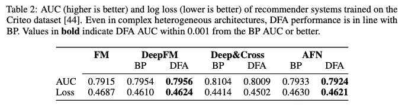
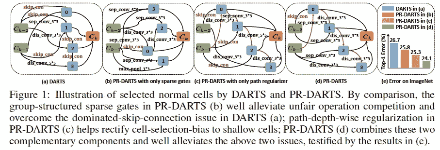
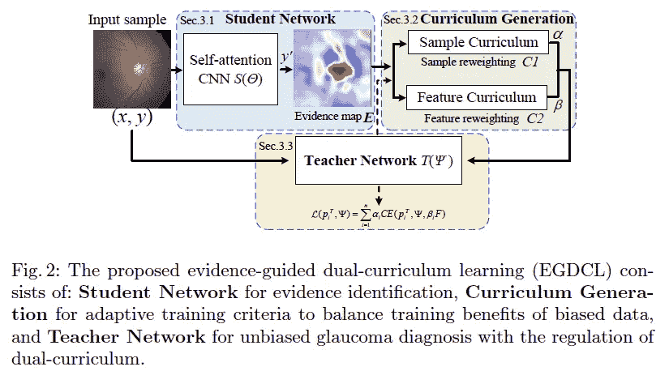
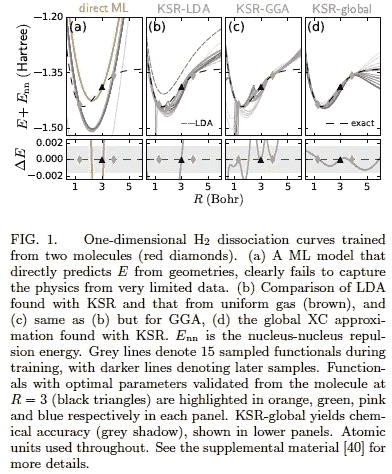
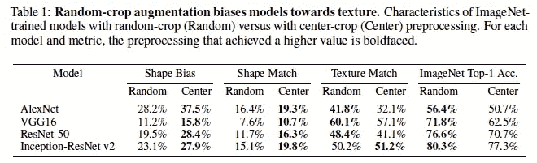
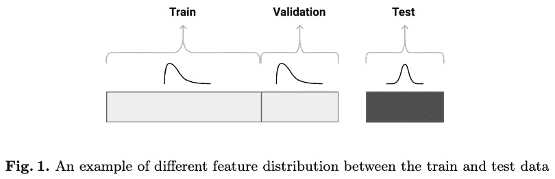

# 2020 年第 40 周

> 原文：<https://medium.com/analytics-vidhya/akiras-ml-news-week-40-2020-c23be58525e9?source=collection_archive---------22----------------------->

以下是我在 2020 年第 40 周(9 月 27 日~)读到的一些我觉得特别有意思的论文和文章。我已经尽量介绍最近的了，但是论文提交的日期可能和星期不一样。

1.  机器学习论文
2.  技术文章
3.  机器学习用例的例子
4.  其他主题

— — — — — — — — — — — — — — — — — — — — — — — — — — — — — —

# 1.机器学习论文

— —

# 反向传播的替代参数更新方法

*直接反馈校准扩展到现代深度学习任务和架构* [https://arxiv.org/abs/2006.12878](https://arxiv.org/abs/2006.12878)

对直接反馈调整的研究，它允许我们在各种任务中并行化参数更新，如转换器模型、图 Conv 和推荐，它们证实了结果不错。

# 识别和提高省道准确度的因素

*理论启发的路径正则化差分网络架构搜索* [https://arxiv.org/abs/2006.16537](https://arxiv.org/abs/2006.16537)

DARTS 是一种神经架构搜索方法，由于它选择经常跳过的连接，因此经常降低准确性，但他们从理论上证明了这是因为收敛速度比 Conv 等其他操作更快。此外，他们提出了一种防止这种情况的 PR-DARTS，并证实 PR-DARTS 的准确性得到了提高。

# 针对数据不平衡和难度的课程学习

*EGDCL:无偏性青光眼诊断的适应性课程学习框架*
[https://www . ecva . net/papers/eccv _ 2020/papers _ ECCV/html/3685 _ ECCV _ 2020 _ paper . PHP](https://www.ecva.net/papers/eccv_2020/papers_ECCV/html/3685_ECCV_2020_paper.php)

由于硬样本和数据不平衡的存在，青光眼数据一直是一项困难的任务。他们提出了一个课程学习 EGDCL，通过一个生成样本难度、标签稀有度和特征图重要性的网络来学习它。超越以往研究的结果。

# 通过将物理约束合并到模型中来提高物理模拟的准确性

*作为正则项的 Kohn-Sham 方程:将先验知识构建到机器学习物理学中*
[https://arxiv.org/abs/2009.08551](https://arxiv.org/abs/2009.08551)

在使用密度泛函理论和神经网络来近似物理模拟的问题中，可以通过将 Kohn-Sham 方程视为可微分模型来对 ML 模型施加物理约束。这大大提高了交换相关项计算的准确性。

# 基于形状而非纹理的图像分类

*卷积神经网络中纹理偏差的起源和流行* [https://arxiv.org/abs/1911.09071](https://arxiv.org/abs/1911.09071)

虽然已经知道 ImageNet 训练的 CNN 模型更多地依赖于纹理而不是形状，但他们表明，使用数据增强方法，如颜色失真、模糊，可以使模型根据形状对对象进行分类。

# 训练/测试数据集中不同分布任务的对策

*针对 https://arxiv.org/abs/2004.03045 优步*
[自动化系统中用户定位概念漂移问题的对抗性验证方法](https://arxiv.org/abs/2004.03045)

对于具有不同训练和测试数据分布的任务，他们通过训练一个分类器来区分训练和测试，并删除分类器的重要特征，直到分数是随机的，以对抗特征选择来匹配分布。这比使用接近测试的数据进行验证或根据测试分布对训练进行加权要好。

— — — — — — — — — — — — — — — — — — — — — — — — — — — — — —

# 2.技术文章

— —

# 一劳永逸

关于 GANs 的小组讨论，由 deeplearning.ai 组织，由吴恩达博士创建，由伊恩·古德菲勒博士和其他重要成员参加。重点是 GANs 的用例，例如，包括给 3D 对象添加周围环境的反射，使用 GANs 设计假牙，如何跟上最新的研究等。
就个人而言，我对以下发现非常感兴趣:“使用 GANs 进行直接数据增强不起作用，但它通过将简单的虚假数据转换为看起来像真实的数据来增加数据(例如[https://arxiv.org/abs/1612.07828](https://arxiv.org/abs/1612.07828))”。

— — — — — — — — — — — — — — — — — — — — — — — — — — — — — —

# 3.机器学习用例的例子

— —

# AI 击败王牌飞行员

在美国国防高级研究计划局(DARPA)主办的模拟空战(战斗机在对方机枪/短程空对空导弹的射击区机动捕捉对手的空战)比赛中，一个 AI 利用深度强化学习使人类王牌飞行员落败。到目前为止，他们似乎没有考虑在没有飞行员的情况下操作战斗机，但如果它变得完全自动化，就会出现伦理问题，以及人工智能如何才能让它以整洁的方式遵循战争规则。

 [## 人工智能在 DARPA 空战中击败人类飞行员

### 这一重大事件发生在由美国国防高级研究计划局(DARPA)组织的竞赛中…

www.i-programmer.info](https://www.i-programmer.info/news/105-artificial-intelligence/13967-ai-beats-human-pilot-in-darpa-dogfight.html) 

— — — — — — — — — — — — — — — — — — — — — — — — — — — — — —

# 4.其他主题

— —

# GPT-3 可能会对“人工智能的民主化”产生负面影响

文章描述了对 GPT-3 可能对“人工智能民主化”产生负面影响的担忧:该模型如此之大，以至于其他机构可能很难复制 GPT-3，而 OpenAI 几乎是垄断。诸如如何对付恶意用户，如何在使用限制之间划清界限，以及根据定价，只有一些人能够访问该网站等问题正在讨论之中。

 [## GPT 时代的 AI 民主化-3

### 9 月 22 日，微软宣布“微软正与 OpenAI 合作，独家授权 GPT-3”。在…

thegradient.pub](https://thegradient.pub/ai-democratization-in-the-era-of-gpt-3/) 

# 甘专题讲座

由吴恩达教授创建的 deeplearning.ai 的 GAN 专业课程现已在 Coursera 上提供。讲座讨论如何评价甘和风格甘等。对于使用 GANs 的人来说，这是非常有用的，不管他们是不是研究人员/工程师。

 [## 生成对抗网络

### 由 DeepLearning.AI 提供关于 GANs 生成对抗网络(GANs)是强大的机器学习模型…

www.coursera.org](https://www.coursera.org/specializations/generative-adversarial-networks-gans) 

— — — — — — — — — — — — — — — — — — — — — — — — — — -

## 推特，我贴一句纸评论。

[https://twitter.com/AkiraTOSEI](https://twitter.com/AkiraTOSEI)