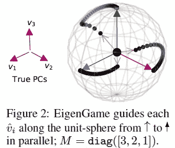
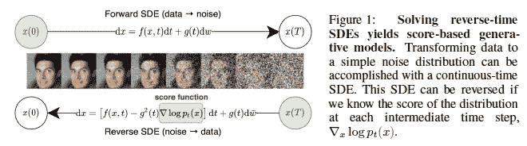
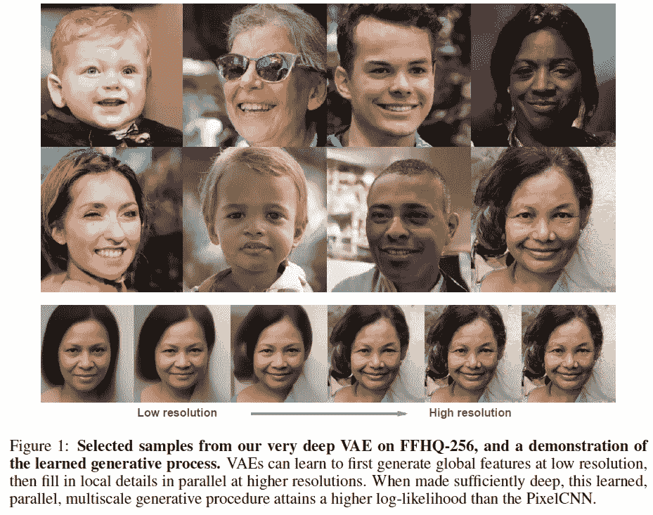
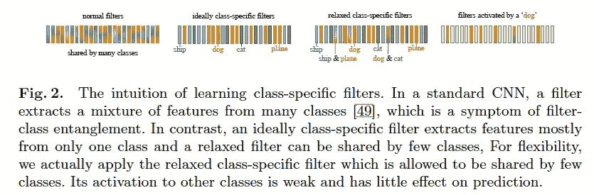
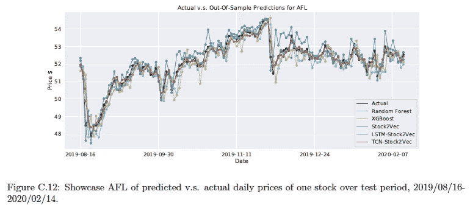
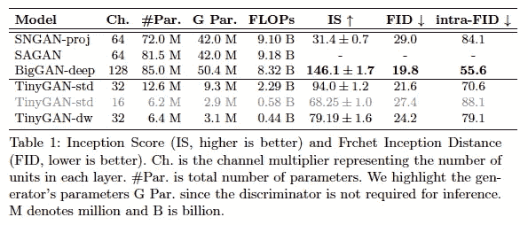

# 2020 年第 41 周

> 原文：<https://medium.com/analytics-vidhya/akiras-ml-news-week41-2020-ff1938c74adf?source=collection_archive---------24----------------------->

下面是我在 2020 年第 41 周(10 月 4 日~)读到的一些我觉得特别有意思的论文和文章。我已经尽量介绍最近的了，但是论文提交的日期可能和星期不一样。

1.  机器学习论文
2.  技术文章
3.  机器学习用例的例子
4.  其他主题

## —过去的文章

[第 40 周](/analytics-vidhya/akiras-ml-news-week-40-2020-c23be58525e9) ⇦第 41 周(本帖)⇨ [第 42 周](/analytics-vidhya/akiras-ml-news-week42-2020-f6cfe5f3be1f)

[2020 年 9 月摘要](/analytics-vidhya/akiras-ml-news-september-2020-80ed65bd7ea4)

— — — — — — — — — — — — — — — — — — — — — — — — — — — — — —

— — — — — — — — — — — — — — — — — — — — — — — — — — — — — —

# 1.机器学习论文

— —

# 将 PCA 解释为玩游戏和去中心化

*EigenGame: PCA 作为纳什均衡*[https://arxiv.org/abs/2010.00554](https://arxiv.org/abs/2010.00554)

他们将 PCA 解释为玩一个每个特征向量最大化自身效用函数的游戏，并证明了它在纳什均衡条件下等价于 PCA。这可以作为一种分散化算法来实现，因此他们能够对神经网络进行大规模分析。这是一个重要的结果，因为对于自动编码器，它并不等同于恢复主分量，也没有被解开。

# 甘作*随机微分方程*

*基于分数的随机微分方程生成建模*
[https://openreview.net/pdf?id=PxTIG12RRHS](https://openreview.net/pdf?id=PxTIG12RRHS)

与通常的通过扰动噪声来生成图像的生成模型不同，随机微分方程用于考虑噪声随时间演化的连续性。使用 CIFAR10，可以实现 IS 9.9 和 FID 2.2，还可以生成 1024x1024 的图像。

# 用深度 VAE 超越自回归模型

*https://openreview.net/forum?id=RLRXCV6DbEJ*非常深入的 VAES 推广自回归模型，并能在图像上胜过它们

该研究得出的结果可与 PixelCNN 等自回归模型和 78 层等非常深的基于流量的模型相媲美。他们认为自回归系统优于 VAE 的原因是网络的深度。忽略大的梯度并开始学习后验分布，克服了学习难度随深度增加的问题。潜在可变维度的数量允许我们操纵图像的信息内容，例如头发质量。

# 通过一个过滤过程一个类别提高可视化性能

*通过区分特定类别的过滤器*
[https://arxiv.org/abs/2007.08194](https://arxiv.org/abs/2007.08194)来训练可解释的卷积神经网络

通过限制 CNN 过滤器以使一个过滤器负责一个类别来提高解释性能的研究。通过将最终层中的过滤器与可训练矩阵[0，1]相乘，他们确保每个过滤器仅使用一个类别。分类性能也没有受到损害，并且 CAM 可视化更好。

# 用深度学习预测股票价格

*Stock2Vec:一个用于股市预测的混合深度学习框架，具有表征学习和时态卷积网络*
[https://arxiv.org/abs/2010.01197](https://arxiv.org/abs/2010.01197)

预测第二天股票价格的研究。该模型不仅使用扩张 Conv 处理每日股票价格，还使用 stock2Vec，这是一种并行使用自然语言处理每只股票新闻文章的功能。Stock2Vec 的嵌入类似于肤感。

# 蒸馏比干

*TinyGAN:提取 BigGAN 用于条件图像生成*
[https://arxiv.org/abs/2009.13829](https://arxiv.org/abs/2009.13829)

一项提取比根的研究。预先获得潜在和类别变量输入和图像输出对，并将其视为数据集以减少训练期间的存储器使用，并且用三个目标训练小的学生模型:每像素的 L1 距离、D 的隐藏层之间的差异以及通常的敌对损失。虽然性能略有下降，但与 BigGANs 相比，他们成功地减少了参数的数量。

— — — — — — — — — — — — — — — — — — — — — — — — — — — — — —

# 2.技术文章

— — — —

# Yann LeCun 教授的讲座材料现已提供

图灵奖获得者 Yann LeCun 博士的深度学习课程现已免费提供。你不仅可以在 Jupyter 笔记本上看到讲课资料，还可以看到代码。

 [## Yann LeCun 在 CDS 的深度学习课程现在完全在线，所有人都可以使用

### CDS 很兴奋的宣布 Yann LeCun 深度学习的所有资料发布，DS-GA 1008，春季合作授课…

medium.com](/@NYUDataScience/yann-lecuns-deep-learning-course-at-cds-is-now-fully-online-accessible-to-all-787ddc8bf0af) 

# 为什么考试成绩高于培训成绩？

一个讨论是什么原因导致测试数据中的分数高于训练数据中的分数的帖子。他们讨论了训练/测试的适当划分，以及训练分数是 keras 规范中一个时期分数平均值的事实，因此不同于测试评估中使用的模型。

— — — — — — — — — — — — — — — — — — — — — — — — — — — — — —

# 3.机器学习用例的例子

— — — —

# 通过 DeepFake 保护受害者的隐私

一篇关于同性恋者在遭受迫害后逃离车臣的纪录片的文章，以及 Deepfake 技术如何通过合成受害者的面部来保护他们的隐私。简单地模糊面部和使用合成声音会使他们不太真实，不太相关，但使用 deepfake 可以在保持真实性的同时保护受害者的隐私。

 [## Deepfake 技术进入纪录片世界

### 一部关于受迫害的车臣男女同性恋者的电影使用数字操纵来保护他们的身份而不丢失…

www.nytimes.com](https://www.nytimes.com/2020/07/01/movies/deepfakes-documentary-welcome-to-chechnya.html) 

# 机器学习驱动的视频会议工具

Nvidia 已经宣布推出 Nvidia Maxine，这是一款由机器学习驱动的视频会议工具，利用 GPU 和云，具有实时翻译和转录等功能，并可以像看着相机一样调整视线。主要特征之一似乎是使用 GAN 来压缩数据量，以便仅提取必要的部分。

 [## 英伟达表示，其人工智能可以解决视频通话中的一些最大问题

### 英伟达宣布推出 Maxine，这是一个面向视频会议开发者的新平台，它使用人工智能来解决…

www.theverge.com](https://www.theverge.com/2020/10/5/21502003/nvidia-ai-videoconferencing-maxine-platform-face-gaze-alignment-gans-compression-resolution) 

# 机器学习现在正在做计数火星上陨石坑的令人疲惫的任务

一篇关于机器学习如何被用来让他们在火星上发现一个陨石坑的文章。自动化机器学习工具使该团队能够发现新的陨石撞击点。寻找一个小陨石坑的任务非常困难，可能需要 40 分钟。通过将此类任务留给机器学习，它允许人类专注于使用更多思维技能的任务。

 [## 机器学习软件现在正在做计数火星宇宙陨石坑的累人任务…

### 天文学家或行星科学家的生活是否令人兴奋？坐在天文台里，喝着热可可…

www.universetoday.com](https://www.universetoday.com/148165/machine-learning-software-is-now-doing-the-exhausting-task-of-counting-craters-on-mars/) 

— — — — — — — — — — — — — — — — — — — — — — — — — — — — — —

# 4.其他主题

— — — —

# 可怕的人工智能

这个 github 知识库收集了机器学习的“可怕”用途，以促进歧视、公共监控、军事用途等。创建它是希望它能成为一个平台，促进关于如何打击这些行为的讨论。

 [## 大卫岛/可怕-艾

### 可怕的人工智能是一个追踪人工智能当前可怕用法的精选列表——希望提高对其在社会中滥用的认识…

github.com](https://github.com/daviddao/awful-ai) 

# 论文与代码和 Arxiv 协作

Paper with Code 和 Arxiv 已经联手。页面底部的选项卡中添加了一个名为“代码”的选项卡，您可以从那里跳转到代码。

 [## 与 arXiv 代码合作伙伴的论文

### 我们很高兴地宣布与 arXiv 合作，支持 arXiv 上的代码链接。

medium.com](/paperswithcode/papers-with-code-partners-with-arxiv-ecc362883167) 

# Reddit 上的 GPT-3

OpenAI 开发的一个巨型高性能语言模型 GPT-3 在留言板 Reddit 上潜伏了一周，并与人类互动，但没有人注意到。GPT-3 散布阴谋论，说“锻炼的目的是避免思考你一生都在为钱而工作的事实。”。

 [## GPT 3 号机器人在 AskReddit 上伪装成人类一周

### 图片来自视频 GPT 3:语言模型是很少出手的学习者。2020 年 10 月 4 日周日，我在 reddit 上看到一个帖子…

www.kmeme.com](https://www.kmeme.com/2020/10/gpt-3-bot-went-undetected-askreddit-for.html?m=1) 

— — — — — — — — — — — — — — — — — — — — — — — — — — — — — —

# 推特，我贴一句纸评论。

[https://twitter.com/AkiraTOSEI](https://twitter.com/AkiraTOSEI)