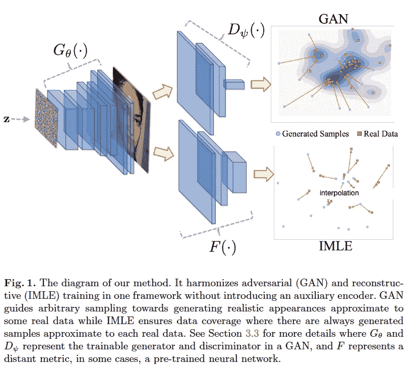
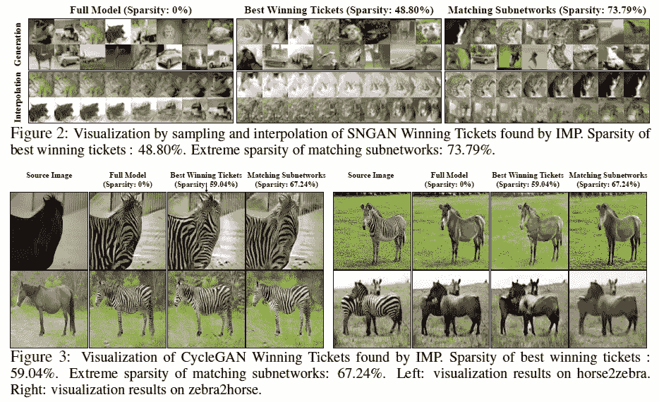
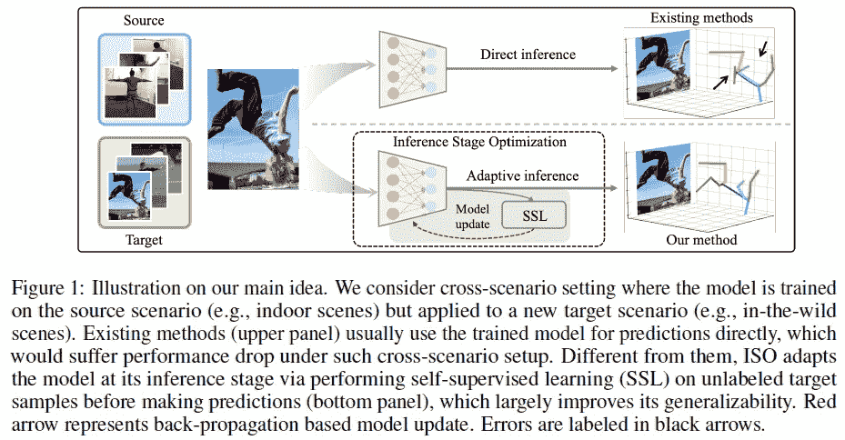
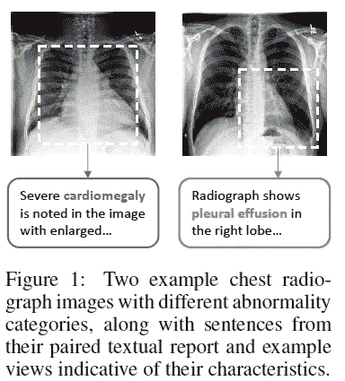
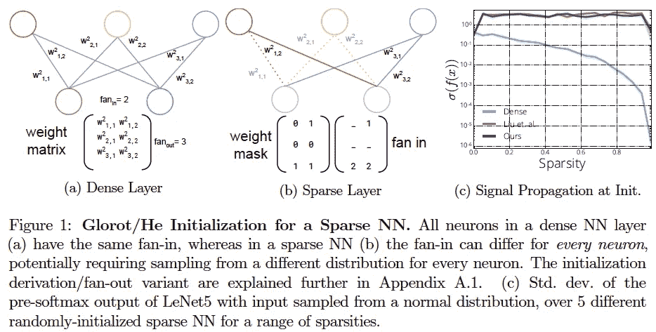

# 2020 年第 42 周

> 原文：<https://medium.com/analytics-vidhya/akiras-ml-news-week42-2020-f6cfe5f3be1f?source=collection_archive---------28----------------------->

下面是我在 2020 年第 42 周(10 月 11 日~)读到的一些我觉得特别有意思的论文和文章。我已经尽量介绍最近的了，但是论文提交的日期可能和星期不一样。

1.  机器学习论文
2.  技术文章
3.  机器学习用例的例子
4.  其他主题

## —过去的文章

[第 41 周](/analytics-vidhya/akiras-ml-news-week41-2020-ff1938c74adf) ⇦第 42 周(本帖)⇨ [第 43 周](/p/c4ad1cfa5de7/)

[2020 年 9 月摘要](/analytics-vidhya/akiras-ml-news-september-2020-80ed65bd7ea4)

— — — — — — — — — — — — — — — — — — — — — — — — — — — — — —

# 1.机器学习论文

— —

# *少数数据生成 GAN*

*包容性 GAN:提高生成模型中的数据和少数群体覆盖率* 

gan 倾向于只生成主要类别。为此，他们提出了一种包容性 GAN，通过对对应于次要类别的潜在变量进行采样，然后约束生成器以成功生成次要潜在变量中的图像，来支持次要样本生成。

# 甘斯的彩票假说

*https://openreview.net/forum?id=1AoMhc_9jER 也会玩彩票* 

甘斯的彩票假说。GANs 中存在彩票子网络，彩票子网络的压缩精度较高。发现鉴别器的初始值很重要，尽管几乎不需要压缩鉴别器和发生器。

# 具有自我监督学习的领域适应

*跨场景 3D 人体姿态估计的推理阶段优化*

[https://arxiv.org/abs/2007.02054](https://arxiv.org/abs/2007.02054)

当在不同于训练的领域中进行推断时，通过在推断之前在目标领域中执行自我监督学习来进行领域适应的研究。使用两种技术，预测姿态的对抗学习和具有 3D⇆2D 姿态变换的周期一致性，来更新不同域的参数。

# 使用数据日常工作的表征学习

*从成对图像和文本中对比学习医学视觉表征*
[https://arxiv.org/abs/2010.00747](https://arxiv.org/abs/2010.00747)

这是一项通过对比学习对一对医学图像和文本数据进行表征学习的研究，常用于医学日常工作中。这是一种表示学习方法，使配对的文本和图像之间的距离更近，这比 ImageNet 训练的模型更有用，大大提高了图像检索的准确性。

# 为什么稀疏网络在不使用彩票初始化的情况下学习失败？

*稀疏神经网络中的梯度流和彩票如何中奖*
[https://arxiv.org/abs/2010.03533](https://arxiv.org/abs/2010.03533)

一项研究，旨在检查彩票初始化和稀疏神经网络中随机抽取之间的准确性差异。由于梯度流的恶化(小梯度值趋于消失)，随机初始化的稀疏网络不如密集网络精确。彩票初始化并不能改善梯度流，但由于剪枝网络的偏向性，可以很好地训练。RigL 可以动态地学习稀疏网络，可以改进梯度流，因此可以从随机初始值给出良好的精度。

— — — — — — — — — — — — — — — — — — — — — — — — — — — — — —

# 2.技术文章

— — — —

# 信用评分的运营挑战

一个讨论信用评分(一种量化贷款和还款能力的技术)的操作挑战的帖子。讨论的内容是不包括性别和年龄，因为这是歧视性的，以及一旦模型转移到生产环境中，如何处理后续数据中的偏差。

# 强化学习是对优化数据的监督学习

一篇从监督学习的角度解释强化学习的文章。他们表示，这可以被视为 RL 可以被解释为策略和数据的联合优化问题，从这种监督学习的角度来看，许多 RL 算法在找到正确的数据和对该数据执行监督学习之间交替进行。

 [## 强化学习是对优化数据的监督学习

### 关于强化学习(RL)的两个最常见的观点是最优化和动态规划。方法是…

bair.berkeley.edu](https://bair.berkeley.edu/blog/2020/10/13/supervised-rl/) 

— — — — — — — — — — — — — — — — — — — — — — — — — — — — — —

# 3.机器学习用例的例子

— — — —

# 人工智能可以帮助病人——但前提是医生理解它

这篇文章是关于在医学领域实现机器学习工具的各种尝试和磨难。它指出，即使你使用机器学习开发了一个自动诊断系统，如果你做了一些扰乱正常工作流程的事情，这将使情况变得更加困难，因此开发一个考虑到这些因素的系统非常重要。

 [## 人工智能可以帮助病人——但前提是医生理解它

### 杜克大学医院装机器的时候迪娜·萨罗护士对人工智能了解不多…

www.wired.com](https://www.wired.com/story/ai-help-patients-doctors-understand/) 

# 一个人工智能胜过了 20 个顶级律师

在寻找保密协议漏洞的任务中，人工智能胜过顶级律师，人工智能可以在 26 秒内审查保密协议，而普通律师需要 92 分钟。律师的反应是积极的，提高了好处，如允许律师专注于更复杂的项目。

 [## 疫情用机器人取代律师的速度比以往任何时候都快，这是最好的法律技术

### 新冠肺炎不仅让审判变得遥远，现在还在加速更换律师。法律技术…

bestoflegaltech.com](https://bestoflegaltech.com/the-pandemic-is-replacing-lawyers-with-robots-faster-than-ever/) 

— — — — — — — — — — — — — — — — — — — — — — — — — — — — — —

# 4.其他主题

— — — —

# 2020 年的人工智能发展

2020 年人工智能发展报告。长达 177 页的报告文件。该报告涵盖了广泛的主题，包括研究趋势、人才所在、伦理问题、向军事应用的扩展以及对下一年趋势的预测。在研究方面，庞大的数据集/海量模型正在推动准确性，更多的论文在生物学中使用人工智能，Pytorch 正在赶上 Tensorflow，等等。

— — — — — — — — — — — — — — — — — — — — — — — — — — — — — —

# 推特，我贴一句纸评论。

[https://twitter.com/AkiraTOSEI](https://twitter.com/AkiraTOSEI)