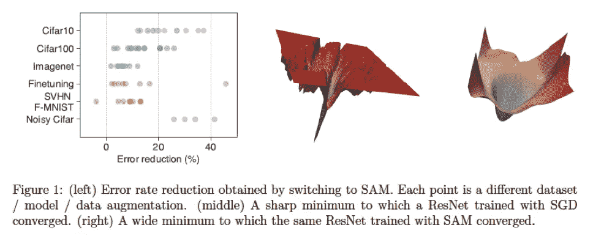
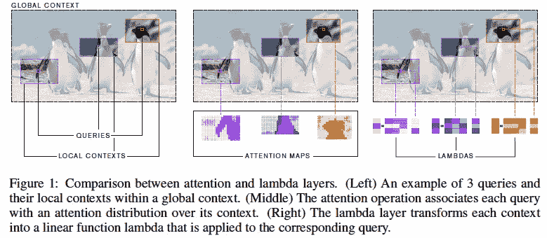
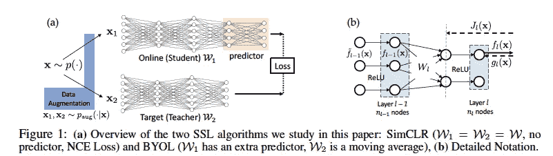
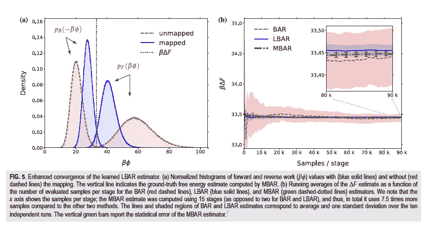
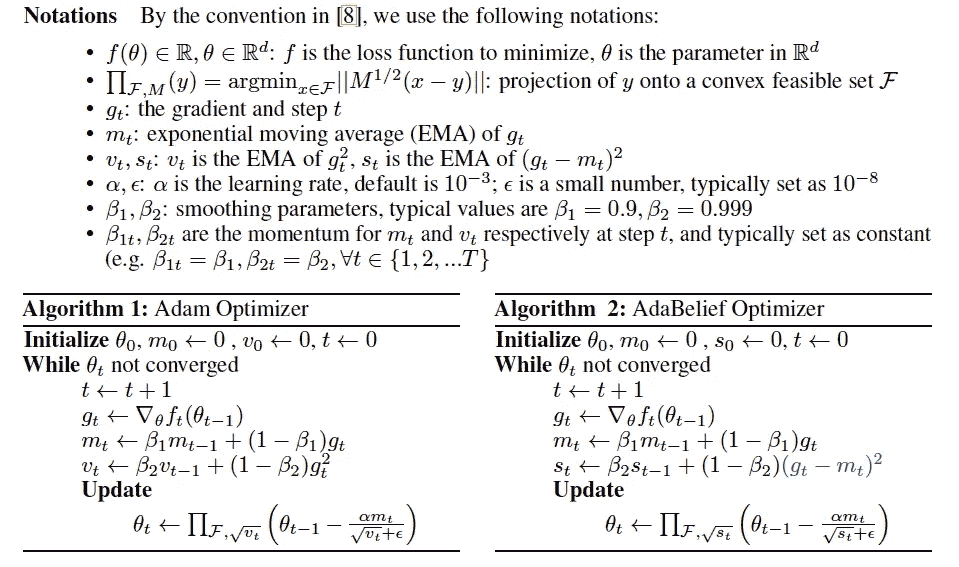
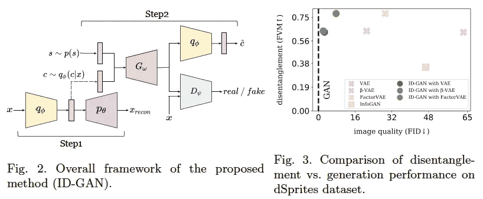
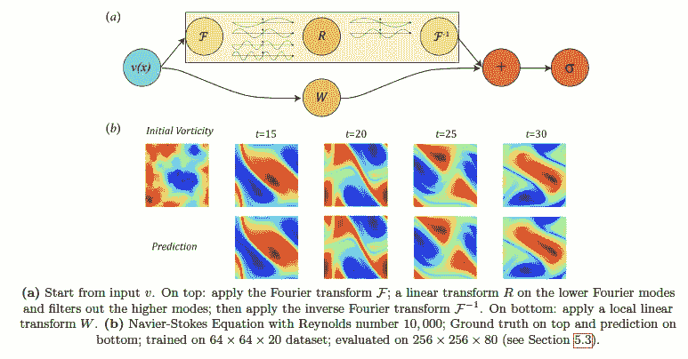

# 2020 年第 43 周

> 原文：<https://medium.com/analytics-vidhya/akiras-ml-news-week43-2020-c4ad1cfa5de7?source=collection_archive---------16----------------------->

下面是我在 2020 年第 43 周(10 月 18 日~)读到的一些我觉得特别有意思的论文和文章。我已经尽量介绍最近的了，但是论文提交的日期可能和星期不一样。

1.  机器学习论文
2.  技术文章
3.  机器学习用例的例子
4.  其他主题

# —每周编辑精选

*   LAMBDANETWORKS:比 EfficientNet(1)更快更准确。机器学习论文)
*   [物体检测从 9 FPS 到 650 FPS 分 6 步(2。技术文章)](https://paulbridger.com/posts/video_analytics_pipeline_tuning/)
*   [工具帮助清除计算机视觉的偏见(4。其他话题)](https://engineering.princeton.edu/news/2020/10/01/tool-helps-clear-biases-computer-vision)

# —过去的文章

[第 42 周](/analytics-vidhya/akiras-ml-news-week42-2020-f6cfe5f3be1f) ⇦第 43 周(本帖)⇨ [第 44 周](/analytics-vidhya/akiras-ml-news-week44-2020-eda5ee9fff33)

[2020 年 9 月汇总](/analytics-vidhya/akiras-ml-news-september-2020-80ed65bd7ea4)

— — — — — — — — — — — — — — — — — — — — — — — — — — — — — —

# 1.机器学习论文

— —

# 防止陷入急剧最小值的优化技术

*锐度感知最小化，专门用于提高泛化能力* [https://arxiv.org/abs/2010.01412](https://arxiv.org/abs/2010.01412)

为了防止损失函数陷入急剧的最小值，他们提出了一种 SAM，该 SAM 通过向模型的参数添加扰动来优化，使得损失上升最多。泛化性能得到提高，并对标签噪声具有鲁棒性。

# LAMBDANETWORKS:比 EfficientNet 更快更准确

*LAMBDANETWORKS:模拟没有注意力的远程交互*
[https://openreview.net/forum?id=xTJEN-ggl1b](https://openreview.net/forum?id=xTJEN-ggl1b)

在对一幅图像应用自我关注时，潜在表示是作为每像素关注度和查询度的矩阵乘积获得的，但他们提出了 Lambda Layer，通过将固定键(不考虑位置)/值矩阵乘积抽象出的地图和查询相乘来获得潜在表示。结果比 EfficientNet 更快更准确。

# 自我监督学习方法 SimCLR 和 BYOL 的理论分析

*用双重深度网络理解自我监督学习*[【https://arxiv.org/abs/2010.00578】](https://arxiv.org/abs/2010.00578)

SimCLR 和配对网络自监督学习方法 BYOL 的理论分析。他们提出，这些方法通过使用协方差算子放大强数据增强后保留的特征来学习。他们还发现，即使每隔几个时期对预测器进行初始化，BYOL 也不会失去准确性。

# 通过深度学习计算自由能

*通过学习映射的目标自由能估算*
[https://aip.scitation.org/doi/10.1063/5.0018903](https://aip.scitation.org/doi/10.1063/5.0018903)

这项研究是关于自由能微扰法(FEP)，这是用来模拟溶剂效应和酶反应，使用深度学习。提出了一个施加物理约束(如周期对称性)的模型，并成功地显著降低了自由能估算的方差。

# 将动量解释为梯度预测的优化方法

*AdaBelief 优化器:通过对观察到的梯度*
[https://arxiv.org/abs/2010.07468](https://arxiv.org/abs/2010.07468)的信任来调整步长

建议的优化方法 AdaBelief，它将动量(m)视为梯度(g)的预测，如果 g 和 m 的方向正确，则应用大步长更新。在分类问题和 GAN 中比 Adam 有更好的结果

# 满足潜在空间解开和生成图像质量的生成模型

*高保真合成与无纠缠表现*
[https://arxiv.org/abs/2001.04296](https://arxiv.org/abs/2001.04296)

ID-GAN 可以通过学习编码器来获得使用β-VAE 的解纠缠表示，然后使用它来生成具有 GAN 的图像，从而实现图像质量和潜在空间的有序性。

# 在神经网络上计算积分核

*傅立叶神经算子用于参数化偏微分方程* [https://arxiv.org/pdf/2010.08895v1.pdf](https://arxiv.org/pdf/2010.08895v1.pdf)

这是一项用神经网络取代傅立叶空间中积分核计算的研究，当应用于纳维尔-斯托克斯方程等流体模拟时，神经网络可以比数值模拟(FEM)快 1000 倍。

— — — — — — — — — — — — — — — — — — — — — — — — — — — — — —

# 2.技术文章

— — — —

# 数据科学家面试问题和答案

数据科学家面试预计会有 120 多个问题和答案。该内容旨在测试您的统计/机器学习基础知识及其在实践中的使用。推荐用于测试你是否掌握了统计学/机器学习的基础知识。

 [## 2021 年你应该知道的 120+数据科学家面试问答

### 面试问题来自脸书、Yelp、亚马逊、谷歌、苹果、网飞等等

towardsdatascience.com](https://towardsdatascience.com/120-data-scientist-interview-questions-and-answers-you-should-know-in-2021-b2faf7de8f3e) 

# 标准化解释

一篇用插图解释规范化方法的主要用途的文章。解释了 BatchNorm、LayerNorm 和 even SPADE。

 [## 用于训练非常深的神经网络的层内标准化技术

### 如果你翻开任何一本入门的机器学习教材，你都会发现输入缩放的思想。不希望…

theaisummer.com](https://theaisummer.com/normalization/) 

# 在 6 个步骤中从 9 FPS 到 650 FPS 的对象检测

一篇关于加快物体检测推理速度从 9FPS 到 650FPS 的文章。要点是，避免 CPU/GPU 转移，让 GPU 做繁重的计算，批处理，使用半精度，等等。这篇文章非常有说服力，因为它通过查看 Nsight 系统中每一步的 CPU/GPU 使用情况，提供了调整方法的基本原理。

 [## 在 6 个步骤中从 9 FPS 到 650 FPS 的对象检测

### 让代码在 GPU 上快速运行需要一种非常不同的方法来让代码在 CPU 上快速运行，因为硬件…

paulbridger.com](https://paulbridger.com/posts/video_analytics_pipeline_tuning/) 

— — — — — — — — — — — — — — — — — — — — — — — — — — — — — —

# 3.机器学习用例的例子

— — — —

# 人工智能预测电池性能

麻省理工和丰田的研究人员正在通过机器学习测量电池的性能。通常，电池必须在几年的时间内反复充电/放电才能进行测试，直到它们退化，但他们正在使用几个小时的数据，通过机器学习来预测电池的性能。研究人员表示，这有助于理清电动汽车对快速充电电池的需求。

 [## 人工智能正在加速电池的发展

### 在斯坦福大学能源学院的一个实验室里，有六个冰箱大小的柜子…

www.wired.com](https://www.wired.com/story/ai-is-throwing-battery-development-into-overdrive/) 

# **人工智能视觉检测平台**

LandingAI 已经发布了 LandingLens，这是一个视觉检查平台，即使你不是人工智能专家，也可以通过几次点击来部署模型。虽然由于许多制造商在小型演示项目(所谓的 PoC)后停滞不前，整体采用速度缓慢，但 LandingLens 是基于制造和运输许多视觉检测项目的技术和专业知识开发的，这有助于它们的使用。

 [## 蓝鼎人工智能推出人工智能视觉检测平台，以提高质量并降低成本…

### 加利福尼亚州 PALO 阿尔托-2020 年 10 月 21 日-一家让客户能够通过以下方式利用人工智能商业价值的公司…

landing.ai](https://landing.ai/landing-ai-unveils-ai-visual-inspection-platform-to-improve-quality-and-reduce-costs-for-manufacturers-worldwide/) 

— — — — — — — — — — — — — — — — — — — — — — — — — — — — — —

# 4.其他主题

— — — —

# 该工具有助于消除计算机视觉的偏见

现在有一种工具可以识别图像数据集中的偏差。它使用现有的图像注释和度量，例如对象的数量、对象-人共现以及图像的来源国家。例如，关于人和乐器，男人在演奏，女人不演奏但在同一空间，等等。

 [## 该工具有助于消除计算机视觉的偏见

### 普林斯顿大学的研究人员开发了一种工具，可以标记用于训练的图像集的潜在偏差…

engineering.princeton.edu](https://engineering.princeton.edu/news/2020/10/01/tool-helps-clear-biases-computer-vision) 

— — — — — — — — — — — — — — — — — — — — — — — — — — — — — —

# —过去的文章

[第 42 周](/analytics-vidhya/akiras-ml-news-week42-2020-f6cfe5f3be1f) ⇦第 43 周(本帖)⇨ [第 44 周](/analytics-vidhya/akiras-ml-news-week44-2020-eda5ee9fff33)

[2020 年 9 月摘要](/analytics-vidhya/akiras-ml-news-september-2020-80ed65bd7ea4)

— — — — — — — — — — — — — — — — — — — — — — — — — — — — — —

# 推特，我贴一句纸评论。

[https://twitter.com/AkiraTOSEI](https://twitter.com/AkiraTOSEI)