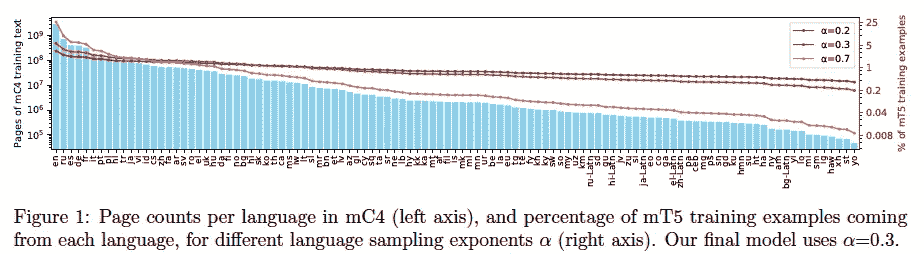
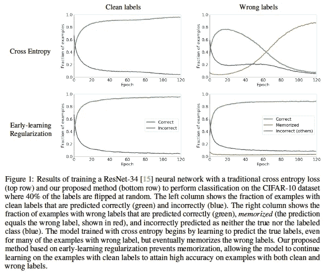
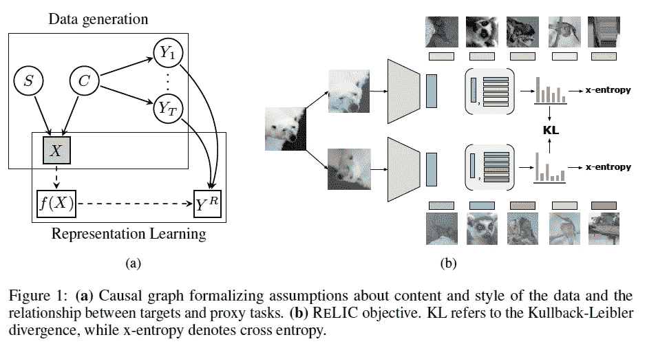
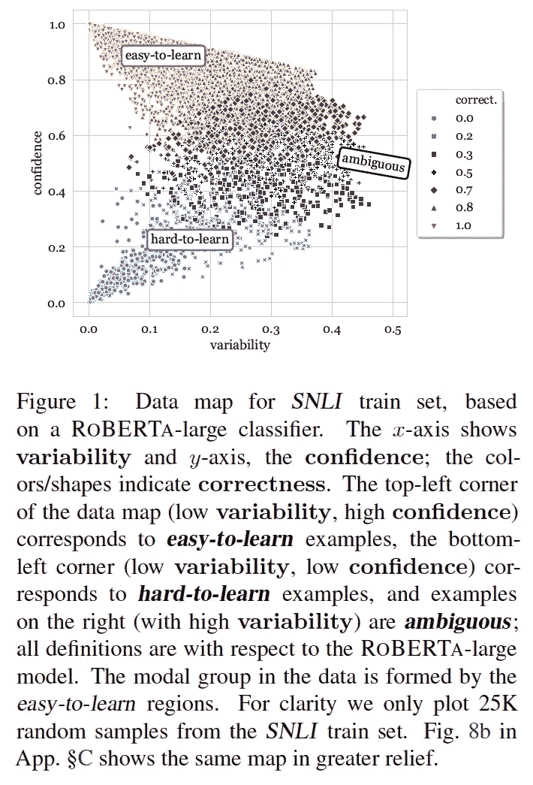
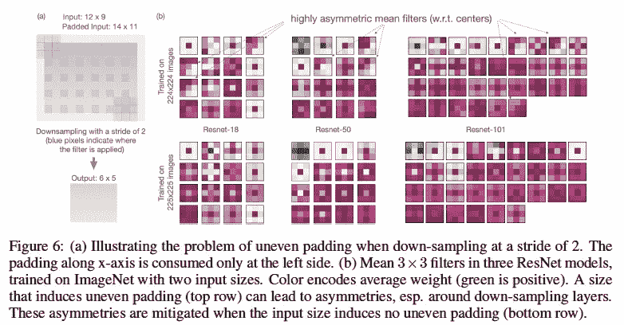
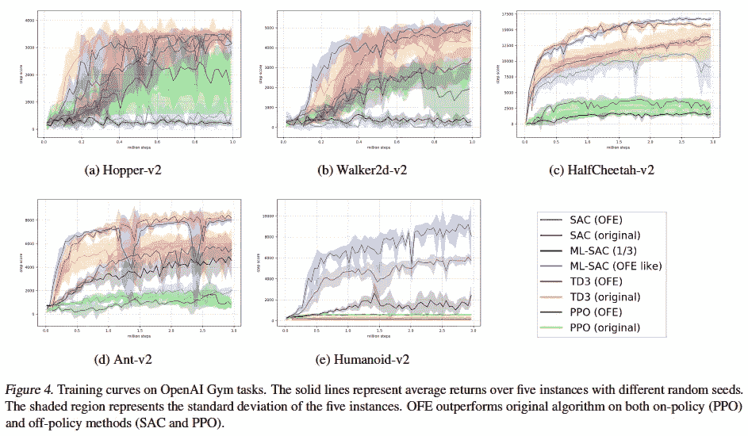
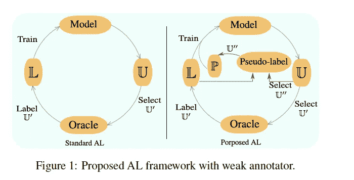
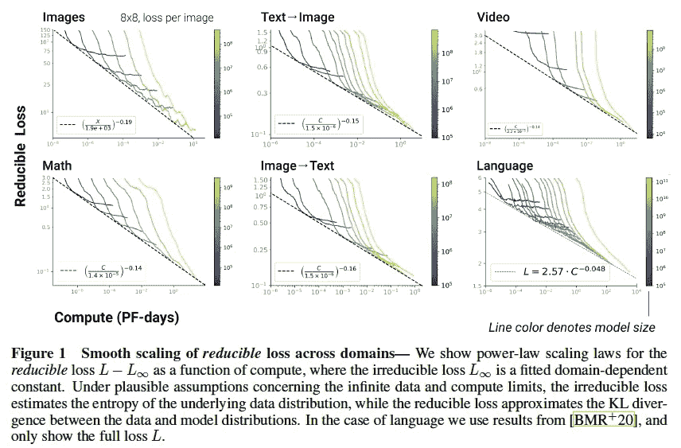

# 2020 年第 44 周

> 原文：<https://medium.com/analytics-vidhya/akiras-ml-news-week44-2020-eda5ee9fff33?source=collection_archive---------26----------------------->

下面是我在 2020 年第 44 周(10 月 25 日~)读到的一些我觉得特别有意思的论文和文章。我已经尽量介绍最近的了，但是论文提交的日期可能和星期不一样。

## 主题

1.  机器学习论文
2.  技术文章
3.  机器学习用例的例子
4.  其他主题

# —每周编辑精选

*   [使用错误和正确标签之间的学习速度差异的正则化](https://arxiv.org/abs/2007.00151) (1。机器学习论文)
*   [使用因果图的自我监督学习](https://arxiv.org/abs/2010.07922) (1。机器学习论文)
*   [填充精度的位置依赖性](https://arxiv.org/abs/2010.02178) (1。机器学习论文)

# —过去的文章

[第 43 周](/analytics-vidhya/akiras-ml-news-week43-2020-c4ad1cfa5de7) ⇦第 44 周(本帖)⇨ [第 45 周](/analytics-vidhya/akiras-ml-news-week45-2020-c58112bd184f)

[2020 年 9 月汇总](/analytics-vidhya/akiras-ml-news-september-2020-80ed65bd7ea4)

— — — — — — — — — — — — — — — — — — — — — — — — — — — — — —

# 1.机器学习论文

— —

# 多语言文本到文本海量模型

*mT5:一个大规模多语言预训练文本到文本转换器*
[https://arxiv.org/abs/2010.11934](https://arxiv.org/abs/2010.11934)

他们提出了 mT5，T5 的多语言版本，将所有任务统一为 text2text 格式，并遵循预学习到微调的策略，以及 mC4，包含 101 种语言的大型多语言数据集。它有多达 130 亿个参数，具有各种任务的最高性能。

图和标题摘自上述论文

# 利用错误标签和正确标签之间学习速度差异的正则化

*早期学习正规化防止记忆嘈杂的标签*
[https://arxiv.org/abs/2007.00151](https://arxiv.org/abs/2007.00151)

他们发现，在标签噪声的情况下，具有正确标签的数据可以被正确地学习，而具有错误标签的数据起初可以预测正确的标签，但后来被错误的标签所拉动，并记住了数据。利用这一现象，他们提出了 ESR，一种使用模型输出移动平均值的正则化方法。这些结果在存在标签噪声的情况下非常有效。

图和标题摘自上述论文

# 使用因果图的自我监督学习

*经由不变因果机制的表征学习*
[https://arxiv.org/abs/2010.07922](https://arxiv.org/abs/2010.07922)

考虑到图像是由内容(动物种类)和风格(背景等)的因果图构成的。)，他们提出了一个自我监督的学习遗迹，学习图像对风格不变。具体来说，该系统被设计成对各个图像进行分类并匹配它们的分布，使得它们对于通过数据扩充进行的风格变换是不变的。这不仅与以前的研究相当，而且在强化学习中也是有效的。

图和标题摘自上述论文

# 数据不仅关乎数量，也关乎质量。

*数据集制图:用训练动力学*
[https://arxiv.org/abs/2009.10795](https://arxiv.org/abs/2009.10795)对数据集进行制图和诊断

一项研究调查了 NLP 数据的质量。研究表明，数据可以分为有助于学习收敛的区域、由于错误标注和其他因素而难以学习的区域以及有助于泛化性能的具有可变置信度的模糊区域。最近 NLP 倾向于强调数量而不是质量，但建议复习质量也不错。

图和标题摘自上述论文

# 通过填充的精度的位置依赖性

*注意护垫——CNN 会产生盲点*
[https://arxiv.org/abs/2010.02178](https://arxiv.org/abs/2010.02178)

研究表明，填充导致准确性的位置依赖性；对于像 ResNet 这样使用 stride=2 进行缩减采样的网络，填充像素的应用并不相同，具体取决于图像的大小。(使用最左边的填充，但不使用最右边的填充。)只要改变图像大小使其填充处理相等，精度就提高了。

图和标题摘自上述论文

# 高维空间中的嵌入表示

增加输入维度能否提高深度强化学习？
[https://arxiv.org/abs/2003.01629](https://arxiv.org/abs/2003.01629)

通常情况下，表征学习旨在使其低维化，但由于强化学习中的状态表征被视为中间层，因此这项研究受到大规模网络取得结果的趋势的启发，并将其纳入高维空间。它在许多环境中是有效的。

图和标题摘自上述论文

# 通过主动学习的分段实现可视化

*深度主动学习进行联合分类&分割用弱标注器*
[https://arxiv.org/abs/2010.04889](https://arxiv.org/abs/2010.04889)

对于只有少量掩码的标记数据，他们提出了一种方法，通过主动学习逐渐增加掩码数据的数量，同时进行分类和分割，这种方法比 CAM 提供了更好的可视化性能。

图和标题摘自上述论文

# 各种数据域的比例法则

*自回归生成建模的标度法则*
[https://arxiv.org/abs/2010.14701](https://arxiv.org/abs/2010.14701)

该研究调查了各种数据域中计算资源、数据量和模型大小的尺度规律。他们在所有研究的领域中发现幂律，并且一个领域的最佳模型大小显示了一个普遍的趋势，而与该领域无关。

图和标题摘自上述论文

— — — — — — — — — — — — — — — — — — — — — — — — — — — — — —

# 2.技术文章

— — — —

# 合成数据的有效性

讨论如何在现场使用合成数据的对话文章。它讨论了合成数据可以增加数据的多样性，以及他们如何在收集实际数据的同时运行一个循环来提高合成数据的质量。

 [## 用金正日合成数据的不合理的有效性

### 涵盖的主题:0:00 内容多样化 0:23 简介+生物 1:00 从文科到综合数据 8:48 什么是…

www.wandb.com](https://www.wandb.com/podcast/daeil-kim) 

# ViT 解释

这个视频解释了变压器模型的论文，击败了 CNN 模型的 ViT。像 CNN 一样，变压器如何随着层的加深从局部特征获得全局特征，以及变压器如何比 CNN 和 LSTMs 具有更小的感应偏差，以便可以用于大规模。他解释说，如果你有数据集，你可以超越这些。等。

— — — — — — — — — — — — — — — — — — — — — — — — — — — — — —

# 3.机器学习用例的例子

— — — —

# 使用机器学习帮助清理河流垃圾

在 2018 年和 2019 年的两次微软全球黑客马拉松比赛中，黑客马拉松团队与海洋清理组织(Ocean Cleanup)合作，建立了一个机器学习模型，以帮助量化流向海洋的河流中的塑料污染量。

 [## 微软黑客马拉松导致人工智能和可持续发展的合作，以摆脱河流和…

### 苏珊娜·乔尼塑料袋。塑料瓶。塑料玩具。将近 900 万吨的塑料碎片被丢弃在…

news.microsoft.com](https://news.microsoft.com/features/microsoft-hackathon-leads-to-ai-and-sustainability-collaboration-to-rid-plastic-from-rivers-and-the-ocean/) 

# 用人工智能分析信息战

本文讨论了如何使用自然语言处理来分析大量的新闻和信息，以应对信息战。除其他外，报告分析说，在亚美尼亚和阿塞拜疆之间最近发生冲突的几个月前，就有人散布信息，故意将该国的一方描绘成侵略者。

 [## 帮助五角大楼评估反信息作战的人工智能公司

### 九月，阿塞拜疆和亚美尼亚因纳戈尔诺-卡拉巴赫——高加索地区的一块有争议的领土——重新开战

www.wired.com](https://www.wired.com/story/ai-helping-pentagon-assess-disinfo-campaigns/) 

— — — — — — — — — — — — — — — — — — — — — — — — — — — — — —

# 4.其他主题

— — — —

# 采访竞赛大师

这是对一位大师的视频采访。它长约 5 分钟，包括他如何开始玩 Kaggle，对他来说成为一名大师意味着什么，以及对 Kaggle 初学者的建议。

— — — — — — — — — — — — — — — — — — — — — — — — — — — — — —

# —过去的文章

[第 43 周](/analytics-vidhya/akiras-ml-news-week43-2020-c4ad1cfa5de7) ⇦第 44 周(本帖)⇨ [第 45 周](/analytics-vidhya/akiras-ml-news-week45-2020-c58112bd184f)

【2020 年 9 月摘要

— — — — — — — — — — — — — — — — — — — — — — — — — — — — — —

# 推特，我贴一句纸评论。

[https://twitter.com/AkiraTOSEI](https://twitter.com/AkiraTOSEI)