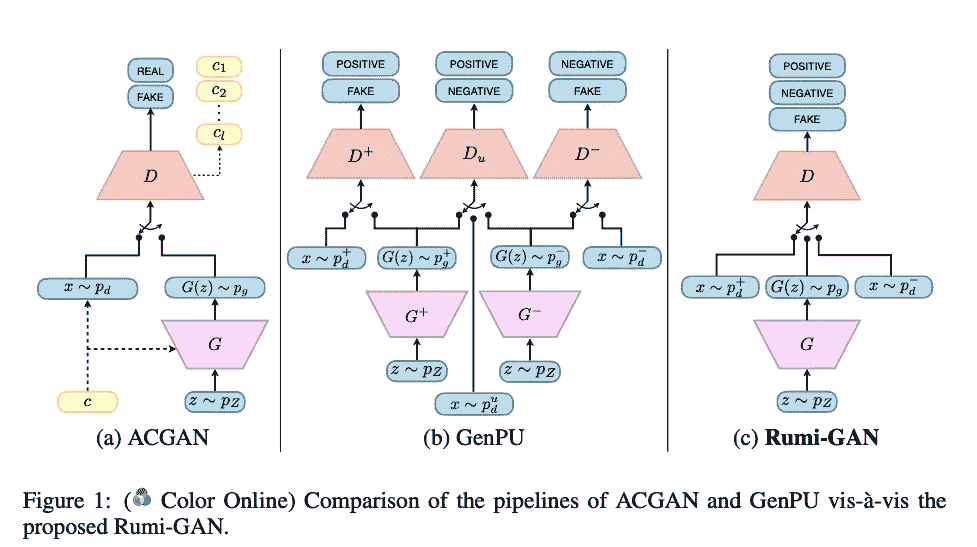
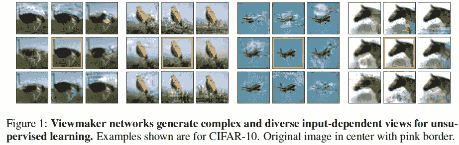
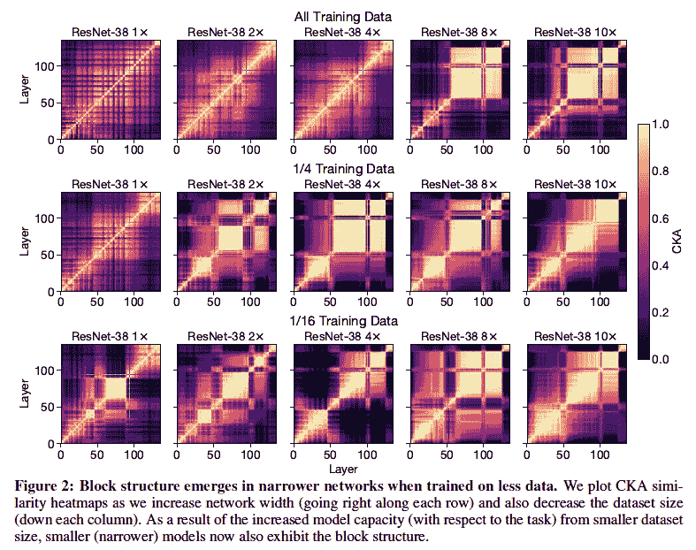
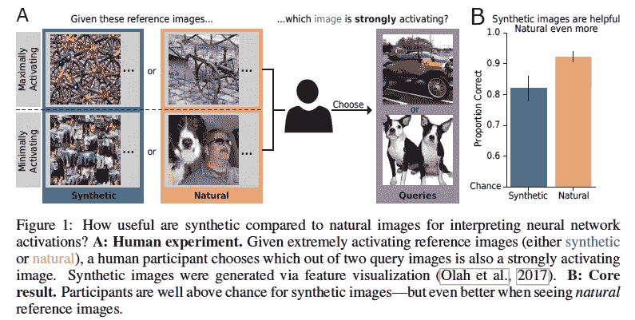
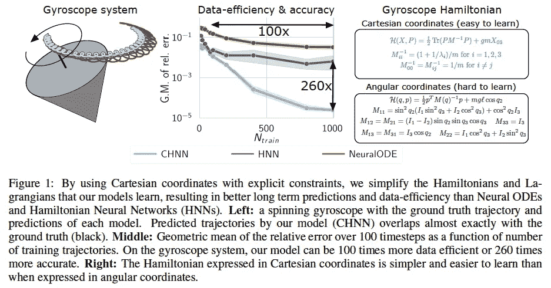

# 2020 年第 45 周

> 原文：<https://medium.com/analytics-vidhya/akiras-ml-news-week45-2020-c58112bd184f?source=collection_archive---------13----------------------->

下面是我在 2020 年第 45 周(11 月 1 日~)读到的一些我觉得特别有意思的论文和文章。我已经尽量介绍最近的了，但是论文提交的日期可能和星期不一样。

# 主题

1.  机器学习论文
2.  技术文章
3.  机器学习用例的例子
4.  其他主题

# —每周编辑精选

*   使用对抗性干扰而不是专业设计的数据扩充进行对比学习。
*   [发现大型网络有冗余结构](https://arxiv.org/abs/2010.15327)
*   [中间层激活图像是一个好的解释吗？](https://arxiv.org/abs/2010.12606)

# —过去的文章

[第 44 周](/analytics-vidhya/akiras-ml-news-week44-2020-eda5ee9fff33) ⇦第 45 周(本帖)⇨ [第 46 周](/analytics-vidhya/akiras-ml-news-week46-2020-e74a03116ebc)

[2020 年 10 月汇总](/analytics-vidhya/akiras-ml-news-october-2020-c7b5b4281d36)

[2020 年 9 月汇总](/analytics-vidhya/akiras-ml-news-september-2020-80ed65bd7ea4)

— — — — — — — — — — — — — — — — — — — — — — — — — — — — — —

# 1.机器学习论文

— —

# 选择不在 GAN 中生成的数据

*教一个甘什么不学*

他们提出了鲁米-GAN，通过让 GAN 鉴别器确定“要避免的真实数据”、“真”和“假”，而不是“真/假”，来有意调整生成的数据；与 ACGAN 等相比，它可以在数据不平衡的样本中成功生成特定类别的数据。

# 对比学习使用对立的干扰，而不是专业设计的数据增强。

*VIEWMAKER 网络:用于无监督表示学习的学习视图*https://arxiv.org/abs/2010.07432[T21](https://arxiv.org/abs/2010.07432)

对比学习学习一种对数据扩充不变的表示，但它们是由专家选择的。相反，作者提出了一种观点制造者，在图像上放置敌对的扰动。它可以应用于任何领域，是可穿戴设备语音和时间序列数据的一大改进。

# 发现大型网络具有冗余结构

*广网和深网学的东西一样吗？揭示神经网络表示如何随宽度和深度变化*
[https://arxiv.org/abs/2010.15327](https://arxiv.org/abs/2010.15327)

他们发现深度或广度网络在多个层中学习相似的表示(称为块结构)。这对应于特定于层的表示的主要成分。这些可用于修剪，对准确性影响最小。此外，宽模型的场景辨别能力强，深模型的消费品辨别能力强。

# 中间层激活图像是一个很好的解释吗？

典型的自然图像比特征可视化更好地解释了 CNN 的激活
[https://arxiv.org/abs/2010.12606](https://arxiv.org/abs/2010.12606)

一项研究调查了激活图像的中间层(如深度梦)能解释多少。进行了一项心理学实验，参与者被给予激活图像或自然图像作为参考图像，并被要求选择两个查询图像中哪个更活跃。结果是激活的图像将具有一定的解释性质，但是自然图像更能提供信息。

# 通过简化哈密顿量提高复杂系统的预测精度

*通过显式约束简化哈密顿和拉格朗日神经网络*
[https://arxiv.org/abs/2010.13581](https://arxiv.org/abs/2010.13581)

虽然广义坐标使哈密顿量更复杂，但嵌入笛卡尔坐标的约束哈密顿量简化了方程，使学习更容易。对于 N 摆和陀螺仪等复杂系统，精度/数据效率显著提高。

— — — — — — — — — — — — — — — — — — — — — — — — — — — — — —

# 2.技术文章

— — — —

# AI 诊断疾病有效吗？

与普通成像相比，医学成像在数据量和分辨率方面存在问题。由于图像尺寸较小，ML 可以相对较好地用于眼底扫描和皮肤任务，但它们仍然面临 MRI 的挑战，因为 MRI 的数据较少，噪音较多。

 [## 为什么皮肤病变是花生，脑瘤是更硬的坚果

### 为什么医学图像分析中的一些问题对 AI 来说比其他问题更难，我们能做些什么？在一个地标…

thegradient.pub](https://thegradient.pub/why-skin-lesions-are-peanuts-and-brain-tumors-harder-nuts/) 

— — — — — — — — — — — — — — — — — — — — — — — — — — — — — —

# 3.机器学习用例的例子

— — — —

# 用智能手机和人工智能识别新冠肺炎无症状患者。)

努力使用手机上关于咳嗽的音频信息来识别无症状的新冠肺炎患者。阿尔茨海默病患者和新冠肺炎咳嗽之间的相似性，基于识别阿尔茨海默病的模型，他们能够识别无症状患者的咳嗽。

 [## 人工智能模型通过手机记录检测无症状新冠肺炎感染…

### 根据定义，感染新冠肺炎病毒的无症状患者没有可辨别的身体症状

news.mit.edu](https://news.mit.edu/2020/covid-19-cough-cellphone-detection-1029) 

# GPT-3 可用于医疗保健？

一篇研究使用 GPT-3 的聊天机器人是否可以实际用于医疗保健设置的文章(当然，Open-AI 不建议将其应用于医疗保健设置)。他们不仅误诊。它缺乏简单的预约逻辑思维，还没有达到在医疗机构中使用的水平。

 [## GPT 医生-3:炒作还是现实？-纳布拉

### 你可能听说过 GPT-3 今年夏天，新的酷小子在人工智能块。GPT 3 号来自 OpenAI，它是世界上最好的…

www.nabla.com](https://www.nabla.com/blog/gpt-3/) 

— — — — — — — — — — — — — — — — — — — — — — — — — — — — — —

# 4.其他主题

— — — —

# 带有 100 个 GPU 的实例现已可用

Amazon 已经在 AWS 上推出了带 A100 GPUs 的 P4d 实例。从 11 月 2 日起在美国地区上市。

 [## Amazon EC2 P4d 实例- Amazon Web 服务

### 云中 ML 培训和 HPC 应用程序的最高性能 Amazon EC2 P4d 实例提供最高的…

aws.amazon.com](https://aws.amazon.com/ec2/instance-types/p4/) 

— — — — — — — — — — — — — — — — — — — — — — — — — — — — — —

# —过去的文章

[第 44 周](/analytics-vidhya/akiras-ml-news-week44-2020-eda5ee9fff33) ⇦第 45 周(本帖)⇨ [第 46 周](/analytics-vidhya/akiras-ml-news-week46-2020-e74a03116ebc)

【2020 年 10 月摘要

【2020 年 9 月摘要

— — — — — — — — — — — — — — — — — — — — — — — — — — — — — —

# 推特，我贴一句纸评论。

[https://twitter.com/AkiraTOSEI](https://twitter.com/AkiraTOSEI)