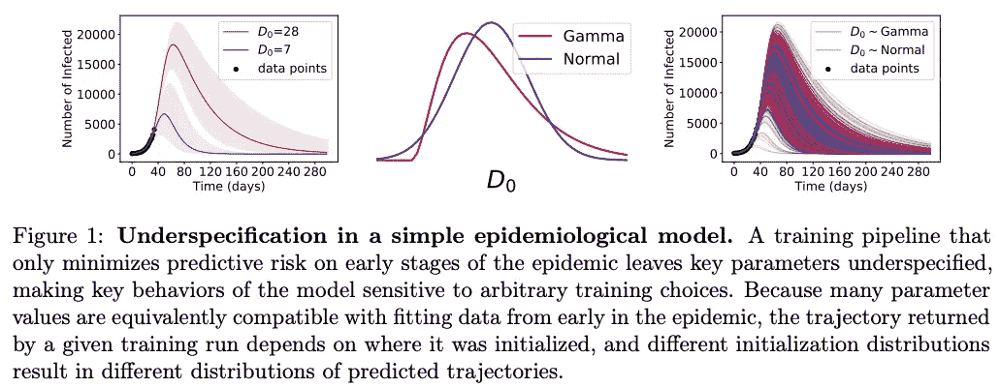
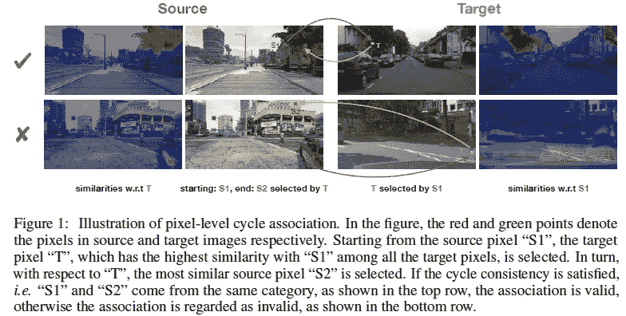
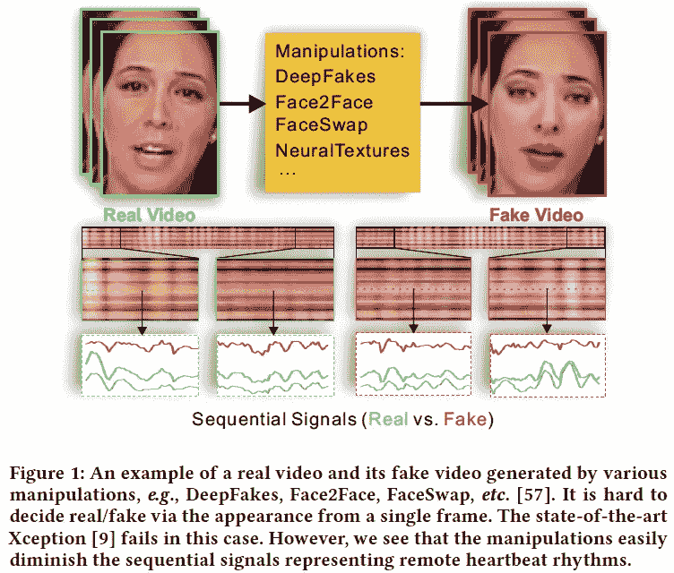
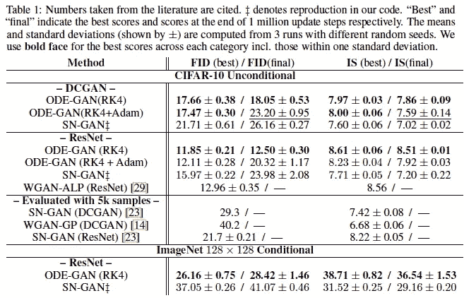

# 2020 年第 46 周

> 原文：<https://medium.com/analytics-vidhya/akiras-ml-news-week46-2020-e74a03116ebc?source=collection_archive---------24----------------------->

下面是我在 2020 年第 46 周(11 月 8 日~)读到的一些我觉得特别有意思的论文和文章。我已经尽量介绍最近的了，但是论文提交的日期可能和星期不一样。

# 主题

1.  机器学习论文
2.  技术文章
3.  机器学习用例的例子
4.  其他主题

# —每周编辑精选

*   [解决方案的不规范导致实际操作中的性能下降](https://arxiv.org/abs/2011.03395)
*   [用颂歌稳定甘](https://arxiv.org/abs/2010.15040)
*   [对无版权/歧视性元素的图像数据集进行预培训](https://hirokatsukataoka16.github.io/Pretraining-without-Natural-Images/)

# —过去的文章

[第 45 周](/analytics-vidhya/akiras-ml-news-week45-2020-c58112bd184f) ⇦第 46 周(本帖)⇨ [第 47 周](/analytics-vidhya/akiras-ml-news-week47-2020-2d6338328113)

[2020 年 10 月汇总](/analytics-vidhya/akiras-ml-news-october-2020-c7b5b4281d36)

[2020 年 9 月汇总](/analytics-vidhya/akiras-ml-news-september-2020-80ed65bd7ea4)

— — — — — — — — — — — — — — — — — — — — — — — — — — — — — —

# 1.机器学习论文

— —

# 通过离散化中间层表示来稳定 GAN

*特征量化提高甘训练*
[【https://arxiv.org/abs/2004.02088v2】](https://arxiv.org/abs/2004.02088v2)

通过替换存储在动态字典中的特征中最近的相邻特征来离散化鉴别器中间层输出的特征图，从而提高 GAN 性能的研究。它可以很容易地集成到现有的 GAN 框架中，并在计算成本略有增加的情况下提高性能。

# 解决方案的不详细说明导致实际操作中的性能下降

*欠规范对现代机器学习的可信度提出了挑战*
[https://arxiv.org/abs/2011.03395](https://arxiv.org/abs/2011.03395)

他们表明，在现实世界中部署的 ML 模型的性能退化问题与欠规范有关，其中存在具有相同预测性能的多个解决方案(模型参数的组合)。这种欠规范出现在所有领域，如自然语言处理，医学成像和计算机视觉，并应测试这些参数记住。

# 具有跨域的最近邻补片是同一类的约束的域适应。

*像素级循环关联:领域自适应语义分割的新视角* [https://arxiv.org/abs/2011.00147](https://arxiv.org/abs/2011.00147)

语义分割任务中的领域适应性研究通过约束随机抽取的源面片->其最近邻目标面片->其最近邻源面片的标签是相同的。这一结果大大超过了以往的研究。

# 用心跳检测深度假货

*DeepRhythm:用注意力视觉心跳节律* [https://arxiv.org/abs/2006.07634](https://arxiv.org/abs/2006.07634)曝光 DeepFakes

这项研究通过检测心跳引起的肤色变化来检测深度造假。现在的生成模型可以拍出逼真的电影，但无法再现肤色因血液而微妙变化的节奏。

# 使用 ODE 来稳定 GAN

*通过求解常微分方程* [https://arxiv.org/abs/2010.15040](https://arxiv.org/abs/2010.15040)训练生成性对抗网络

训练 GANs 中的不稳定性是由离散化连续动力学中的积分误差引起的，它们通过实验验证了众所周知的 ODE 求解器(如 Runge-Kutta)可以稳定训练。即使没有 SpectralNorm，学习也是稳定的，并且产生了优秀的结果。

# 一致的逐帧图像处理

*通过深度视频先验的盲视频时间一致性*
[https://arxiv.org/abs/2010.11838](https://arxiv.org/abs/2010.11838)

为了解决逐帧图像处理产生不一致视频的问题，他们提出了一种通过 CNN 学习图像处理的简单方法。他们的方法不需要正则化和大量的数据来纠正以前研究中的不一致。乍一看，并不清楚为什么会这样，但他们把视频中的湍流认为是噪声，在训练好的网络中，没有噪声的先验分布(视频的主要部分)先于噪声被再现，导致没有湍流。

# 置换权重以提高网络压缩性能

置换、量化和微调:神经网络的高效压缩
【https://arxiv.org/abs/2010.15703 

通过改变权重使其更具可压缩性的量化研究。它将置换的权重分成块，并用存储的向量集中的最近邻居来替换它们，而不直接使用它们。ResNet50 可以压缩到原来大小的 1/31，同时保持精度。

— — — — — — — — — — — — — — — — — — — — — — — — — — — — — —

# 2.技术文章

— — — —

# 2020 年计算机视觉值得关注的研究

它挑选了 2020 年发表的 10 篇可能具有高度重要性的计算机视觉论文，并从概述、技术核心、机器学习社区的反应以及它们在商业中的用途等方面对它们进行了总结。

 [## 2020 年的新颖计算机视觉研究论文

### 为了帮助您浏览大量优秀的计算机视觉论文，我们整理并总结了…

www.topbots.com](https://www.topbots.com/computer-vision-research-papers-2020/) 

— — — — — — — — — — — — — — — — — — — — — — — — — — — — — —

# 3.机器学习用例的例子

— — — —

# 利用人工智能管理建筑工地的具体进度

英国-以色列初创公司 Buildots 可以通过安装在其头部的 360°摄像头监控约 15 万个组件的状况(三到四个级别，如已安装)。它已经被安装在小型建筑工地上，预计将允许人类经理专注于更重要的任务，而不是单调的任务，如检查。

 [## 扫描建筑工地的人工智能可以发现什么时候东西落后了

### 建筑工地是巨大的人和零件的拼图，必须在正确的时间拼凑在一起…

www.technologyreview.com](https://www.technologyreview.com/2020/10/16/1010617/ai-image-recognition-construction-computer-vision-costs-delays/) 

# 美国政府补贴医疗人工智能使用费

隶属于美国卫生与人类服务部的组织 CMS 宣布，它将为使用两个诊断糖尿病并发症(可能导致失明)的系统和一个通过大脑扫描警告患者中风的系统支付费用。这一决定可能有助于促进人工智能在医疗保健领域的更广泛应用。

 [## 美国政府将支付医生使用这些人工智能算法

### 一些人工智能的突破发生在计算机科学实验室或紧张的电视棋盘游戏之间…

www.wired.com](https://www.wired.com/story/us-government-pay-doctors-use-ai-algorithms/) 

# 机器学习检测小地震

从传感器数据中检测小地震是一项需要专家几个月来分析的任务，但使用机器学习，可以在 20 分钟内完成。通过分析这种小地震，可以确定断层的三维结构，从而得出应对大地震的对策。

 [## 地震监测人工智能可以帮助预测，理解大地震

### 地球最外层的微小运动告诉我们许多关于大地震的信息。有点像人类的新算法…

hai.stanford.edu](https://hai.stanford.edu/blog/earthquake-monitoring-ai-could-help-anticipate-understand-major-quakes?sf131668405=1) 

— — — — — — — — — — — — — — — — — — — — — — — — — — — — — —

# 4.其他主题

— — — —

# 无版权/歧视元素的图像数据集预培训

一个使用自然界中常见的分形结构创建数据集的项目。网络上的大型数据集可能会受到版权和图像权利问题的影响。我们可以不用这样的自然图像，而是用自然界中频繁出现的分形结构来构建数据集，用它们来进行预训练，避免这样的问题，学习重要的结构。

 [## 无自然图像的预训练

### 亚洲计算机视觉会议(ACCV)2020 口头报告，论文获得 3 强接受！片冈博胜 1…

hirokatsukataoka16.github.io](https://hirokatsukataoka16.github.io/Pretraining-without-Natural-Images/) 

— — — — — — — — — — — — — — — — — — — — — — — — — — — — — —

# —过去的文章

[第 45 周](/analytics-vidhya/akiras-ml-news-week45-2020-c58112bd184f) ⇦第 46 周(本帖)⇨ [第 47 周](/analytics-vidhya/akiras-ml-news-week47-2020-2d6338328113)

【2020 年 10 月摘要

【2020 年 9 月摘要

— — — — — — — — — — — — — — — — — — — — — — — — — — — — — —

# 推特，我贴一句纸评论。

[https://twitter.com/AkiraTOSEI](https://twitter.com/AkiraTOSEI)