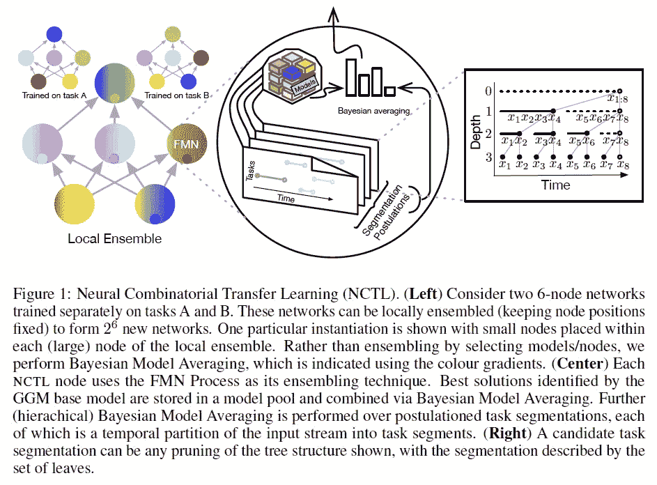
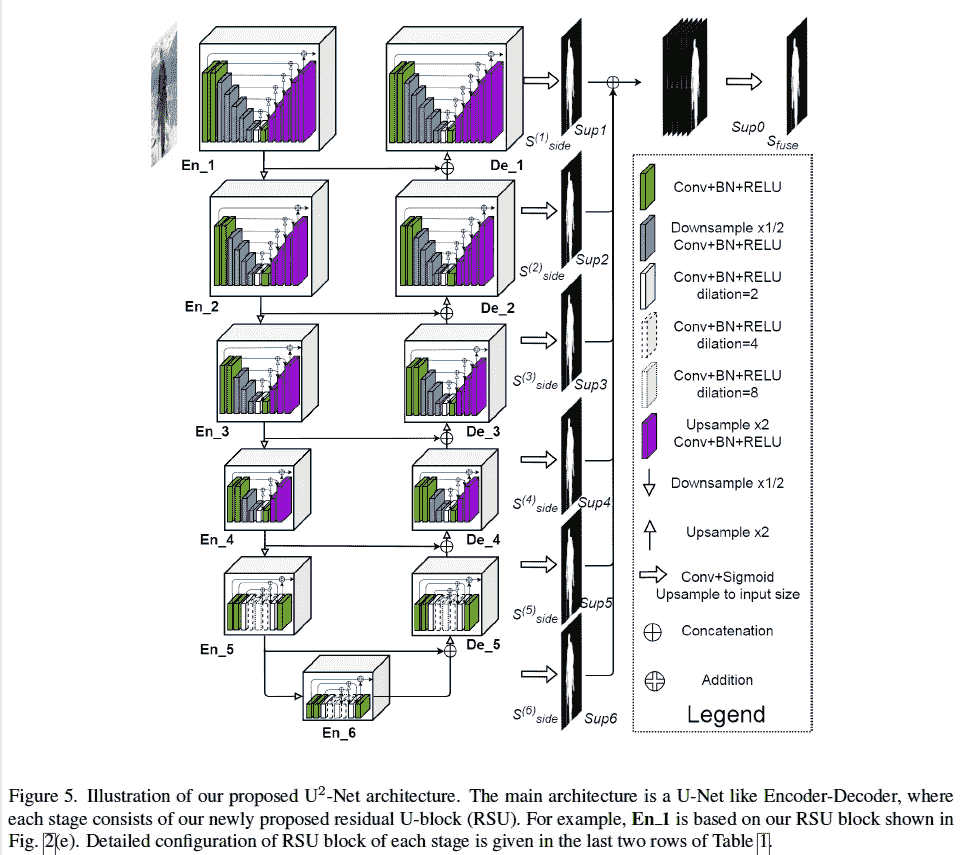
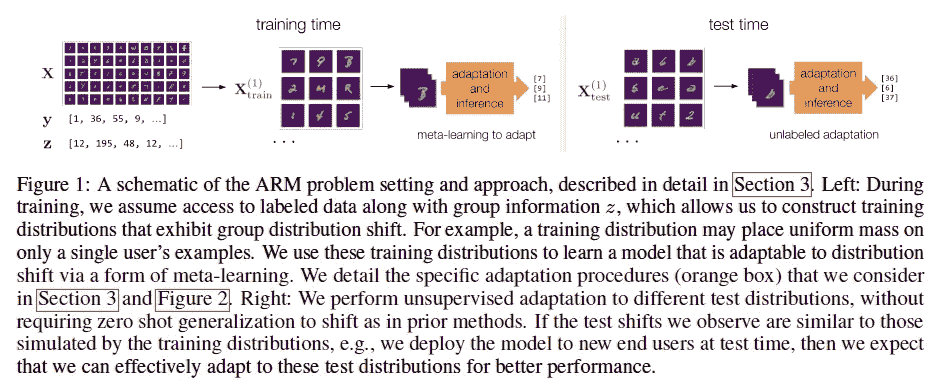
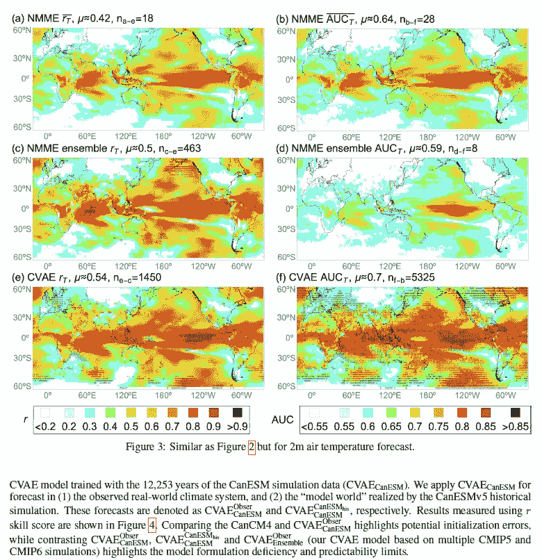
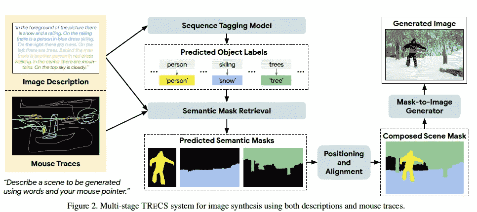
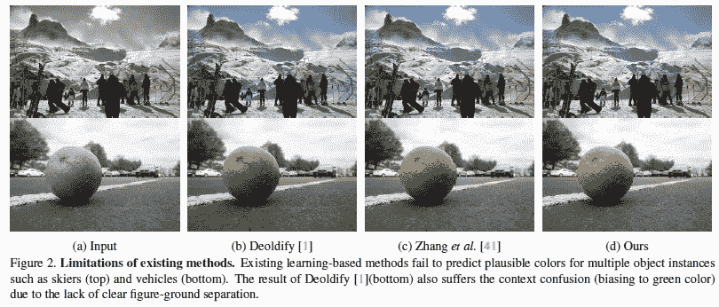
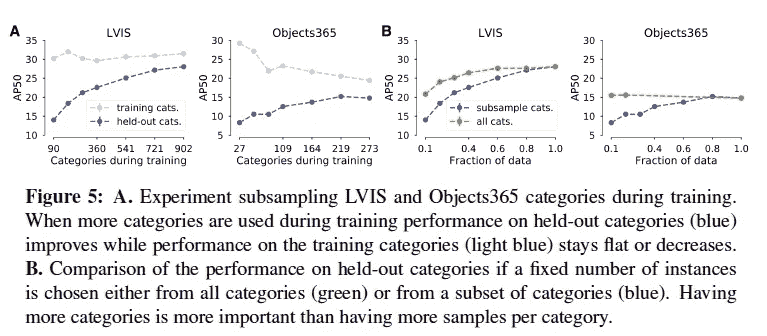

# 2020 年第 47 周

> 原文：<https://medium.com/analytics-vidhya/akiras-ml-news-week47-2020-2d6338328113?source=collection_archive---------23----------------------->

以下是我在 2020 年第 47 周(11 月 15 日~)读到的一些我觉得特别有意思的论文和文章。我已经尽量介绍最近的了，但是论文提交的日期可能和星期不一样。

# 主题

1.  机器学习论文
2.  技术文章
3.  机器学习用例的例子
4.  其他主题

# —每周编辑精选

*   [通过指明文本描述的位置来优化文本到图像的生成](https://arxiv.org/abs/2011.03775)
*   [让视频中的人说一种不同的语言](https://arxiv.org/abs/2011.03530)
*   [为什么决策树系统的方法常常优于神经网络？](https://towardsdatascience.com/when-and-why-tree-based-models-often-outperform-neural-networks-ceba9ecd0fd8)

# —过去的文章

[第 46 周](/analytics-vidhya/akiras-ml-news-week46-2020-e74a03116ebc) ⇦第 47 周(本帖)⇨ [第 48 周](/analytics-vidhya/akiras-ml-news-week48-2020-150accbf126e)

[2020 年 10 月汇总](/analytics-vidhya/akiras-ml-news-october-2020-c7b5b4281d36)

[2020 年 9 月汇总](/analytics-vidhya/akiras-ml-news-september-2020-80ed65bd7ea4)

— — — — — — — — — — — — — — — — — — — — — — — — — — — — — —

# 1.机器学习论文

— —

# 将单个神经元视为模块的集成技术

迁移学习的组合观
[https://arxiv.org/abs/2010.12268](https://arxiv.org/abs/2010.12268)

他们将单个神经元视为模块，并提出了一种将它们集成在一起的连续学习方法 NCTL:一个由 m 个节点组成的网络在 h 个任务上进行训练，可以应用于 h^m 伪任务。他们用实验证明，分裂主义者没有多少破坏性的遗忘。

# 让视频中的人说一种不同的语言

大型多语言视听配音
[https://arxiv.org/abs/2011.03530](https://arxiv.org/abs/2011.03530)

这项研究不仅翻译视频，而且转换视频，就像它在说语言一样。这是通过专注于转换说话者的说话方式来实现的，同时将注意力放在嘴巴的图像和嵌入视频的声音之间。

# 无版权/歧视元素的图像数据集预培训

无自然图像预训练
[http://hirokatsukataoka . net/pdf/accv 20 _ kata oka _ fractaldb . pdf](http://hirokatsukataoka.net/pdf/accv20_kataoka_fractaldb.pdf)

一个使用自然界中常见的分形结构创建数据集的项目。网络上的大型数据集可能会受到版权和图像权利问题的影响。我们可以不用这样的自然图像，而是用自然界中频繁出现的分形结构来构建数据集，用它们来进行预训练，避免这样的问题，学习重要的结构。

 [## 无自然图像的预训练

### 亚洲计算机视觉会议(ACCV)2020 口头报告，论文获得 3 强接受！片冈博胜 1…

hirokatsukataoka16.github.io](https://hirokatsukataoka16.github.io/Pretraining-without-Natural-Images/) 

# U-Net 中的 U-Net

U2-Net:使用嵌套的 U 型结构进行更深入的显著物体检测
[https://arxiv.org/abs/2005.09007](https://arxiv.org/abs/2005.09007)

为了在显著目标检测中有效利用各种分辨率的信息，他们提出了一种 U-网，即块是 U-网的 U-网。即使没有预先训练，结果也比以前的研究更有效/准确。

# 适应元学习中的学习和测试分布偏差

适应性风险最小化:一种解决群体转移的元学习方法
【https://arxiv.org/abs/2007.02931 

提出了自适应风险最小化(ARM)，使用元学习来适应测试时的数据分布变化。当提供了人物和作者(数据和伴随的信息)时，它们可以根据作者进行改编和推断。

# 基于机器学习的全球气候预测

使用概率深度学习
[https://arxiv.org/abs/2010.14610](https://arxiv.org/abs/2010.14610)改进季节性预测

基于气候模拟模型的深度学习模型(VAE)设计的全球气候预测研究。它可以预测厄尔尼诺现象将如何影响全球范围。

# 通过指明文本描述的位置来优化文本到图像的生成

基于精细用户注意力的文本到图像生成
[https://arxiv.org/abs/2011.03775](https://arxiv.org/abs/2011.03775)

提议的 TReCS，它使用自然语言解释并结合鼠标轨迹来指示正在放置哪个解释。每个单词都有一个遮罩标签，由此生成遮罩并合成图像。与以前的研究相比，生成质量大大提高。

# 通过给每个对象着色来改进着色

实例感知图像彩色化
[https://arxiv.org/abs/2005.10825](https://arxiv.org/abs/2005.10825)

在图像的彩色化中，通过用经过训练的模型裁剪对象并在对单个对象进行彩色化比直接对整个图像进行彩色化更容易的观点下对它们进行处理，来对对象进行彩色化。每个对象都可以被着色而不受背景的影响。

# 训练期间的大量类别可以在少数镜头设置中创建强大的对象检测模型

缩小一次性物体检测中的一般化差距
[https://arxiv.org/abs/2011.04267](https://arxiv.org/abs/2011.04267)

在物体检测方面，该研究表明，用更多类别训练的模型更适合少量学习。他们建议，在创建一个新的数据集时，最好集中精力创建许多类别，而不是收集许多单独的类别。

— — — — — — — — — — — — — — — — — — — — — — — — — — — — — —

# 2.技术文章

— — — —

# 数据集移位描述

一篇关于数据分布变化的解释性文章。解释协方差转移，先验概率转移等。，并解释了它们发生的原因以及如何识别数据集变化。

 [## 了解数据集转换

### 如何确保你的模型不会被你的数据欺骗。

towardsdatascience.com](https://towardsdatascience.com/understanding-dataset-shift-f2a5a262a766) 

# NeurIPS2020 中所有论文的句子摘要

《NeurIPS 2020》上发表的所有论文的一句话摘要文章现已发布。快速查看内容，以便轻松找到您感兴趣的内容。

# **为什么决策树系统的方法往往优于神经网络？**

这篇博客提出，神经网络是概率性地拟合模型，而决策树方法是确定性地拟合，所以神经网络对于不能用 0 或 1 表示的事物很强，比如图像，或者是模糊的、有很多例外的事物，比如自然语言，而决策树方法对于很多事件很强，因为它们可以用是/否来处理。

 [## 基于树的模型何时以及为什么(通常)优于神经网络

### 以及为什么它们没有那么大的不同

towardsdatascience.com](https://towardsdatascience.com/when-and-why-tree-based-models-often-outperform-neural-networks-ceba9ecd0fd8) 

— — — — — — — — — — — — — — — — — — — — — — — — — — — — — —

# 3.机器学习用例的例子

— — — —

# 在新冠肺炎的影响下更新了机器学习模型，增加了销售额

许多公司都面临着新冠肺炎导致他们现有的机器学习模型完全停止工作的问题。但中国的 JD.com 和阿里巴巴通过重新开发他们的机器学习模型来关注短期趋势，使他们的销售额比去年增加了 26%

 [## 疫情如何让阿里巴巴的人工智能为全球最大的购物日做好准备

### 新闻:当美国沉迷于选举时，中国却在购物。从 11 月 1 日到 11 日，这个国家的…

www.technologyreview.com](https://www.technologyreview.com/2020/11/13/1012073/pandemic-prepared-ai-for-alibaba-singles-day/) 

— — — — — — — — — — — — — — — — — — — — — — — — — — — — — —

# 4.其他主题

— — — —

# Tensorflow 现在在 Mac 上运行更快

采用 M1 芯片的 Mac 电脑将能够利用苹果 Mac 优化版的 TensorFlow 2.4 来显著提高性能。

 [## 在 Mac 上加速 TensorFlow 性能

### 2020 年 11 月 18 日-由 Pankaj Kanwar 和 Fred Alcober 在 TensorFlow 2 上发布，在

blog.tensorflow.org](https://blog.tensorflow.org/2020/11/accelerating-tensorflow-performance-on-mac.html) 

# 针对机器学习系统的网络攻击比你想象的更常见

尽管机器学习被用于金融和医疗保健等各个领域，但作者发现，不仅是中小企业，大型企业和政府机构等大型组织也没有准备好应对对机器学习的攻击。本文介绍了微软针对这些攻击所做的努力

 [## 针对机器学习系统的网络攻击比你想象的更普遍——微软安全

### 机器学习(ML)正在金融、医疗保健和国防等关键领域进行令人难以置信的变革…

www.microsoft.com](https://www.microsoft.com/security/blog/2020/10/22/cyberattacks-against-machine-learning-systems-are-more-common-than-you-think/) 

— — — — — — — — — — — — — — — — — — — — — — — — — — — — — —

# —过去的文章

[第 46 周](/analytics-vidhya/akiras-ml-news-week46-2020-e74a03116ebc) ⇦第 47 周(本帖)⇨ [第 48 周](/analytics-vidhya/akiras-ml-news-week48-2020-150accbf126e)

【2020 年 10 月摘要

【2020 年 9 月摘要

— — — — — — — — — — — — — — — — — — — — — — — — — — — — — —

# 推特，我贴一句纸评论。

[https://twitter.com/AkiraTOSEI](https://twitter.com/AkiraTOSEI)