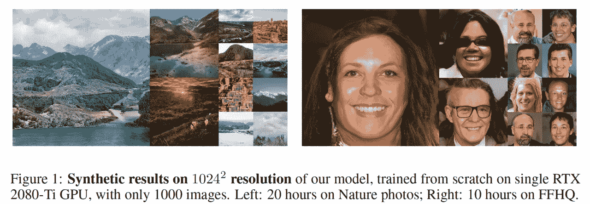
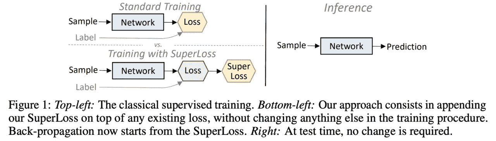
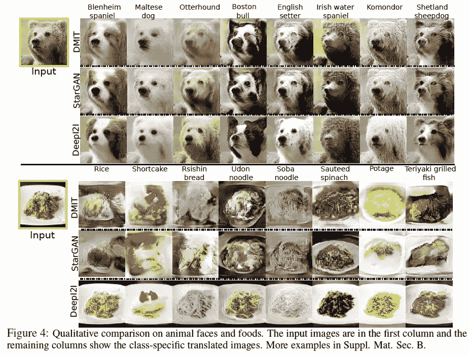
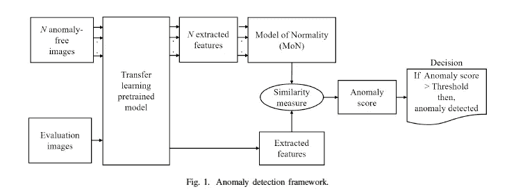
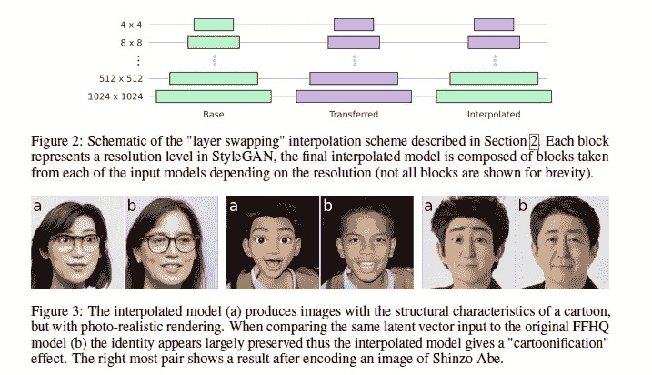
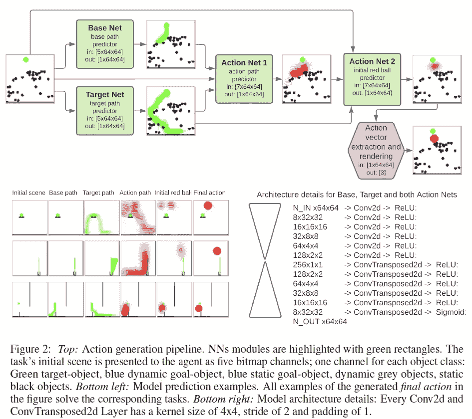
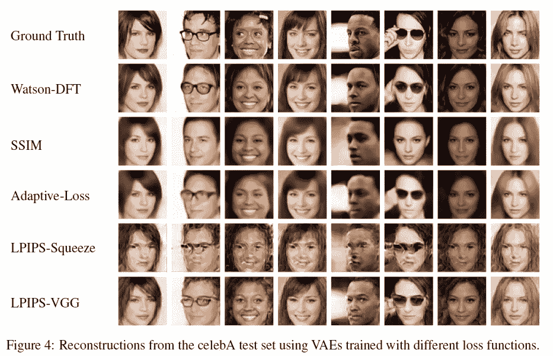

# 2020 年第 48 周

> 原文：<https://medium.com/analytics-vidhya/akiras-ml-news-week48-2020-150accbf126e?source=collection_archive---------14----------------------->

以下是我在 2020 年第 47 周(11 月 15 日~)读到的一些我觉得特别有意思的论文和文章。我已经尽量介绍最近的了，但是论文提交的日期可能和星期不一样。

# 主题

1.  机器学习论文
2.  机器学习用例的例子
3.  其他主题

# —每周编辑精选

*   [GAN，生成高分辨率图像，数据量小，计算时间少](https://openreview.net/forum?id=1Fqg133qRaI)
*   [通过交换图层进行风格转换](https://arxiv.org/abs/2010.05334)
*   [在人工智能的帮助下植树](https://blog.google/products/earth/helping-cities-seed-new-trees-with-tree-canopy-lab/)

# —过去的文章

[第 47 周](/analytics-vidhya/akiras-ml-news-week47-2020-2d6338328113) ⇦第 48 周(本帖)⇨ [第 49 周](/analytics-vidhya/akiras-ml-news-week49-2020-1eef6779d2ed)

[2020 年 10 月汇总](/analytics-vidhya/akiras-ml-news-october-2020-c7b5b4281d36)

[2020 年 9 月汇总](/analytics-vidhya/akiras-ml-news-september-2020-80ed65bd7ea4)

— — — — — — — — — — — — — — — — — — — — — — — — — — — — — —

# 1.机器学习论文

— —

# GAN 生成高分辨率图像，数据量小，计算时间短

实现更快、更稳定的 GAN 训练，实现高保真少镜头图像合成
[https://openreview.net/forum?id=1Fqg133qRaI](https://openreview.net/forum?id=1Fqg133qRaI)

可以从零开始训练/生成高分辨率(256 ~1024)的 gan，数据量小(100~1000)，计算复杂度小(1 GPUx10hours~)。技术关键是一个 SLE 模块，它结合了每个分辨率的信息和一个允许从鉴别器的中间特征图重建的约束。

# 如果使用损失函数来自动确定什么是可靠的阈值，那么在许多任务中的课程学习是可能的

超级损失:稳健课程学习的一般性损失
[https://papers . nips . cc/paper/2020/hash/2 CFA 8 F9 e 50 E0 f 510 ede 9d 12338 a5f 564-abstract . html](https://papers.nips.cc/paper/2020/hash/2cfa8f9e50e0f510ede9d12338a5f564-Abstract.html)

他们提出了一种损失函数 SuperLoss，可以动态确定每个样本的置信水平，自动确定损失函数的可信度阈值，用于课程训练。因为它可以添加到现有的损失函数中，所以它可以用于各种任务，例如分类、对象检测和回归，并且在具有标签噪声的任务中是有效的。

# 利用预先训练的模型，允许 GAN 使用少量数据进行转换。

DeepI2I:通过从甘斯
[https://arxiv.org/abs/2011.05867](https://arxiv.org/abs/2011.05867)传输，实现深度分层图像到图像的翻译

在使用 GAN 的图像到图像转换中，他们提出利用现有的已训练模型用于生成器、鉴别器和编码器(读取转换源的编码器是已训练的预训练鉴别器权重)。可以使用先验知识，因此需要较少的数据来使转换成为可能。

# 用于异常检测的端到端框架

使用正态模型进行异常检测的迁移学习框架
https://arxiv.org/abs/2011.06210

一种端到端异常检测方法。异常性通过被检查图像和嵌入在具有训练模型的正常图像数据集中的特征分布之间的距离来测量。使用 SSIM 等测量分布和检查图像之间的距离。

# 通过交换图层来执行样式转换

用于域间可控图像合成的分辨率相关 GAN 插值
[https://arxiv.org/abs/2010.05334](https://arxiv.org/abs/2010.05334)

使用训练过的语体进行语体转换的研究。一种 GAN，通过在新的数据集上将转移学习的 StyleGAN 的浅层部分与常规训练的 StyleGAN 的深层部分进行交换来执行样式转换，从而允许对照片进行类似迪士尼的转换。

# 在深度学习中解决物理难题

通过推理路径解决物理难题
[https://arxiv.org/abs/2011.07357](https://arxiv.org/abs/2011.07357)

用一个球接触另一个球的目标位置来解决一个难题的研究。通过让用户学习监督学习中的四个模型来解决该任务，这四个模型预测没有动作的球体的轨迹、球体的理想轨迹等..

# 用感知损失函数改进生成模型

基于沃森感知模型的生成神经网络损失函数
[https://arxiv.org/abs/2006.15057](https://arxiv.org/abs/2006.15057)

通过使用沃森模型的损失函数的改进版本进行研究，以提高生成图像的质量，沃森模型的损失函数更接近于生成模型中的人类感知；证实了将它应用于 VAE 产生了具有较少模糊的高质量图像。

— — — — — — — — — — — — — — — — — — — — — — — — — — — — — —

# 2.技术文章

— — — —

# 仔细解释机器学习模型的可解释性

这篇文章解释了为什么可解释性很重要，以及诸如模型透明性之类的功能，并从定义中给出了详细的解释和图表。例如，关于透明度，文章解释了一些因素，如人类是否可以通过与模型相同的步骤进行推理，以及每一步是否都是可解释的。

 [## 机器学习中的可解释性:综述

### 这篇文章提供了机器学习可解释性子领域的广泛概述。虽然不详尽，我的…

thegradient.pub](https://thegradient.pub/interpretability-in-ml-a-broad-overview/) 

— — — — — — — — — — — — — — — — — — — — — — — — — — — — — —

# 3.机器学习用例的例子

— — — —

# 在人工智能的帮助下植树。

 [## 用人工智能和航空影像的力量创造新的树荫

### 通过树冠实验室，我们发现超过 50%的洛杉矶人生活在树木不到 10%的地区…

博客.谷歌](https://blog.google/products/earth/helping-cities-seed-new-trees-with-tree-canopy-lab/) 

热岛效应成为一个公共健康问题，但它可以通过在城市植树来预防。谷歌的 TreeCanopy 实验室可以使用航拍图像和机器学习来创建一个地图，显示一个城市的树木覆盖密度。这将消除人工树木调查的需要。树木树冠实验室的短期目标是到 2021 年种植和维护 90，000 棵树，并继续在一个超过 503 平方英里的城市每年种植 20，000 棵树

# 使用机器学习保护动物免遭偷猎

 [## ZSL 如何使用 ML 声学分类器保护野生动物

### ZSL 如何使用谷歌云机器学习对枪声进行分类以保护野生动物

cloud.google.com](https://cloud.google.com/blog/products/ai-machine-learning/how-zsl-uses-google-cloud-to-analyse-acoustic-data) 

谷歌和国际保护慈善机构 ZSL 建立了一个机器学习模型，使用机器学习来识别枪声。声学传感器可以探测到 1 公里以外的枪声，从而协助野生动物保护者的工作。

— — — — — — — — — — — — — — — — — — — — — — — — — — — — — —

# 3.其他主题

— — — —

# 机器学习歧视与法律

 [## “肯定性算法”的法律探讨

### 修正算法偏差的解决方案可能会与法律发生冲突。两位学者提出了一个解决方案。

hai.stanford.edu](https://hai.stanford.edu/blog/legal-approach-affirmative-algorithms?sf132409414=1) 

根据训练数据，机器学习模型可能无意中具有潜在的歧视性。一个简单的对策是对此进行调整，比如给少数族裔打分，但现行法律让这变得很难。

# 生成一个怪物 GAN

 [## 用甘创造出梦幻般的生物

### 为数字视频游戏创作艺术需要高度的艺术创造力和技术知识，同时也…

ai.googleblog.com](https://ai.googleblog.com/2020/11/using-gans-to-create-fantastical.html) 

一个自动生成游戏怪物的 GAN。由于多样性和版权的原因，现有的插图数据集无法使用，所以他们使用 3D 模型创建了一个数据集，生物的数量，它们的结构，造型和生物每个部分的比例都通过面具清楚地显示出来。

— — — — — — — — — — — — — — — — — — — — — — — — — — — — — —

# —过去的文章

[第 46 周](/analytics-vidhya/akiras-ml-news-week46-2020-e74a03116ebc) ⇦第 47 周(本帖)⇨ [第 48 周](/analytics-vidhya/akiras-ml-news-week49-2020-1eef6779d2ed)

【2020 年 10 月摘要

【2020 年 9 月摘要

— — — — — — — — — — — — — — — — — — — — — — — — — — — — — —

# 推特，我贴一句纸评论。

【https://twitter.com/AkiraTOSEI 