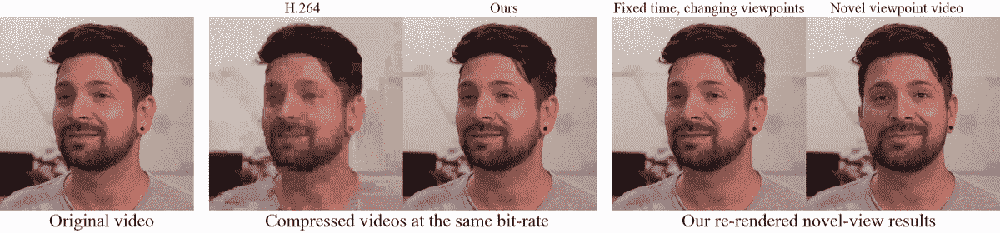
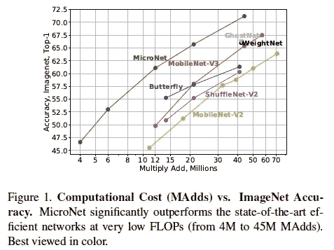
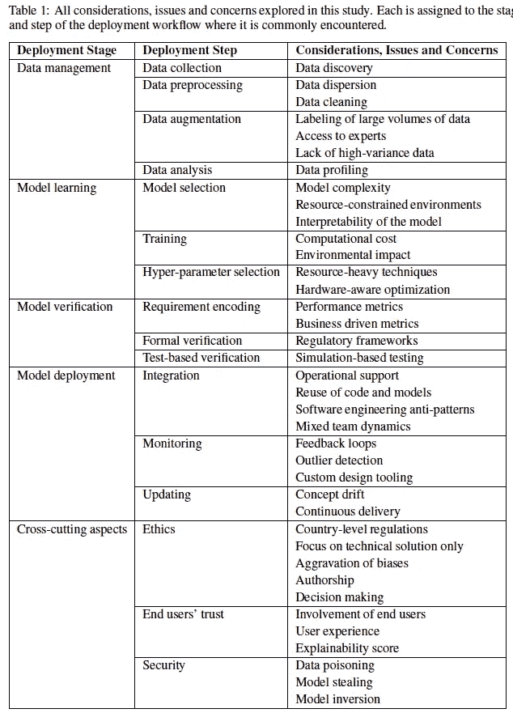
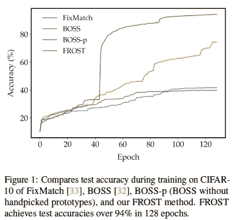
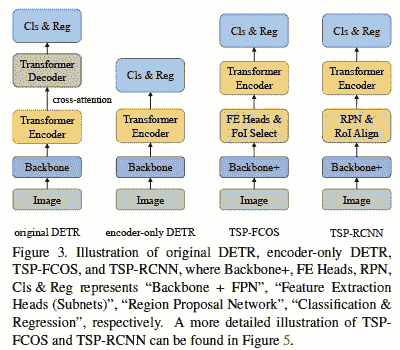
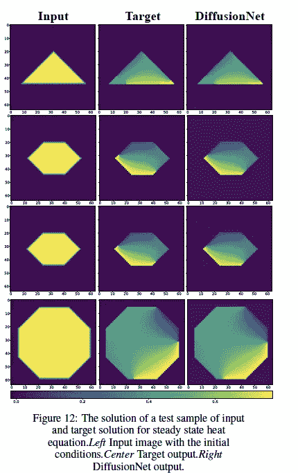
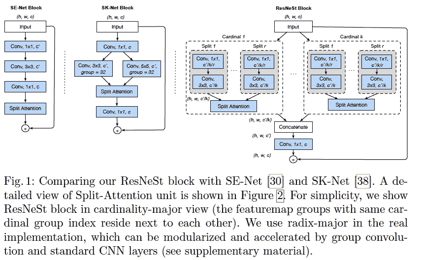
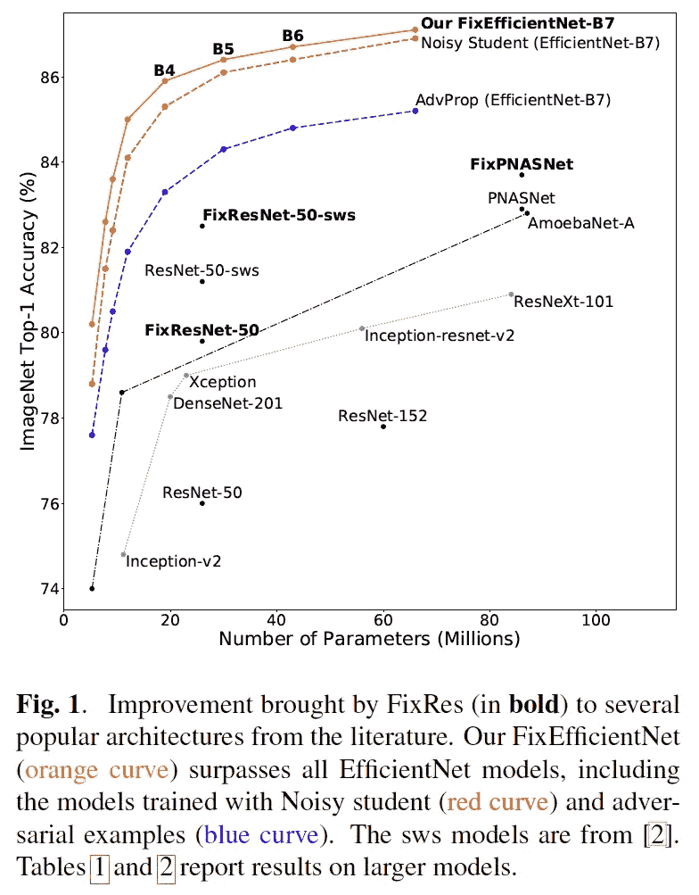

# 2020 年第 49 周

> 原文：<https://medium.com/analytics-vidhya/akiras-ml-news-week49-2020-1eef6779d2ed?source=collection_archive---------27----------------------->

以下是我在 2020 年第 49 周(11 月 29 日~)读到的一些我觉得特别有意思的论文和文章。我已经尽量介绍最近的了，但是论文提交的日期可能和星期不一样。

# 主题

1.  机器学习论文
2.  技术文章
3.  机器学习用例的例子
4.  其他主题

# —每周编辑精选

*   [通过指明文本描述的位置来优化文本到图像的生成](https://arxiv.org/abs/2011.03775)
*   [让视频中的人说一种不同的语言](https://arxiv.org/abs/2011.03530)
*   [为什么决策树系统的方法常常优于神经网络？](https://towardsdatascience.com/when-and-why-tree-based-models-often-outperform-neural-networks-ceba9ecd0fd8)

# —过去的文章

[第 48 周](/analytics-vidhya/akiras-ml-news-week48-2020-150accbf126e) ⇦第 49 周(本帖)⇨ [第 50 周](/analytics-vidhya/akiras-ml-news-week50-2020-2091f11a72a9)

[2020 年 11 月汇总](/analytics-vidhya/akiras-ml-news-november-2020-a48a3cb75285) [2020 年 10 月汇总](/analytics-vidhya/akiras-ml-news-october-2020-c7b5b4281d36)
[2020 年 9 月汇总](/analytics-vidhya/akiras-ml-news-september-2020-80ed65bd7ea4)

— — — — — — — — — — — — — — — — — — — — — — — — — — — — — —

# 1.机器学习论文

— —

# GAN 技术在降低视频会议流量的同时保持图像的高质量

用于视频会议的单镜头自由视角神经摄像头合成
[https://arxiv.org/abs/2011.15126](https://arxiv.org/abs/2011.15126)

在视频会议中，与商业标准相比，只向接收者发送脸部的关键点表示可以节省十倍的带宽。从关键点表示来看，接收方使用少镜头的说话头来重建高质量的人脸图像。

# 一个比 MobileNetV3 计算量更少、精度更高的模型

MicroNet:面向极低 FLOPs 的图像识别【https://arxiv.org/abs/2011.12289
T22

提出了微因子分解卷积，它使用对角块矩阵来实现层之间连接的分组，同时交换通道，如 ShuffleNet 和 dynamic Shift-Max，它通过跨组取最大值来加强非线性。结果大大超过精度，而计算复杂度比 MobileNetV3 小。

# 将机器学习应用于现实世界时面临的挑战和克服的方法综述

部署机器学习的挑战:案例研究调查
[https://arxiv.org/abs/2011.09926](https://arxiv.org/abs/2011.09926)

对现实世界中机器学习的挑战和解决方案的调查，涉及数据、学习、评估和应用实施。这是一个论文集，深入研究了每一个挑战，并描述了他们是如何克服的。

# 半监督学习和对比学习的结合

冰霜:更快更强的一击半监督训练
【https://arxiv.org/abs/2011.09471 

通过将对比学习的损失纳入半监督学习，提出 FROST 使学习更快；仅在大约 128 个时期与监督学习的准确度相当，并且对超参数选择具有鲁棒性。

# 风格转换的过程中，就像一个人用画笔绘画

风格化的神经绘画
[https://arxiv.org/abs/2011.08114](https://arxiv.org/abs/2011.08114)

这项研究不是为每个像素构造一个值，而是在一个类似于人类用画笔绘画的过程中执行一个样式转换。使用来自空白画布的可区分渲染器，用笔画重复多次，并基于与参考的相似性，以自我监督的方式训练。

# 通过去除解码器提高基于变压器的对象检测模型的收敛速度

重新思考用于对象检测的基于变压器的集合预测
[https://arxiv.org/abs/2011.10881](https://arxiv.org/abs/2011.10881)

使用变换器的对象检测模型 DETR 具有缓慢的收敛(500 个历元)。他们将收敛缓慢的原因确定为解码器，消除它，并采用 Fater-RCNN 之类的机制。收敛速度快得多(36 个历元~)，精度也提高了。

# 数据驱动下求解时间相关偏微分方程

扩散网:使用深度学习加速求解依赖于时间的偏微分方程。
[https://arxiv.org/abs/2011.10015](https://arxiv.org/abs/2011.10015)

提出了数据驱动的、依赖于时间的偏微分方程求解器 DiffusionNet，证实了在空间和时间较大的情况下，对于二维瞬态传热等任务存在加速优势。

# 结合 ResNeXt 分组和选择性核结构

雷斯内特:注意力分散网络
[https://arxiv.org/abs/2004.08955](https://arxiv.org/abs/2004.08955)

提出了一种结合类分组和选择性核结构的分离注意模块。确认图像分类、对象检测、语义分割和实例分割的准确性有所提高。

# 通过纠正训练和推理过程中分辨率的不一致来提高准确性

修正列车-测试分辨率差异:修正效率网
[https://arxiv.org/abs/2003.08237](https://arxiv.org/abs/2003.08237)

EfficientNet 通过提高分辨率来提高准确性，但在训练和推理过程中分辨率之间存在差距。通过在训练后以给定的分辨率微调顶层，他们填补了这一空白，并在不使用外部数据(SotA)的情况下，在 ImageNet 中取得了比 NoisyStudent 更好的结果。

— — — — — — — — — — — — — — — — — — — — — — — — — — — — — —

# 2.技术文章

— — — —

# 2020 年最佳 10 篇机器学习论文

 [## 2020 年顶级人工智能和机器学习研究论文

### 为了帮助你赶上必要的阅读，我们总结了 2020 年以来的 10 篇重要的机器学习研究论文。

www.topbots.com](https://www.topbots.com/ai-machine-learning-research-papers-2020/) 

本文介绍了 2020 年发表的 10 篇机器学习论文，包括 GPT-3、EfficientDet、ViT 等。它不仅给出了概述，还总结了核心技术和社区反应。

— — — — — — — — — — — — — — — — — — — — — — — — — — — — — —

# 3.机器学习用例的例子

— — — —

# 穿着睡衣去参加视频会议

 [## xpression camera:一款虚拟相机应用程序，在冠状病毒疫情期间重新发明了变焦通话

### Mac 版将分发给在 app 网站等候名单上注册的用户。Windows 版本是…

www.prnewswire.com](https://www.prnewswire.com/news-releases/xpression-camera-a-virtual-camera-app-that-reinvents-zoom-calls-amid-the-coronavirus-pandemic-301169902.html) 

[具体化](https://embodyme.com/)发布了“xpression”，这是一个虚拟相机应用程序，它使用人工智能来改变相机上的人。你甚至可以让爱因斯坦为你说话。当你觉得在视频会议中一直被人监视，并且对此感到厌倦时，这是很有用的。

— — — — — — — — — — — — — — — — — — — — — — — — — — — — — —

# 4.其他主题

— — — —

# DeepMind 解决了 50 年未解决的蛋白质折叠问题

 [## AlphaFold:生物学 50 年来最大挑战的解决方案

### 在一项重大的科学进步中，我们的人工智能系统 AlphaFold 的最新版本被认为是解决这一问题的解决方案…

deepmind.com](https://deepmind.com/blog/article/alphafold-a-solution-to-a-50-year-old-grand-challenge-in-biology) 

DeepMind 宣布 AlphaFold2，这是 AlphaFold 的一个巨大改进版本，声称 AlphaFold2 解决了一个 50 年来未解决的蛋白质折叠问题。该论文和详细的方法尚未发表。

— — — — — — — — — — — — — — — — — — — — — — — — — — — — — —

# —过去的文章

[第 48 周](/analytics-vidhya/akiras-ml-news-week48-2020-150accbf126e) ⇦第 49 周(本帖)⇨ [第 50 周](/analytics-vidhya/akiras-ml-news-week50-2020-2091f11a72a9)

[2020 年 11 月汇总](/analytics-vidhya/akiras-ml-news-november-2020-a48a3cb75285) [2020 年 10 月汇总](/analytics-vidhya/akiras-ml-news-october-2020-c7b5b4281d36)
[2020 年 9 月汇总](/analytics-vidhya/akiras-ml-news-september-2020-80ed65bd7ea4)

— — — — — — — — — — — — — — — — — — — — — — — — — — — — — —

# 推特，我贴一句纸评论。

[https://twitter.com/AkiraTOSEI](https://twitter.com/AkiraTOSEI)