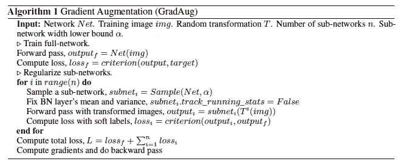
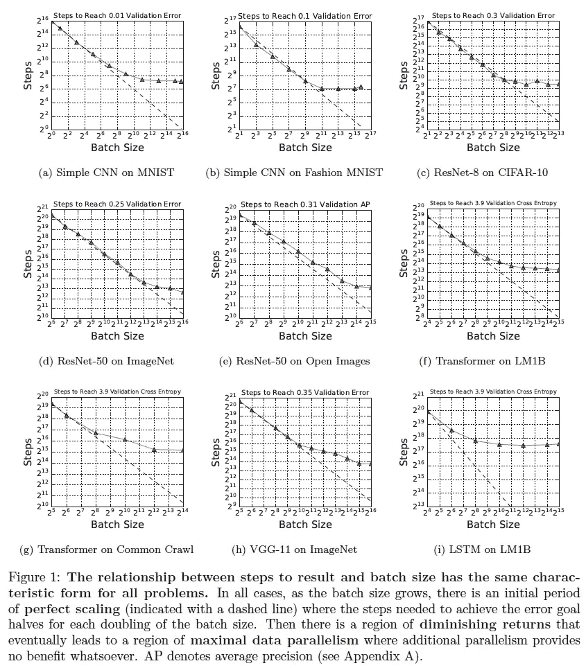
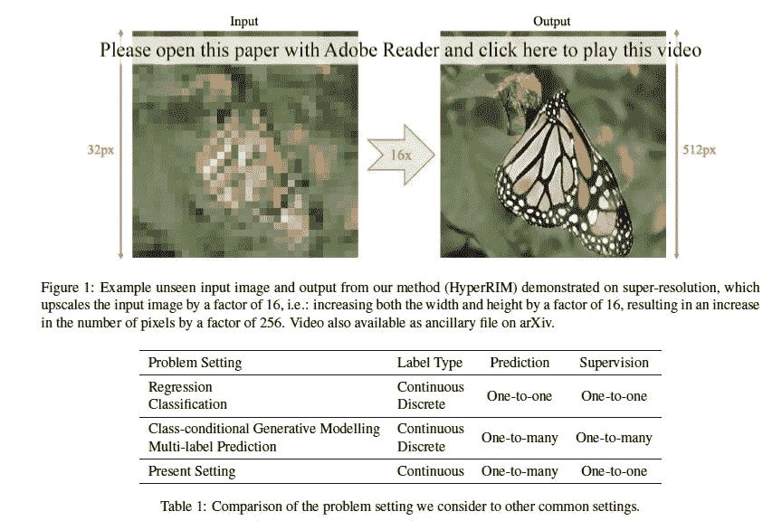
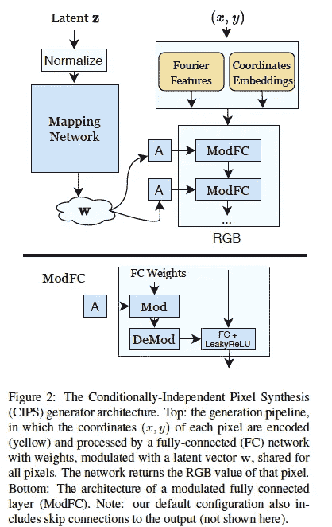
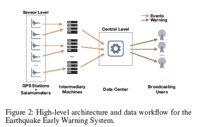
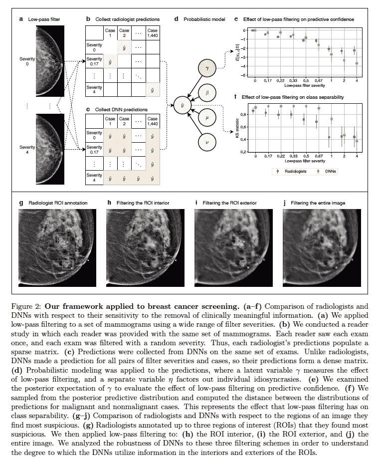

# Akira 的 ML 新闻# 2020 年第 50 周

> 原文：<https://medium.com/analytics-vidhya/akiras-ml-news-week50-2020-2091f11a72a9?source=collection_archive---------23----------------------->

下面是我在 2020 年第 50 周(12 月 6 日~)读到的一些我觉得特别有意思的论文和文章。我已经尽量介绍最近的了，但是论文提交的日期可能和星期不一样。

# 主题

1.  机器学习论文
2.  技术文章
3.  机器学习用例的例子
4.  其他主题

# —每周编辑精选

*   [医生和深度学习模型诊断的区别](https://arxiv.org/abs/2011.14036)
*   [研究神经网络中神经元的作用](https://distill.pub/2020/circuits/equivariance/)
*   [比较人类和机器学习建议](https://hbr.org/2020/10/when-do-we-trust-ais-recommendations-more-than-peoples)

# —过去的文章

[第 49 周](/analytics-vidhya/akiras-ml-news-week49-2020-1eef6779d2ed) ⇦第 50 周(本帖)⇨第 51 周(不成文)

[2020 年 11 月汇总](/analytics-vidhya/akiras-ml-news-november-2020-a48a3cb75285) [2020 年 10 月汇总](/analytics-vidhya/akiras-ml-news-october-2020-c7b5b4281d36)
[2020 年 9 月汇总](/analytics-vidhya/akiras-ml-news-september-2020-80ed65bd7ea4)

— — — — — — — — — — — — — — — — — — — — — — — — — —

# 1.机器学习论文

— —

# 规则化切除网络的一部分

*GradAug:一种新的深度神经网络正则化方法*
[https://arxiv.org/abs/2006.07989](https://arxiv.org/abs/2006.07989)

他们提出了 GradAug，它提供了一个子网络，其中一些权重从网络中删除，并约束数据增强图像的子网络输出，以匹配原始网络的输出。对敌对干扰具有鲁棒性，并且在分类和对象检测中具有改进的准确性。

# 最优批量的研究

https://arxiv.org/abs/1811.03600
[测量数据并行性对神经网络训练的影响](https://arxiv.org/abs/1811.03600)

检验批量大小和准确性、模型大小和数据集之间关系的研究。结果表明，随着批量的增加，一些模型变得更加精确，最优学习速率并不随着批量的增加而线性增加，动量系统随着大于正常 SGD 批量的增加变得更加精确，等等。

# 利用输出不是唯一确定的这一事实，成功地实现了 16 倍的超分辨率。

*生成未观察到的替代方案*
[https://arxiv.org/abs/2011.01926](https://arxiv.org/abs/2011.01926)

在生成模型中，对于输入的输出不是唯一确定的问题，提出了隐式最大似然估计(IMLE ),它使用多个随机码和输入来生成并选择最接近训练正确答案的一个。成功实现了 16x 的超分辨率。

# 没有卷积层的生成模型 CIPS

*具有条件独立像素合成的图像发生器*
[https://arxiv.org/abs/2011.13775](https://arxiv.org/abs/2011.13775)

他们提出了一个没有卷积层的生成模型 CIPS。它具有通过诸如 StyleGAN 的潜在变量的非线性变换将潜在变量嵌入每一层的机制，以及通过坐标的傅立叶变换添加位置信息的位置编码等。

# 机器学习在地震预警系统中的应用

*地震预警的分布式多传感器机器学习方法*
[https://www . una VCO . org/projects/major-projects/earth cube/geosciframework/fau vel _ et al _ aaai 2020 _ Distributed _ Multi-Sensor _ Machine _ Learning _ Approach _ to _ Early _ warning . pdf](https://www.unavco.org/projects/major-projects/earthcube/geosciframework/Fauvel_etal_AAAI2020_Distributed_Multi-Sensor_Machine_Learning_Approach_to_Earthquake_Early_Warning.pdf)

在地震预警系统(EEW)中，使用传感器的每 2 种常规方法都有一些弱点。通过将它们定义为地震规模分类问题并使用 kNN 构建模型，我们大大提高了对大地震的预测性能。

# 医生和深度学习模型诊断的区别。

*医学诊断中人与机器感知的差异*
[https://arxiv.org/abs/2011.14036](https://arxiv.org/abs/2011.14036)

医生和深度学习模型诊断的差异研究。深度学习依赖于图像的高频成分，根据任务的不同，通过低通滤波器比医生更明显地降低了准确性。他们还证实，根据辛普森悖论，如果不将医学知识纳入评估方法，他们就无法正确评估表现。

# 使用正常背景时实时裁剪一个人

实时人像抠图真的需要绿屏吗？
[https://arxiv.org/abs/2011.11961](https://arxiv.org/abs/2011.11961)

无绿色或蓝色均匀背景图像的实时人体图像裁剪研究。该策略是用监督方式训练模型，然后用未标记数据进行自监督训练，以调整模型用于三个任务的一致性，边界预测用于低/高分辨率掩模预测。

— — — — — — — — — — — — — — — — — — — — — — — — — —

# 2.技术文章

— —

# 神经元在神经网络中的作用研究

 [## 神经网络中自然发生的等方差

### 卷积神经网络包含一个隐藏的对称世界。这种对称性是一种强有力的工具…

蒸馏. pub](https://distill.pub/2020/circuits/equivariance/) 

本文给出了一个经过训练的网络(ImageNet trained InceptionV1)的示例，其中神经元检测到的模式从等价变为不变性。在检测特定模式的神经元中，有一组神经元，当应用诸如旋转的变换时，其模式变得等同。本文介绍了一个示例，说明如何将这些神经元和权重矩阵结合起来，以创建对下一层中的操作(如旋转)不变的神经元。不仅对于旋转不变性，而且对于颜色和比例也观察到相同的现象。

— — — — — — — — — — — — — — — — — — — — — — — — — —

# 3.机器学习用例的例子

— —

# 深度强化学习让气球停留的时间更长。

 [## 谷歌的人工智能可以让气球连续飞行 300 多天

### 在偏远地区充当浮动蜂窝塔的巨大平流层气球可以在空中停留数百天…

www.newscientist.com](https://www.newscientist.com/article/2261369-googles-ai-can-keep-loon-balloons-flying-for-over-300-days-in-a-row/) 

Alphabet 的子公司 Loon 已经成功制造了一个气球，它充当了一个基站，并配备了一个由深度强化学习控制的控制器，可以在空中停留 312 天。这是一个巨大的进步，超过了之前 223 天的记录。它将能够为偏远地区成千上万的人提供互联网接入。

# 比较人类和机器学习建议

 [## 什么时候我们更相信 AI 的推荐而不是人的？

### 越来越多的公司正在利用机器学习、自然语言处理和…

hbr.org](https://hbr.org/2020/10/when-do-we-trust-ais-recommendations-more-than-peoples) 

一篇比较人类和机器学习推荐的文章。结果显示，在涉及到诸如外套或电脑的透气性等实用建议时，机器学习优于人类，而人类更擅长推荐感官体验和产品，如葡萄酒、香味或外套的面料。了解这些特征有助于你在实际应用中充分利用 AI。

— — — — — — — — — — — — — — — — — — — — — — — — — —

# 4.其他主题

— —

# 优步出售自动驾驶装置

 [## 在一度吹捧自动驾驶汽车后，优步出售了该部门，以重新专注于核心业务

### 打车巨头优步正将其自动驾驶汽车研究部门先进技术集团出售给…

www.npr.org](https://www.npr.org/2020/12/07/944004278/after-once-touting-self-driving-cars-uber-sells-unit-to-refocus-on-core-business) 

优步已经将自己的自动驾驶汽车研究部门 Advanced TechnologiesGroup 出售给了自动驾驶初创公司 Aurora。该公司似乎正在重新关注其核心业务，即汽车配送服务和食品配送。

— — — — — — — — — — — — — — — — — — — — — — — — — —

# —过去的文章

[第 49 周](/analytics-vidhya/akiras-ml-news-week49-2020-1eef6779d2ed) ⇦第 50 周(本帖)⇨ [第 51 周](/analytics-vidhya/akiras-ml-news-week51-2020-6fb82b15642d)

[2020 年 11 月汇总](/analytics-vidhya/akiras-ml-news-november-2020-a48a3cb75285) [2020 年 10 月汇总](/analytics-vidhya/akiras-ml-news-october-2020-c7b5b4281d36)
[2020 年 9 月汇总](/analytics-vidhya/akiras-ml-news-september-2020-80ed65bd7ea4)

— — — — — — — — — — — — — — — — — — — — — — — — — —

# 推特，我贴一句纸评论。

[https://twitter.com/AkiraTOSEI](https://twitter.com/AkiraTOSEI)