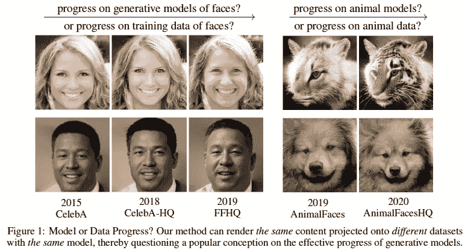
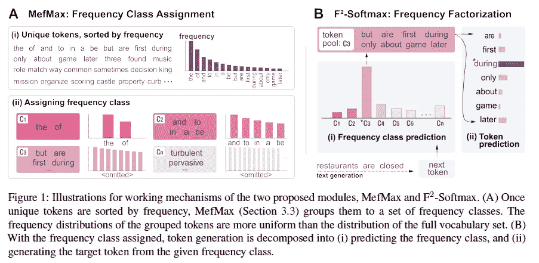
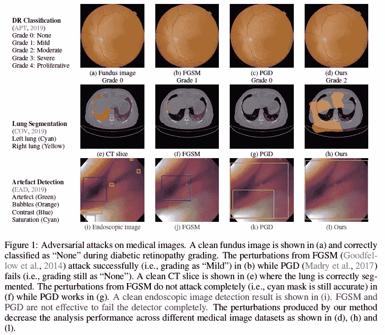
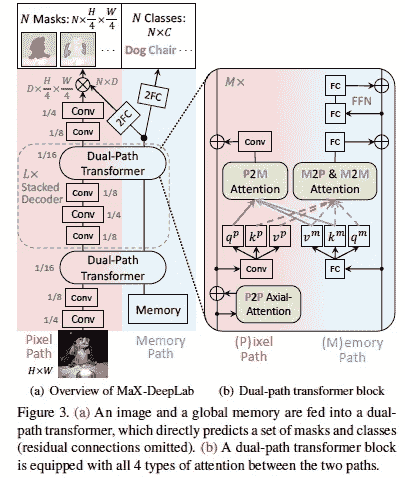
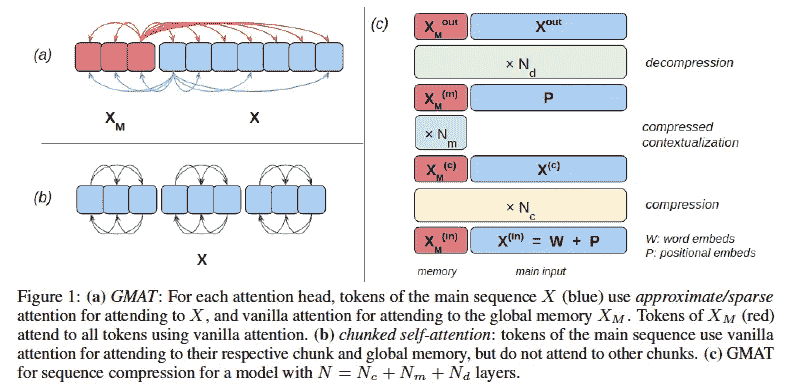
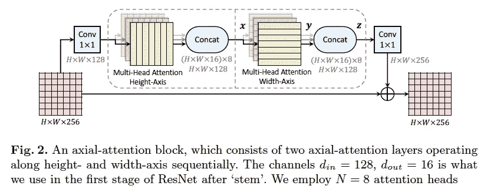
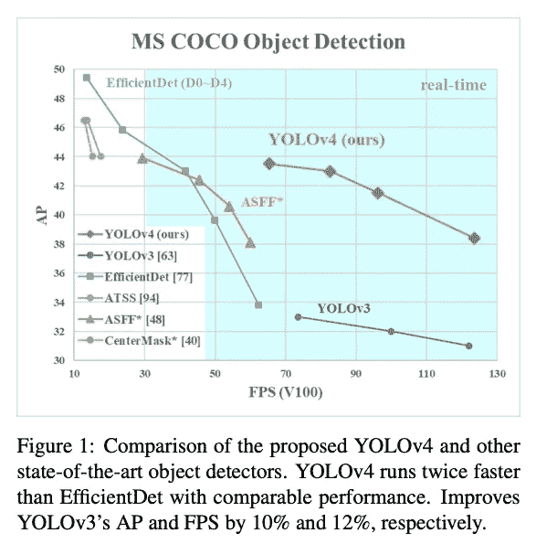
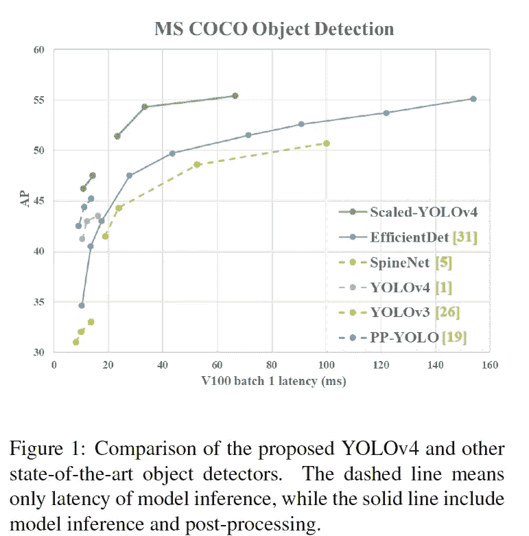

# 2020 年第 51 周

> 原文：<https://medium.com/analytics-vidhya/akiras-ml-news-week51-2020-6fb82b15642d?source=collection_archive---------24----------------------->

下面是我在 2020 年第 51 周(12 月 13 日~)读到的一些我觉得特别有意思的论文和文章。我已经尽量介绍最近的了，但是论文提交的日期可能和星期不一样。

# 主题

1.  机器学习论文
2.  技术文章
3.  机器学习用例的例子
4.  其他主题

# —每周编辑精选

*   [生成数据的质量和训练数据的质量](https://arxiv.org/abs/2012.02516)
*   [比 EfficientDet-D7 更准确、更快速的物体检测模型](https://arxiv.org/abs/2011.08036)
*   [数据科学需要哪些软技能？](https://www.reddit.com/r/learnmachinelearning/comments/k8f451/what_are_the_soft_skills_required_in_data_science/)

— — — — — — — — — — — — — — — — — — — — — — — — — —

# 1.机器学习论文

— —

# 生成数据的质量和训练数据的质量

关于生成模型中数据偏差的一个注记
[https://arxiv.org/abs/2012.02516](https://arxiv.org/abs/2012.02516)

关于数据集对生成模型的影响的研究(更多的是备忘录)。当相同的潜在表示被为每个数据集训练的自动编码器解码器解码时，解码的质量对于每个数据集是不同的。这表明不仅模型而且数据集的质量对生成图像的质量有影响。

# 通过考虑单词出现的概率来避免相同单词的重复生成

F2-Softmax:通过频率分解的 soft max
[https://arxiv.org/abs/2009.09417](https://arxiv.org/abs/2009.09417)使神经文本生成多样化

在文本生成中存在同一个词重复的问题。假设问题是由文本数据的不平衡引起的，他们提出了 F softmax，它将令牌按频率分类，先预测频率类后生成单词。与传统方法相比，这种方法可以生成偏差更小的文本。

# 医学图像的对抗性攻击

稳定医疗影像攻击
https://openreview.net/forum?id=QfTXQiGYudJ

一种针对医学图像的对抗性攻击方法。除了通常的敌对噪声产生的损失，我们增加了一项损失，最小化网络的敌对样本和高斯平滑图像的输出。医学成像有很多图像域，但是很多域都可以用它来攻击。

# 端到端全景分割

MaX-DeepLab:使用遮罩变形金刚
[的端到端全景分割 https://arxiv.org/abs/2012.00759](https://arxiv.org/abs/2012.00759)

他们提出了一个 Max-DeepLab，可以以完整的 End2End 方式学习泛神分割，其中 2 路全局内存和图像由 Transformer 集成。他们在 COCO 的帮助下显著提高了分数，并且已经能够提高性能(SotA)。

※泛切分:结合实例切分和语义切分的任务。

# 使用全局内存来降低转换器的计算复杂度。

GMAT:变形金刚
全球记忆增强[https://arxiv.org/abs/2006.03274](https://arxiv.org/abs/2006.03274)

他们提出 GMAT 是一个具有全局记忆的变压器。存储长度为 M，序列长度为 L，计算复杂度可以从 L 降低到 M*(L+M)。长序列可以压缩到一个存储表示中，对于需要全局信息的任务，精度得到提高。

# 通过将注意力应用于图像的每个轴来处理图像的全局注意力。

Axial-DeepLab:独立的轴注意全景分割
[https://arxiv.org/abs/2003.07853](https://arxiv.org/abs/2003.07853)

他们提出了轴向注意力，通过将自我注意力应用于图像的长度和宽度来实现对图像的整体注意力，同时减少计算量(正方形的 size⁴→2*size)。他们证实了它在图像识别和分割任务中的有效性。

# 优化 YOLOv3 以包含网络架构。

YOLOv4:物体检测的最佳速度和精度
[https://arxiv.org/abs/2004.10934](https://arxiv.org/abs/2004.10934)

使用最新技术(如跨阶段部分、空间金字塔池、路径聚合网络)对 YOLOv3 进行了显著修改的研究，使其比 EfficientDet 更快、更准确。这似乎是 YOLOv3 的一次超调，包括架构和学习方法，以选择现有的最佳技术。

# 比 EfficientDet-D7 更准确、更快速的对象检测模型。

Scaled-YOLOv4:缩放跨级局部网络
[https://arxiv.org/abs/2011.08036](https://arxiv.org/abs/2011.08036)

一项基于 cspdarknet 53(yolov 4 的网络)的研究，旨在探索分辨率、宽度和深度之间的平衡，实现超越 efficient det-D7 的准确性和速度。

— — — — — — — — — — — — — — — — — — — — — — — — — —

# 2.技术文章

— —

# 面向工程师的重要 NeurIPS2020 论文

 [## NeurIPS 2020 论文:深度学习工程师的收获

### NeurIPS 2020 上发表的论文中应用深度学习的技术和见解。

towardsdatascience.com](https://towardsdatascience.com/neurips-2020-papers-a-deep-learning-engineers-takeaway-4f3066523151) 

这是本博客作者汇编的重要神经科 2020 论文列表，重点关注变形金刚。

— — — — — — — — — — — — — — — — — — — — — — — — — —

# 3.机器学习用例示例

— —

# 环境保护人工智能

 [## 人工智能帮助拯救地球的 6 种方式

### 世界自然基金会编制的“活的星球指数”估计，自……以来，野生动物的数量减少了 68%

www.raconteur.net](https://www.raconteur.net/sustainability/ai-save-planet/) 

一篇关于人工智能被用来保护环境的文章。它举例说明了它是如何被用于回收利用、物种保护、减少污水污染、减少食物浪费、减轻空气污染和保护森林的。

# 用人工智能保护蜜蜂。

 [## 拯救蜜蜂，拯救世界:蜜蜂保护如何利用人工智能和物联网来保护蜂巢

### 不是危言耸听，但是如果蜜蜂灭绝了，咖啡很可能会成为一种稀有而昂贵的奢侈品……

thenextweb.com](https://thenextweb.com/neural/2020/12/10/save-the-bees-save-the-world-how-apisprotect-uses-ai-and-iot-to-protect-hives/) 

ApisProtect 宣布，它正在进入美国养蜂人检验设备市场。已经对蜜蜂的蜂箱进行了人工检查，但是这会给蜜蜂造成压力。蜜蜂保护可以用来保护蜜蜂免受疾病和外包，而不会对蜂房造成破坏。由于蜜蜂参与了各种植物的授粉，保护蜜蜂将有助于防止粮价飙升。

— — — — — — — — — — — — — — — — — — — — — — — — — —

# 4.其他主题

— —

# 数据科学需要哪些软技能？

讨论数据科学需要什么样的软技能(除了像编码和学习特定程序语言这样的硬技能之外的沟通和其他能力)的线索。向客户提出正确问题的能力等。被提及。

# 按部门列出的人工智能公司

 [## 企业人工智能公司的基本格局(2020)

### 为了帮助您识别最适合您业务的工具，我们根据研究筛选出了最有前途的公司…

www.topbots.com](https://www.topbots.com/enterprise-ai-companies-2020/) 

按部门总结领先人工智能公司的文章，如生产率提高、人力资源、制造、医疗保健等。

— — — — — — — — — — — — — — — — — — — — — — — — — —

# —过去的文章

[第 50 周](/analytics-vidhya/akiras-ml-news-week50-2020-2091f11a72a9) ⇦第 51 周(本帖)⇨第 52 周(不成文)

[2020 年 11 月总结](/analytics-vidhya/akiras-ml-news-november-2020-a48a3cb75285)[2020 年 10 月总结](/analytics-vidhya/akiras-ml-news-october-2020-c7b5b4281d36)
2020 年 9 月总结

— — — — — — — — — — — — — — — — — — — — — — — — — —

# 我在推特上发表了一句评论。

[https://twitter.com/AkiraTOSEI](https://twitter.com/AkiraTOSEI)