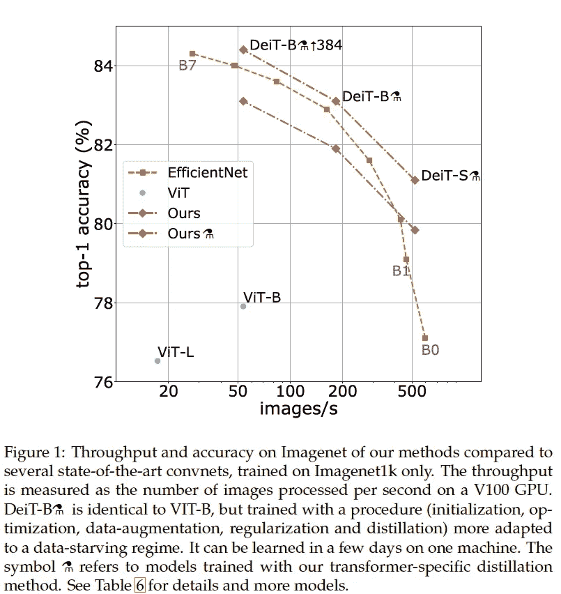
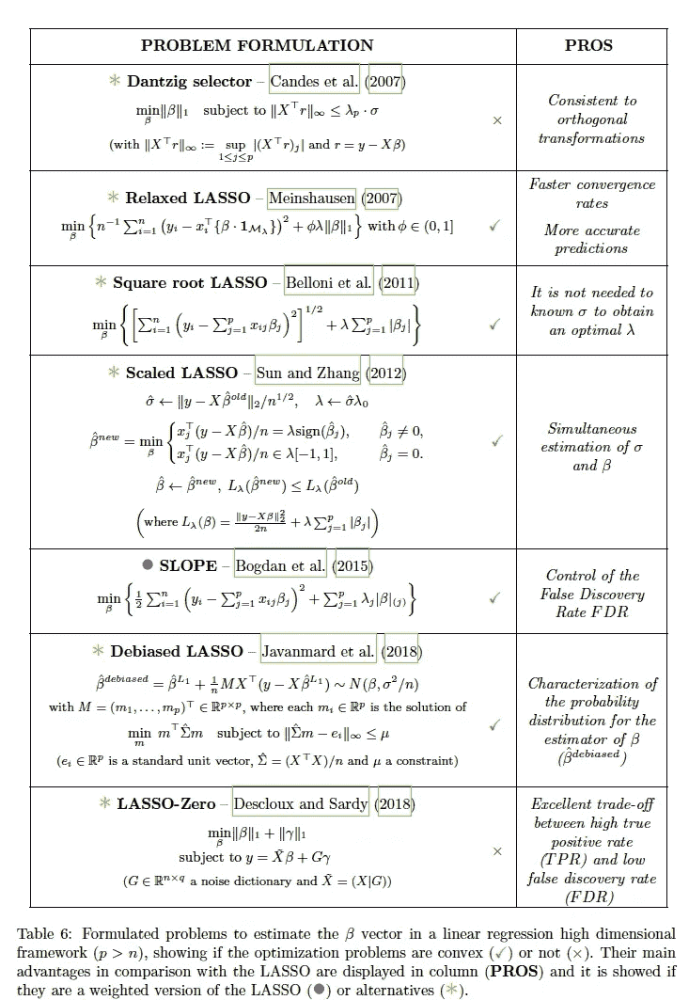

# 2020 年第 52 周

> 原文：<https://medium.com/analytics-vidhya/akiras-ml-news-week52-2020-845556ee3a45?source=collection_archive---------11----------------------->

下面是我在 2020 年第 52 周(12 月 20 日~)读到的一些我觉得特别有意思的论文和文章。我已经尽量介绍最近的了，但是论文提交的日期可能和星期不一样。

# 主题

1.  机器学习论文
2.  技术文章
3.  机器学习用例的例子

# —每周编辑精选

*   [使用灵长类视觉皮层提高对抗攻击的能力](https://www.biorxiv.org/content/10.1101/2020.06.16.154542v1)
*   [用于测量真实世界数据分布变化稳健性的数据集](https://arxiv.org/abs/2012.07421)
*   [人工智能用于药物发现](https://analytics.dkv.global/deep-pharma/AI-for-Drug-Discovery-2020.pdf)

— — — — — — — — — — — — — — — — — — — — — — — — — —

# 1.机器学习论文

— —

# 使用智能手机上的图像创建 10 微米级别精度的高度地图

*使用不稳定手机摄像头的介观摄影测量*
[https://arxiv.org/abs/2012.06044](https://arxiv.org/abs/2012.06044)

研究从智能手机拍摄的多幅图像中创建 10μm 级别的高度图。它学习使 CNN 计算出的高度图与它和摄像头信息重建的地图保持一致。

# 用于测量对真实世界数据分布变化的稳健性的数据集

*野生:野生分布移位的基准*
[https://arxiv.org/abs/2012.07421](https://arxiv.org/abs/2012.07421)

在现实世界中，数据分布(由不同的摄像机、一天中的时间、区域捕获)会发生许多变化，并导致模型性能下降。该项目提供了卫生图像、医学图像和文档等数据集，以评估这些分布变化的鲁棒性。

# 复制和粘贴可以是一种强大的数据扩充。

*简单的复制粘贴是一种强大的数据扩充方法，例如分段*
[https://arxiv.org/abs/2012.07177](https://arxiv.org/abs/2012.07177)

一项研究表明，结合图像缩放和复制粘贴的数据扩充在实例分割和对象检测中非常强大。这种效果在许多网络中得到证实。

# 在不使用 JFT300M 的情况下超越 ViT 的性能

https://arxiv.org/abs/2012.12877
[训练数据高效的图像变形金刚&通过注意力蒸馏](https://arxiv.org/abs/2012.12877)

他们提出了 DeiT(数据高效图像转换器),在仅转换器的机制中使用基于令牌的提取，这超过了 ViT 的准确性，ViT 是没有 CNN 的 SotA 模型，而 EfficientNet 仅使用 ImageNet 进行训练。背景是 ViT 论文中说“Transformer 在 ImageNet 这样的中型数据集上不准确，因为它的感性偏差很小，需要 JFT300M 这样的大型数据集。然而，它需要使用 RegNet (CNN)作为教师以及正则化和数据扩充等进行提炼。

# 一种通过关注单个正确答案来消除 NMS 的对象检测模型

*OneNet:面向端到端的一阶段目标检测*
[https://arxiv.org/abs/2012.05780](https://arxiv.org/abs/2012.05780)

在目标检测中，在传统的盒分配系统 YOLO 和点分配系统 CenterNet 中，对于一个目标有多个正确的标签。OneNet 通过将正确答案分配给每个候选对象成本最低的点，将正确锚点的数量缩小到一个。虽然这是一个简单的方法，但它可以消除 NMS，建立一个完整的 E2E 网络。

# 通过在每个块中保留图像的表示，成功地将超分辨率提高了 30 倍

*用局部隐式图像函数学习连续图像表征*
[https://arxiv.org/abs/2012.09161](https://arxiv.org/abs/2012.09161)

他们提出了一种局部隐式图像函数(LIIF ),它将图像表示为一组向量，而不是单个向量，并对它们进行积分以实现更高的分辨率。与许多使用特定放大倍数进行学习的研究不同，LIIF 可以在任何放大倍数下进行训练，即使在推断 30 倍高分辨率时也能获得良好的结果。

# 这是一篇关于套索及其变体的综合论文

*LASSO 及其衍生工具在协变量依赖下的变量选择*
[https://arxiv.org/abs/2012.11470](https://arxiv.org/abs/2012.11470)

这是一篇关于套索及其在变量选择中经常使用的变体的综合论文。当添加有噪声的虚拟特征或特征相关时，LASSO 不能很好地工作，本文展示了它们在这种情况下如何表现的许多实验。(自适应套索好像挺好的)

# 使用灵长类动物视觉皮层可以提高对抗攻击的能力

*模拟中枢神经系统前部的初级视觉皮层提高了对图像扰动的鲁棒性*
[https://www.biorxiv.org/content/10.1101/2020.06.16.154542v1](https://www.biorxiv.org/content/10.1101/2020.06.16.154542v1)

他们发现了灵长类初级视觉皮层(V1)和对抗攻击的抵抗力之间的相关性，通过添加一层重现 V1 的层，他们可以提高对抗攻击的抵抗力。

# 用轻量计算获得光流运动特征

*运动挤压:用于视频理解的神经运动特征学习*
[https://arxiv.org/abs/2007.09933](https://arxiv.org/abs/2007.09933)

通过计算相邻帧的点积来计算相邻像素的相似性，他们可以像轻量计算中的 OpticalFlow 一样计算动作的特征。结果是一个轻量级的网络，具有动作识别的高精度。

# 处理来自特殊相机的数据的缺乏

*通过使用嫁接网络*
[https://arxiv.org/abs/2003.10959](https://arxiv.org/abs/2003.10959)学习利用多种视觉模态

来自热感相机等特殊相机的数据少于来自正常图像数据集的数据。因此，他们提出了一种类似蒸馏的学习机制，该机制使用在正常图像上训练的学习模型，并应用约束，使得除了特殊相机侧的输入层之外的层的表示匹配。这比从特殊的摄像机图像中从头开始学习更准确。

# 通过将数据分配到一个额外的类来识别标签错误的数据。

*使用边距等级*
[https://arxiv.org/abs/2001.10528](https://arxiv.org/abs/2001.10528)下的区域识别误贴标签的数据

通过将样本随机分配到附加的额外类别，并将其置信水平与最大置信水平进行比较来识别错误标记数据的研究。错误标记的数据可以被识别，因为最大置信度大于实际值。

— — — — — — — — — — — — — — — — — — — — — — — — — —

# 2.技术文章

— —

# NeRF 及其相关研究解释

 [## NeRF 爆炸 2020

### 除了新冠肺炎疫情和美国的政治动荡，2020 年也是神经体绘制…

dellaert.github.io](https://dellaert.github.io/NeRF/) 

这是一篇简要介绍 NeRF 及其相关研究的文章。文章首先介绍了导致 NeRF 的相关研究，因此很容易理解 NeRF 如何使用这些研究。

— — — — — — — — — — — — — — — — — — — — — — — — — —

# 3.机器学习用例的例子

— —

# 用于药物发现的人工智能

[https://analytics . dkv . global/deep-pharma/AI-for-Drug-Discovery-2020 . pdf](https://analytics.dkv.global/deep-pharma/AI-for-Drug-Discovery-2020.pdf)

一份关于人工智能用于新药开发的报告，描述了领先的公司，人工智能如何在每个公司中使用，以及市场。每个公司如何使用人工智能的部分是必看的。例如，报告描述了阿斯利康如何使用知识图表来分析相关信息。

— — — — — — — — — — — — — — — — — — — — — — — — — —

# —过去的文章

[2020 第 51 周](/analytics-vidhya/akiras-ml-news-week51-2020-6fb82b15642d) ⇦ 2020 第 52 周(本帖)⇨ [2021 第 1 周& 2](/analytics-vidhya/akiras-ml-news-week2-2021-c9374ac86d3e)

[2020 年 11 月汇总](/analytics-vidhya/akiras-ml-news-november-2020-a48a3cb75285) [2020 年 10 月汇总](/analytics-vidhya/akiras-ml-news-october-2020-c7b5b4281d36)
[2020 年 9 月汇总](/analytics-vidhya/akiras-ml-news-september-2020-80ed65bd7ea4)
[2020 年汇总](https://towardsdatascience.com/machine-learning-2020-summary-84-interesting-papers-articles-45bd45c0d35b)

— — — — — — — — — — — — — — — — — — — — — — — — — —

# 推特，我贴一句纸评论。

[https://twitter.com/AkiraTOSEI](https://twitter.com/AkiraTOSEI)