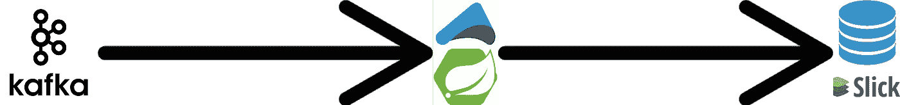
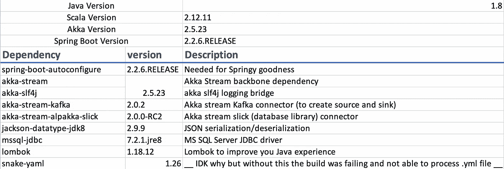

# 爪哇 Spring Boot 的阿卡河！

> 原文：<https://medium.com/analytics-vidhya/akka-streams-in-java-spring-boot-f7749cafb7f5?source=collection_archive---------5----------------------->


在当今的数据处理和数据流水线系统中，将数据从源流式传输到接收器是一项非常琐碎的任务。因此，有许多流媒体解决方案，如:Kafka Stream，Spark Streaming，Apache Flink 等。

它们都以某种方式需要建立一个基础设施来充分利用它们(例如，HDFS、Spark cluster、Kafka 流设置等)。)或者我们需要在流作业之间进行某种编排(例如 Apache Airflow)。

# 阿卡溪流

Akka streams 在这场战斗中脱颖而出，拥有完全由应用程序驱动的优势。Akka stream 是建立在 Akka 著名的演员模型(实际上是受 Erlang 演员模型的启发)之上的。因此，Akka streams 可以利用其经过战斗考验的[弹性、事件驱动和响应](https://www.lightbend.com/blog/why-do-we-need-a-reactive-manifesto)(参见[反应宣言](https://www.reactivemanifesto.org/))能力。

【Akka 的问题

1.  Java 开发人员社区已经远离了“为 scala 量身打造的”Akka 平台。
2.  对最流行的 Java 框架“Spring”没有多少文档和支持。

我是来告诉你另一件事的！尽管缺乏互联网上可用的资源，我们事实上可以用 Java 做 akka-streams，而且做起来很容易。

在本帖中，我们将用 Java 和 Spring Boot**构建一个 Akka 流应用程序**！**我们将分析使用 Akka 流可以获得的现成优势。所以，让我们葛开始…**

# 问题陈述

我们需要一个简单的实时流，它消耗 Kafka 主题上发布的所有更新，并在解析后将事件保存在 SQL server 数据库中。我们只想在记录插入数据库后提交 Kafka 偏移量。



**让我们从 Spring Initialzr 开始一个新的 Spring boot 项目。**

[](https://start.spring.io/) [## 弹簧初始化 r

### Initializr 生成的 spring boot 项目正好是你快速启动所需要的！

start.spring.io](https://start.spring.io/) 

我们将使项目像下面的树一样组织起来，这是一个非常标准的 maven 目录结构(因为我们在这里选择了使用 maven)。如果你愿意，你也可以和格雷迪一起去。

```
.
├── pom.xml
└── src
    ├── main
    │   ├── java
    │   │   └── com
    │   │       └── lprakashv
    │   │           └── springalpakka
    │   │               ├── SpringCommandLineApplication.java
    │   │               ├── configs
    │   │               │   ├── AkkaConfig.java
    │   │               │   └── StreamConfig.java
    │   │               ├── dtos
    │   │               │   └── Event.java
    │   │               ├── services
    │   │               │   └── StreamService.java
    │   │               └── utils
    │   │                   └── StreamUtils.java
    │   └── resources
    │       ├── application.yml
    │       └── stream.conf
    └── test
        └── java
            └── com
                └── lprakashv
                    └── springalpakka
```

不要担心树中的代码文件，我们很快就会谈到它们。

**添加所有必需的依赖项:**



**设置基础 Akka 配置**

在每个 Akka/Akka-Stream 应用程序中，需要的最基本组件是 Akka 的 **ActorSystem** 和 **Materializer** 。这是这个生态系统中很多事情所需要的，比如，产生演员，创建流组件，运行流，物化流等等。

在上面的代码中，我们确保:

1.  在整个应用程序中，我们只有一个 ActorSystem 和 Materializer 实例 beans。
2.  仅当***akka . stream . Java DSL . source***在范围内时才会被实例化。

**我们的卡夫卡事件 DTO 消费:**

**让我们编写我们的 Source (Kafka)** :我们希望稍后提交偏移量，因此使用一个 [committableSource](https://doc.akka.io/api/alpakka-kafka/2.0.2/akka/kafka/scaladsl/Consumer$.html#plainSource[K,V](settings:akka.kafka.ConsumerSettings[K,V],subscription:akka.kafka.Subscription):akka.stream.scaladsl.Source[org.apache.kafka.clients.consumer.ConsumerRecord[K,V],akka.kafka.scaladsl.Consumer.Control]) 。我们将从可提交的源代码中创建一个 Bean，并自动连接到我们的服务类中。

**现在让我们编写我们的流(Slick):** 如果我们不关心持久结果并提交 Kafka offset(使用" [plainSource](https://doc.akka.io/api/alpakka-kafka/2.0.2/akka/kafka/scaladsl/Consumer$.html#plainSource[K,V](settings:akka.kafka.ConsumerSettings[K,V],subscription:akka.kafka.Subscription):akka.stream.scaladsl.Source[org.apache.kafka.clients.consumer.ConsumerRecord[K,V],akka.kafka.scaladsl.Consumer.Control]) ")，我们就可以创建一个 Sink。我们使用 flow 而不是 sink，因为我们想在数据库阶段之后传播 committable-offset。我们将在同一个配置类中添加以下代码。

你可能想知道 ***stream.conf*** 文件中有什么，那个***committableMesssageToDTO***和***insertEventQuery***是从哪里来的？

Slick 需要一个配置来创建一个会话，该会话将执行我们所有的数据库查询。该配置需要在 ***中遵循以下结构。conf*** 文件(这是在 typesafe/lightbend 环境中访问配置的标准方式)。

```
event-sqlserver {
  profile = "slick.jdbc.SQLServerProfile$"
  db {
    dataSourceClass = "slick.jdbc.DriverDataSource"
    properties {
      driver = "com.microsoft.sqlserver.jdbc.SQLServerDriver"
      url = "your-db-url!"
      user = "your-db-user!"
      password = "your-db-pass"
    }
  }
}
```

而***committableMesssageToDTO***和***insertEventQuery***是将我们的 CommittableMessage 转换为 DTO(我们的记录类)然后转换为 SQL 插入查询的函数。

我们可以用静态函数编写一个 Utils 类来生成 SQL，如下所示:

**现在，让我们把它们拼凑起来，构建一个流:**

就是这个！我们现在可以从任何地方调用 startKafkaToDatabaseStream()方法，它将完成我们的工作。

在一个“简洁”的链中有很多突出的特性！让我来解释一下:

1.  **T1。buffer(size，overflowStrategy)** :这将在我们的“流”中添加一个固定大小的*缓冲区，这将保护下游系统免受更快的上游源的影响。如果大小已满，我们可以使用丢弃消息的策略: ***背压*** —将降低消耗，***drop head/drop tail/drop buffer***—将丢弃消息并且不会背压， ***fail*** —缓冲区已满时流失败。*
2.  ****。idleTimeout(duration)*** :在空闲超时持续时间会抛出一个***Java . util . concurrent . time out exception***，可以使用 recover/recoverWith 处理。*
3.  ****。recoverWith(ThrowableClass，fallbackSourceConsumer)***:每当 ThrowableClass.class 异常被截获时，原始源将被从 fallbackSourceConsumer 接收的源所替换。*
4.  ****。throttle(elements，per，maximumburst，mode)*** :以限制为( ***elements/per*** )的速度向下游发送元素，mode = Shaping 在发射前暂停以满足节流速率，mode = Enforcing 当上游速度快于节流速率时，异常失败。*
5.  ****。mapAsync(parallelism，()->completion stage(value))***:以定义了并行度的异步模式处理阶段。*
6.  ****【committer settings . create(actor system)***:创建默认的提交者设置。*

*排水控制可用作:*

*akka 流还有很多其他特性，不在本文讨论范围之内，但仍然值得探索。请检查 [**akka-stream**](https://doc.akka.io/docs/akka/current/stream/index.html) 和 [**alpakka 的**](https://doc.akka.io/docs/alpakka/current/index.html) 文档。*

# *结论*

*我们看到，我们可以轻松地将 Akka 流集成到我们的 Spring Boot 项目中，并利用 Spring 的依赖注入来轻松管理我们的 Akka/Stream bean。*

*有许多流特性，如背压和节流等，很容易占用开发人员大量的时间和精力。然而，如果没有进行彻底的测试，我们可能会错过一些关键案例。我们在 akka-stream 的工具包中获得了开箱即用的那些东西。*

*总而言之，Akka-streams 和 Alpakka 都是数据平台堆栈中的优秀工具。*

*感谢阅读！*